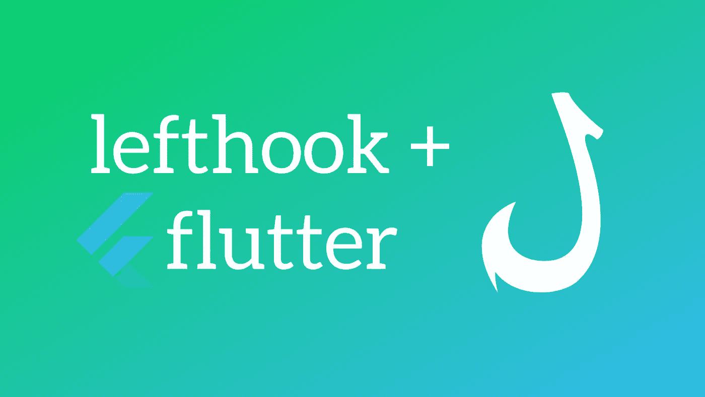

# 容易抖动的 Git 挂钩

> 原文：<https://blog.devgenius.io/easy-git-hooks-for-flutter-f2927cbbcfd4?source=collection_archive---------1----------------------->

## 使用 git 挂钩自动化您的工作流，进行各种活动，如林挺、格式化、测试等。在使用 Lefthook 的颤振项目中



左勾拳+扑击= ❤

随着项目变得越来越大，多个开发人员同时不断地编辑代码库，维护代码标准和代码质量的需求变得非常重要。当然，这是每个开发人员的责任，但是使用 git 钩子可以让这个过程变得非常高效和轻松。

Git 挂钩是在执行 git 命令(提交、推送等)之前启动定制脚本/动作的一种方式。在 git 官方网站上有很多 git 挂钩可以使用，如[所记录的](https://git-scm.com/docs/githooks)，但是在本文中，我们将主要关注两个:`pre-push`和`pre-commit`，以及如何在一个 Flutter 项目中轻松实现它们。

Roberta 有一篇很棒的文章[解释了如何通过修改`.git`文件夹中的内容在 Flutter 项目中设置自定义 git 挂钩。`.git`文件夹是存储库根目录下的一个隐藏文件夹。但是还有另一种方法来实现它，使用 left hook——一个多语言的 git 钩子管理器。](https://medium.com/kinandcartacreated/githooks-explained-using-flutter-babcdeb4048d)

首先，我们需要全局安装 lefthook。基于您的环境，有几个选项—

如果你安装了 Node.js】

如果你在一个基于 Ruby 的环境中:`gem install lefthook`

> 您可能需要以`sudo`的身份运行这些命令

就是这样，lefthook 现在可以用了。导航到您的项目根目录并运行— `lefthook install`

> 每个项目/存储库必须运行一次`lefthook install`命令

Lefthook 的工作原理是使用一个位于项目根目录下的 YAML 文件。让我们创建这个文件— `lefthook.yaml`

这个文件定义了应该使用哪些 git 挂钩，以及在这些挂钩期间应该运行哪些脚本/命令。使用 Flutter，可以很容易地根据单个开发人员的偏好设置不同格式的代码。为了解决这个问题，我们可以使用 Flutter SDK 中可用的命令，在提交/推送版本控制之前标准化我们的代码。

在提交之前，我们将配置两个命令。第一个是使用 Flutter SDK 的默认规则 lint dart 代码，第二个是格式化代码。该文件以钩子的名称开始，后面是下一级缩进的一组命令。我定义了两个命令—

```
pre-commit:
  commands:
    lint_code:
      glob: '*.dart'
      run: dart fix lib && git add .
    format_code:
      glob: '*.dart'
      run: flutter format {staged_files} && git add .
```

这里， *lint_code* 和 *format_code* 是我给命令起的名字。这些可以是任何东西。glob 参数定义了在哪些文件上运行命令，还有一些特殊的 git 变量可用，如`{staged_files}`。有关这方面的详细参考，请参考 lefthook 文档。

第二组命令是在我们将任何东西推送到版本控制之前使用的。开发人员社区普遍认为，在将任何东西提交到版本控制之前，您应该总是测试您的代码。除此之外，运行代码分析以发现任何潜在的问题是队列中的第二个任务。这两项任务都是独立的，可以并行运行，我们会做到这一点。

```
pre-push:
  parallel: true
  commands:
    tests:
      run: flutter test
    static_code_analysis:
      run: flutter analyze
```

`parallel`参数指定命令是否应该并行运行，默认设置为`false`，这意味着命令将按顺序运行。

使用 git 钩子的全部意义在于，如果钩子定义的任何命令失败，将会抛出一个错误，退出当前的 git 操作，这意味着 git 命令将不会执行。这真的很有帮助，并确保开发人员产生良好的代码质量，即使他们一开始忘记了。

这是完整的 lefthook.yaml 文件—

颤振项目的左钩 YAML

这是一个基本设置，可以扩展以满足您的特定需求。现在，无论何时运行 git 命令——commit/push，lefthook 都会运行您的命令，并显示命令成功通过或失败的输出摘要。此外，lefthook 可以与各种其他语言和框架一起使用，因为它不是为一种特定的语言或框架开发的——因此是多语言的。

感谢您花时间阅读本文，如果您觉得有用，请分享！

## 参考

Roberta 用 Flutter 解释 Git 挂钩

[2] [Lefthook](https://github.com/evilmartians/lefthook) —多语言 git hooks 管理器