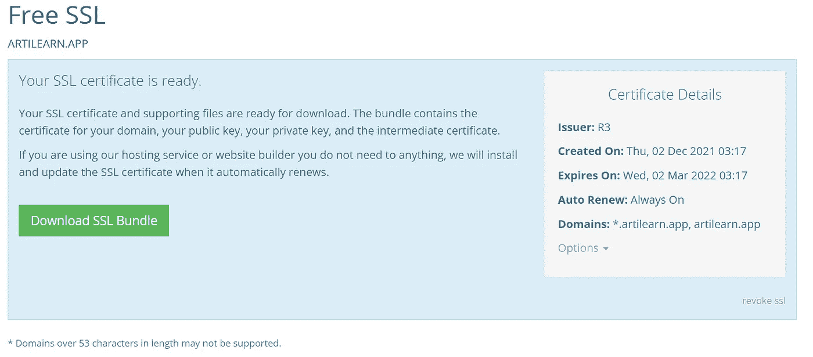

# Nginx 中简单的手动设置 HTTPS

> 原文：<https://blog.devgenius.io/easy-manual-setup-https-in-nginx-9cac185ebdb4?source=collection_archive---------12----------------------->


图片由[天空电视台在 Pixabay](https://pixabay.com/id/illustrations/https-situs-web-internet-keamanan-3344700/) 上拍摄

如果你像我一样懒，你可以使用 certbot 为 HTTPS 创建证书。这是我的首选方法，因为它简单、快速，并且可以在证书过期时自动续订。不幸的是，这个世界不全是阳光和彩虹。在某些情况下，certbot 无法立即创建证书，例如:

1.  服务器在 VPN 后面。通常，有一个已经设置好的代理。如果对你来说不是这样，那么我希望你知道应该在哪里设置代理的列表。
2.  web 服务器位于安全的 TLD(如. app)之后。这意味着您无法通过 HTTP 协议访问它，certbot 也无法创建认证。这是因为，默认情况下，certbot 使用 [HTTP-01 质询](https://letsencrypt.org/docs/challenge-types/#http-01-challenge)，这意味着该质询在 web 服务器上将会失败。

如果您是因为第一个原因来到这里，那么我建议您为 certbot 配置代理。因为迟早您需要将其配置为自动证书续订。如果你现在努力工作，未来的你会感谢你的。

就我而言，我有一些网站使用。app 域。因此，我需要学习如何手动设置证书。出于解释，我将跳过证书的创建，因为它已经在我的域提供者中生成了。如果你想加深对 HTTPS 的了解，你可以看看这幅来自《HowHTTPSWorks》的漫画。

所以第一步是拿到你的证书。就我而言，我使用 porkbun 作为我的供应商。在给定的 zip 中有 4 个文件:`domain.cert.pem`、`intermediate.cert.pem`、`private.key.pem`、`public.key.pem`。如果你像我一样习惯于 certbot 文件命名，这个映射将帮助你:

*   `domain.cert.pem`(pork bun)->`fullchain.pem`(certbot)->`ssl_certificate` (nginx)
*   `intermediate.cert.pem`(pork bun)->`chain.pem`(certbot)->`ssl_trusted_certificate`(nginx)
*   `private.key.pem`(pork bun)->`privkey.pem`(certbot)->`ssl_certificate_key`
*   `public.key.pem`(pork bun)->`cert.pem`(certbot)

如果你想进一步了解这些文件，可以查看这些 StackOverflow 讨论:

*   [如何在 Nginx 上使用 Porkbun SSL 证书文件？](https://stackoverflow.com/q/63359785)
*   [从头开始生成 CRT &密钥 SSL 文件](https://stackoverflow.com/q/50389883)



现在您需要将这个文件移动到您的服务器上。我们可以使用 SCP 像这样移动它:

```
scp artilearn.app-ssl-bundle host@ipaddress:~/
```

SSL 证书被成功复制到我们的远程服务器。现在我们需要把我们的网站放在服务器上。出于本教程的目的，我们将只使用一个虚拟的 HTML 文件来测试我们的 SSL。

最后一步是配置 Nginx 配置文件。我们只需要配置 4 样东西:

1.  我们的网站将在港口(第 2 行)
2.  网站的 SSL 证书(第 3–5 行)
3.  我们网站的根文件夹(第 6 行)
4.  我们网站的域名(第 7 行)

现在用`sudo systemctl restart nginx`重启 Nginx 服务。当您检查`https://artilearn.app/dummy.html`时，我们的 HTML 文件将成功显示正确的证书！


现在我们的证书已经成功设置。但是别忘了这个证书是手动设置的，我们还没有配置任何自动续订。但是应该怎么做呢？好吧，我们可以去看看这篇文章的第一句话:懒，用 certbot。我们现在可以这样做，因为我们的网站现在可以从 HTTPS 网址访问，HTTP-01 挑战批准了这种方法。现在只需进入 [certbot 网站](https://certbot.eff.org/)并遵循那里的简单步骤！

*大家好，我是 Adyaksa，我写的是软件开发和我的语言学习经历。我计划每周发布一篇博客，内容是我在做兼职项目时发现的一些有趣的事情。如果你感兴趣，你可以关注我来了解它的最新情况！*