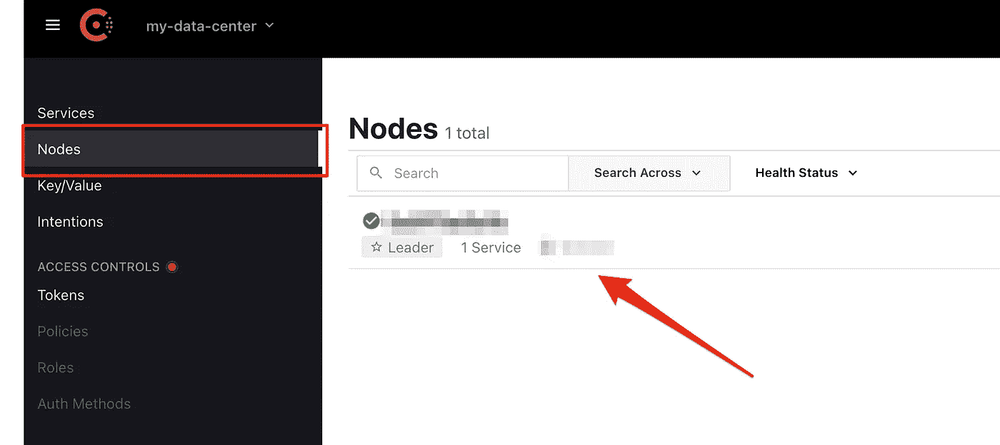
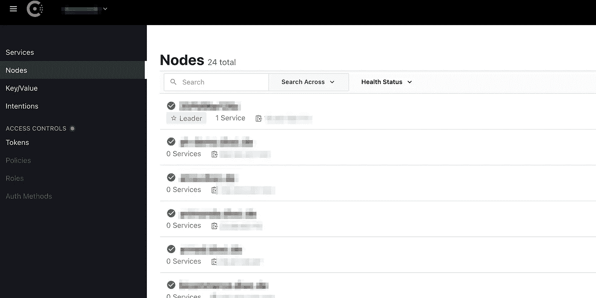

# 利用 Consul 轻松发现节点

> 原文：<https://blog.devgenius.io/easy-node-discovery-with-consul-8b6f3c4b5116?source=collection_archive---------14----------------------->


有时，要跟上生态系统中所有不同的服务器真的很难。无论你是一个主机商，一个有很多不同测试服务器的代理机构，还是一个非常积极的自由职业者。当涉及到 IP 地址和可用系统时，只有一个真实的来源不是很好吗？Consul 节点发现解决您的问题！

让我们面对现实吧！您在服务器方面获得的经验越多，您就拥有越多！越来越多的系统意味着您的节点需要更高的安全级别。

无论您是否使用 NAGIOS、RUNDECK 或任何其他工具来监控和维护您的服务器，它们都有一个共同点。他们通常需要节点及其 IP 地址的列表。如果它与工具无关，那么拥有一份最新的服务器列表仍然是一件好事。

所以你的任务简单明了:

> 获取可用节点及其 IP 地址的单一列表！

领事给你的正是这个。
事实上，它做得更多，比如服务发现等。
但是今天，我们只关注一个**简单的即插即用设置来访问可用节点列表。**

一旦你深入了解，事情就变得棘手了，但是这篇文章实际上只是关于一个简单的安装。我们也将跳过防火墙和更多的设置(但请仍然使用它)。

对于 Consul，我们将使用带有官方 Docker 映像的简单 Docker 设置，但是我们的客户机节点将直接在主机系统上配置(即使您在这些主机系统上运行 Docker 容器)。

我们开始吧！

# 咨询主服务器

我们现在将创建一个领事主节点。为此，我们显然需要一台新服务器…

一旦订购和运行，请安装 Docker，并确保它的工作。

现在我们需要做的就是，创建一个" *docker-compose.yml"* 文件并配置我们的 Consul 容器。

```
version: "3.0"services:
   consul:
    container_name: consul
    image: consul:latest
    ports:
      — "80:8500"
      — "8300:8300"
      — "8600:8600/tcp"
      — "8600:8600/udp"
      — "8301:8301/udp"
      — "8301:8301/tcp"
      — "8302:8302/udp"
      — "8302:8302/tcp"
    volumes:
      — "./consul/config.json:/etc/consul.d/bootstrap/config.json"
    command: “agent -server -config-file /etc/consul.d/bootstrap/config.json”
```

Consul 需要几个**端口**用于主节点和客户端节点之间的握手。如果使用的话，UI 可以通过端口 8500 获得。我们只需将端口 80 映射到它，这样我们就有了一个很好的 HTTP 体验。尽管如此，请随意使用 HTTPS，NGINX 代理或任何你需要的东西。

当新客户端加入主客户端时，将使用其他端口。 *tcp* 和 *udp* 条目的分离是故意的！

最后但同样重要的是，我们为我们的**配置文件**使用一个 bind-mount，并确保 Consul 是以服务器模式启动的，并且在**命令**部分中使用我们挂载的配置文件。

现在我们的**配置文件**在我们的子目录*下。/consul/config.json* ”。
这个包含了我们数据中心所需的一切。
请为其提供一个**名称**，使用您的服务器公共主机 IP 作为 **advertise_addr** ，并分配您的**加密令牌**。

```
{
 "datacenter": "my-data-center",
 "data_dir": "/var/consul",
 "bootstrap": true,
 "server": true,
 "ui" : true,
 "encrypt": "xxx",
 "client_addr" : "0.0.0.0",
 "advertise_addr" : "x.x.x.x"
}
```

但是嘿？！您从哪里获得加密令牌？

加密令牌基本上是访问数据中心的密码。但是你不能在那里粘贴任何字符串。它必须是领事创造的**。这就是我们现在要做的初始设置。**

```
docker run consul:latest keygen
```

好了，现在我们有了令牌，只要把它粘贴到配置文件中，最后**启动我们的 Docker 容器**。

> 恭喜你，你的领事大师现在应该可以运行了。
> 你应该可以用你的 IP 或域名通过 HTTP 访问它，如果也设置了的话。



> 如果 Consul 没有正确启动，您可以随时查看日志输出，以获得有关任何配置问题的更多信息。只需在我们的样本中使用“docker 日志咨询”。

谈到**防火墙**需要考虑什么？总的来说，要时刻注意 Docker、UFW 和 IPTABLES 的问题。
这意味着，码头港口仍可能暴露，即使 UFW 会阻止它。请谷歌 DOCKER-USER chain 了解更多，因为这可能很多，真的超出了这里的范围:)

但是一旦完成(以任何方式)，这里是客户端在加入您的 consul 数据中心时需要访问的端口。

```
8600, 8300, 8301, 8302
```

> 你现在不需要这么做，继续就可以了，风险自担；)

# 添加您的第一个客户端节点

终于到了将您的第一个客户端节点添加到我们的数据中心的时候了。再次重申，订购新的服务器或使用现有的服务器。

之后，我们需要在服务器上安装 Consul。
这个安装脚本是基于 UBUNTU 20 的(应该是 20 吧，我觉得……至少是 UBUNTU)。

```
curl -fsSL [https://apt.releases.hashicorp.com/gpg](https://apt.releases.hashicorp.com/gpg) | sudo apt-key add -sudo apt-add-repository "deb [arch=amd64] [https://apt.releases.hashicorp.com](https://apt.releases.hashicorp.com) $(lsb_release -cs) main"sudo apt-get update 
sudo apt-get install consul
```

安装后，您已经可以使用此命令加入您的数据中心。

```
sudo consul agent -retry-join "x.x.x.x" -bind=0.0.0.0 -advertise=$(hostname -I | cut -d' ' -f1) -datacenter="my-data-center" -encrypt="xxx" -data-dir=/var/www/src/consul
```

使用**-重试-加入**的咨询主管、正确的**数据中心名称**和**加密令牌**。**通告 IP** 地址应该已经从 hostname 命令中提取出来。

特别是广告 IP 是重要的，因为这是一个，将在 Consul 内部使用，以显示该节点的公共 IP 地址。

请记住，这个一行程序不会在本文中使用额外的配置，尽管这是可能的。所以像用过的服务之类的东西不传输，只传输我们的基本节点和 IP 地址。

> 如果你已经做了所有正确的事情，你现在应该在 Consul 的 web UI 中看到你的新节点。祝贺你！



如果你还想改进的话，我再次建议你试试防火墙。确保在这些端口上只允许来自您的领事大师 IP 的来电(如果您愿意)

```
8300, 8301, 8302
```

如果你现在使用 Puppet 之类的东西，或者其他任何东西来创建新的服务器，你可能想要**自动开始加入过程**。这就是为什么在我的示例中它只是基于一行代码的原因。
最简单的方法是创建一个 cronjob。每 x 分钟加入一次(反正只有第一次有效)。但是其他更好的方法也是可能的，比如启动脚本、超级监视器或者任何你想到的方法。这取决于你！

# 使用 API 提取节点

终于到了使用节点实现自动化的时候了！
有些系统可能已经有了用于 Consul 集成的插件，但如果没有，你可以自己调用 API，通过生成自己的配置来施展你的魔法；)

那么为什么不为 Rundeck 生成一个 *resources.yml* ？还是其他应用？

这是一个基于 PHP 的脚本，用于获取 consul master 的可用成员节点。它应该可以帮助你开始。

只需提供带有**加密令牌**的 **URL** ，就可以开始了。

```
$url = '[http://consul.mydomain.com/v1/agent/members'](http://consul.mydomain.com/v1/agent/members');
$encyptionToken = 'xxx';$headers = array();
$headers[] = 'X-Consul-Token:' . $encyptionToken;$ch = curl_init();
curl_setopt($ch, CURLOPT_URL, $url);
curl_setopt($ch, CURLOPT_HTTPHEADER, $headers);
curl_setopt($ch, CURLOPT_RETURNTRANSFER, true);$result = curl_exec($ch);
curl_close($ch);$nodes = json_decode($result, true);
```

输出是所有节点的数组，包括它们的名称、状态、IP 地址和更多有趣的信息。

# 结论

使用 Consul 进行节点发现是一个非常简单的即插即用选项。

请记住，这只是您可以做的很小一部分事情，但是拥有一个可用节点的列表会很有帮助，包括用任何编程语言获取这些节点的选项。

把安全放在心上，你会很高兴领事在你的堆栈里！