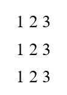

# Python #Python 系列中的(简单)模式-6

> 原文：<https://blog.devgenius.io/easy-patterns-in-python-python-series-6-7cba864a880b?source=collection_archive---------14----------------------->

当你试图掌握循环和条件时，模式会成为你的朋友，帮助你掌握这些概念。实际上，模式在很大程度上对于理解如何使用“for”循环或“while”循环起着重要的作用。

对于不熟悉模式的人来说。让我们来解决一个模式问题，并找出 python 代码。

n = 5 的模式样本


n = 5 的模式

图案看起来很棒对吧！。现在，让我们分析给定的模式。对于 n = 5 的值，我们有这样的模式。现在，我们脑海中出现的下一个问题是，n = 3 的模式是什么。



n = 3 的模式

看起来棒极了！。看到它们的 n 值和对应的模式后，我们就能想出点什么了。我们会把所谓的东西破解成代码。

为了解决任何模式问题，我们需要回答 3 个问题。

1.关于 n 有多少行？

2.每一行要打印多少列？

3.在每行的特定列中打印什么？

> 注意:模式问题的难点在于第 3 题。

对于给定的模式。我们来回答这三个问题。

1.  关于 n 有多少行？

Ans。如果 n = 5，则行数为 5。如果 n = 3，则行数为 3。所以，行数= n

2.每行要打印多少列？

Ans。对于 n =5，在第一行，有 5 列。对于第 2 行，有 5 列。我们可以得出结论，每行的列数等于 n。因此，列数是 n。

3.在每行的特定列中打印什么？

Ans。这是棘手的部分。对于 n = 5，每行的列从 1 到 5 开始。对于 n = 3，列从 1 到 3 开始。通过小观察，我们在每一行打印列号。例如，在第 2 行的第 3 列中，我们打印 3 意味着我们打印列号。

这三个问题我们都有解决方案。现在，是时候写代码了…

```
def pattern(n):
    r = 1                           # r = rows
    while r <= n:
        c = 1                       # c = columns
        while c <= n:
            print(c, end="") 
            c = c + 1             # we are incrementing column value
        print()
        r = r + 1                 # we are incrementing row value
    return

n = int(input())
pattern((n)) # we are calling pattern function
```

在上面的代码中，我们在一个函数中给出了图案打印，以实现代码的重用。在名为“pattern()”的函数中，它将 n 作为输入参数。

如果您运行这个 python 代码，我们会得到上述任意 n 值的期望模式。

尝试几个模式问题，让你很好地理解循环及其相关概念。