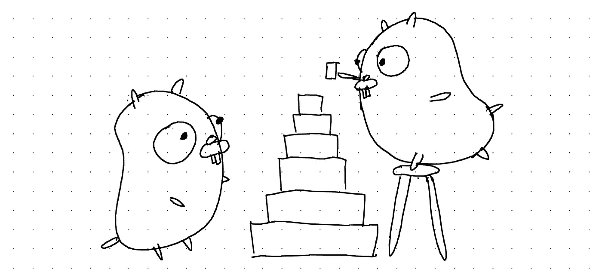

# 在 Go 中轻松排序

> 原文：<https://blog.devgenius.io/easy-sorting-in-go-17525f6f900b?source=collection_archive---------8----------------------->



玩积木的地鼠。

排序是开发人员中的一个热门话题。它是计算机科学中最重要的算法之一，因为许多重要的算法都依赖于有序数组。例如，二分搜索法算法通常被认为是最快的搜索方法之一。然而，为了让它工作，我们需要提供一个排序的数组。

我不打算在这里深入研究排序算法，因为这超出了本文的范围。但是，这是一个非常有趣的话题，所以你一定要查一下。但是，即使排序算法并不有趣，您也可能遇到过必须对元素列表进行排序的情况。有一种更简单的方法来排序，而不是从头开始实现自己的算法。在这篇文章中，我们将看到如何在 Go 中轻松地排序。尽情享受吧！

# 使用 Go 标准库中的排序包

Go 通常对效用函数采取极简主义的方法，所以在很多情况下你必须创建自己的做事方法。例如，没有内置函数来获取数组的最小值或最大值。

幸运的是，Go 提供了开箱即用的功能，因为排序是如此重要的功能。您可以导入`sort`包，并使用它的功能。

```
package main

import (
    "fmt"
    "sort"
)

func main() {
    intSlice := []int{5, 3, 9}
    sort.Ints(intSlice)

    f64Slice := []float64{4.8, 10.5, 7.4}
    sort.Float64s(f64Slice)

    stringSlice := []string{"Banana", "Apple", "Cherry"}
    sort.Strings(stringSlice)

    fmt.Println(intSlice, f64Slice, stringSlice)
}[3 5 9] [4.8 7.4 10.5] [Apple Banana Cherry]
```

这三个基本的分类将会让你走得很远，但是在这个包中有一段有趣的代码。

# 排序。连接

有一个接口被定义为`sort.Interface`。下面是代码的样子。

```
type Interface interface {
    Len() int
    Less(i, j int) bool
    Swap(i, j int)
}
```

让我们把它拆开，检查每个功能。

*   `Len()`只是告诉你数组的长度。
*   `Less()`获取索引`i`和`j`并检查第 I 个元素是否小于第 j 个元素。
*   交换第 I 个和第 j 个元素的顺序。

有些人可能已经注意到，这是一个非常容易实现的接口。这是什么意思？

# 实现您自己的排序

是的，您可以创建自定义排序。如果以上三种方法都不适合你的需求，那就创建一个实现`sort.Interface`的类型，然后对其应用`sort.Sort()`。这里有一个简单的例子。

```
package main

import (
    "fmt"
    "sort"
)

type employee struct {
    name string
    lastname string
    age int
    phoneNumber int
}

type employeeDb []employee

// employeeDb implements sort.Interface
func (edb employeeDb) Len() int {
    return len(edb)
}

func (edb employeeDb) Less(i, j int) bool {
    if edb[i].age == edb[j].age {
        if edb[i].lastname == edb[j].lastname {
            return edb[i].name < edb[j].name
        }
        return edb[i].lastname < edb[j].lastname
    }
    return edb[i].age < edb[j].age
}

func (edb employeeDb) Swap(i, j int) {
    edb[i], edb[j] = edb[j], edb[i]
}

func main() {
    myDb := employeeDb{
        {"Jacob", "Kim", 21, 1234567890},
        {"Chris", "Hemsworth", 38, 9375913934},
        {"Robert", "Downey Jr.", 56, 4459183048},
        {"John", "Doe", 22, 4793721933},
        {"Jane", "Doe", 22, 4792091933},
    }
    sort.Sort(myDb)
    for _, v := range myDb {
        fmt.Println(v)
    }
}{Jacob Kim 21 1234567890}
{Jane Doe 22 4792091933}
{John Doe 22 4793721933}
{Chris Hemsworth 38 9375913934}
{Robert Downey Jr. 56 4459183048}
```

唷，那是一大堆要消化的代码。但是我们可以一起看整体流程。

*   我们定义了一个新的类型`employee`，它是一个保存雇员姓名、年龄和电话号码的结构。
*   我们还定义了一个新的类型`employeeDb`，它是一个`employee`的数组。这个类型实现了`sort.Interface`，因为它定义了`Len()`、`Less()`和`Swap`。
*   `Len()`只是返回`employeeDb`的长度，`Swap()`只是交换第 I 个和第 j 个元素。`Less()`有点长但是很简单。我们试图通过先按年龄排序来确定哪个值更大。如果年龄相等，那么我们尝试先按姓氏排序，然后按名字排序。
*   当我们`sort.Sort()`的时候，可以看到员工先按年龄排序。由于无名氏和无名氏年龄相同，所以按姓氏排序。然而，他们也有相同的姓氏！所以它们是按名字排序的。剩下的就不言自明了。

我必须说，这是一个很好的分类方法。根据你如何处理`Less()`，你可以想出一种完全不同的排序方式。

# 结论

这也是我认为 Go 是一门很酷的语言的原因之一。你可以实现一个接口来享受它的所有功能。这里的要点是，`sort`包为您提供了基本的排序，如果它们不够，那么实现`sort.Interface`是一种根据您自己的规则对定制类型进行排序的简单方法。

希望这篇帖子有所帮助！你可以在 [Dev.to](https://dev.to/jpoly1219/easy-sorting-in-go-56ae) 和 [my personal site](https://jpoly1219.github.io) 上阅读这篇文章。