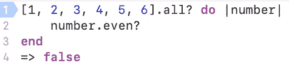

# Ruby Enumerable 的简单可视化:

> 原文：<https://blog.devgenius.io/easy-visualisation-of-ruby-enumerables-9d2e91a0964e?source=collection_archive---------17----------------------->

## 。查找，。全部？vs 任何？还有。挑选

我是一个视觉学习者，有时阅读定义是不够的。直到我应用图像和实际的代码片段，它才开始有意义。这里有一些现实生活中的例子和代码片段，有希望用这三个 Ruby 可枚举的例子来清理。

假设我们带一个 4 岁的孩子去杂货店。当孩子们还小的时候，他们是非常实际的生物，我们需要非常具体地给他们指明方向。你可以告诉一个孩子或一台电脑一只猫是斑马，他们会相信你。电脑和孩子很像。

## 。找到或。发现

我们告诉我们四岁的孩子去给我拿个苹果。我们的孩子会走到我们面前的柜台前，拿起他们看到的第一个苹果，然后拿回来给我们。Find and detect 查看数组，当它看到数组中的第一个真响应时，它将返回该值。

上面显示了一组数字。我只想要所有数字中的第一个偶数。

上面显示了一个名称数组。我只想从数组中取出第一个三个字母的名字。

## 。选择或。查找全部

我们还和我们四岁的孩子在杂货店里。我告诉他们把手推车推到水果展示区，把所有的青苹果都拿回来。这是我们的孩子带回来的。

现在我们已经把这家杂货店所有的青苹果都放在一辆新车上了。Select 和 find_all 接受一个数组，并在一个新数组中返回所有真值。

上面的代码片段给出了数字数组中的所有偶数，并返回一个新的数组。上面的代码片段提取了所有三个字母的名字，并返回一个三个字母的名字的新数组

## 。全部？vs .any？

认为任何和所有可列举的为真或假，或是或否的问题。我们问我们四岁的孩子手推车是否装满了苹果。他们说是！这是所有的例子吗？

上面的代码片段表明数组中的所有数字都大于零或为真

上面的代码片段询问是否所有的数字都是偶数。他们不是，所以返回是假的。

现在我们问我们四岁的孩子是否有苹果是绿色的。他们说是！苹果有许多颜色，但是有绿色的苹果。

上面的代码片段询问是否有任何数字是偶数。有三个偶数，所以返回为真。

上面的代码片段询问是否有任何数字是负数。所有的数字都是正的，所以返回是假的。

## 最后

伪代码和思考你想要的输出是很重要的。一旦你知道你的输出应该是什么，你就可以寻找一个可枚举的方法来实现它。我个人觉得把我正在学的东西应用到我已经知道的东西上是很有帮助的。有一次，有人告诉我，计算机很笨，你需要非常明确地表达出来，这样它才知道该做什么。这将使理解和使用可枚举更容易。