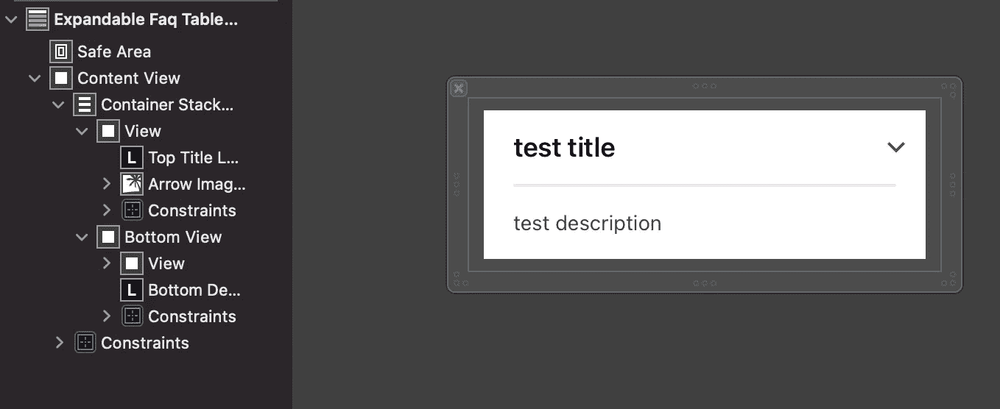
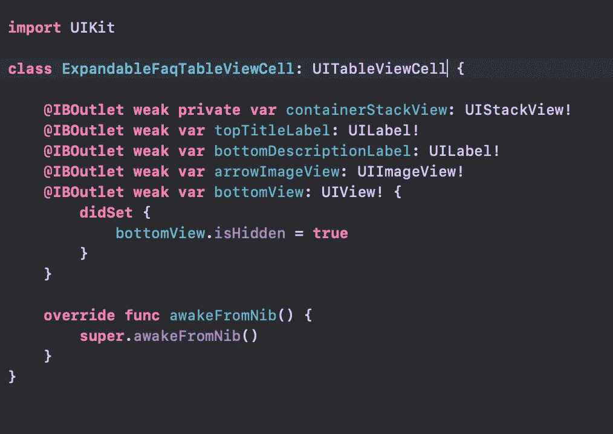
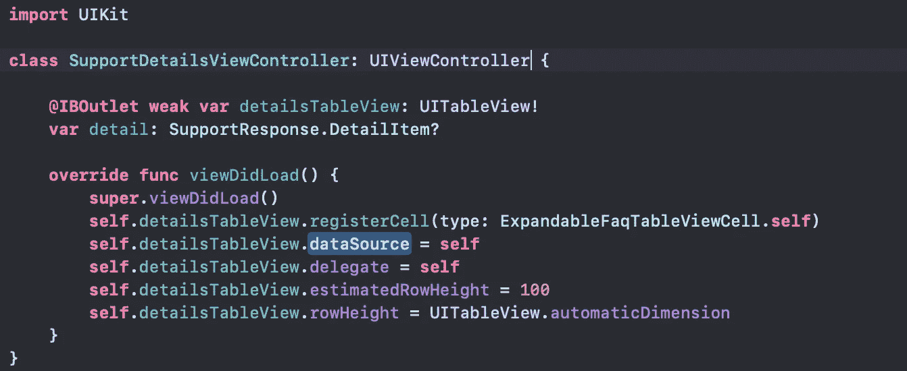
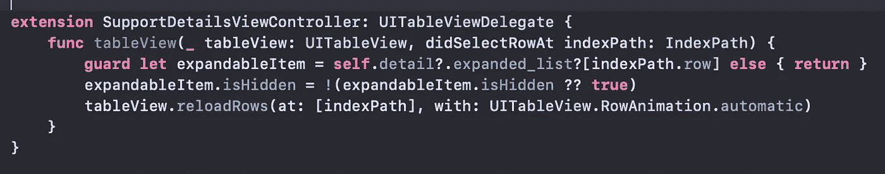
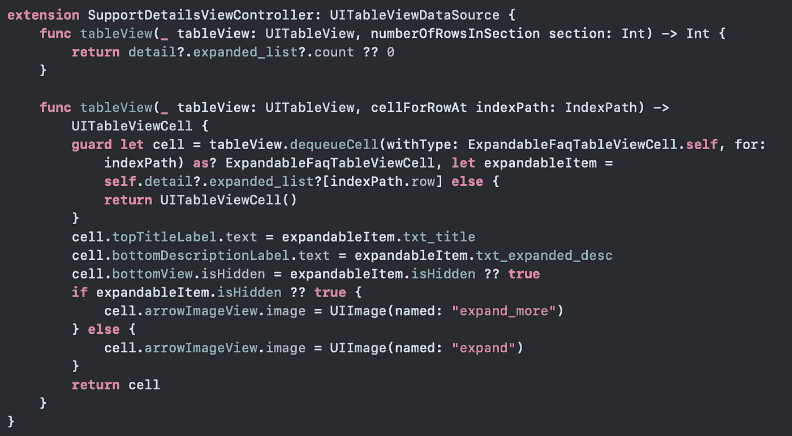
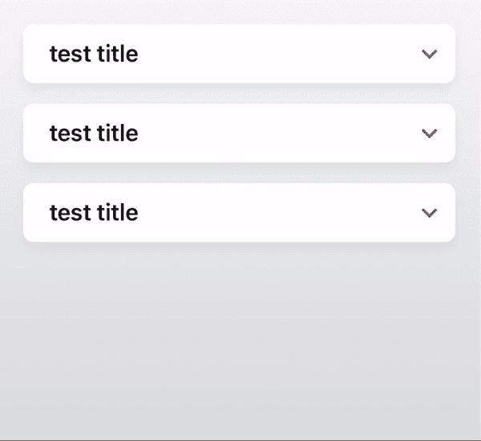

# Swift 5 中的可扩展 UITableViewCell(简单方式)

> 原文：<https://blog.devgenius.io/easy-way-to-create-an-expandable-uitableviewcell-in-swift-5-a5c72d1361da?source=collection_archive---------0----------------------->

我们将看到如何在不使用节的情况下创建可扩展的 tableview 单元格。

使用 **UIStackView** ！！！

让我们首先创建我们的单元格(我们将称之为 ExpandableFaqTableViewCell)

这就是**锡伯**应该有的样子。现在让我们在内容视图中放置一个 **UIStackView** 并添加必要的约束。

我们想要分离扩展区域，所以我们将在我们的 **UIStackView** 中添加两个视图。第一个视图将只包含一个 UILabel(这是我们的标题)和一个简单的图像，它将根据单元格的状态改变为 up 或 down。第二个视图将包含一个 UIView(一个简单的行)和一个 UILabel，它是描述(它可以有多行)。

现在让我们将第二个视图命名为 bottomView(注意在 bottom view 中你可以添加任何你想要的东西，而不仅仅是一个 UILabel。在所有视图中使用约束。

现在让我们看看 swift 文件应该是什么样的。

我们连接所有的 **IBOutlets** ，正如你注意到的，我们应该在底部视图中添加一个 didSet。这意味着当底视图被设置时，它将被隐藏。您可以避开这一步，直接在 xib 文件中设置 hidden 属性。我们完成了 UITableViewCell 的配置。

现在让我们看看我们的 UIViewController(我们将称它为 SupportDetailsViewController)

我们将从 UIViewController 的基本配置开始

detailsTableView 将是我们的 UITableView。我们需要注册我们的单元格，并设置数据源和 **UITableViewDelegate** 和 **UITableViewDatasource 的委托。**为了方便起见，我们将在 100 处添加一个 estimatedRowHeight 和一个 RowHeight 的 automaticDimension，这样高度将等于单元格的内容。

下一步是用 UITableViewDelegate 和 UITableViewDatasource 添加 SupportDetailsViewController 的扩展

让我们先看看 **UITableViewDelegate** :

我们只需要实现 didSelectRowAt 方法，并且尽可能地简单。在这个例子中，我们有我们的模型数组，我们将使用它来保持可扩展单元的状态。因此，在点击单元格时，我们将反转模型上的 isHidden 值(从 true 到 false，反之亦然),这里的技巧是只调用 reloadRows 函数

*table view . reload rows(at:[index path]，with: UITableView。RowAnimation.automatic)*

现在我们将看到扩展单元格的技巧。让我们实现 **UITableViewDataSource** 的方法

numberOfRowsInSection 将只计算我们的数组

让我们把重点放在 cellForRowAt 函数上。在配置了带有标题和描述的单元格后，我们需要配置底部视图，以便在单元格被点击时隐藏。我们简单地用数组中的值设置 bottomView 的 **isHidden** 属性。如果您还需要更改图标(向上或向下)，您可以基于 isHidden 属性设置图像。

结果是:

可扩展示例

如果你想在你的单元格中添加**圆角和阴影**你可以阅读我的帖子(正如你所见，它对可扩展的单元格也非常有效):[https://medium . com/p/round-corners-and-shadow-in-uitableviewcell-swift-5-8 EB 903 BF 38 a 1](https://medium.com/p/round-corners-and-shadow-in-uitableviewcell-swift-5-8eb903bf38a1)

请支持我们成为灵媒会员

 [## 用我的推荐链接加入媒体

### 作为一个媒体会员，你的会员费的一部分会给你阅读的作家，你可以完全接触到每一个故事…

simaspavlos.medium.com](https://simaspavlos.medium.com/membership) 

*更多内容尽在*[*blog . devgenius . io*](http://blog.devgenius.io)*。*