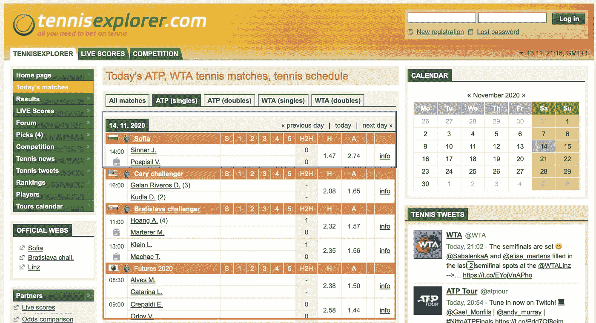
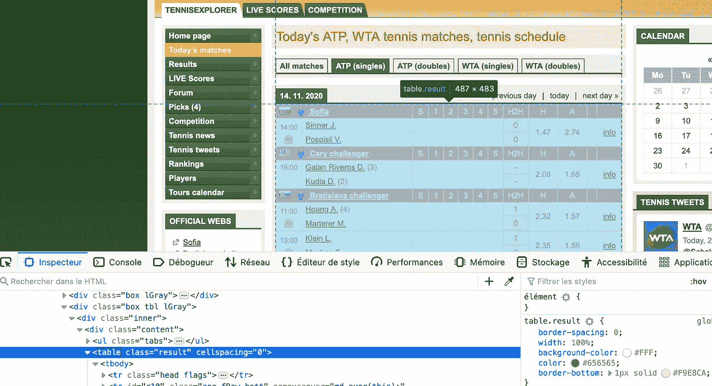
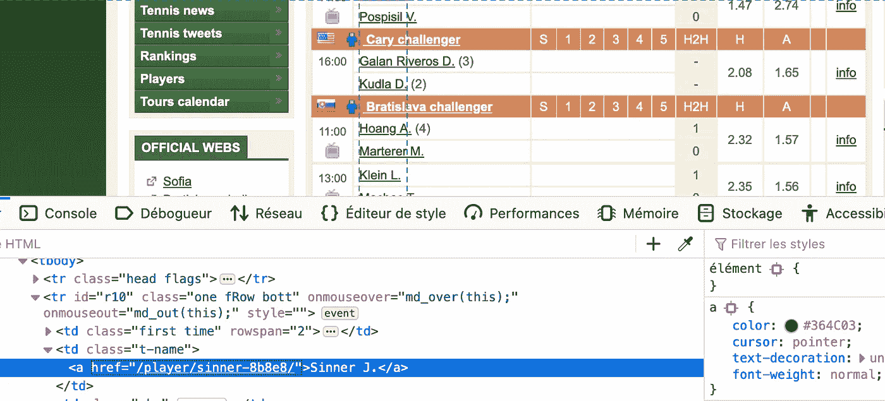

# 使用 Python 轻松抓取网页

> 原文：<https://blog.devgenius.io/easy-web-scraping-with-python-f9e884a90420?source=collection_archive---------4----------------------->

享受自动化—扩展您的能力


克拉克·蒂布斯在 [Unsplash](https://unsplash.com?utm_source=medium&utm_medium=referral) 上拍摄的照片

在过去的几年里，我学到的一件事是，我们很快就会对重复的东西感到厌倦。

例如，你正在寻找一辆新车，不想被愚弄，所以你每天都在许多网站上寻找一个好的建议…这可能相当无聊。当然，现在大部分网站都可以有提醒系统，但不管怎样，你明白了。

就我个人而言，我对网球感兴趣。我想知道每个 D+1 会有哪些球员上场，以确保我不会错过任何我感兴趣的比赛。

所以在开始编码之前，这里是我的购物清单:

*   找一个能提供每日日程表的网站(tennisexplorer.com)
*   找一个 Python HTML 解析器(美汤)
*   了解一点 HTML

如果你关注了我以前的文章，我将使用我提到的一些特性(比如[日志](https://medium.com/better-programming/stop-using-print-to-debug-your-python-code-2ace9217f501))。

现在我们来认真的谈谈，开始我们的小剧本吧！

让我们先来谈谈我们将使用的模块 are，从第 1 行到第 5 行定义:

*   **请求**:我们需要它来检索 HTML 网页及其内容
*   **日志**:对调试目的总是有用的
*   **BeautifulSoup** :我们的 HTML 解析器——我们将在后面详细讨论
*   **argparse** :用于使用-v 标志实现详细级别(第 7 行到第 14 行)
*   **datetime** :强大的计算我们的一天+1(见第 17 行的简单计算，和第 18 行典型的 Python 变量赋值)

这很简单。我们查找明天的值，并将它们传递给一个 **GET** 请求(l25 / l29)。以下是在**调试**模式下运行时的输出

```
python tennis.py -vv
2020–11–13 21:09:25,079 — root — DEBUG — day: 14, month: 11, year: 2020
2020–11–13 21:09:25,079 — root — DEBUG — URL : [https://www.tennisexplorer.com/matches/?type=atp-single&year=2020&month=11&day=14](https://www.tennisexplorer.com/matches/?type=atp-single&year=2020&month=11&day=14)
2020–11–13 21:09:25,208 — urllib3.connectionpool — DEBUG — Starting new HTTPS connection (1): [www.tennisexplorer.com:443](http://www.tennisexplorer.com:443)
2020–11–13 21:09:25,485 — urllib3.connectionpool — DEBUG — [https://www.tennisexplorer.com:443](https://www.tennisexplorer.com:443) “GET /matches/?type=atp-single&year=2020&month=11&day=14 HTTP/1.1” 200 16790
2020–11–13 21:09:25,531 — root — DEBUG — Response content: b’<!DOCTYPE html PUBLIC “-//W3C//DTD XHTML 1.0 Transitional//EN” “[http://www.w3.org/TR/xhtml1/DTD/xhtml1-transitional.dtd](http://www.w3.org/TR/xhtml1/DTD/xhtml1-transitional.dtd)">\n<html
```

看起来不错。接下来，我们需要分析我们的 HTML 内容。在用脚本解析 HTML 之前，有一件事可以帮助你，那就是使用 Firefox / Chrome dev 模式来清楚地识别你在网页中寻找的信息是如何表示的。

在我的例子中，我想获取蓝色矩形内的所有信息，同时区分红色矩形内的信息。



如果你使用检查工具，你会很快看到所有想要的信息都在一个表中，并且有一个类属性=结果。



嗯，这是摘录的好开始。然后，我们还可以过滤 tbody(表体)元素，以进一步减少。然后，我们需要确定两件事:

*   锦标赛是在一个特定的职业/ id 还是别的什么？是的，它总是一个 **tr** 元素，一个类被设置为“ **head flags**
*   同样的事情也适用于球员吗？不完全是。每个面对面的人都有一个专用的 id。例如，玩家 1 的 id=r1，而玩家 2 的 id=r1b。也许我们可以在这里做得更容易，我们会看到以后。

首先，让我们将所有的锦标赛位置放入我们的 tbody 中，以便能够逐个解析每个区块:

第 2 行，我们用 response.content 作为参数初始化我们的 BeautifulSoup 解析器。
然后，我们在表格元素(l4)上应用一个过滤器，在第 5 行上减少。

接下来，我们使用 enumerate 来获取锦标赛名称(t_name)和锦标赛线(I ),这两个信息将被添加到我们的锦标赛索引列表(tournament_idx_lst)中。

```
python tennis.py -vv
2020-11-13 21:38:05,436 - root - INFO -   Sofia is located at line 0 of the tbody
2020-11-13 21:38:05,437 - root - INFO -   Cary challenger is located at line 3 of the tbody
2020-11-13 21:38:05,438 - root - INFO -   Bratislava challenger is located at line 6 of the tbody
2020-11-13 21:38:05,440 - root - INFO -   Futures 2020 is located at line 11 of the tbody
2020-11-13 21:38:05,443 - root - INFO - [0, 3, 6, 11, 24]
```

下面是我们的循环将产生的输出。这是一个非常好的开始，因为我们现在可以使用我们的锦标赛 _idx_lst 来提取两个边界之间的内容。

如果你没注意到，玩家的名字会被截断。我想知道全名。我们需要提取每个玩家的 href 链接，转到玩家的网页，并获得全名。



每个玩家都有一个 href 链接，在“t-name”类的元素上

我会为这个任务专门设计一个函数，因为它会随着玩家数量的增加而被使用。

这个也超级简单。在玩家页面上，玩家的名字位于一个带有 plDetail 类的表格中，在两个

### 标签之间。注意 player_name 是一个列表的窍门，第一项[0]永远是我们玩家的名字。

下面的例子将向你展示它是如何工作的:

```
print(getPlayersFullName("/player/sinner-8b8e8/"))
Jannik Sinner# Check the content of player_name var
print(player_name)
[<h3>Sinner Jannik</h3>]# Check the content of item n°1 of the list
print(player_name[0])
<h3>Sinner Jannik</h3># Convert it to text (beautiful soup method)
print(player_name[0].text)
Sinner Jannik# Reverse the content (I need first name - last name)
# Convert it to a list to easily reverse, then join it back to have a string
print(' '.join(player_name[0].text.split()[::-1]))
Jannik Sinner
```

这看起来不错。我们现在只需要用一些 for 循环来解析整个页面。我想要生成的是这样组织的字典:

```
tournament_dict = {
    "tournament1": {
        "current_date": ["x vs y", "z vs p"]
    },
    "tournament2": {
        "current_date": ["a vs b", "c vs d"]
    }
}
```

> 让我解释一下我们在这里做什么

*   首先，我们解析我们的 ***锦标赛 _ idx _ 列表*** ，它包含我们的 tbody 项目的所有锦标赛行号
*   锦标赛名称提取自 ***< td >*** 标签、 ***类 t-name*** 、来自 ***行列表*** (这是 tbody 表中的所有< tr >)
*   如果锦标赛名称不存在于我们的字典中，我们创建上面的树结构
*   然后，从第 8 行到第 9 行的循环解析两个锦标赛之间的所有记录(基于锦标赛位置—存在于 ***锦标赛 _idx_list*** )

如果您运行该代码，您将会得到类似这样的结果:

```
# Output with url = [https://www.tennisexplorer.com/matches/?type=atp-single&year=2020&month=11&day=15](https://www.tennisexplorer.com/matches/?type=atp-single&year=2020&month=11&day=15)
{'Sofia': {'2020-11-15': ['Jannik Sinner vs Vasek Pospisil']}}# Output with url = [https://www.tennisexplorer.com/matches/?type=atp-single&year=2020&month=11&day=15](https://www.tennisexplorer.com/matches/?type=atp-single&year=2020&month=11&day=15)
{'Masters Cup ATP': {'2020-11-15': ['Dominic Thiem vs Stefanos Tsitsipas', 'Rafael Nadal vs Andrey Rublev']}}# Output with url = [https://www.tennisexplorer.com/matches/?type=atp-single&year=2020&month=02&day=03](https://www.tennisexplorer.com/matches/?type=atp-single&year=2020&month=02&day=03)
# Multiple tournaments
{'Cordoba': {'2020-11-15': ['Pablo Cuevas vs Federico Delbonis', 'Gianluca Mager vs Pablo Juan Ficovich', 'Attila Balazs vs Lorenzo Sonego']}, 'Pune': {'2020-11-15': ['Salvatore Caruso vs Ramkumar Ramanathan', 'Viktor Troicki vs Sumit Nagal', 'Yuichi Sugita vs Thomas Fabbiano', 'Cedrik-Marcel Stebe vs Ivo Karlovic']}, 'Montpellier': {'2020-11-15': ['Norbert Gombos vs Pablo Carreno-Busta', 'Gregoire Barrere vs Joao Sousa', 'Vasek Pospisil vs Aljaz Bedene', 'Damir Dzumhur vs Elliot Benchetrit', 'Sergiy Stakhovsky vs Danilo Petrovic', 'Enzo Couacaud vs Guillermo Garcia-Lopez', 'Emil Ruusuvuori vs Nicolas Mahut']}}
```

这正是我想要的！当然，您可以用一个循环来运行脚本，以便对未来的匹配有更完整的了解。

希望这篇教程能让你的网络抓取不那么黑暗。不要犹豫，如果你有任何建议，请使用下面的评论部分。

感谢您的阅读