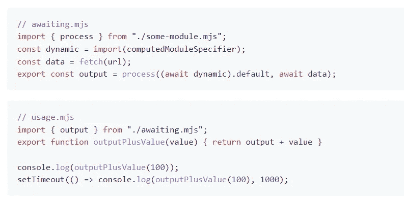
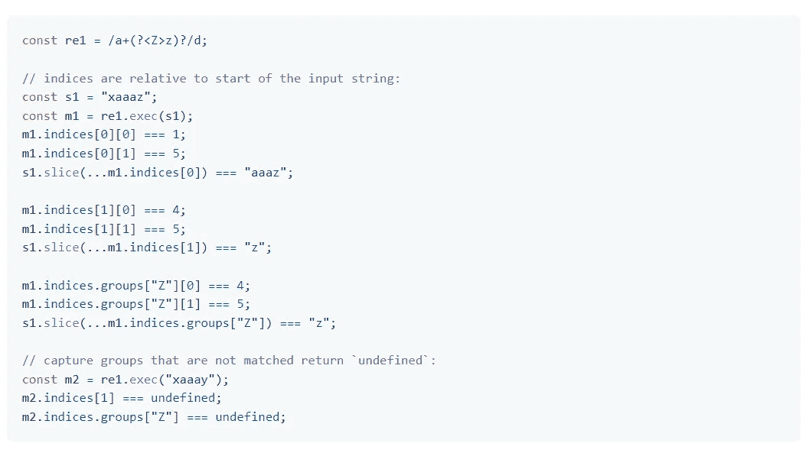
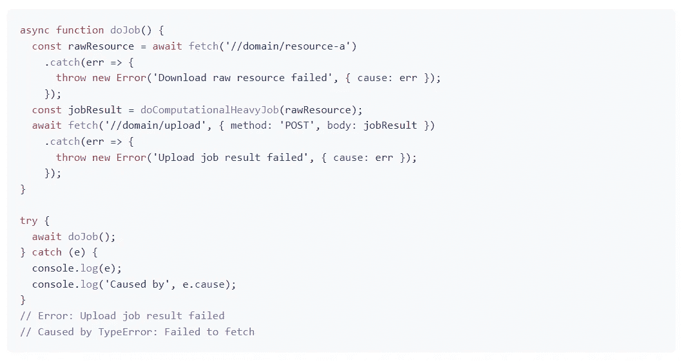
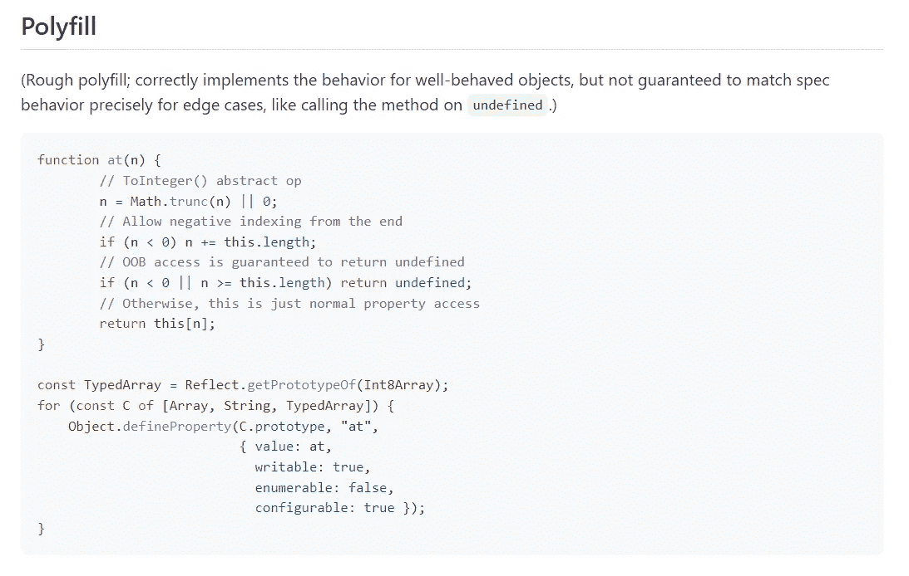

# ECMAScript 2022 正式发布，需要注意什么？

> 原文：<https://blog.devgenius.io/ecmascript-2022-is-officially-released-what-should-we-pay-attention-to-5e207ed61a46?source=collection_archive---------0----------------------->

## 有没有带来什么有趣的东西？


[绿色变色龙](https://unsplash.com/@craftedbygc?utm_source=medium&utm_medium=referral)在 [Unsplash](https://unsplash.com?utm_source=medium&utm_medium=referral) 上拍摄的照片

ECMA 大会于 2022 年 6 月 22 日批准了 ECMAScript 2022 语言规范，这意味着它现在正式成为一个标准。我们很快就能在 JavaScript 中使用这些新特性。下面将一一介绍:

# 引入顶级`**await**`

在此之前，`await`关键字只能在`async`函数中使用，如果强行使用就会出现语法错误:`await is only valid in async functions and the top level bodies of modules`

现在可以在文件的顶层使用`await`，它将被视为一个 ECMAScript 模块。下面是官方的例子:



图片来自 [GitHub](https://github.com/tc39/proposal-top-level-await#solution-top-level-await)

在`awaiting.mjs`中的`await`的承诺得到解决之前，`usage.mjs`中的任何语句都不会执行。

这在某些情况下很有用，比如动态依赖路径、资源初始化、依赖回退、WebAssembly 模块等。

# 正则表达式通过`/d`标志匹配索引

这个特性允许我们使用`d`字符来表示我们想要匹配的字符串的开始和结束索引。以前，在字符串匹配操作中，只能获得包含提取的字符串和索引信息的数组。在某些情况下，这是不够的。因此，如果您设置了标志`/d`，您将额外获得一个具有开始和结束索引的数组。

下面是官方的例子:



图片来自 [GitHub](https://github.com/tc39/proposal-regexp-match-indices#examples)

# `Error`对象上的`cause`属性

在`new Error()`中可以使用`cause`属性来记录错误中的因果链。

下面是官方的例子:



图片来自 [GitHub](https://github.com/tc39/proposal-error-cause#chaining-errors)

# 用于字符串、数组和类型数组的`at`方法

`at()`方法解决了一个非常实际的问题，即所有基本的可索引类(Array、String、TypedArray)都可以“负索引”，就像在 Python 中一样。这是一种更通用的方法，允许相对索引。

```
const arr = ['1', '2', '3'];// '3'
console.log(arr.at(-1));
// '2'
console.log(arr.at(-2));
```

下面是 GitHub 给出的一个简单粗糙的 polyfill:



图片来自 [GitHub](https://github.com/tc39/proposal-relative-indexing-method#polyfill)

# Object.hasOwn()

`Object.hasOwn`是`Object.prototype.hasOwnProperty`的便捷替代。我在以前的一篇文章中详细介绍了这一点:

[](https://javascript.plainenglish.io/in-vs-hasown-vs-hasownproperty-in-javascript-885771d2d100) [## 在 JavaScript 的“与‘hasOwn’和‘hasOwnProperty’中

### 你真的知道区别吗？

javascript.plainenglish.io](https://javascript.plainenglish.io/in-vs-hasown-vs-hasownproperty-in-javascript-885771d2d100) 

# 结论

此外，class 元素中还添加了一些新特性，我将在下面的文章中介绍这些特性:

[](https://medium.com/@islizeqiang/new-features-in-ecmascript-2022-for-class-elements-b4a8f4a26659) [## ECMAScript 2022 中针对类元素的新功能

### 它带来了什么便利？

medium.com](https://medium.com/@islizeqiang/new-features-in-ecmascript-2022-for-class-elements-b4a8f4a26659) 

如果你对今天介绍的内容有什么想法和疑问，欢迎留下评论。

# 参考

[1][https://www . ECMA-international . org/publications-and-standards/standards/ECMA-262/](https://www.ecma-international.org/publications-and-standards/standards/ecma-262/)

[https://github.com/tc39/proposal-top-level-await](https://github.com/tc39/proposal-top-level-await)

[https://github.com/tc39/proposal-regexp-match-indices](https://github.com/tc39/proposal-regexp-match-indices)

[https://github.com/tc39/proposal-error-cause](https://github.com/tc39/proposal-error-cause)

[https://github.com/tc39/proposal-relative-indexing-method](https://github.com/tc39/proposal-relative-indexing-method)

*感谢阅读。如果你喜欢这样的故事，想支持我，请考虑成为* [*中等会员*](https://medium.com/@islizeqiang/membership) *。每月 5 美元，你可以无限制地访问媒体内容。如果你通过* [*我的链接*](https://medium.com/@islizeqiang/membership) *报名，我会得到一点佣金。*

你的支持对我来说非常重要——谢谢。