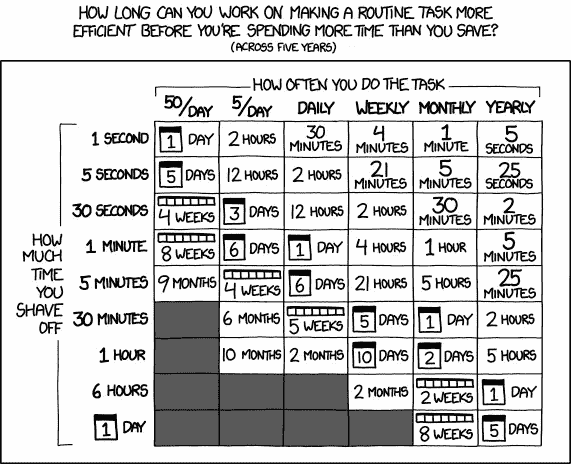

# 工程管理经济学

> 原文：<https://blog.devgenius.io/economics-in-engineering-management-5fda115477e7?source=collection_archive---------0----------------------->

## 经济学原理可以为测量工程系统的效率提供一个视角。

这篇博客是博客系列的一部分— [工业时代的管理工具如何帮助有效的工程管理？](https://medium.com/@meet.aman.gupta/how-can-industrial-era-management-tools-help-in-effective-engineering-management-862104a33d80)

您可以访问上面的上下文链接和本系列其他文章的链接。

工程经理可能会认为经济学是金融专业人士所说的外语。在这篇博客中，我想介绍经济学作为一种管理工具来衡量和优化系统的效率。

# 资本支出和 OPEX 作为一种管理理念

让我们首先快速回顾一下金融领域的资本支出和运营支出，尤其是从工程角度。

**资本支出:**资本支出或资本支出是购买重要的商品或服务，公司将使用这些商品或服务来改善其**未来**的业绩**。**发生的成本在资产的生命周期内**计入费用**，而不是在支出时全部计入费用。

**OPEX:** OPEX 或运营费用是公司日常运营的费用。我们在这些支出发生的同一时期将其列为费用。

# 资本支出与运营支出作为工程决策的视角

资本支出和运营支出之间没有正确或更好的支出类型，但是您计划支出的 ***使用期*** 可以帮助您在日常决策中做出正确的决策。

让我用几个我们作为工程经理需要做出决策的例子来解释这个概念:

## **投资自动化还是投入更多人力**

作为工程师，我们倾向于自动化每一项手动任务。开发这样的自动化需要时间和精力，即一次性成本或资本支出，而我们试图通过节省运营支出来恢复它。

然而，如果我们计划从正在考虑开发自动化的技术中迁移出来，我们将得到一个更短的时间来摊销这个成本。

因此，如果我们可以通过在更短的时间内为手动任务部署更多的人来实现业务成果，这对于组织来说可能是一个更具成本效益的决策。

这是 xkcd 的另一个有趣的图表，比较了自动化花费的时间(成本)和实际节省的时间

值得被 xkcd[【1】](https://xkcd.com/1205/)浪费时间吗

## **批量与基于订阅的软件许可**

随着越来越多的公司转向基于订阅的许可方式，我们可能不会很快购买等效的批量软件许可证。但是，如果有这样的选择，我们应该考虑我们试图购买的软件是否是我们服务的核心组成部分。

假设软件将在很长一段时间内提高系统的性能或效率。在这种情况下，选择批量许可证是有意义的，因为与订阅许可证相比，批量许可证的前期成本会作为资本支出，而订阅许可证则是运营支出。当然，总体而言，资本支出和运营支出预算也决定了这一选择。

## **雇佣与承包**

在列出的所有示例中，从资本支出(雇佣)与运营支出(承包)的角度来看，这是最明显的一个。

我想把这个例子扩展到内部培训(Capex)和横向招聘(Opex)来获得团队中不可用的技能。考虑技能组合的使用期限，以决定资本支出与运营支出的决策。

有些决策可能如此明显，以至于我们在没有资本支出和运营支出分析的情况下也做出了同样的决策。然而，这些工具仍然可以作为一个框架向您的利益相关者解释这些决策。

# 工作流分配的经济学

作为经理，我们在履行人力资源经理职责时，非常重视 R&R、目标和评估周期。我强烈要求我们像重视评估周期一样重视工作流程管理。工作分配是影响团队效率的一个很好的工具。

以下是关于我们如何将工作流分配用作经济杠杆的一些建议:

## **下放**

如果一个初级员工能以 80%的效率完成一项任务，我们应该把它委派给他们，因为:

1.  它为你的团队创造了一个领导渠道
2.  工程经理可以通过赋予员工更重要的职责来激励他们
3.  高级员工有机会做一些他们可以增加更高价值的事情
4.  这种分配具有经济意义，因为初级员工的工资通常会更低；因此，通过以更低的成本获得相同的产出，你正在为提高公司的底线做出贡献。

## **好的工作应该是对好工作的奖励。**

丹尼尔·平克在他 2009 年的畅销书《T6 驱动力 T7 驱动力 T8 驱动力 T9 驱动力 T10 驱动力 T11 驱动力》中认为，内在动机比金钱等外在动机因素对人类更有效。我们都有一个奖励和认可(R & R)预算，但在管理一个高绩效团队时，这个预算总会受到限制。

然而，通过做更多高价值的工作，我们可以为组织创造多少价值是没有限制的。我们可以将高价值的工作任务作为一种工具来奖励出色完成的工作。

## **同样给你的顶级员工分配常规业务(BAU)任务**

当顶级员工处理 BAU 任务时，如小的改进或操作，他们往往会找到一种更有效和更有创意的方式来完成它，可能是因为他们厌倦了这样做或想挑战自己。

这种创造性的解决问题的方法，反过来又为整个团队在下一次创造了一个更有效的过程。除了效率之外，这种轮换也使团队中的知识制度化，减少了你的顶级员工的权利。

## **在创新过程中增加松弛度**

虽然我在整篇文章中都主张提高系统的效率，但我想建议将创新举措作为追求效率的例外。

如果需要，请不要犹豫在创新过程中增加备用时间，并将此备用时间视为资本支出，这将在项目生命周期中节省更高的成本。除了交换时间效率，当你在你的创新项目中看到绿芽时，你还可以推迟其他经济政策，比如工作轮换。

请在 [Linkedin](https://www.linkedin.com/in/meetguptaaman/) 上联系我，以便进一步交流。

[这里的](https://medium.com/@meet.aman.gupta/how-can-industrial-era-management-tools-help-in-effective-engineering-management-862104a33d80)是该系列主页的链接，方便参考。

如果你喜欢读这篇文章，别忘了鼓掌👏请关注我，了解更多关于工程管理的内容。欢迎反馈！

非常感谢！

# 参考

[1][https://en . Wikipedia . org/wiki/Drive:_ The _ surcing _ Truth _ About _ What _ infinites _ Us](https://en.wikipedia.org/wiki/Drive:_The_Surprising_Truth_About_What_Motivates_Us)