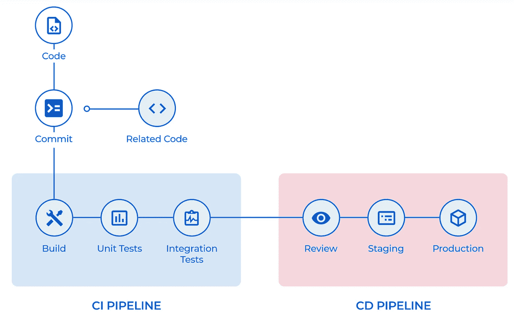

# 生态系统 4——软件开发的革命性方法

> 原文：<https://blog.devgenius.io/ecosystem54-a-revolutionary-approach-to-software-development-afac32964dc?source=collection_archive---------30----------------------->

生态系统 24 技术

# 内容

1.  **概述**
2.  **单点登录/单点权限系统**
3.  **服务发展之路**
4.  **现成的服务**
5.  **内置 CI / CD 流程**
6.  **基础技术**
7.  **结论**

# 概述

[**eco system 4**](https://54origins.com/en/ecosystem54/)是由 [54origins 团队](https://54origins.com/en/about-us/)开发的一套技术，利用这套技术，您可以快速创建具有极高安全级别和巨大定制潜力的模块化解决方案。eco 54 允许您创建适用于小公司的有效应用程序，并扩展到企业级。

在 eco 54 中，发展和相关过程被连接成一个单一的集合，其中每个过程互不干扰，它们可以在“信息场”的概念内相互作用。

**生态系统 4 的整合分几个阶段进行:**

1.  启动——在诸如 **AWS** 、 **DigitalOcean** 或 **Hetzner** 等提供商上部署 Biom，配置服务，并创建根用户。 **Biom** 是我们在 eco 54 中使用的一个概念，用来解释“信息域”的一个部分，它有一个单一的帐户、一个单一的许可系统、服务的一般结构、与此相关的过程以及服务之间的信息交换。
2.  创建您的用户和组。
3.  为组设置权限。
4.  定制和使用。

# 单一登录/单一权限系统

单一登录和单一权限系统

eco 54 实现了单一登录和密码技术。这大大简化了用户对许多 Ecosystem54 服务的访问，并大大节省了员工的工作时间。您需要用他们的一组凭证为用户创建一个帐户，然后他将能够立即在可用的服务之间切换。

单个权限系统允许您管理和配置从一个主服务 **Auth** 创建的每个用户组的访问权限。任何用户操作都受到访问权限的限制。您可以创建具有特定权限集的组，添加和删除用户，分别管理每个服务的权限，并在必要时授予个人权限，这些权限是优先权限。

通过登录和密码进行的基本身份验证不能提供现代企业所需的适当安全级别。一个员工很有可能会忘记密码，或者把它写在任何容易拿到的地方，还会把密码告诉他的同事。因此，eco 54 使用内置的身份验证系统来保护用户帐户，并确保最高级别的安全性。它是通过使用 [**ECDSA**](https://en.wikipedia.org/wiki/Elliptic_Curve_Digital_Signature_Algorithm) 密钥对(公钥和私钥)和一个 QR 码来实现的。 **ECDSA** 密钥对是在用户在其电话上注册期间生成的，而私钥仅存储在创建位置，即用户的个人电话上。只有存储了私钥的用户手机才能扫描二维码。

此外，为了保护 eco 54 中的某些操作，可以将确认二维码附加到关键操作上，也就是说，即使是开放的帐户，也只有帐户所有者才能通过仅使用存储私钥的设备(手机)扫描二维码来执行关键操作。关键状态可以分配给某些服务。

# 发展的服务方式

模块结构

Ecosystem54 的模块化架构和分布式认证系统保证了所有服务的稳定可靠运行。如果由于某些技术原因，一个服务停止工作或正在被配置，那么其他服务照常工作。这使您可以在不停止整个生态系统 4 的情况下开发任何其他附加服务。

由于软件开发的服务方法，一个良好开发的结构，一组基本的功能，一个为您公司开发的新服务可以在 2-3 周的短发布周期内完成。

AP54 协议的多功能性确保了根服务的稳定性。通过 AP54 协议，可以实现服务到服务的同步。如果您通过 Auth 服务更改了任何权限，则会通过 AP54 协议向其他服务发送一条消息，说明已经进行了更改。对 Auth 服务所做的更改会自动转移到其他服务。

# 现成的服务

Ecosystem54 已经集成了大量必要的现成服务，这些服务将立即使您公司的业务流程自动化:

*   Auth —用于管理用户帐户和访问权限、创建组和权限系统、更改数据的主要服务。

> [**PM**](https://54origins.com/en/wms54-promo/)—定制化 IT 项目管理服务。PM54 包括有效项目和团队管理的所有主要功能。

*   FxCRM —功能强大的外汇经纪人销售管理系统。
*   **实体** —一个具有树形数据结构的通用后端服务。
*   **控制** —一项允许您检测技术问题并控制备份创建的服务。
*   **内容** —一种动态存储和编辑内容的服务，可轻松连接到项目。
*   **Relay** —用于创建和配置固件的服务，在 Raspberry Pi 上添加了一些 Ecosystem54 应用程序以及微控制器与 Auth 服务的关系。
*   **MRPS**—IT 企业的 CRM。
*   [**计算**](https://54origins.com/en/blog/computations54-framework-for-intelligent-data-processing/) —对大量数据进行智能处理和分析的服务。

为了在服务器上分配负载，Ecosystem54 有一个助理服务器，它在后台执行高能耗和复杂的计算。

eco 54 的一个巨大优势是你可以使用其他服务而无需开发它们——这将大大节省你的时间和资源。

# 内置 CI / CD 流程

内置 CI / CD 流程

Ecosystem54 内置的 CI/CD 流程为您提供了许多重要优势。例如，自动部署、启动更新的高速率、由于内置自动集成测试系统而没有错误的高质量完成的服务，该系统检查整个周期:从输入数据到结果。

eco 54 内置了**自动备份系统**:可以在特定时间配置定时备份任务。

将监控集成到代码中这样一个重要的特性将允许您监控服务器和服务的状态。

# 基础技术

生态系统 4 只使用**开源技术**

开源技术

# 结论

由于服务交互、简单软件开发和支持的独特结构，生态系统 4 的应用是多方面的。eco 54 主要用于与**金融科技**相关的关键管理任务。

54 [***出身***](https://54origins.com/)***——****一支专业的焊接团队。我们有来自 20 多个国家的 120 多个客户。我们的技术堆栈是 12 年努力工作和平衡的结果，为您提供最灵活的工具和最高级别的安全性。*

*最初发表于 https://54origins.com*[*。*](https://54origins.com/en/blog/ecosystem54-software-development/)