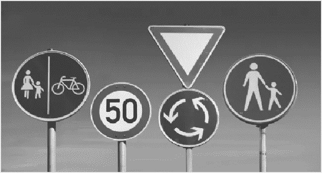
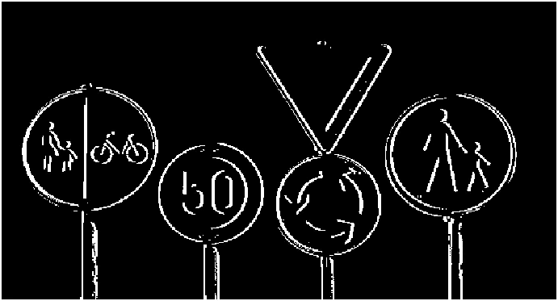

# 边缘检测

> 原文：<https://blog.devgenius.io/edge-detection-8b26039c327?source=collection_archive---------22----------------------->

边缘检测是一个日益热门的话题。检测边缘并使用人工智能处理这些边缘提高了生产率。例如，自动驾驶汽车检测道路线并做出一些移动，或者在 instagram 中，您可以使用边缘检测来过滤您的图像。

因此，我在 MATLAB 中编写了一个简单的边缘检测代码，而没有使用图像处理工具，因为我想展示系统是如何工作的。如果你理解了主要思想，你可以使用任何编程语言。

首先，拿起一个图像。根据需要重命名图像。我用 signs.jpg


然后，开始代码部分。使用 MATLAB 读取图像非常容易。

```
image = imread('signs.jpg');
```

我们在 MATLAB 中得到图像，另一件事是把图像变成灰度。因为观察边缘要容易得多。

```
image = imread('signs.jpg');image_bw = rgb2gray(image);
figure(1)
imshow(image_bw)
```



确定检测边缘的阈值是很重要的。如果你的阈值很大，那么你的输出将包括所有的边。此外，如果阈值很小，则输出无法检测到边缘。我决定这个图像的值是 15。

```
filename = 'signs.jpg'
image = imread(filename);image_bw = rgb2gray(image);
figure(1)
imshow(image_bw);th = 15; %threshold
```

实际上我们还没有开始边缘检测部分。现在我们准备好了。为输出创建与“signs.jpg”大小相同的零数组。

```
image = imread('signs.jpg');image_bw = rgb2gray(image);
figure(1)
imshow(image_bw)th = 15; %threshold[x,y]=size(image_bw);
edge=zeros([x,y]);
```

在 for 循环中开始边缘检测。For 循环检查行像素值，并彼此相减以比较阈值。如果减去的值大于或等于阈值，则零数组(边)数会随着它们所对应的循环数而变化。

```
image=imread('signs.jpg');image_bw = rgb2gray(image);
figure(1)
imshow(image_bw)th = 15; %threshold[x,y]=size(image_bw);
edge=zeros([x,y]);for i=1:x
  j=1;
    while j+2<=y
      if abs(image_bw(i,j)-image_bw(i,j+2))>=th
        edge(i,j+1) = 1;
      end 
  j=j+1;
  end
end
figure(2)
imshow(edge);
```

