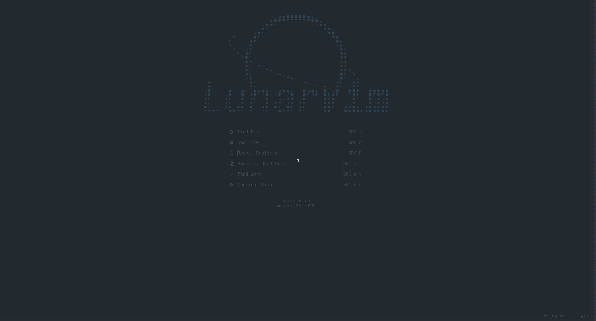
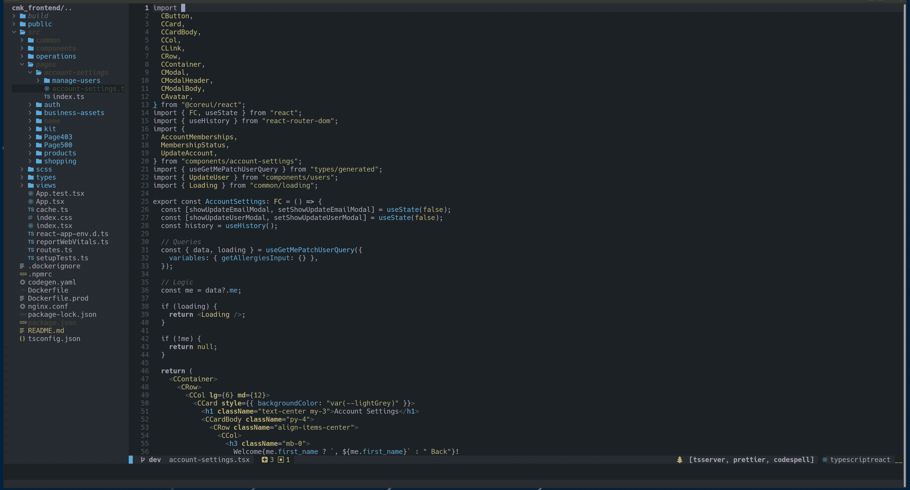
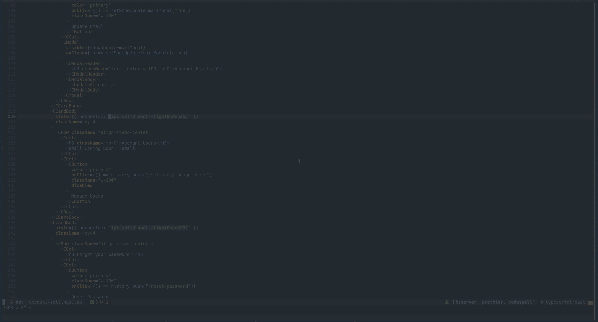
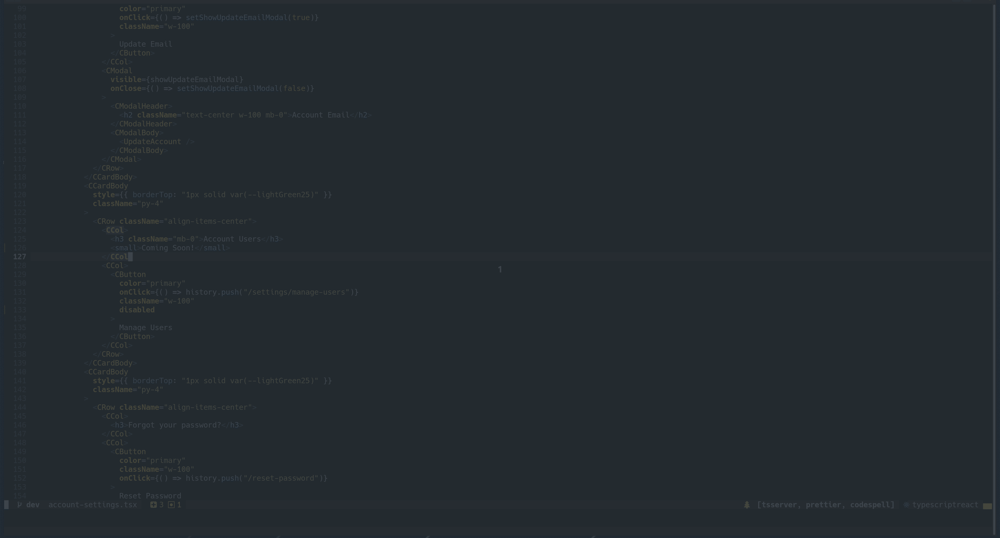
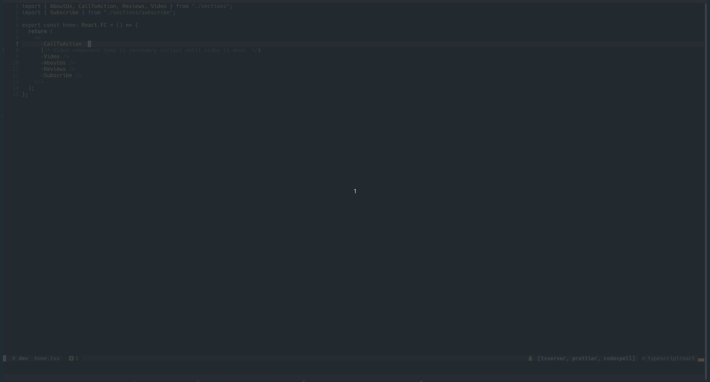
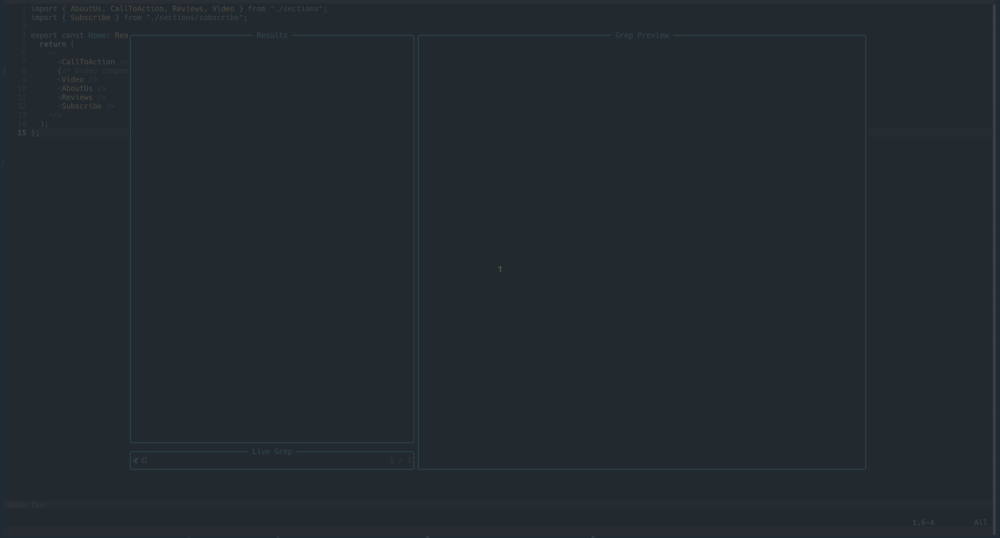

# 在 Lunar Vim 中编辑是神奇的——17 个 LVIM 技巧和窍门

> 原文：<https://blog.devgenius.io/editing-in-lunar-vim-is-magic-17-more-lvim-tips-and-tricks-598ba7f4f6d6?source=collection_archive---------3----------------------->

大家好，感谢你们的加入！

我已经有一段时间没有时间继续谈论我有多么喜欢一个好的月球 Vim 设置了。也就是说，你真的不需要做很多事情就能得到一个现成的功能设置！

不管怎样，她运行*是如此的流畅*，以至于我几乎没有时间离开键盘的最后一排。

所以，这是我最近和 LVIM 一起享受的一些事情！

如果你想要更多，看看我的第一篇 Lunar Vim 文章，[在 Lunar Vim 中编辑是神奇的——查看 LVIM 的 8 个技巧](/editing-in-lunar-vim-is-magic-8-tips-for-checking-out-lvim-69fd2083a47a)。


照片由 [NASA](https://unsplash.com/@nasa?utm_source=medium&utm_medium=referral) 在 [Unsplash](https://unsplash.com?utm_source=medium&utm_medium=referral) 上拍摄

# LVIM 的 Git

从检查一个新的分支到提交一些新的变更，从几个 vim 快捷方式，似乎可以做任何事情。

要开始，按`space`然后按`g`打开 git 菜单！



LVIM Git 菜单

## 在更改之间跳转

你有没有遇到过这样的情况:一个文件太长了，以至于你的终端在试图读取它的时候速度变慢了——或者——想象一下滚动屏幕找到你刚刚在第 2000 行所做的修改。

我希望你永远不必看到这份文件。我现在有。这不是我自己写的东西，但这是我目前必须编辑的东西！不过不要担心，重构正在发生。

好吧，当你需要找到那个改变的时候，就跳到那里！

```
space + g + j/k
```

`j`和`k`都是传统的 vim 上下绑定，这意味着您可以在变化之间跳转，而无需无休止的滚动。



在变化/大块之间跳跃

## 责怪它吧

我们都经历过。我们在一个新的代码库中，有人写了一些非常时髦的代码。

这是我的社交媒体版本。我需要知道是谁写的，有一个快捷方式可以告诉我谁该负责。

```
space + g + l
```



## 获得快速差异

假设您最近刚刚删除了一些您现在需要查看的代码。太远了，无法撤销，所以你有两个选择。长话短说，这个更快。

查看并排垂直分割！

```
space + g + d
```



## 刷新浏览器

内置的探索者与 LVIM 是超级好的。我一直在用它。不过，它并没有真正保持最新，这可能具有欺骗性。

进行一些更改，浏览器中的文件会变成不同的颜色，以表示哪些文件发生了更改。太好了！

打开一个终端并提交更改，文件树的颜色保持不变！骗人的。

有时候你只需要快速刷新文件树！

```
//While in the file tree
shift + R
```

现在，您的文件显示了它们的真实颜色。

# 望远镜戏法

使用 telescope 插件在代码中搜索文件或文本。又快又靠谱！

文件:

```
space + s + f 
```

文本:

```
space + s + t
```

搜索只是一个开始！有许多选项可以帮助您，您可以通过帮助菜单了解它们！

天哪，我希望我能早点知道。打开望远镜，然后按下`?`。

你会看到帮助菜单！



## 一些简单的正则表达式

有时当搜索文本时，你可能需要使用一些简单的正则表达式来包含那些古怪的字符。这是 regex 变得更好的最佳时机。

假设您正在搜索字符串，`this.has.periods`。

搜索`this`很容易，但是由于正则表达式的搜索，继续搜索将会导致很少的结果。而是使用转义符`\`进行搜索。

```
this\.has\.periods
```

现在，您在将 regex 与 Vim 结合使用方面更进了一步。

是的，很简单但是很有用。

## 快速修复列表

起初，我对 telescope 最大的不满之一是，一旦它关闭，我的搜索结果就会消失。

要保存结果，请选择您希望查看的结果，并将它们发送到快速修复列表。

使用`tab`选择结果，并使用`crtl + q`将其发送至列表。



现在，您可以随意过滤结果。

# 其他一些很酷的插件

## 瓦卡提时间

想在编写项目代码时跟踪自己的时间吗？WakaTime 很甜。

一旦激活，你可以测量每周，项目，甚至文件所花费的时间。

## 托多斯

在代码中快速添加注释，这样几秒钟内就能找到:

`//FIX: This section is so broken.`

`folke/todo-comments`插件允许你快速搜索你在代码库中创建的“待办事项”

这些可以从修复到警告——使得跟踪提交之间的开发进度变得容易。

# 值得使用的快捷方式

## 跳到错误

用`space + l + d`快速查看一个文件中的所有错误。

## 转到定义

跳转到函数/变量的源— `g + d`。

## 获取参考资料

查找一个函数或变量的所有出现— `g + r`。

## 获取类型定义

显示关于您正在“悬停”的功能的信息— `shift + k`。

## 滚动类型定义

定义窗口中的长定义？跳进窗口滚动— `shift + k`。

## 切换格式

我正在做一个几乎没有格式的项目…所以我需要小心不要一次添加太多的修改！

用`:LvimToggleFormatOnSave`拨动`format on save`。

# 农历维姆是神奇的

说真的，我从来没有对一个文本编辑器如此满意过。我喜欢支持这个项目，我希望你可以使用我在过去几年使用 LVIM 时学到的一些技巧和诀窍。

随意分享一些你自己的月球旅行和技巧，感谢阅读！