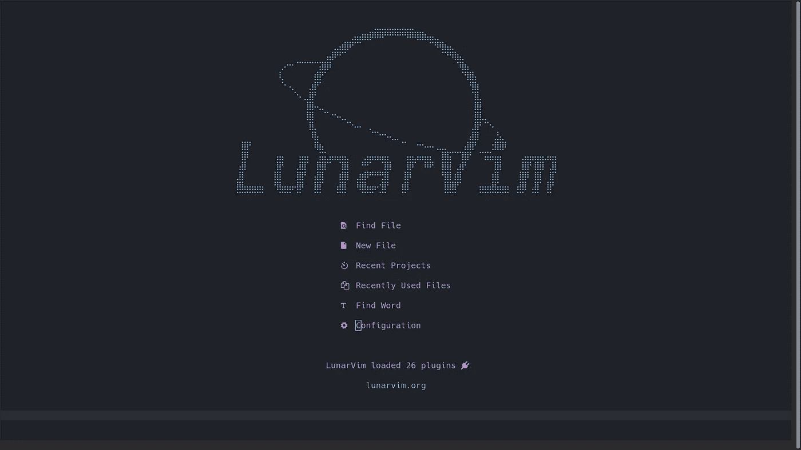
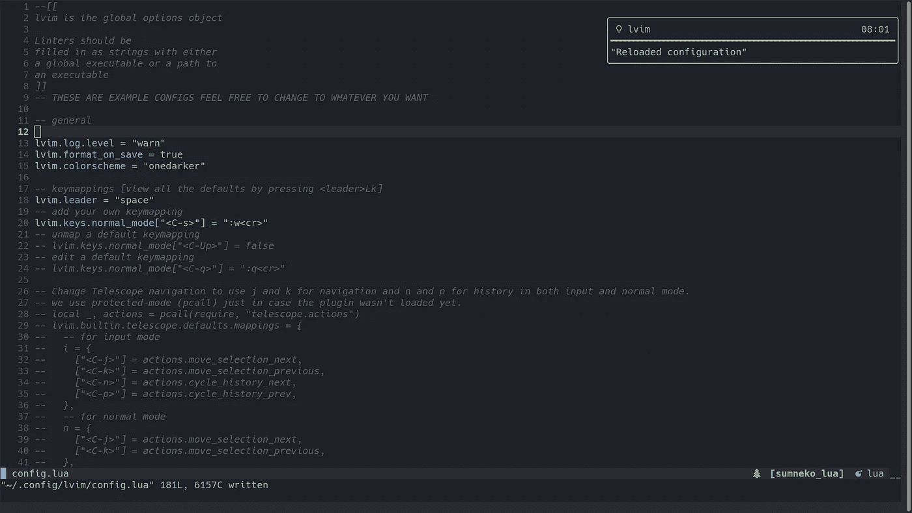
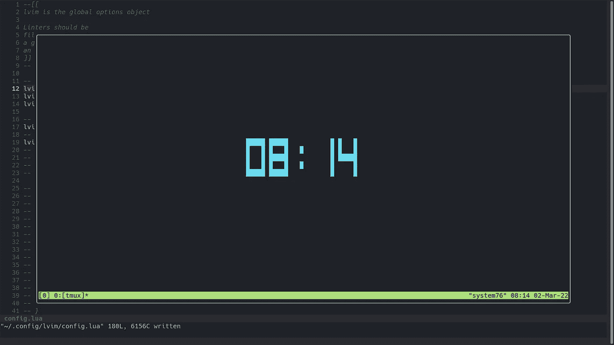
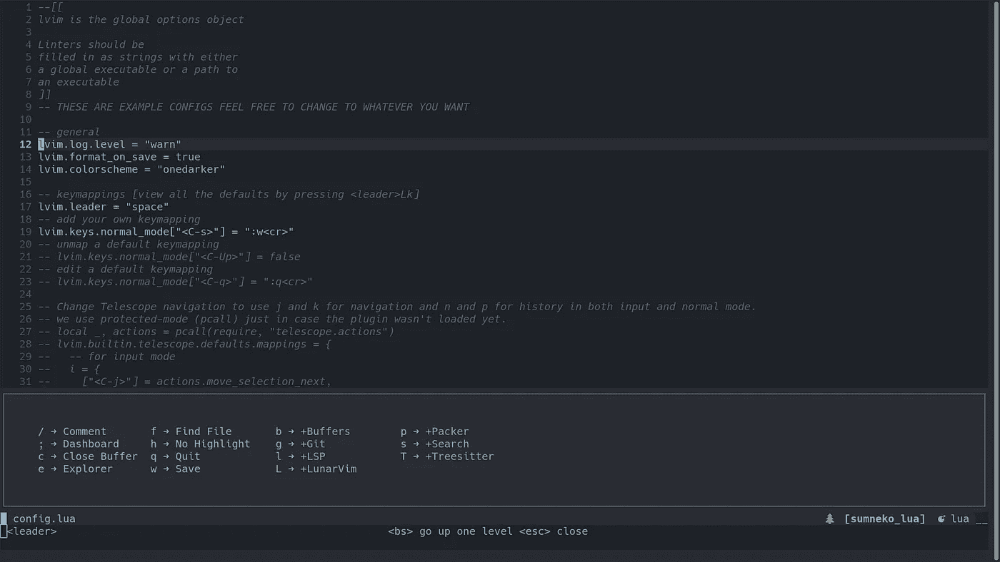
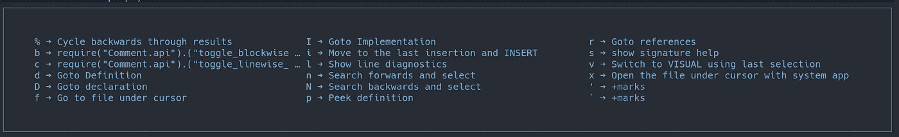
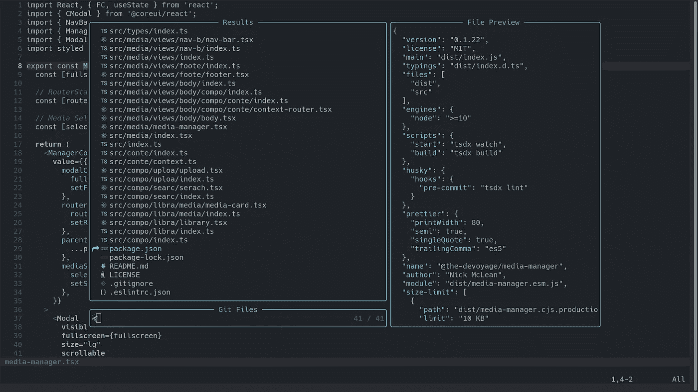
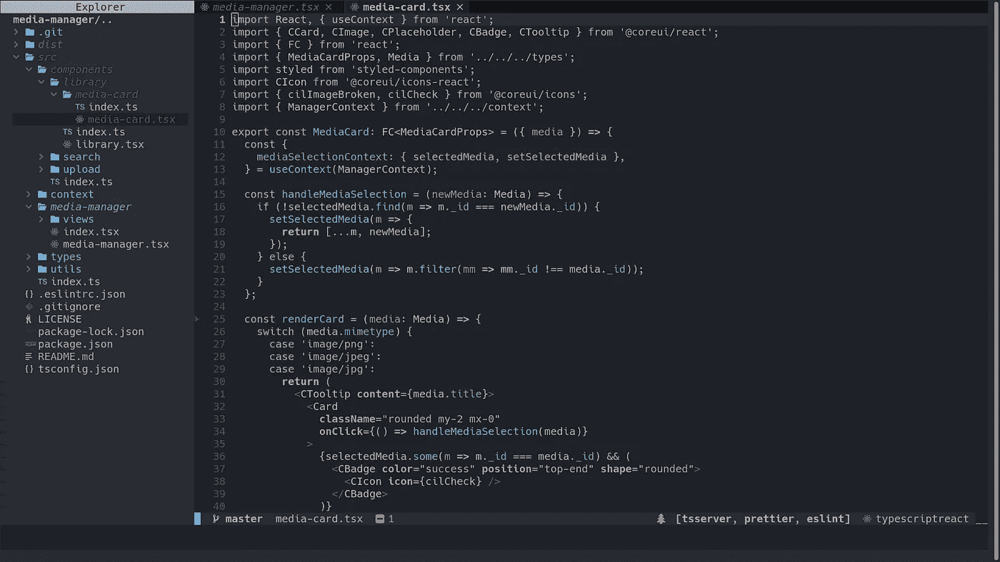

# 在 Lunar Vim 中编辑是神奇的——查看 LVIM 的 8 个技巧

> 原文：<https://blog.devgenius.io/editing-in-lunar-vim-is-magic-8-tips-for-checking-out-lvim-69fd2083a47a?source=collection_archive---------0----------------------->

大家好，感谢加入！

今天，我想花几分钟谈谈我在 Lunar Vim 上的一次冒险！上周，我一直在我的正常开发过程中断断续续地使用它，我即将把这个程序视为我的新“IDE”。为了进入一个新的编辑器，我的手指已经习惯于输入`lvim`而不是`nvim`,它们一点也不介意——它们似乎对我当前的设置很忠诚。

正如我刚才提到的，我的主要“IDE”是 neovim，带有“自定义”设置。我说“定制”是因为我只是把一堆插件扔在一起，添加了我喜欢的功能——自动完成、建议、git、格式化之类的东西。我不能说它比那更“定制”……这只是一个有趣的一年，插件和配置的组合调整了一个非常强大的 vim 设置。

农历维姆*和*一样甜……它拥有一个伟大的 IDE 所需要的一切…而且你永远不需要离开终端。

这些提示是关于如何使用 Lunar Vim 的更多信息。我希望你已经有了基本的 vim 知识！把那只手放在主行上，让我们谈谈我希望在开始使用 Lunar Vim 时知道的一些事情。

 [## 简介| LunarVim 文档

### LunarVim 是 Neovim >= 0.5.0 的自以为是、可扩展且快速的 IDE 层。LunarVim 利用最新的…

www.lunarvim.org](https://www.lunarvim.org/#opinionated) 

更新——看看这 17 个技巧！

 [## 在 Lunar Vim 中编辑是神奇的——17 个 LVIM 技巧和窍门

### Lunar Vim 作为 IDE——提示和技巧

blog.devgenius.io](/editing-in-lunar-vim-is-magic-17-more-lvim-tips-and-tricks-598ba7f4f6d6) 

# Lunar Vim 入门

## 1.该配置独立于 NVIM

如果你已经在使用 nvim，不需要删除你当前的`nvim`配置！Lunar vim 在自己的位置有自己的配置。所以如果你像我一样，你可以同时使用 neovim 和 lunar vim 来缓解设置之间的过渡。

您也可以从欢迎屏幕访问配置。无需退出并找到配置文件来编辑选项…直接从当前会话跳转。

另一个好处是——更新配置文件后无需重启。Lvim 会自动应用这些设置，而无需关闭程序。查看集成的吐司通知。

## 2.通过插件查找键绑定

这些文档很棒——它们安装了 Lunar Vim，运行速度很快。唯一的问题是，我花了一秒钟才弄清楚默认的键绑定在哪里……我知道这听起来很无聊，但事实就是这样。

“插件”页面，特别是“默认插件”页面列出了默认的键绑定。。查看[默认插件](https://www.lunarvim.org/plugins/02-default-plugins.html#plugin-management)页面，了解 Lunar Vim 开箱即用的插件和绑定。

抓紧了，因为你真的不需要记住所有这些插件！下面我会让你了解更多这方面的内容。

 [## 默认插件| LunarVim 文档

### 本页列出了 Lunavim 安装的默认插件，包括描述、重要命令和默认插件…

www.lunarvim.org](https://www.lunarvim.org/plugins/02-default-plugins.html#plugin-management) 

## 3.LSP、林挺和格式化

我按照说明为我需要的语言“设置”lunar vim。虽然，很多这似乎是自动的！当我访问不同语言类型的文件时，程序会自动安装所需的语言服务器。

无论哪种方式，安装说明都可以让您的配置为您编码的语言做好准备。

## 4.集成终端非常好

使用命令`crtl + t`打开集成终端，只要你不在文件浏览器中！

集成终端是持久的。所以执行你需要运行的任务，再次按`ctrl + t`隐藏终端，需要的时候再回来。

要从集成终端内部访问多个终端，运行`tmux`！

## 5.新闻空间

我想念这一点，在我以前的配置之前，我使用 Space Vim 作为我的主要“IDE”。按空格键使用哪个键插件，并打开一个选项的视觉，你可以从中选择，以执行任务。一旦你知道选项，快速按下它，让它执行没有视觉问题。

这些应该也可以定制，但我还没有看到这个设置的需要。

## 6.按` g '

我觉得这个挺标准的，但是值得注意！在正常模式下按下`g`会打开一组不同的选项，非常有用。转到定义、参考和更多！

## 7.打开文件的各种方式

Lunar Vim 使用望远镜——一种模糊文件查找器和模式匹配机。按下`space`然后按下`f`，用它打开文件。您也可以从欢迎屏幕打开它。

查看文件的另一个选项是检查内置的文件资源管理器。`space`后跟`e`的组合打开浏览器。

同样，检查上面提到的默认插件页面上的默认键绑定。这些非常有用。您可以添加和编辑文件和目录，打开分割，预览内容，等等。

## 8.切换窗口和缓冲区

好吧，这个超级简单...并不是真正的 Lunar VIm 专用，但仍然值得分享。vim 中的方向键分别是`h`、`j`、`k`和`l`，用于向左、向下、向上和向右。按住 control 键并使用所需的方向键在拆分、引用、资源管理器和缓冲区之间切换(在正常模式下)。

使用命令`:bn`或`:bp`缓冲下一个和缓冲上一个命令。

Lunar vim 还提供了鼠标支持…所以如果你的手已经放在鼠标上了，就点击吧。

# 包装东西

好了，这就是这个快速列表。我希望它能让你和 vim 或者 lunar vim 一起去。我个人喜欢 vim……有时候事情会难一点，有时候会容易一点——但这总是一次有趣的冒险。

尽情享受吧，

尼克·M

想要更多建议吗？看看下一个！

 [## 在 Lunar Vim 中编辑是神奇的——17 个 LVIM 技巧和窍门

### Lunar Vim 作为 IDE——提示和技巧

blog.devgenius.io](/editing-in-lunar-vim-is-magic-17-more-lvim-tips-and-tricks-598ba7f4f6d6)