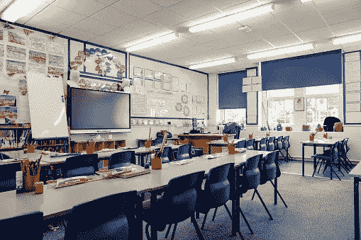
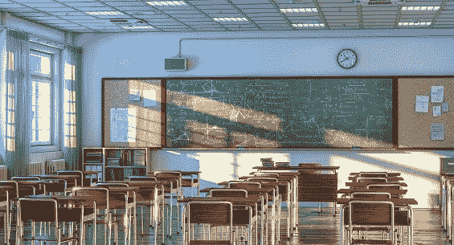

# 教育和人工智能:令人兴奋的结合

> 原文：<https://blog.devgenius.io/education-and-artificial-intelligence-an-exciting-union-32105ec6c8df?source=collection_archive---------9----------------------->

# 传统的教育体系已经过时

现在，教育作为一个整体已经升级为在线形式，现在的重点是在线教育，以确保学生在舒适的家中学习时的安全。然而，现在事情正在恢复正常，如果学生要回到学校和大学学习，系统需要改进，如果它还在继续，也需要在线形式。

# 人工智能可以加强教育

人工智能的应用可以增强教育的体验和质量，有助于提高学生对学习和其他课外活动的兴趣。同时也让学生在同龄人中学习和成长变得更加安全和有趣。幸运的是， [Prisma AI](https://prisma.ai/) 根据教育部门的需求开发了解决方案:

**24–7 数据管理系统**

Prisma 的解决方案允许学生在世界任何角落随时访问学习材料和内容，如模块、PPT、在线课程和讲座，允许学生按照自己的进度学习，甚至不会产生高昂的差旅费和生活费。一站式解决方案，保存您的所有研究数据，并可随时随地访问。管理良好的数据管理系统。

**基于人工智能的作业评分**

人工智能系统已经被教会扫描答题卡，以比较和纠正正确的答案，允许自动作业评分，从而大大减少教师批改大量作业所花费的时间。基于视觉的人工智能软件将有助于提高您在评估论文时的工作准确性。

**只有在面部匹配成功的情况下，学生才能获准参加课程或考试，从而防止任何代理人参加，同时也更好地保护身份。**

****

**这些只是 Prisma AI 提供的许多解决方案中的一部分，这些解决方案可以提升和改善教育部门，同时使其更加安全，并提高学生的兴趣。**

****面向未来的下一代教育****

**教育就是这样一个部门，在未来几代人当中有很大的改进空间。人工智能可以以多种方式极大地改善教育部门，但还有更多方式可以进一步改善教育部门，这将不仅限于人工智能应用。随着知识的增加，关于用更新的创新来改善教育部门的知识也会增加。**

****