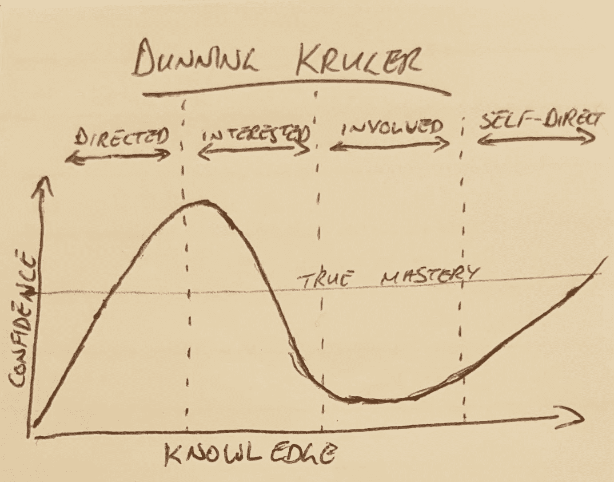
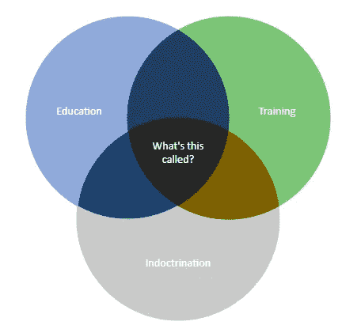
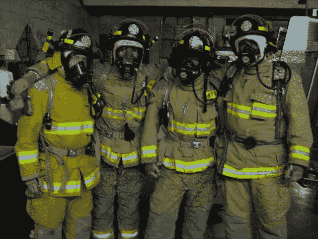

# 教育、培训和灌输

> 原文：<https://blog.devgenius.io/education-training-and-indoctrination-8b54228d5d07?source=collection_archive---------23----------------------->

## 对企业培训及其目的的观察

当这张便条在一次教育会议上传给一位同事时，他指出，“真正的掌握”应该是“感知的掌握”。我们一直在讨论学生在学校里对技能掌握的看法。突然，第二个演讲者提到了自我导向学习。

我最近在做一个项目，在这个项目中，我们向企业引入了一个新的信息管理软件。这个软件在任何方面都不特别，但它意味着从根本上改变组织共享信息的方式。

项目进行了大约一年后，我的团队讨论了初始版本以及对它的需求。作为讨论的一部分，提出了“培训”的需要，以帮助用户理解如何使用软件。给我留下深刻印象的是，对需要什么有三种不同的描述，因此对培训的发展有三种不同的时间表和费用。

1.  经理:我们没有时间创建培训。创建完整的课程、获得组织的批准，并确保它与企业目标和现有的法律声明保持一致，需要几个月的时间。视频制作又增加了几个月的时间，结业证书又增加了几个月的时间。
2.  同事:我们不需要任何培训，供应商提供的用户手册非常完整。我们已经参加了供应商提供的课程，并将能够为他们完成工作。
3.  我:我们已经有了用例或用户故事形式的(基本的)培训文档。它们已经讲述了系统的基本用法，只需要重新格式化，就可以作为一个简单的任务驱动的剧本，供用户使用。

这是关于同一个问题的三种截然不同的叙述。

从我的角度来看，绝对有必要发布，让我们的用户开始看到系统的好处，推迟几年只是为了让我们内部培训部门构建的在线培训系统降低了对组织的价值。另一方面，我完全明白，除了(非常技术性的)供应商手册之外，什么都不提供只会占用已经很忙的时间表，产生负面的联想，导致对平台的不良接受。

当时，我对这种回应感到非常沮丧，对需求的不同理解导致了进展的受阻。

我们经常提到的“培训”有点尴尬，但它实际上是指图表中间的这个东西。我将称它为“培训材料”，但我认为它需要一个更好的名字

最近，我开始理解感知需求的差异是从哪里来的。这实际上是对为什么要制作培训材料的不同理解:

*   教育
*   培养
*   教导

所有这三者对一个组织都有价值，并且所有这三者都(部分地)通过所谓的“培训材料”来实现。此外，所有“培训材料”在制作时都有一定数量的用途。阐明特定培训计划的主要目标可能有助于制作材料。

# 区分维度

在商业发展讨论中呼吁“公司培训”是很常见的。培训的需求是为了克服工作障碍、抵制变革和提高绩效( [lessonly](https://www.lessonly.com/the-importance-of-training/#:~:text=The%20Objectives%20of%20Training,and%20development%20in%20an%20organization.) )。这不是一个完整的列表，但代表了我们学习材料的每个方面。

## 培养

*   机械技能组合
*   安全
*   基本操作
*   容易量化

## 教育

*   可转移的技能
*   预测推理
*   假设形成
*   基于质量，难以量化

培训可以与教育区分开来，因为它关注的是眼前的行动，而不是未来的可能性。

## 教导

*   团队建设
*   [抵制变革](https://hbr.org/2012/09/ten-reasons-people-resist-chang)
*   可量化，但量化价值不大(只需要接受)

> “每一种文化都将交流和鼓励某些形式的思考和行为的某些行为形式制度化，从而塑造了其公民的性格”(梅洛，《心灵的强奸》，1956 年)

我记得在一家新公司开始一个新角色，并被告知第一天去培训中心报到。这是一次关于基本发展的公司培训活动。大多数技能是我十年前掌握的，但重温一下也不错，而且肯定比《ITIL 基础》(上周)更有趣。

当大多数人对所展示的内容不感兴趣时，我感到很惊讶。相当游手好闲，花更多时间延长午餐时间。我后来了解到，在那里的 24 个人中，只有 3 个人是真正的开发者；其余的由各种各样的商业分析师组成。

重点不是教一项新技能。

开发人员已经知道如何用 C#编程，而分析师被禁止使用这种技能。

这是一次团队建设练习。

把人们放在一个房间里，让他们解决共同的问题，会产生一种团结的感觉。要解决的问题是不相关的，但必须让观众充分参与进来，以激励他们去解决它，你也可以在做的时候学到一个半有用的技能。

与这个概念相似的是告知员工该怎么想。

对组织来说，人们对组织忠诚或服从是很重要的。这种服从的一部分是知道组织的决定是什么。

我想起了一次商务旅行，在那次旅行中，关于我们软件产品的测试框架的实现发生了激烈的争论。前三天，我和我的同事一起旅行，并利用这个机会建议测试自动化应该是什么样子。我的同事们都同意，我们正在顺利实施。第三天，我们的主管出现了，在每日会议后的几杯啤酒中，他告诉我们他必须让我们接受培训，因为我们中没有人知道如何测试他的软件系统。

就这样，从那天起(至少直到我离开的那天)，所有的测试都是通过`bash`手动执行的。

( [Wikicommons，CC-SA](https://commons.wikimedia.org/wiki/File:Crazze05.jpg)

许多需要一致同意的决定实际上是在执行层面独立决定的。这些决定必须传达给员工，以确保他们的行为和决定符合组织的期望。

在这种情况下，培训用于确保在业务层面做出的决策与在执行层面设定的期望一致。

假设个人拥有组织的最大利益，他们可能不同意实现组织目标的最佳方式。必须达成某种形式的共识。大多数情况下，这种共识是在执行层面上达成的，并在组织内传播。通过让员工参加解决问题的培训，可以让他们知道解决问题的合适方法。这让员工清楚地知道，这是一个“好”的解决方案，或者是组织内“社会可接受”的解决方案。

梅洛将这一过程称为*大众调节*，它可以被认为是企业宣传。这是[变革管理](https://en.wikipedia.org/wiki/Change_management#Managing_the_change_process)的核心组成部分，因为必须说服员工采用新的和改进的业务实践。

梅洛写了“大众调节”，即自上而下决策的社会接受的武器化

# 不相互排斥

*   [自我导向学习模式的阶段(teachthought.com)](https://www.teachthought.com/learning/stages-self-directed/)

确定了开始培训背后的所有三个目的后，认识到它们并不相互排斥是很重要的。事实上，所有培训材料中都包含了这三个要素。

在人们能够提出有意义的问题之前，他们必须被告知该做什么。当这张纸条在一次教育会议上被传递给一位同事时，他指出“真正的精通”应该是“感知的精通”。

所有学习的努力都必须通过一个被引导的部分。给出信息的基本组成部分的部分。这些基本要素通过不断的重复灌输给我们(就像“小学”)。后来，我们通过理解基本组成部分是如何相互联系的来进行更高层次的理解(类似于“高中”)。

从根本上来说，了解零件以理解它们是如何组合在一起的是非常必要的。

这代表了一个自然的进程，并导致早期的部分通过重复(训练)被简单地灌输给我们，随后的学习是通过反思和内省对关系的更复杂的内部理解。这个流程是在自我导向学习的[阶段定义的。](https://www.teachthought.com/learning/stages-self-directed/)

在整个过程中，从基本的技能训练到更深入的理解，我们都受到周围偏见和观点的影响:早期是通过我们的老师，后来是通过我们自己和我们的同龄人。在所有情况下，这些偏见都是必要的，以传达所展示的材料有足够的价值值得关注。这是最低层次的灌输:你必须相信主题是重要的。

学习材料的这三个方面强调不同的目标和结果，并与学习阶段相对应:

*   作为一名志愿消防员，在其他地方有一份全职工作，我只需要学习“把湿东西放在热东西上”的机械操作(正如一位教练所说)。
*   [教育/自学]我们消防队的队长有一份全职工作，是地区火灾调查员。对火和助燃剂力学的深刻理解对他解释墙上的烟雾图案是必要的(每周技能练习和会议后的有趣讨论)
*   我和主任都花了很多时间向公众演示基本的消防安全。总的来说，我们鼓励人们认真对待自己家中的火灾风险。

> 顺便说一句:总是在你家的显眼地方放置多个灭火器

虽然它们并不相互排斥，但了解它们之间的区别有助于正确使用它们。关于你建议的培训材料类型，第一个也是最明显的信号是消费者接触信息的时间长度。

*   教育:一次教育活动可能需要几周或几个月的时间
*   培训:一个单一的培训目标可以在几天内完成。
*   灌输是以小时计算的

如果你被要求参加一个长达一小时的演示来展示一种新的做事方式，你很可能正在接受灌输，在其中你被告知新政策是什么。这一点可以通过主讲人的资历来证实。如果是由非常资深的成员进行的简短介绍，那就是灌输。这适用于部门合并的情况，在这种情况下，高管必须通知现在合并的团队，他们将一起工作。它不会被质疑或理解，只会被接受。

如果你参加为期一天或一周的培训，你会被*引导*去学习如何准确地完成一项特定的任务。第一部分是确信你所学的是有意义的(灌输)。这可能包括填写税单的适当方式、穿戴安全装备的正确方法或转移细菌样本的安全方法。关键是你有一个正确的方法可以应用，你应该在培训结束后能够展示(并因此实施)这些*最佳实践*。

教育是*自我导向*的，需要很长时间。想出新颖的解决方案需要考虑替代方案，以及尝试各种变化。某个领域的教育允许人们发挥创造力，并要求在当前接受的技术方面预先存在培训，但随后使用经验和实验来进一步发展该知识。这是专上教育的表面目标。重点是发明新技术，或者通常只是以新颖的方式应用它们。这需要几年，有时甚至几十年。

我自己(左)和我团队的其他成员，刚刚完成如何着装的培训。我们还向小学生展示了这一点，以减少遇到穿着消防员时的焦虑(版权，2012)

# 企业培训

理解学习的三个目的之间的相互关系，并理解混淆它们是多么容易，我们可以发现[教育膨胀](https://en.wikipedia.org/wiki/Credentialism_and_educational_inflation)的一个可能的潜在原因，在这种情况下，人们期望个人对相同级别的工作拥有越来越高的认证级别(例如，进行基本信息分析的博士学位)。

雇主寻找的是有能力执行技术技能(培训)的人，但是他们错误地认为更高的证书意味着更强的能力。这忽略了向更抽象的思维发展的趋势。随着雇主寻求更多的培训，教育机构更加注重培训特定的手工技能，而不是从事更高层次的思考。这意味着，随着周期的继续，那些有证书的人不会表现得那么好。

这个问题似乎从根本上是由对雇主在寻找什么的困惑引起的:受过训练的实干家还是自学者。

雇主在考虑他们的教育和培训要求时，最好考虑他们在寻找什么(执行者、计划者或啦啦队长)。如果做不到这一点，就会产生消极的后果，主要表现为浪费时间。

## 失败的企业培训

财政年度快结束了，我的董事会在他们的培训预算中还有钱。我的经理开始要求我们每天填写我可能想要的任何培训的培训表格，因为*我们必须使用资金*。

年底了，我正忙着确保审计工作的一些数据转换。我已经在代码中看到了一些我以前没有使用过或者已经多年没有使用过的东西，将这些东西与同行代码的评论结合起来，我的经验告诉我它们有改进的空间。所以我有点忙着研究手册和现有的同行代码。

他们真的很坚持，因为他们*不想让我失去在我喜欢的方向发展职业的培训机会*。

我正忙着学习。留着钱，把培训给别人。

他们坚持要我利用组织培训的机会。

好的，什么课程对组织有价值？组织希望我了解什么。

不，公司想让员工觉得我们从培训中获得了最大的收益，因为*这是一种行之有效的留住员工的方法*。然而，有一门课将在两周内开课，其他人都在报名，看起来不错。

好吧，帮我报名。

哦…我们将不得不看看我们是否能得到允许让你做那件事。我们不想让自己人手不足……*经过一番艰难的谈判，我为你争取到了许可*。

有时候我有点迟钝。这是我注意到模式的时刻。

组织不关心我的职业发展。他们关心的是留住人才和忠诚度，主要是**展示关键 KPI**。他们的员工正在学习，这不是组织感兴趣的，而是重要的是有盒子，并且盒子正在被检查。此外，在员工身上花钱通常是表达感激的唯一方式:让员工参加昂贵的课程，是向员工赠送大量礼物的一种方式(这就是为什么需要表现出这很难)

这很奇怪，因为我在过去实际上帮助开发了这门课程的课程，并且在去年接受了关于这个问题的公司培训，并且不会很快使用这些技能。

不明确的培训目标造成了公司财务和员工时间的浪费。就像呆伯特漫画里的东西(虽然我找不到一个真正的链接)

> **一旁的**
> 
> 有趣的是，我的导师在某个时候提到，他已经“花了太多时间在培训上”，以至于他还没有真正“有机会学习”他所教授的一项详细服务。
> 
> 这说明了很多。

# 结论

当我们说我们需要“培训”时，我们的目标并不总是很明显。当团队中出现困惑时，可能是因为有不同的目标，以及与之相关的不同的时间尺度。

[发现了这个有趣的东西？留下小费…这有助于](https://www.buymeacoffee.com/jeffereycave)

我希望，这些定义可以让一个特定的群体明白他们在工作场所寻求什么:你的组织对你的课程的目标可能与你的个人目标不一样。同样危险的是为你的目标选择错误的参与类型，或者错误的证书类型。

*   培训:学习一项特定的技能
*   教育:自学一项技能，或者制定新的计划
*   灌输:传播认可的解决方案，或增加品牌忠诚度

在采取行动之前，花点时间去理解你为什么要创造、消耗或分配材料。花点时间了解你的组织让你接受培训的目的。

请留下评论或提出问题，如果您发现此内容有价值，请记得点击[关注](https://jefferey-cave.medium.com/)。

([维基媒体，公共领域](https://commons.wikimedia.org/wiki/File:Organ_grinder_with_monkey.jpg))