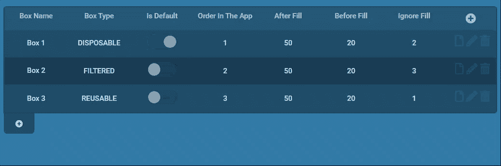

# 有效的“干”开发示例(仅适用于懒惰的开发人员！)

> 原文：<https://blog.devgenius.io/effective-dry-development-example-for-lazy-developers-only-5745df266938?source=collection_archive---------15----------------------->

开发中的一个重要规则是不要重复你的代码，这被称为“干”——不要重复你自己，这是坚实的代码原则之一。

作为 ImpacX 的仪表板系统开发人员，我必须开发许多命令和控制表，在这里我将与您分享这一规则的实现。如果你够懒的话，你可以为自己节省多少时间，这真令人着迷...如果我说它可以在服务器上为你节省多达 80%的代码，我并没有夸大其词，继续阅读并告诉我你是否同意。

我将从向您展示 UI 结果开始，关于表格的产品需求每次都有点不同，这取决于他们希望我们系统中的哪个表格是可编辑的。

但是——我对自己的技术要求是构建一个可编辑的表格组件，提供完整的后端支持，您可以做几乎任何您能(或产品能)想到的事情:

每行:

*   **向表中添加**新行(或者不能够)。
*   **编辑**每个栏目(或者不能够)。
*   **删除**现有的行(或不能删除),对话框询问你是否确定。

每列:

*   类型可以是数字、文本、电子邮件、布尔值、文件、选择、照片或事件 HTML 文件等。
*   可以是不能存在于其他行中的唯一值
*   创建或编辑时可能需要
*   可以有唯一的验证条件(你能想到的任何东西)

首先，我将向您展示我构建的可编辑表格的一个真实示例(众多示例之一)。我用了不到两个小时就把它开发到了侧面(！)，当然，只有在长时间开发工具，允许在如此短的时间内用如此少的代码完成这些工作之后，这才是可能的。

相信我 DRY 规则会让你作为开发人员的生活变得更容易，更少错误，代码也更容易更改(一劳永逸)。

我们在这里看到的是一个可编辑的表，用户可以向其中添加新行，第一列是必需的且唯一的，该行包含文本、布尔、选择和数字类型的列。用户可以在创建后编辑或删除该行。

让我们深入研究一下我用来创建所有这些功能的代码(它是基于 React、MobX 和 react-table 库构建的)。

这是所有的前端，在这里发挥神奇作用的是“EditableTable”组件，您可以在代码中看到我是如何向该组件描述在屏幕上显示什么以及每列的确切行为的。

从前端来看，我们将使用后端代码来处理获取列表、发布新行、放置行列和删除列的 API 实现。

请在这里停一会儿。你认为后端代码会是什么样子？你会如何建造它？

让我们看看这里有什么:

是的… 26 行都是我为可编辑表编写的唯一代码，所有完成重置工作的神奇代码都在仪表板系统中的所有可编辑表之间共享。

如果你需要，我很乐意与你分享“可编辑表格”前端组件的神奇基础代码和后端代码。

今天到此为止。感谢阅读到目前为止！

我邀请你至少像我一样懒惰…并且记住**不要重复自己**。

请告诉我你对它的看法，如果你喜欢这篇文章，请为它鼓掌，当我写一篇新文章时，你也可以跟着我更新。

我邀请你在链接上阅读我以前的文章:

*   [使用 NestJS 和 TypeORM 像专业人员一样记录日志](/logging-like-a-professional-with-nestjs-and-typeorm-dc935f71ef8b?source=friends_link&sk=54014a2dcabc579eb4b0df22e0cab23e)
*   [如何编写干净的服务器端代码(并节省 30%的代码)](/how-did-i-build-my-own-orm-for-mysql-with-python-inspired-by-nestjs-cf56cbaee7fd?source=friends_link&sk=ec293413ebbc735aa5cbf7a01119c408)