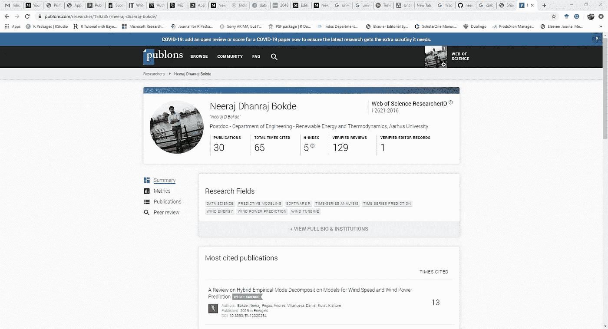
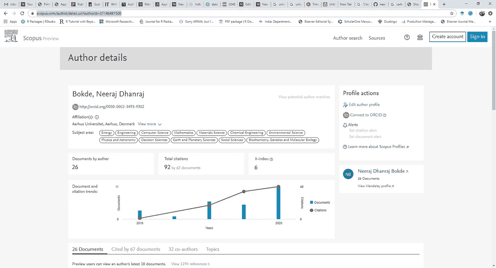
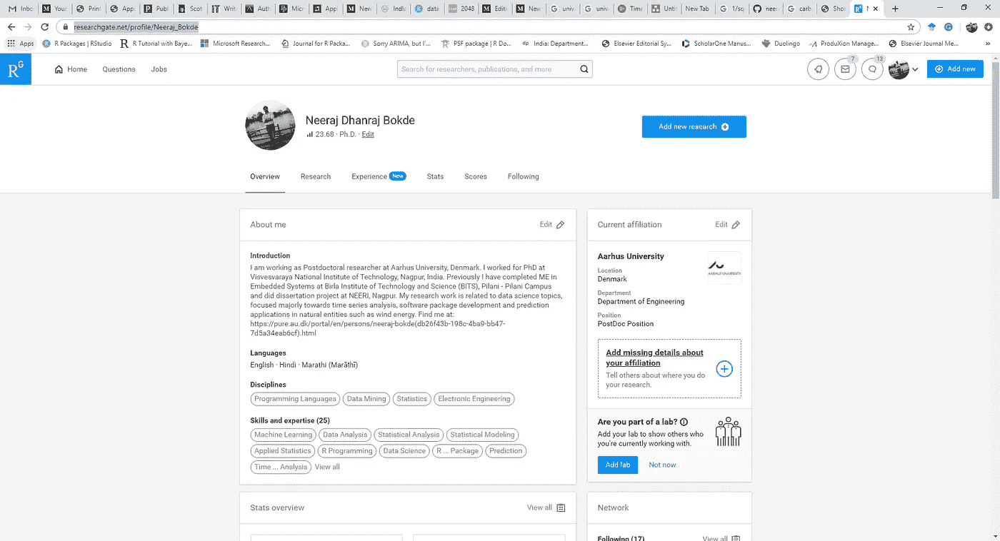
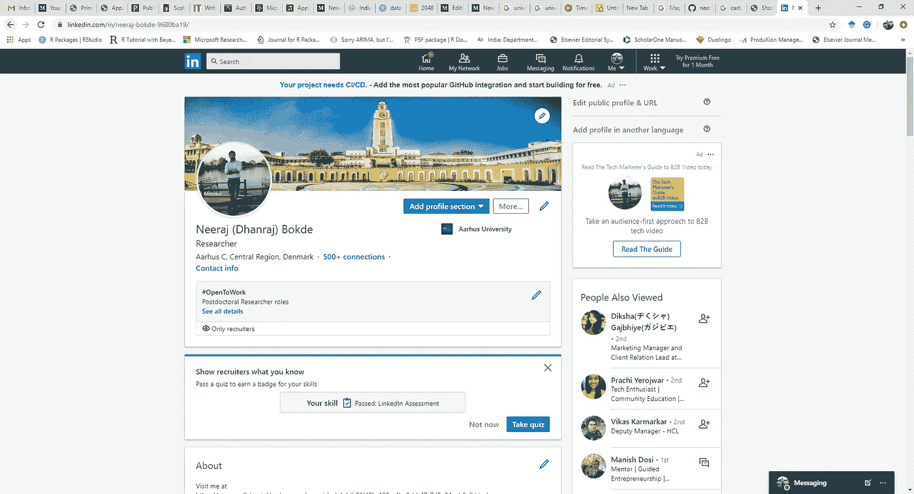
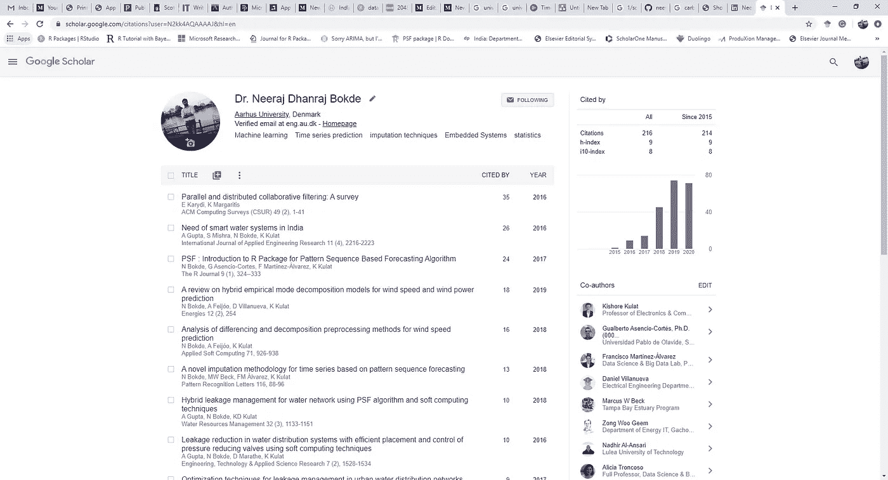
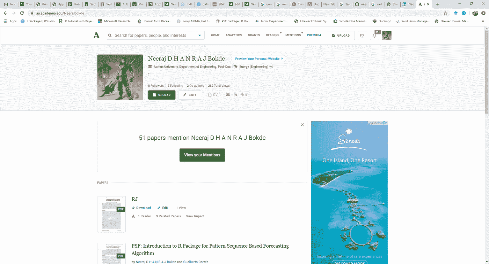
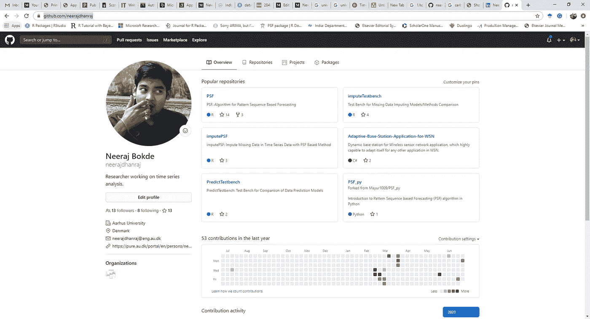

# 展示互联网研究的有效平台

> 原文：<https://blog.devgenius.io/effective-flatforms-to-showcase-the-research-on-the-internet-d4a76b244bc7?source=collection_archive---------33----------------------->

## 面向研究人员的社交媒体介绍

约翰·施诺布里奇在 [Unsplash](https://unsplash.com?utm_source=medium&utm_medium=referral) 上的照片

我们意识到研究在解决问题、理顺生活、造福社会方面的重要性。在研究方面贡献较大的国家正经历着更高水平的繁荣。对于个体研究人员来说，展示他/她的研究成果和贡献是非常关键的。这篇文章是对在线平台的系统回顾，展示了互联网上的研究概况。让我们一个一个地看一下:

1.  科学网

科学网(前 ISI 知识网)是一个科学、社会科学、艺术和人文科学信息的主要研究平台。它对上述领域的期刊论文进行了索引，并列出了索引期刊的影响因子。科学网为在科学网索引期刊上贡献研究的作者维护个人资料。虽然这是一个著名的展示研究文章的平台，但它不允许研究人员创建帐户。一旦作者的研究论文在索引期刊上发表，他/她的帐户就会被创建。

2.[出版社](https://publons.com/researcher/1592857/neeraj-dhanraj-bokde/)

Publons 是科学研究概况网络的新界面。它允许用户创建一个作者帐户，并自动链接在科学索引期刊网上发表的研究文章。刊物还有一个额外的有价值的功能来展示作者在评论期刊和会议文章中的贡献。这是同类网站中唯一一个对研究人员的评论贡献进行表彰的网站。此外，它还提供了个别研究人员的编辑信息，以及对大量科学出版物、引文、评论文章的一些见解。它提供了研究人员的总体研究贡献(主要强调了科学网的贡献)。

3. [Scopus](https://www.scopus.com/authid/detail.uri?authorId=57148487500)

Scopus 是研究期刊出版的另一个索引服务。类似于科学索引网，Scopus 有一个类似的更大的研究期刊集。它还维护作者简介以及出版物和引用的数量。

4.[研究之门](https://www.researchgate.net/profile/Neeraj_Bokde)

ResearchGate (RG)是一个非常有趣的社交媒体，就像是研究人员的网站。许多人称之为“*脸书为研究者*”。它允许用户基于他/她的官方电子邮件 ID 创建一个帐户。它维护了作者的出版物、引用、合作和项目的记录。此外，它允许研究人员显示他/她的介绍和简历。提供了一个单独的部分来显示研究或行业经验。

ResearchGate 就像一个社交媒体网站，允许研究人员向在 ResearchGate 拥有帐户的其他研究人员发送消息。另一个有趣的特点是，ResearchGate 允许研究人员为发表的文章请求手稿，否则可能无法免费获得。手稿的作者可以通过 ResearchGate 消息发送，也可以公开发表(取决于相应期刊的版权政策)。此外，ResearchGate 允许显示研究和学术招聘广告。

基于研究人员在 ResearchGate 上的贡献和互动，它维护所有研究人员的 RG 分数。这样的分数有助于理解研究者贡献的质量和数量。有时，有必要了解 RG 分数，因为它可以通过其他方式提高。RG 分数中出版物贡献的真实份额也在 ResearchGate 中提供。

5.[领英](https://www.linkedin.com/in/neeraj-bokde-9680ba19/)

LinkedIn 是另一个类似社交媒体的网站，最初是为求职和联系全球专业人士而设计的。但是，它也认为研究人员是专业人士，并为我们提供了一些单独的部分，可以手动输入研究文章。LinkedIn 允许研究人员通过他们的技能和关系与志同道合的人取得联系。此外，这也是一个在理想领域寻找新职位的好地方。

6.[谷歌学术](https://scholar.google.com/citations?user=N2kk4AQAAAAJ&hl=en)

谷歌学术是一个由谷歌维护的自主网站。一旦研究人员在杂志或会议上发表文章，它就会自动为他/她创建一个帐户。它允许作者使用有效的官方电子邮件 id 来声明他们的帐户。它还维护不同指标的引用数量，如 *i10* 和 *h* 索引。谷歌学术是获得研究论文引用的最快媒介。

7.[Academia.edu](https://au.academia.edu/NeerajBokde)

学术界可以成为 ResearchGate 的另一个平台。如果使用高级或付费版本，这可能是一个很好的地方。它允许用户维护所有的研究文章、引文和简历。它可以为高级模式的用户提供一个利润丰厚的个人网站。

8. [GitHub](https://github.com/neerajdhanraj)

GitHub 是为程序员以私有和公共模式开发和共享代码而设计的。但是，它作为一个非常有用的工具出现在多个方向的研究人员面前。研究人员可以使用 GitHub 与全球分享他们的文章、代码、发现和其他东西。

还有一些更相似和有用的平台来展示这项研究。我会不断更新名单。享受出版…！

> 尼拉杰·丹拉杰·博克德博士