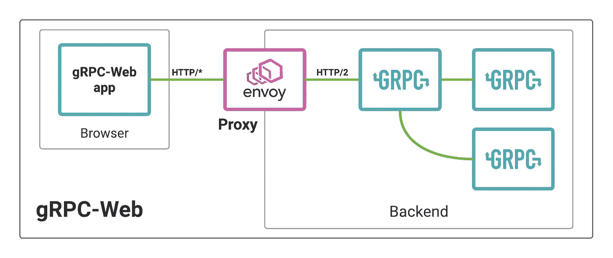
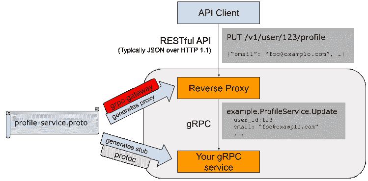
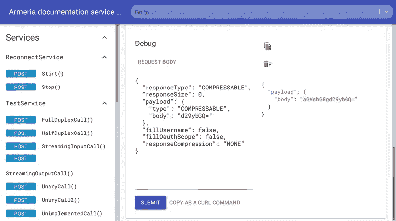
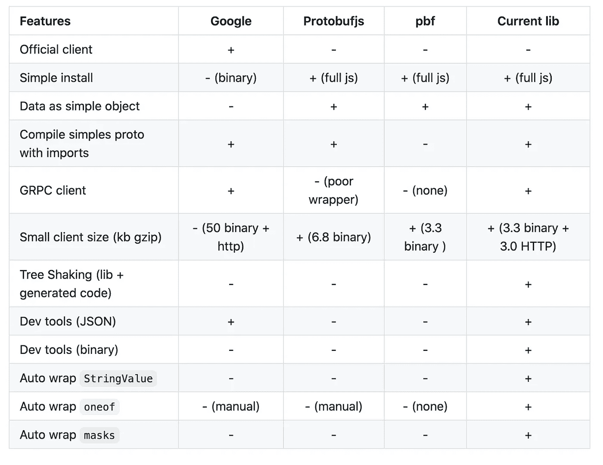

# 有效 GRPC

> 原文：<https://blog.devgenius.io/effective-grpc-9152bea2cf50?source=collection_archive---------4----------------------->

照片由[晨酿](https://unsplash.com/@morningbrew?utm_source=medium&utm_medium=referral)在 [Unsplash](https://unsplash.com?utm_source=medium&utm_medium=referral) 拍摄

如今，几乎不可能不听到这样或那样的 GRPC。越来越多的现代技术和公司使用它。下一代谷歌云服务 API 建立在 GRPC 之上，Kubernetes 使用它，负载平衡器和路由器开始支持它，Spotify 等公司逐渐从旧的替代产品中迁移出来。

Whisk 中的 RPC 服务有着良好的历史，多年来我们的内部服务通信都依赖于 Twitter Finagle 技术栈之上的 Thrift 二进制协议。

您可以具体阅读 RPC 库和 GRPC 的好处，但在本文中，我想特别关注提高生产率和安全性，这是促使 whish 采用这项技术的原因。并就如何有效利用它提供一些建议

我从未遇到过对 GRPC 的各个方面都满意的人，对该协议有某些不满，尤其是在字段的可选性方面。但是技术不需要完美，重要的是它能让团队更有效率。

# 选择 GRPC

很可能，你对 GRPC 的特色至少有一些基本的了解。在继续之前，我想在这里简要概述一下这个选择的好处(正如我们所看到的)

非常流行的比较通常是 GRPC 与 RESTful HTTP，所以我将重点放在这一点上

对于通信开销低的小团队和服务，选择更复杂的东西的理由可能更少，但是随着你的成长，你开始面临更多的挑战

*   **需要一份文件**
*   **定义明确的通信协议**
*   **异构技术堆栈**和平台的可变性(服务器、网络、移动)

是的，OpenAPI 和 Swagger 解决了其中的一些问题，但是不同的框架和语言与之集成的方式不同。并不是每个库都很好地支持自动生成 OpenAPI 模式，编写手动规范需要大量的工作，最终也不能保证它与实现的一致性。我还没有遇到多少人对 Swagger codegen 感到满意，并且正在开箱即用

GRPC 解决了这些问题，并为您提供了一个定义良好的类型安全模式，您可以将它集成到更多的语言中。

1.  编写它的方式很简单，你需要做的关于 RESTful 路径和动词的修改要少得多。
2.  这很容易阅读
3.  它支持多种语言
4.  它消除了路径匹配、参数序列化/反序列化等负担，并允许专注于实现
5.  提供类型安全

你将会看到更多…

如果你确信这是值得考虑的，文章的其余部分将展示我们如何有效利用 GRPC 和利用生态系统的力量

# 有效的实践

## 1.集成棉绒

你不需要重新发明轮子，学习如何编写好的 Protobuf。此外，人们可能会对风格有不同的看法。我建议通过遵循 linter 规则来更容易地摆脱争论以及开发和评审过程

不久前我们从优步的[原型工具](https://github.com/uber/prototool')开始，但是现在我们推荐看看[的 Buf Linter](https://buf.build/docs/introduction) 。(Prototool 的 README 中有一个部分现在也推荐它)

通过集成 linter，您将立即在您的组织中获得更一致的风格，并学习非常好的实践。

此外，该工具允许您在模式中执行重大更改检测

总体而言，它将帮助您:

*   命名
*   版本化模式
*   Protobuf 项目结构
*   消息结构(例如枚举)
*   突变检测

## 2.写作风格指南

Linter 会做得很好，但是关于 Protobuf 的定义仍然有一些不确定性，所以你会发现在你做的时候需要额外的样式指南

我们的重点是

**错误**

涵盖关于错误消息、错误代码的格式以及我们如何以分散的方式在我们的代码库中定义它们的主题

**可选和必填字段**

涵盖挑选一个或另一个的最佳实践、关于[包装器的建议、](https://github.com/protocolbuffers/protobuf/blob/master/src/google/protobuf/wrappers.proto)额外注释

**更新操作和字段掩码**

更新消息的结构、更新模式、字段掩码的使用([视频](https://www.youtube.com/watch?v=W421BNZA_74))以及针对不同场景和 API 类型的建议

与 Linter 一起，Style Guide 将指导您的团队在 Protobuf 模式的定义上保持一致。而下一个项目将更多地关注生态系统

## 3.GRPC 网络

上述的一切，我们用节俭协议也实现了很长时间，但所有这些都局限于我们在私有网络中的内部服务通信。我们所有的外部 HTTP APIs 都是 RESTful 的

现在我们到了 GRPC 为我们做额外工作的部分

虽然 Android 和 iOS 客户端可以说 GRPC 协议，但 web 客户端不能

这是用 GRPC 网络协议解决的。常见的做法是在您的 GRPC 本地后端前放置一个特使代理，以便 web 客户端可以访问您的服务。

你可以在这篇[特使博客文章](https://blog.envoyproxy.io/envoy-and-grpc-web-a-fresh-new-alternative-to-rest-6504ce7eb880)中读到更多。设置非常简单

(图片摘自特使博客)

## 4.GRPC 网关

虽然原生 GRPC 适用于移动客户端，GRPC 网络使从网络前端访问成为可能，但我们不能让所有的外部客户端都遵守规则，必须整合它。REST HTTP 仍然是一个很好的行业标准，几乎每个公司都把它作为主要的方法，而公共 GRPC 或 GraphQL APIs 的选择更合适。

这就是 [GRPC 门户](https://github.com/grpc-ecosystem/grpc-gateway)发挥作用的地方

> grpc-gateway 是谷歌协议缓冲编译器[协议](https://github.com/protocolbuffers/protobuf)的一个插件。它读取 protobuf 服务定义，并生成一个反向代理服务器，将 RESTful HTTP API 翻译成 gRPC。这个服务器是根据服务定义中的`[google.api.http](https://github.com/googleapis/googleapis/blob/master/google/api/http.proto#L46)`注释生成的。

我们发现它工作得很好，现在新版本的 Whisk Public API 是直接从我们的 Protobuf 模式中派生出来的，带有 HTTP 注释。

这样，我们仍然不必担心 HTTP 层中的路径映射一致性和消息序列化/反序列化

## 5.Armeria(特定于 JVM)

Armeria 将自己定位为微服务框架。我们最近发现了它，它在 Whisk 上处于实验状态。

它看起来对我们很有吸引力，允许我们在同一个服务中拥有 GRPC-Web 层，消除了对 Envoy 代理翻译的需求。

它附带了很棒的在线文档和调试功能

Armeria 还允许我们让更多的 HTTP 经典流(Cookie 管理、重定向)与原生 GRPC 共存。

## 6.打字稿代码生成器[未发布]

将 GRPC 作为我们新的前端<>后端服务通信的标准，我们在 Whisk 上做了额外的努力，并在开发我们的世代库的 Web 前端支持工具上做了一些投资

下面是一张对比图，其中包含了我们选择这种方式的一些原因

(Javascript GRPC 生成器)

它的功能和差异值得单独的文章，但简而言之，它提供了使用 TypeScript 中的 GRPC 的更惯用的写作方式，并给出了更小的包大小。

# 摘要

我们看到 GRPC 生态系统现在已经足够成熟，确实可以提高一些团队开发人员的工作效率，并避免与构建 HTTP 服务的传统方法相关的各种错误。

虽然有些人可能会认为该协议并不完美，我个人也同意一些抱怨，但 GRPC 的生态系统非常强大和充满活力，因此它的净效应是非常积极的。它现在是定义公共 API 的首选解决方案，在 Whisk around 工具和库方面做了一些工作后，它将更进一步，将我们长期建立的 Thift 二进制协议用于 Scala 后端服务之间的内部通信。

我不会说它是一个银弹，但是它有可能使你的团队的开发流程更好。

