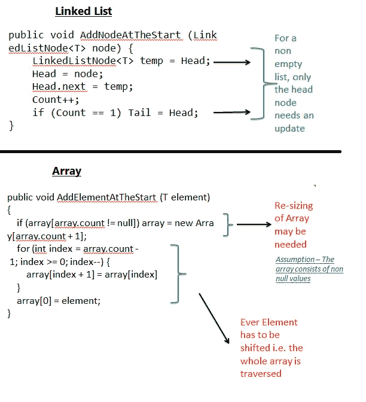
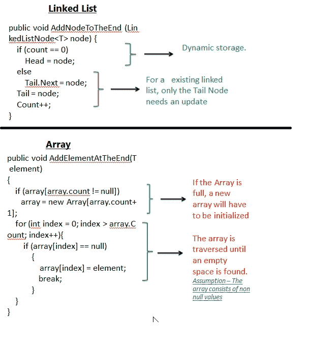

# 高效插入:链表与数组

> 原文：<https://blog.devgenius.io/effective-insertion-linked-list-vs-arrays-c36bea8c5613?source=collection_archive---------0----------------------->

几天前，我开始复习我的数据结构概念。人们常说，最好的学习方法是向别人描述你的学习。本文是该计划的延续。在我以前的文章中，我已经介绍了链表的基本概念。在阅读本文之前，最好先阅读这些文章。

1.  [链表—简介](https://medium.com/@tarunbhatt9784/linked-list-an-introduction-25f8cac4452e)
2.  [链表——在开头添加一个节点](https://medium.com/@tarunbhatt9784/linked-list-can-you-add-a-professional-node-please-4387215baa5a)
3.  [链表—在末尾增加一个节点](https://medium.com/@tarunbhatt9784/linked-list-add-a-node-at-the-end-5b1911b160a0)

**高效插入**展示了在链表中插入数据的好处。要对链表及其添加操作有一个基本的了解，请阅读下面提到的文章。

**什么是高效插入**？

新节点的高效插入是链表的主要优点之一。

1.  在前面添加新节点不需要移动列表中的其他节点。
2.  在链表中添加新节点并不要求遍历所有的数据元素。
3.  不需要重新初始化链表对象。

让我们通过将其与数组进行比较来深入了解这些优势。[数组是由元素集合组成的数据结构](https://en.wikipedia.org/wiki/Array_data_structure)。每个元素都可以用一个索引来标识。数组的大小是固定的。

1.  每次达到数组的最大值时，只能通过分配一个新的数组对象来插入新元素。
2.  在前面添加新元素需要移动数组中的所有其他元素。

**场景 1:在前面添加一个元素**

**场景 2 —在结尾添加一个元素**

希望这篇文章有助于理解**有效插入**的概念。

**参考文献**

1.  [链表——简介](https://medium.com/@tarunbhatt9784/linked-list-an-introduction-25f8cac4452e)。
2.  [链表——在开始处添加一个节点](https://medium.com/@tarunbhatt9784/linked-list-can-you-add-a-professional-node-please-4387215baa5a)。
3.  [链表——在末尾增加一个节点](https://medium.com/@tarunbhatt9784/linked-list-add-a-node-at-the-end-5b1911b160a0)。
4.  [https://app . plural sight . com/library/courses/ads-part 1/目录](https://app.pluralsight.com/library/courses/ads-part1/table-of-contents)。
5.  https://en.wikipedia.org/wiki/Linked_list[。](https://en.wikipedia.org/wiki/Linked_list)
6.  【https://en.wikipedia.org/wiki/Array_data_structure】T4。

谢谢

塔伦

页（page 的缩写）s-Medium 是一个阅读、写作和向其他作者学习的绝佳平台。如果你想加入我的旅程，今天就加入 [medium](https://tarunbhatt9784.medium.com/membership) 。