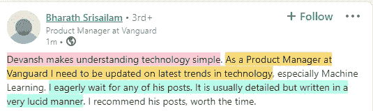
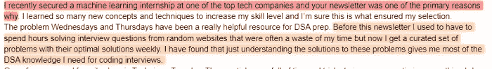

# 许多正数之间的有效乘法

> 原文：<https://blog.devgenius.io/efficient-multiplication-between-lots-of-positive-numbers-d29332d72e39?source=collection_archive---------4----------------------->

## 这是一个在多个数学/统计领域使用的技巧。你应该知道的。

这是一个有趣的问题，

你如何处理几个非常大的数字的乘法运算？假设你必须将 100 个数字(每个都超过 10000)相乘。如果您只是尝试使用标准方法，这可能会导致内存不足。你会怎么做？

或者相反的情况呢？想象一下把一百个正的 T4 数相乘，每个都小于 1？那时你能做什么？你会注意到你的计算机的精度会很快下降，最终你会得到 0。你将如何确保你不丢失这个计算？

你可以创建/使用一个数据结构来处理这么多小数位的数字。然而，这需要大量的内存。如果你正在设计需要超大规模运行的系统(想想脸书、谷歌等)或者计算能力有限的系统(嵌入式系统)，那么这可能是不实际的。有更好的方法。我们可以使用一些聪明的数学来使我们的生活变得更好。

这项技术对于加速你的整体计算非常有用。克里斯·利维拉尼在 [Unsplash](https://unsplash.com?utm_source=medium&utm_medium=referral) 上的照片

# 主要亮点

1.  技术- 假设你有一个数字列表 n，你想要所有项的乘积。你拿着产品的日志。这将问题转化为两个数字的对数相加，这使得它更容易管理。
2.  **数学-** 对于那些想看方程式的人来说-

*   `product= list[0]*list[1] *...list[n-1]`
*   `=> log(product)= log(list[0]*list[1] *...list[n-1])`
*   `= log(list[0])+ log(list[1])+ ...log(list[n-1])#product law of logs. We can use the log of the products for our computations`

**3。为什么这样做-** 日志有有趣的行为。

*   对于小正数(< 1)-一个数的对数大于这个数。
*   对于较大的数字，数字的对数比它小。

这允许我们很好地处理精度和内存溢出。小数字的相加不会像相乘那样达到 0。大数的乘法不会像它们的乘法一样快溢出。

**4。但是我们不是使用了不同的数字吗-** 你们中的一些人可能会担心使用产品的日志而不是产品，因为它们是不同的数字。这是一个合理的担忧。然而，请记住，所有的计算最终只是代表想法。只要您构建的系统考虑到这种调整，就没有问题。

你会一直用到这种技术，尤其是在人工智能、大数据、数据科学和机器学习等需要大量计算的领域。要查看它在机器学习中的一些应用示例，请观看下面的视频。

如果你想进入 ML，t [他的文章给了你一个逐步发展机器学习能力的计划](https://medium.com/geekculture/how-to-learn-machine-learning-in-2022-9ef2ea904986)。它使用免费资源。为了获得最佳效果，请将这篇文章与我的时事通讯《技术变得简单》相结合。更多信息如下。

对于机器学习来说，软件工程、数学和计算机科学的基础至关重要。它将帮助你概念化，建立和优化你的 ML。我的每日时事通讯， [Technology Made Simple](https://codinginterviewsmadesimple.substack.com/) 涵盖了算法设计、数学、技术领域的最新事件、软件工程等主题，让你成为更好的开发人员。 [**我目前正在进行一整年的八折优惠，一定要去看看。**](https://codinginterviewsmadesimple.substack.com/subscribe?coupon=1e0532f2)

我创造了[技术，利用通过指导多人进入顶级科技公司而发现的新技术使](https://codinginterviewsmadesimple.substack.com/p/faqs-and-about-this-newsletter?r=4tnbw&s=w&utm_campaign=post&utm_medium=web)变得简单。时事通讯旨在帮助你成功，避免你在 Leetcode 上浪费时间。我有一个 100%满意的政策，所以你可以尝试一下，没有任何风险。[您可以阅读常见问题解答并在此了解更多信息](https://codinginterviewsmadesimple.substack.com/p/faqs-and-about-this-newsletter?r=4tnbw&s=w&utm_campaign=post&utm_medium=web)

如果你也有任何有趣的工作/项目/想法给我，请随时联系我。总是很乐意听你说完。

# 向我伸出手

使用下面的链接查看我的其他内容，了解更多关于辅导的信息，或者只是打个招呼。另外，查看免费的罗宾汉推荐链接。我们都得到一个免费的股票(你不用放任何钱)，对你没有任何风险。**所以不使用它只是损失免费的钱。**

为了帮助我了解您[请填写此调查(匿名)](https://forms.gle/7MfQmKhEhyBTMDUD7)

查看我在 Medium 上的其他文章。:【https://rb.gy/zn1aiu 

我的 YouTube:【https://rb.gy/88iwdd 

在 LinkedIn 上联系我。我们来连线:[https://rb.gy/m5ok2y](https://rb.gy/f7ltuj)

我的 insta gram:[https://rb.gy/gmvuy9](https://rb.gy/gmvuy9)

我的推特:[https://twitter.com/Machine01776819](https://twitter.com/Machine01776819)

如果你想在科技领域发展事业:[https://codinginterviewsmadesimple.substack.com/](https://codinginterviewsmadesimple.substack.com/)

获得罗宾汉的免费股票:[https://join.robinhood.com/fnud75](https://join.robinhood.com/fnud75/)