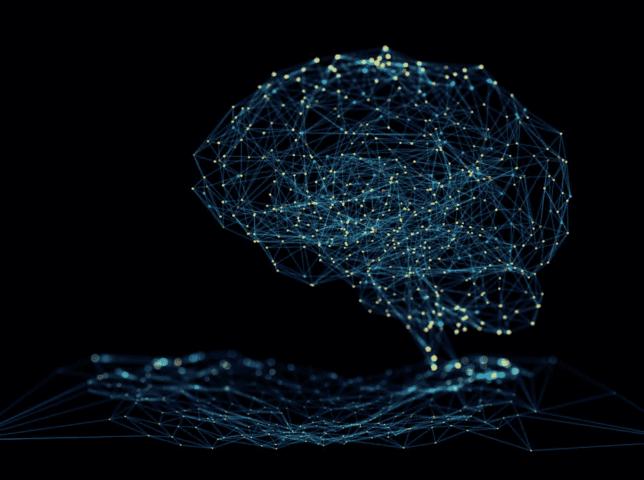
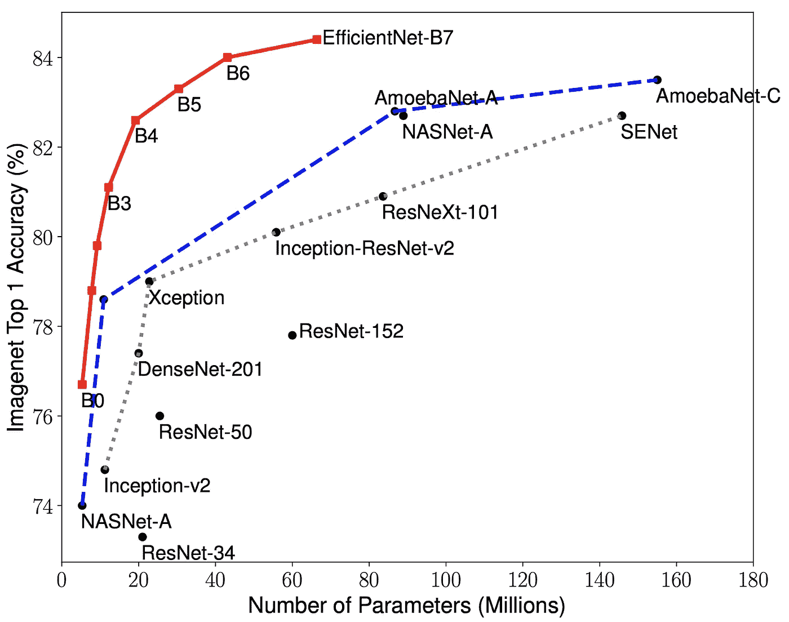
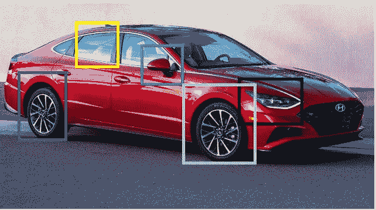
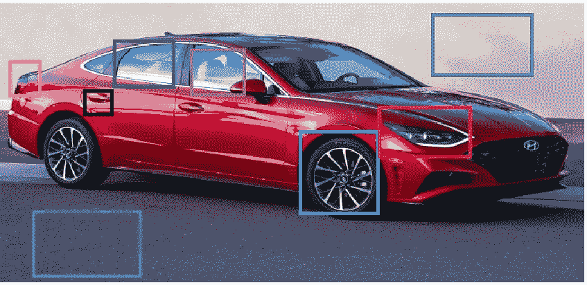
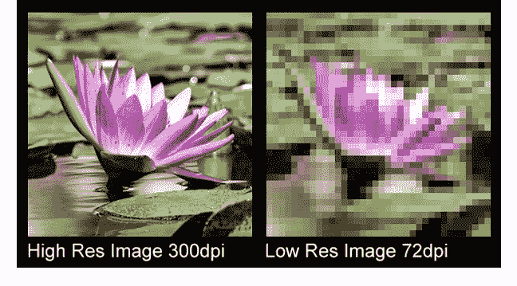
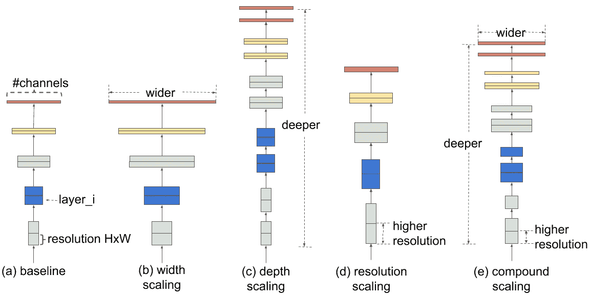
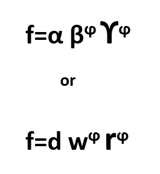
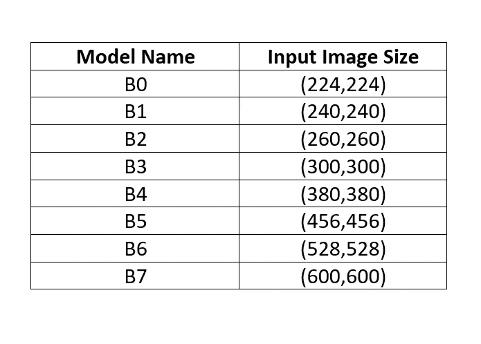

# 高效网络——重新思考模型缩放

> 原文：<https://blog.devgenius.io/efficient-nets-rethinking-model-scaling-f342ee7bb021?source=collection_archive---------10----------------------->

有各种神经网络可用；但是每一种都有一些缺点，这促使开发者创建新的和改进的网络。一个这样的网络叫做“高效网络”。与所有其他神经网络一样，设计 CNN 的关键问题之一是模型缩放，即决定如何增加模型大小以提供更好的准确性。

高效网络是一种先进的神经网络架构和缩放方法，使用**复合系数**统一缩放深度/宽度/分辨率的所有维度。与现有 CNN 相比，EfficientNet 模型实现了更高的精度和更好的效率，将参数大小和 FLOPS 减少了一个数量级。这是一个轻量级模型(可以在 android 应用程序中使用)，即使使用较少的参数也能提供更高的准确性。

> **FLOPS** 测量一个冻结的深度学习网络的操作次数。
> 
> ***FLOPS =每秒浮点运算次数。***

在普通 CNN 中，只进行**深度缩放**。深度缩放意味着增加深度，即网络中的层数，以获得更好的精度。模型深度的不断增加逐渐导致**消失渐变的问题。**这个问题通过使用另一个神经网络——ResNet 来解决。EfficientNet 模型用于实现比现有 CNN 更高的精度和效率，将参数大小和 FLOPS 减少一个数量级。

> *要了解更多关于* ***消失渐变*** *问题和****ResNet****架构，敬请参考我的文章* [***这里***](/resnet50-6b42934db431) *。*

在 EfficientNet 中，我们扩展了所有 3 个组件，即

1.  深度
2.  宽度
3.  解决

**宽度缩放**是指改变输入图像的宽度。图像越宽，特征图/通道的数量就越多，因此可用于处理的信息就越多。这反过来导致更好的结论和预测。

原创

宽度缩放后

因此，图像越宽，图像中出现的通道数量就越多。

但是，随着宽度的增加，出现了一些不重要的特征图。就像，深蓝色的特征地图只限制了道路和背景墙，而不是汽车。

**分辨率缩放**是指改变图像的分辨率。图像的 DPI(每英寸点数)越大，分辨率就越高。简单来说，更好的分辨率指的是图像中像素数量的增加。

分辨率缩放

分辨率越高的图像提供的信息越详细，因此卷积模型的结果越好。

为了处理高分辨率图像，我们需要深度神经网络(深度缩放)。即使图像的分辨率很高，特征图的数量也较少(宽度缩放)，捕获的信息也较少(对于大量的特征图，由于大量的计算，模型变得较慢)。因此，深度、宽度和分辨率缩放都是相互依赖的实体。

在论文- ***中对卷积神经网络的模型缩放进行再思考*** 2 观察到:

1.  扩大网络的任何维度——宽度、深度或分辨率——都会提高精度，但 ***对于更大的模型*** (消失梯度问题)，精度增益会降低。

2.为了追求更好的精度和效率，关键是 ***在缩放(**复合缩放**)时平衡网络*** 的所有维度。

为了缩放三维，需要一个**基线模型**—**efficient net B0**

**EfficientNet B0** 由 **NAS(神经架构搜索)**设计，其中神经网络生成新的和改进的神经网络。

# 复合缩放

复合缩放指的是缩放所有 3 个组件同时保持它们之间平衡的方法。

在哪里，

d =深度

w =宽度

r =分辨率

ϕ=compound 系数

d、w、r 的值是固定的，ϕ的值由**网格搜索技术提供。**

**α= 1.2；β = 1.1;ϒ = 1.15;**

让我们，ϕ=1

这意味着，如果我们增加 20%的深度，那么宽度应该增加 10%，分辨率增加 15%，以保持平衡。

从 B0 到 B7，共有 7 种高效网络模式。B0 是基线模型。

输入图像尺寸因型号而异。随着模型级别的增加，图像的输入大小也增加。

使用这种技术，作者能够创建比以前的 ConvNets 精度更高的模型，同时极大地减少了总体失败次数和模型大小。这种缩放策略是灵活的，并且它可以用于有效地缩放卷积神经网络，并且提高各种架构的准确性。

*感谢阅读！如有任何疑问，请随时联系我的*[***Gmail***](http://aditi2507rastogi@gmail.com/)**或我的* [***LinkedIn 个人资料***](https://www.linkedin.com/in/aditi-rastogi-961789191/)**或*[***GitHub***](https://github.com/AditiRastogi250701)*个人资料。***