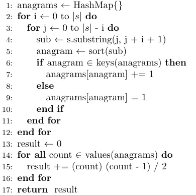
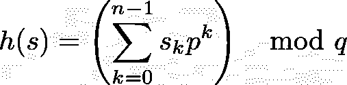
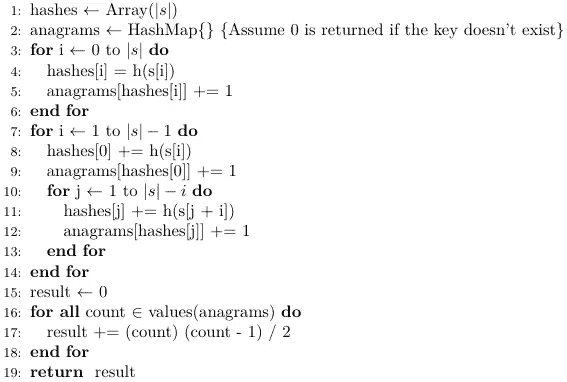
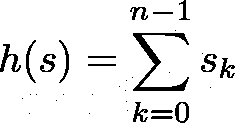
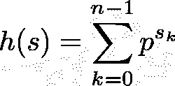
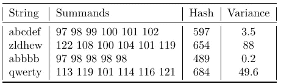
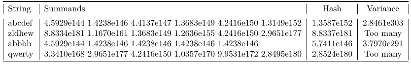
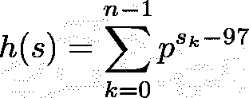
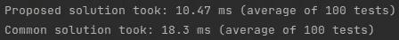

# 夏洛克和字谜的有效解决方案

> 原文：<https://blog.devgenius.io/efficient-solution-to-sherlock-and-anagrams-hackerrank-48c0cb3efad3?source=collection_archive---------2----------------------->

# 问题陈述

我将讨论一个**不同的**和更**高效的**解决方案来应对[这次](https://www.hackerrank.com/challenges/sherlock-and-anagrams)黑客排名挑战。问题陈述如下:

> 如果一个字符串的字母可以重新排列形成另一个字符串，则两个字符串是彼此的 [*变位词*](http://en.wikipedia.org/wiki/Anagram) 。给定一个字符串，找出该字符串中互为变位词的子字符串对的数量。

在继续阅读这篇文章之前，如果你还没有解决它，我建议你自己解决它。说完了，我们开始吧！

# 通用解决方案

常见的解决方法是对字符串中的所有子串进行排序，存储每个排序后的子串出现的次数，对每个排序后的子串出现的所有组合数 C( *count* ，2)求和(每个子串出现的次数命名为 *count* )。更准确地说，该算法如下所示:

常见的 O(n log(n))算法。s 是字符串

算法复杂度 **O(n log(n))** 因为获取所有子串需要 O(n)时间，对每个子串排序需要 O(n log(n))。因为输入只包含 ASCII 字符，所以我们可以通过使用计数排序将总运行时间提高到 **O(n )** 。然而，**我们可以进一步改进它。**

首先，我们来分析一下为什么上面的算法行得通。

1.  我们获得所有的子串，不管它们是不是字谜。
2.  我们计算其中哪些是字谜。回想一下，如果一个子串的字母可以重新排列形成另一个子串，则两个子串 s1 和 s2 是彼此的变位词。因此，为了判断 s1 和 s2 是否是变位词，我们对 s1 和 s2 进行排序，如果它们相等，那么可以说它们是变位词，因为要将 s1 转换为 s2，我们可以对 s1 进行排序，然后以相反的顺序执行用于对 s2 进行排序的步骤。
3.  我们被要求提供互为变位词的子串对的数量。这就是为什么我们需要取组合 C( *count* ，2)=(*count*)(*count*-1)/2。如果你对那个等式有疑问，展开并简化 n！/[(n-r)！r！]对于 r=2，n= *计数。*

注意，子串并不存储在 hashmap 中，而是存储它的 hash(也就是键)(这就是它被称为 hashmap 的原因😯).因此，要判断两个子字符串是否是字谜，我们不是比较实际排序的子字符串，而是比较它们的哈希值。一个常见的散列函数由下式给出:

普通散列函数。p 和 q 是质数。s 是字符串，n 是它的长度。

几乎可以保证没有冲突(不同字符串的哈希相同)。但是，它仍然是可能的，例如，让 p 是 31 (java 使用这个值并且不执行模运算)，那么 h('A@') = h('？') = 2049.在这种情况下，链表或 BST 被用在 hashmap 中，但是这不在本文的讨论范围之内(如果你想在 Java 运行`"@A".hashCode() == "?`".hashCode()`的话)，因为在 Java 中指数从 n-1 开始下降。在[这篇文章](/assembly-by-example-compute-string-hash-part-2-loops-ba39de0ff6d6)中，简要讨论了为什么它更有表现力)

这里需要注意的重要一点是，哈希函数考虑了每个字符的**位置**和表示该字符的实际**值**(字节)。

# 拟议解决方案

如果我们有一个哈希函数**只考虑值**而不考虑位置，该怎么办？我们可以用它来确定两个字符串是否是字谜，因为如果它们有完全相同的字母(因此也有相同的散列),我们就知道有可能重新排列 s1 以获得 s2，反之亦然。

假设我们知道哈希函数是什么，那么我们可以使用下面更有效的 **O(n )** 算法。

高效的 O(n)算法

第 3 到 6 行计算长度为 1 的子串的所有哈希。

第 7 行到第 14 行计算长度为 2 到|s|-1 的子字符串的哈希，并记录它们的出现次数，就像前面的算法一样。请注意，长度为 *k >* 1 的子字符串的哈希是使用长度为 *k-1 的子字符串的哈希计算的。*因此，计算哈希在每次迭代中都要用到 **O(1)** 。

## 构造哈希函数

很好。但是现在我们怎么知道哪个是散列函数呢？让我们构建它。一个天真的方法是:

朴素哈希函数

尽管它保证所有字谜都有相同的散列，但很容易看出它会产生大量的冲突，例如 h(‘BBB’)= h(‘ABC’)= 294，这对我们显然是不利的。

为了解决这个问题，我想到了求和之间有一个巨大的差异，所以求和不太可能相似或相等(幸运的是，求和之间的差异会导致求和之间的差异更大)。

我们如何实现这一目标？好吧，让我们看看哪个算术运算符能帮助我们。

*   求和或减法:没用。添加一个常数不会有什么不同，我们刚刚看到简单的求和不好。
*   乘法或除法:我看不出这对我们有什么帮助。乘以一个常数是没有用的，乘以字符串中的其他字符(例如第一个字符或 k+1 字符)也没有用，因为这样做会导致依赖于字符位置的散列，我们不希望这样。
*   取幂:这可能是有用的。我们可以将子串中的每个字符取 p 的幂，反之亦然。这确实增加了被加数之间的差异。

所以现在建议的散列函数是:

冲突概率较小的哈希函数

现在，让我解释为什么这比另一个建议更好，并举例说明“被加数之间的方差”实际上是什么意思。下表认为 p 为 31，字符串采用 ASCII 编码。

使用简单散列函数的一些字符串的表摘要。方差列是指被加数之间的方差

使用精确散列函数的某些字符串的表摘要

从上面可以立即看到，对于改进的哈希函数，被加数之间的差异实际上更大，因此哈希之间的差异也更大，但它也有计算非常大的哈希的缺点。

为了解决这个问题，我们将利用输入字符串在 ASCII 编码中仅由从 *a* 到 *z* 的字母组成的事实，因此我们可以减去最小值 *a* 并得到一个较低的指数。因此，哈希函数最终成为

还值得注意的是，即使它不会产生大的哈希，被加数之间的方差也不会像以前那么大(p，p，p 之间的方差小于 p ⁰，p，p 的方差)，这导致发生冲突的可能性更大，但我们可以通过选择更大的 p 值来减轻这种情况

另一个缺点是不能保证不会发生冲突，但我们可以通过增加 p 或者混合使用两种解决方案来减轻这种情况。例如，我们可以用不同的散列函数(具有不同的 p 值)计算两个散列，如果它们不同，那么对于一些子串，回退到 O(n log(n))解决方案，或者我们甚至可以使用两个散列作为关键字(像复合散列)，这降低了冲突的概率。然而，我认为为 p 选择一个更大的值要容易得多。

# 密码

这两种算法在 Java 中的实现和比较如下:

正如您所看到的，我使用一个线程来执行每个解决方案，如果您想要精确的测量，这不是一个好主意(想想看，如果它们在不同的 CPU 内核中执行，并且它们有不同的工作负载，因此操作系统优先考虑一个线程，会发生什么)。但是，我不认为在这种情况下有多大关系。然而，您可以修改代码，使其按顺序执行。

另一个需要注意的重要事情是 BigInteger 的使用，它可能会增加一些开销，特别是在处理大数的时候。因此，我们可以说所提出的算法理论上具有 O(n)渐近行为，但实际的渐近行为是**几乎** O(n)。

如果您不能运行它，这是我为输入*ofeqjnqnxwiddhbuxhfwargwkikjqwyghpsyjxyrarcoachewnhxyqlvikfuuotifznqmzpjrxycnqktkryutpqvbgbgthfges*获得的结果

# 结论

尽管这是一个 HackerRank 挑战，显然没有任何实际应用，但思考如何构建有效的算法是很重要的，人们可以从这样的虚拟问题开始，分享比自己保留更酷，所以如果你找到更有效的哈希函数或进一步改进该算法的方法，请告诉我。