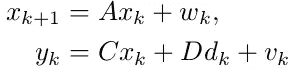
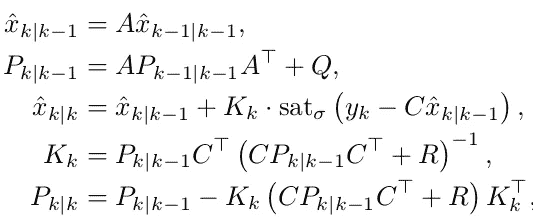
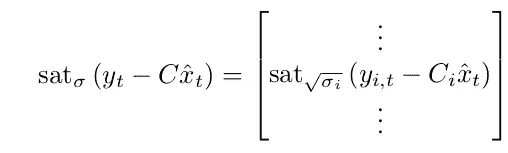
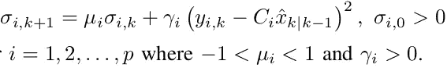

# 具有异常处理的自主车辆的 EKF

> 原文：<https://blog.devgenius.io/ekf-for-autonomous-vehicles-with-outlier-handling-d169dbae1949?source=collection_archive---------21----------------------->

凯文·Ku 在 [Unsplash](https://unsplash.com?utm_source=medium&utm_medium=referral) 上的照片

多亏了新冠肺炎，我所有的实习机会都没有了，给了我相当多的空闲时间。与此同时，Udacity 为他们的自动驾驶汽车纳米学位项目提供了一个月的试用，所以我自然报名了。作为一名研究生，我熟悉该课程的大多数理论方面(尤其是估计和控制)，所以我想尝试使用 C++(这在业界很常见)在良好的模拟器上实现一些东西，而不是我在大多数学术工作中使用的 Matlab。

所以我选择从扩展卡尔曼滤波项目开始。由于有很多关于基本实现的帖子，为了简洁起见，我不会在这篇帖子中包括它们。这是香草 EKF 的样子:

如你所见，性能相当不错。我们怎样才能做得更好？仔细观察表明，来自传感器的数据是不一致的。雷达上的蓝点比我们喜欢的分散得多。一种方法是完全消除异常值，即如果我们发现传感器读数对应于远离我们预测的估计值的点，我们跳过更新步骤，有效地丢弃截止值。从数学角度来说，我对创新的标准进行了限制。只有内曲线用于更新状态估计:5(激光新息范数截止)和 2.7(雷达范数截止)

以下是它们在 Udacity 提供的两个模拟实例上的性能:

然而，这种方法的一个警告是，它假设汽车将遵循的轨迹知识，允许我们优化截止点，以产生最小的误差值。这在现实生活中很少可能，所以我想让算法“适应”传感器波动，并相应地调整其截止值。在谷歌搜索了一番后，我发现了一个叫做 [**创新饱和**](https://arxiv.org/pdf/1904.00335) 的想法。在这里，他们的创新被限制在一定的范围内，而不是完全忽略假定的错误测量。这些饱和界限随着系统的发展而动态变化。考虑系统的以下状态空间模型:

假设一个线性系统。如果系统是非线性的，则使用近似线性模型

对于这个系统，通常的 KF 方程稍微调整如下:

注意更新方程式(上图第三个)。创新有一个术语“sat”。它是饱和函数，定义如下:

饱和度限制了+-sqrt(σ_i)之间的值

对于每个 I，饱和界限(σ)更新如下:

尽管它的稳定性的证明在数学上非常复杂(我们已经受够了！)，我尽量提供一个直观的理解。根据更新方程的性质，如果传感器偏差非常接近界限，界限将变得更窄。否则，他们会扩张。这种行为将继续，直到边界收敛到合理的数量。

下面演示了后一种方法在 Udacity 模拟器中的行为。

请注意，在第一个数据集中，就在一开始，有一个读数导致汽车错误判断其位置。在朴素的离群值过滤中，由于调整了截止值，这一问题得到了解决。在第二种方法中，问题仍然存在。这是因为，我们的**初始估计是不可靠的**，可能会偏离实际状态。因此，我们期待大的创新，并因此将饱和界限初始化为非常高的值。随着时间的推移，它们会自动收敛。在第二个数据集中，第二个算法表现更好，因为它更好地了解了使用什么创新来更新估计值。

关于代码结构的注释。最初的代码结构无法使用多个 EKF 实现。所以我从最初的 KF 类派生出了一个新的 KF 类。我修改了 FusionEKF 代码，以接受将要使用的 KF 实现的模板。这是**多态**的一个例子，多态是 **OOP** 范例的核心原则。

如果你喜欢它，请留下掌声或评论。谢谢！

Github 链接:[https://github . com/lau kikm/CarND-Extended-Kalman-Filter-Project](https://github.com/laukikm/CarND-Extended-Kalman-Filter-Project)