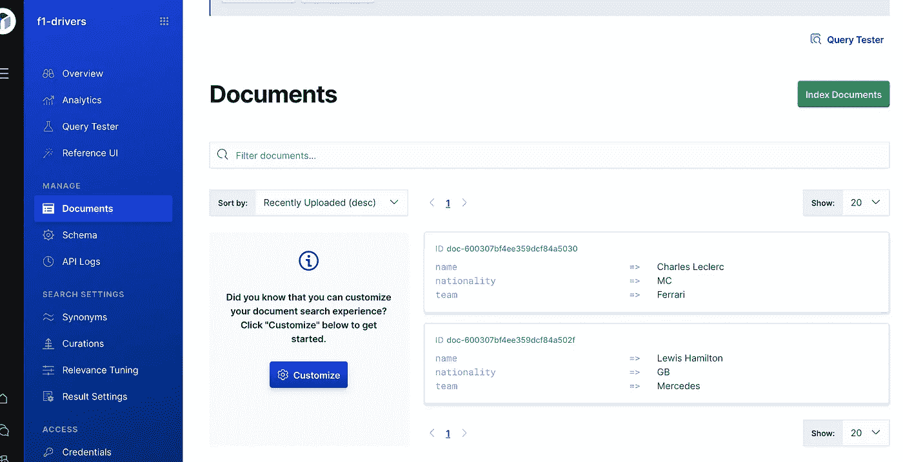

# 简而言之，弹性应用搜索

> 原文：<https://blog.devgenius.io/elastic-app-search-in-a-nutshell-ad446e7a3293?source=collection_archive---------0----------------------->

弹性应用搜索标志

# 什么是弹性 App 搜索？

Elasticsearch 是 Elastic Stack 的核心，提供非常强大的搜索、聚合和分析功能。 [Elastic App Search](https://www.elastic.co/app-search/) (原名 Swiftype)是提供搜索即服务的产品，在 Elasticsearch 之上。

应用搜索是弹性企业搜索解决方案的一部分，可以部署在云上或内部。应该指出的是，它是免费的，但不是开源的。

# 简而言之的特点

App Search 为客户简化了搜索用例，在 Elasticsearch 之上提供了抽象，提供了精炼的 API 和仪表板。下面你可以简单地看到应用程序的搜索功能。

*   引擎:引擎是应用搜索为弹性搜索[指数](https://www.elastic.co/blog/what-is-an-elasticsearch-index)提供的抽象。引擎是具有可定制的模式、相关性、结果设置、同义词和策略的文档集合。它们可以针对不同的语言进行优化，以获得国际化的搜索体验。可以通过比 Elasticsearch APIs 更简单的 API 调用来获取或检索文档。
*   搜索:应用程序搜索方便了文档搜索，使用户能够轻松配置分组、分页方面(聚合)、过滤、相关性和结果字段调整。与 Elasticsearch 聚合相比，刻面配置非常简单。默认情况下，会提供前缀和二元搜索等文本匹配选项。
*   相关性调整:在应用搜索中，客户可以调整他们的查询的相关性，在字段和值上分配权重和提升。相关性调整可以在引擎或查询级别上执行。
*   同义词:应用搜索允许用户提供同义词来将查询联系在一起。应用搜索中的同义词与 Elasticsearch 中的略有不同；这基本上是一种查询重写，而不是索引级别的操作。
*   管理:用户可以管理搜索结果，提升或隐藏特定查询关键词的文档。
*   查询建议:App 搜索可以对不完整的查询提供查询建议。
*   分析:App Search 提供 API 和仪表板，使客户能够获得和监控搜索结果分析。
*   UI 支持:在 App Search 中，可以配置自定义搜索 UI，并将其导出为 React 应用程序。

在官方[文档](https://www.elastic.co/guide/en/app-search/current/index.html)中可以找到完整的功能和指南。

# 限制

如上所述，Elastic App Search 极大地简化了搜索体验，抽象出了 Elasticsearch API 中的复杂性；然而，由于性能问题，应用程序搜索存在一定的限制。

例如，每个引擎的字段、同义词和策略的数量；以及文档的大小和可以被索引的文档的数量是有限的。在查询级别，查询长度、每页文档数等参数是有限的。你可以在官方文档中看到完整的限制列表。

除了这些限制，App Search 只提供了强大的 Elasticsearch 引擎所提供功能的一个子集。我无法在此列举完整列表，但应用程序搜索不支持的一些功能如下:

*   文本分析器在应用程序搜索中不可配置。
*   文本匹配配置仅限于某些默认值。客户端可以选择包含在文本匹配中的字段，但不能选择匹配类型(和、或、前缀或短语)
*   相关性调整仅限于 Elasticsearch 提供的大量可能性中的一小部分。
*   同义词是简单的查询重写，而不是对文档和查询分析的修改。
*   方面仅限于聚合功能的子集(术语和范围聚合)

值得注意的是，App Search 似乎旨在提供便捷的搜索体验，更喜欢简单而不是全面。

# 应用程序搜索客户端

应用程序搜索带有一个非常强大的网络用户界面，用户可以为他们的引擎配置一切。下面你可以看到一个界面截图。

对于应用程序客户端，应用程序搜索的特性被公开为 REST APIs，这在官方的 [API 指南](https://www.elastic.co/guide/en/app-search/current/api-reference.html)中有很好的记录。除了 REST API，App Search 还为以下编程语言提供了[官方客户端](https://www.elastic.co/guide/en/app-search/current/api-clients.html):

*   Java Script 语言
*   节点. js
*   服务器端编程语言（Professional Hypertext Preprocessor 的缩写）
*   计算机编程语言
*   红宝石

不幸的是，Java/Kotlin 没有正式的客户端实现。你可以在 [Github](https://github.com/itasyurt/app-search-kotlin/) 上找到我的 Kotlin 实现，它实现了 App Search 提供的大部分 API，并且在功能上与 Java 兼容。我计划在下一篇文章中提供更多信息。

# 全部的

Elastic App Search 在 Elasticsearch 的基础上提供了一个伟大的抽象和简化，以促进搜索即服务。在这篇文章中，我试图提供一些见解，重点以及一些限制。我计划访问一些应用程序搜索功能，在我即将发布的帖子中提供更多细节。敬请关注。