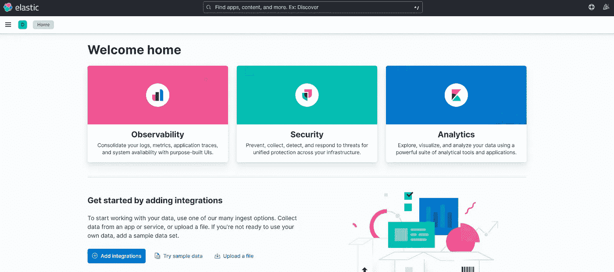

# 使用 Docker Compose 进行 Elasticsearch 和 Kibana 安装

> 原文：<https://blog.devgenius.io/elasticsearch-and-kibana-installation-using-docker-compose-886c4823495e?source=collection_archive---------1----------------------->


在[上一篇文章](https://medium.com/@mhdabdel151/run-elasticsearch-and-kibana-as-docker-containers-c5f5f5460afd)中，我们看到了如何将 Elasticsearch 和 Kibana 作为 Docker 容器运行。这个方法当然不是很复杂，但是需要很多命令。今天，我们将重点关注**编排**，以便通过 **docker-compose** 将一切集中化。

对于那些不知道它是什么的人来说， **Docker Compose** 是一个用 Python 编写的工具，它允许你在一个 *YAML* 文件中描述几个容器作为一组服务。然后，它将允许您编排您的容器，从而简化您在不同环境中的部署。

如果您使用的是 Mac 版*Docker*或 Windows 版*Docker*，那么您的系统中已经安装了最新版本的 Docker Compose。在 Linux 工作站上，您必须下载它，然后用以下命令行安装它:

```
sudo curl -L "https://github.com/docker/compose/releases/download/1.23.2/docker-compose-$(uname -s)-$(uname -m)" -o /usr/bin/docker-compose && sudo chmod +x /usr/bin/docker-compose
```

安装后，您可以使用以下命令检查 Docker Compose 的版本:

```
docker-compose --version
```

你可以在这里 了解更多 docker-compose [*。*](https://docs.docker.com/compose/)

首先，在一个空目录中，我们将创建一个*。env* 文件来重组我们的环境变量。该文件的内容如下:

```
# Version of Elastic products
STACK_VERSION=8.4.0# Port to expose Elasticsearch HTTP API to the host
ES_PORT=9200# Port to expose Kibana to the host
KIBANA_PORT=5601
```

在这里，我们一定要提到我们要使用的弹性产品的*版本*，以及 Elasticsearch 和 Kibana 将要暴露的*端口*。
因为在第一个教程中**安全性没有被激活**为了尽可能简化，我们不需要为我们的客户端指定密码。

现在让我们转到 *docker-compose.yml* 文件:

```
version: '3.8'services:
  elasticsearch:
    image: docker.elastic.co/elasticsearch/elasticsearch:${STACK_VERSION}
    container_name: elasticsearch
    volumes:
      - elasticsearch-data:/usr/share/elasticsearch/data
    ports:
      - ${ES_PORT}:9200
    restart: always
    environment:
      - xpack.security.enabled=false
      - discovery.type=single-node
    ulimits:
      memlock:
        soft: -1
        hard: -1 kibana:
    depends_on:
      - elasticsearch
    image: docker.elastic.co/kibana/kibana:${STACK_VERSION}
    container_name: kibana
    volumes:
      - kibana-data:/usr/share/kibana/data
    ports:
     - ${KIBANA_PORT}:5601
    restart: always
    environment:
      - ELASTICSEARCH_HOSTS=http://elasticsearch:9200volumes:
  elasticsearch-data:
    driver: local
  kibana-data:
    driver: local
```

这里，我们运行的是一个*单节点* Elasticsearch 版本 *8.4.0* 集群，安全*被禁用*。我们的容器名为 *elasticsearch* ，如果出现崩溃或任何问题，容器将*总是重启*。我们还需要指定一个卷来保存数据(您可以在*中修改端口)。env* 文件)。

对于 kibana 也是一样，我们为容器指定一个名称( *kibana* )，我们填写 *ELASTICSEARCH_HOSTS* 作为环境变量，以便将 Kibana 连接到 ELASTICSEARCH。指定 *depends_on* 属性也很重要，以便仅在启动 Elasticsearch 容器时启动容器。

现在，通过运行以下命令，创建并启动 Kibana 实例和单节点 Elasticsearch 集群:

```
docker-compose up -d
```

第一次运行这个命令可能需要很长时间，这取决于您的互联网连接，因为它将从 [docker hub](https://hub.docker.com/) 下载我们文件中指定的 Elasticsearch 和 Kibana 图像。您可以通过以下命令检查您的容器是否已经创建并正在运行:

```
docker ps
```

当部署开始时，打开浏览器并通过访问 [http://localhost:5601](http://localhost:5601) 访问 Kibana，在这里您可以加载、测试数据并与您的集群通信。



要停止集群，再简单不过了，运行以下命令:

```
docker-compose down
```

要删除容器和卷，您只需将 *-v* 添加到前面的命令中。

这里还有很多事情我们可以讨论，比如如何在启用了*安全性的情况下重做同样的配置。不幸的是，我们无法在一篇文章中涵盖所有内容，但是不要担心，其他文章正在路上😁。*

今天到此为止，请随时查看关于该主题的[官方文档](https://www.elastic.co/guide/en/elasticsearch/reference/current/docker.html#docker-compose-file)以了解更多细节和配置。感谢您的阅读，如果您对本文有任何问题或评论，请在下面留下您的评论。

我们下次再见，看更多的帖子🚀。

阿卜杜尔-巴吉