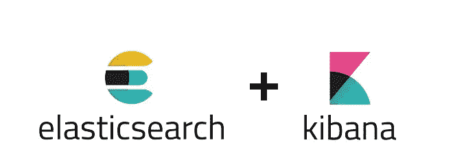
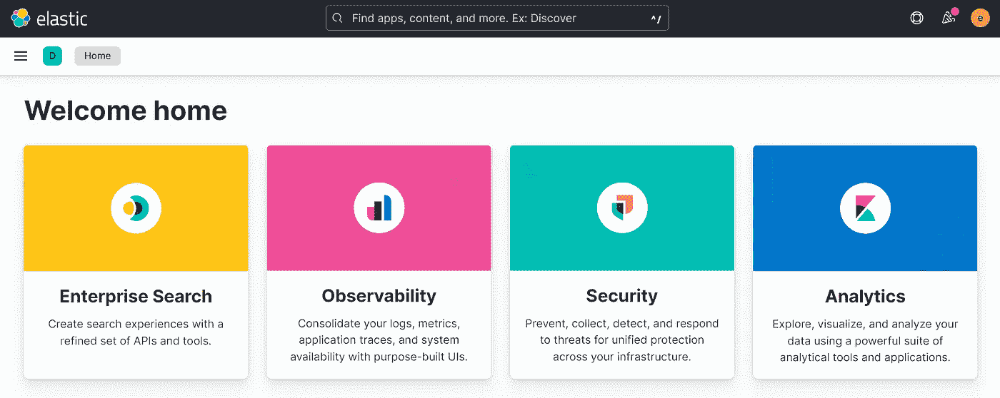

# Windows 上的 Elasticsearch 和 Kibana，让我们开始吧

> 原文：<https://blog.devgenius.io/elasticsearch-and-kibana-on-windows-lets-get-started-ff005f1fe2fc?source=collection_archive---------10----------------------->



作为上一篇文章的结果，我假设您现在已经熟悉了弹性堆栈。如果你还没有看过，请看一看。

在[弹性云](https://cloud.elastic.co/registration)上运行弹性服务可以说是最简单的选择，因为你只需点击一下就可以访问所有的服务(你可以加入 14 天的免费试用)。

今天我们要安装 Elasticsearch *(堆栈的大脑)*和 Kibana *(进入堆栈的窗口)*。实际上，有几种方法可以使用 Elasticsearch 和 Kibana，这取决于您运行的发行版。

-**. tar . gz**Linux 或 MacOs 发行版的归档

——**。适用于 Windows 系统的 zip**

- **deb** 对于 Debian，Ubuntu…

- **rpm** 适用于 Red Hat、Centos、SLES、OpenSuSE 和其他基于 rpm 的系统

此外，如果您对 Elasticsearch 和 Kibana 感到满意，可以在 Docker 容器中运行它们。这可能是以后文章的主题。

今天我们将仅限于使用 Windows 版本。

因此，您必须首先下载**。来自[官网](https://www.elastic.co/downloads/elasticsearch)的 zip** 包。在撰写本文时，当前版本是 8.3.3 。

先说 Elasticsearch。解压缩后，将自己置于使用以下命令创建的目录中:

```
cd C:/elasticsearch-8.3.3
```

这里不需要安装，您只需要通过运行以下命令来运行 Elasticsearch:

```
bin/elasticsearch
```

注意:Elasticsearch 也可以设置为 windows 服务，在启动时自动开始，在后台运行。更多信息[点击这里](https://www.elastic.co/guide/en/elasticsearch/reference/current/zip-windows.html#windows-service)。

首次启动 Elasticsearch 时，将默认设置安全功能。自动进行以下配置:

*   为弹性用户生成密码
*   为基巴纳生成一个 30 分钟有效的注册令牌
*   TLS 的证书和密钥是为传输层和 HTTP 层生成的。

初始化后，Elasticsearch 将继续在后台运行，并向终端返回任何必要的信息。默认情况下，您还可以通过部署在端口 **9200** 上的 HTTP 接口与 Elasticsearch 进行交互。

让我们现在启动基巴纳。使用相同的过程，从[这里](https://www.elastic.co/downloads/kibana)下载归档文件，导航到提取产生的文件夹，并发出以下命令:

```
bin/kibana
```

第一次启动时，这个命令会在您的终端中生成一个惟一的链接，将您的 Kibana 实例注册到 Elasticsearch。然后按照以下步骤操作:

*   在终端中单击创建的链接，在浏览器中启动 Kibana
*   将首次启动 Elasticsearch 时在终端中生成的注册令牌粘贴到浏览器中后，单击按钮将您的 Kibana 实例与 Elasticsearch 链接起来

如果您无意中丢失了注册令牌或令牌已过期，请不要担心，以下命令将为您生成一个新的令牌。

```
bin/elasticsearch-create-enrollment-token — scope kibana
```

*   使用启动 Elasticsearch 时生成的密码，以弹性用户的身份进入 Kibana。

仅此而已，你刚刚在 Windows 上本地推出了 Kibana 和 Elasticsearch。为了让他们俩停下来， ***Ctrl + C* 上的**终端。



今天就到这里，请随时查看官方文档了解更多细节。感谢您的阅读，如果您对本文有任何问题或评论，请在下面留下您的评论。

我们下次再见，看更多的帖子。

阿卜杜尔-巴吉