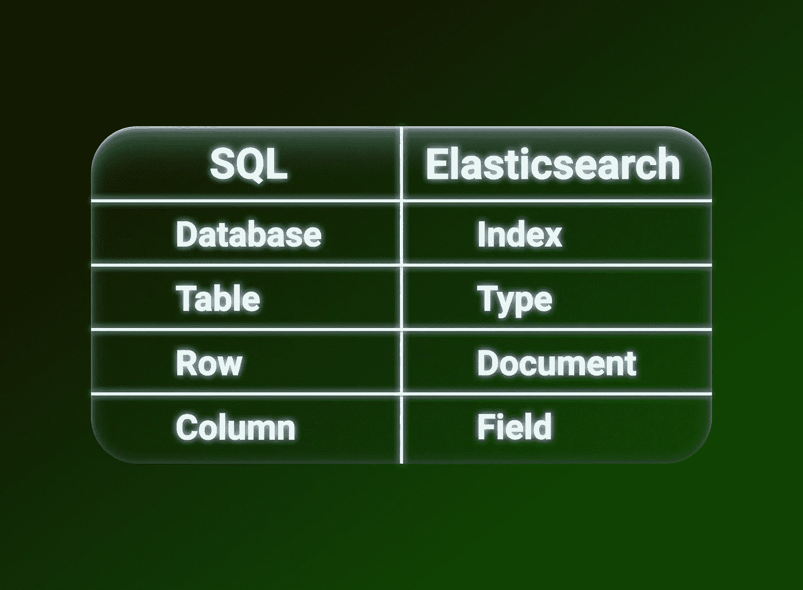
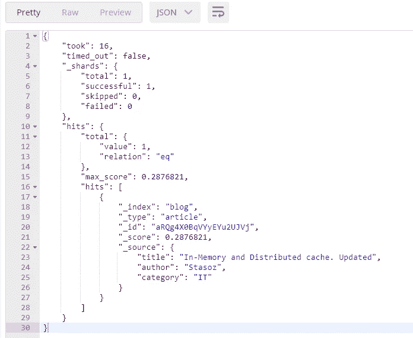

# 弹性搜索。基础

> 原文：<https://blog.devgenius.io/elasticsearch-basics-657fb6223cfb?source=collection_archive---------4----------------------->


# 弹性研究基本概念

Elasticsearch 是一个快速的、水平可伸缩的、免费的 NoSQL 混合数据库，可以在其中搜索数据。然而，可以关闭存储，然后只保留搜索引擎，返回曾经被索引的文档的 id。

虽然它最初是一个文本搜索引擎，但现在已经发展成为一个分析引擎，不仅可以提供搜索，还可以提供复杂的聚合。Elasticsearch 支持自动完成、基于位置的过滤、多级聚合等功能。

本文将介绍弹性搜索的基本概念和操作。

首先，我们来看看 Elasticsearch 中的术语。如果您熟悉 SQL，下表显示了在 Elasticsearch 中等价的术语。



## 索引

索引就像一个数据库，如果你熟悉关系数据库，它绝不是数据库索引。换句话说，索引是类型(表)的容器。

## 类型

该类型可以被认为是一个数据库表。因此，每个索引可以包含几种类型。

假设我们正在创建一个博客应用程序，我们想要创建两种类型，文章和评论。

文章类型:

注释类型:

重要的是要知道你可以定义类型之间的关系，一对一，一对多和多对多(如果你想知道更多的关系，请在评论中写下来，我会单独写一篇文章)。

## 文件

Elasticsearch 将数据存储为 [JSON](https://www.json.org/json-en.html) ，因为它方便、简单、灵活。Elasticsearch 中的文档可以看作关系数据库中的字符串。

我们还可以在 Elasticsearch 中存储嵌套的对象。

Elasticsearch 是为处理非结构化数据而构建的，可以自动检测文档字段的数据类型。也就是说，您可以索引新文档或添加新字段，而无需更改模式。

## 集群和节点

在传统数据库中，我们通常只有一台服务器来处理所有请求，但 elasticsearch 的工作方式不同。

Elasticsearch 是一个分布式系统。这意味着它由一个或多个作为一个整体工作的节点组成，这允许您扩展和处理超过单个服务器所能处理的负载。

每个节点(服务器)都有一段数据。您可以只在一个节点上运行 Elasticsearch，然后在数据量超过一台服务器的容量时扩展集群。


在上图中，我描绘了一个包含三个节点的集群:elasticsearch1、elasticsearch2 和 elasticsearch3。这些节点作为一个单元来处理所有索引请求和数据检索。

## 碎片

Elasticsearch 使用 [Apach Lucene](https://lucene.apache.org) 进行索引和查询处理。

Shard 是 Apache Lucene 的一个实例。该索引可以存储一个或多个碎片。因此，Elasticsearch 可以存储超过一台服务器容量的信息。

# 实践

你可以从[官方网站](https://www.elastic.co/downloads/elasticsearch)下载 Elasticsearch，也可以在 Docker 中运行。

`docker run -d -p 9200:9200 elasticsearch`

所以，安装之后，我们需要发送一个请求，Elasticsearch 通过 REST API 进行通信，你可能已经注意到了，它默认运行在端口 9200 上。

我将通过 [Postman](https://www.postman.com) 进行交流(所有例子，我将通过 Postman 展示)，你也可以使用编程语言的客户端库。本质上，这些库是 REST API 的包装器。

要检查 Elasticsearch 是否正常工作，请发送一个 GET 请求


我的回答是:

举个例子，假设我们正在创建我们的博客，并希望使用 Elasticsearch 作为我们的搜索引擎。我们将把所有类型为**文章**的文章存储在**博客**索引中。我们要索引的每篇文章都是一个 JSON 文档。

## 文档创建

让我们创建一个新的索引，并向它添加一个类型。

添加一篇文章会是这样的。请求正文是我们想要添加的文章文档。


> 如果还不存在的话，Elasticsearch 会自动创建**博客**索引和**文章**类型。

用有关文档和索引的信息进行响应:


因为我们使用 HTTP PUT 方法创建了文档，所以我们需要设置文档的 id，否则，我们将得到一个错误。

```
No handler found for uri [/blog/article/] and method [PUT]
```

如果您没有唯一的 id，您可以使用 HTTP POST，然后 Elasticsearch 会为您创建一个唯一的 id。例如:


回应:


如果您尝试发出一个 PUT 请求并传递一个现有的 id，文档将被更新，版本参数将增加:


回应:


正如你注意到的`_version` = 2 和`result` =更新。

## 获取现有文档

要获取一个文档，我们需要知道文档的**索引**、**类型**和**唯一标识符**。让我们尝试使用以下查询来获取新创建的文档:


如你所见，结果不仅包含文档本身，它存储在`_source`层，还包含附加信息，例如，文档被发现`found` =真，当前版本`_version` = 1，让我提醒你，每次文档被更改时它都会增加。

## 更新现有文档

在 Elasticsearch 中更新文档比在传统的 SQL 数据库中更复杂。在 Elasticsearch 的幕后，您签出文档，应用更改，然后重新插入文档。非常昂贵的手术。

让我们更新新创建文档的类别:


回应:


`result: updated`表示一切顺利，通知`_version`也增加了。还有更复杂的升级场景，但我不会在本文中介绍它们。

## 删除现有文档

要删除现有的文档，我们需要使用 HTTP DELETE 方法，将路径传递给它，就像获取文档一样。


回应:


`result = deleted`，则操作成功，文档被删除。

## 搜索

但是许多 NoSQL 数据库能够添加和接收 JSON。elasticsearch 最强大的当然是**搜索**。通过索引搜索文档有两种方法:用于简单搜索查询的 **REST 请求 API** ，以及更高级的**查询 DSL。**

> Elasticsearch 中的所有数据都作为倒排索引存储在 Apache Lucene 中。

假设我们有一个文章表，我们想找到 Stasoz 写的所有文章，SQL 如下所示:

```
SELECT * FROM Article WHERE Author like '%Stasoz%'
```

弹性搜索查询:


使用 URL 参数的请求最适合用于简单的事情。对于更复杂的情况，最好使用位于 POST 请求主体中的 JSON 请求(查询 DSL)。


回应:



搜索 API 非常灵活，支持不同种类的过滤、排序、分页和聚合。

搜索 API 值得单独撰写一篇文章。如果你想知道更多关于搜索 API 的信息，请在评论中写下，我会写的。

感谢您阅读本文！如果你想了解更多关于 Elasticsearch 的特定主题(安装、类型之间的关系、Kibana、倒排索引等)，请在评论中写下。

快乐编码:)

# 学到了新东西？

如果你喜欢这篇文章，你可以 [**给我买杯咖啡**](https://www.buymeacoffee.com/stasoz) 我写下一篇文章的时候再喝:)

[](https://www.buymeacoffee.com/stasoz)