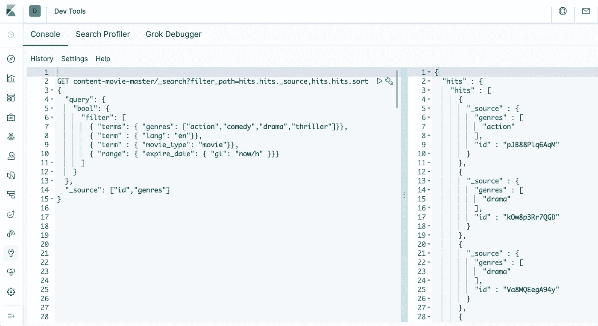
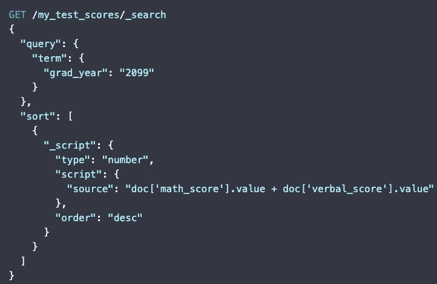
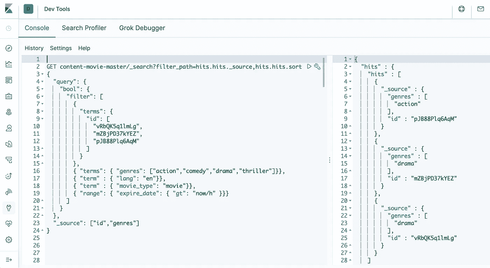
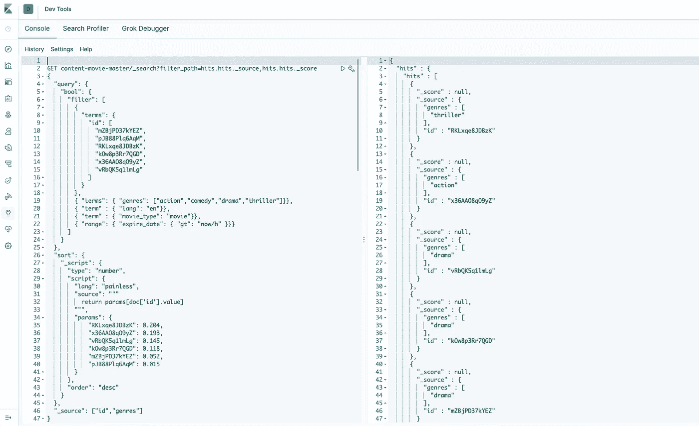

# Elasticsearch 自定义排序脚本

> 原文：<https://blog.devgenius.io/elasticsearch-custom-sorting-script-7778fb661bf9?source=collection_archive---------1----------------------->

有时候你会用 like 从 Elasticsearch 中检索或过滤一些东西。[在过滤上下文](https://www.elastic.co/guide/en/elasticsearch/reference/current/query-filter-context.html#filter-context)中，查询可能不需要匹配的相关性分数，因为没有计算分数。**过滤器**主要用于过滤结构化数据，如`status = published`、`expired_date > now`等。



弹性搜索以过滤内容。

## **为什么要自定义排序？**

在某些情况下，我们可能需要添加业务逻辑来对结果进行排序，例如，



来源:[https://www . elastic . co/guide/en/elastic search/reference/7.13/scripts-and-search-speed . html](https://www.elastic.co/guide/en/elasticsearch/reference/7.13/scripts-and-search-speed.html?baymax=rec&rogue=rec-1&elektra=guide#_improving_search_speed)

但是，上述脚本可以在索引时执行或预定义，以提高搜索速度。所以在这里，我们将主要关注如何在排序字段中**使用外部上下文，因为它更适合我们的用例。**

让我们看看它是如何工作的。例如，如果我们想要搜索文档 id 列表以及一些过滤器。对于这些 id，您可以为它们中的每一个定制分数，可能是 ML 模型中的`number_of_interactions`、`external_prices`，甚至是`prediction_scores`。

通常的做法是首先查询它们，然后从代码中对结果进行排序。这意味着您不能对结果进行分页，因为 elasticsearch 不知道文档得分。



您可以在这里看到，订单结果与输入 id 不匹配。

## 解决方案:[基于脚本的排序](https://www.elastic.co/guide/en/elasticsearch/reference/7.13/sort-search-results.html#script-based-sorting)

这允许使用[无痛脚本语言基于定制脚本进行排序。](https://www.elastic.co/guide/en/elasticsearch/reference/current/modules-scripting-painless.html)其中，`source`是脚本本身，`id`是存储的脚本，`params`是作为变量传入脚本的命名参数。


来源:[https://www . elastic . co/guide/en/elastic search/reference/current/modules-scripting-using . html](https://www.elastic.co/guide/en/elasticsearch/reference/current/modules-scripting-using.html#modules-scripting-using)

假设我们有来自外部环境的自定义分数，并希望将它们映射到排序脚本。下面是如何使用一个无痛脚本来完成它。



```
{
  "query": {
    "bool": {
      "filter": [
        { 
          "terms": { 
            "id": ["a", "b", "c"]
          }    
        }
      ]
    }
  },
  "sort": {
      "_script": {
         "type": "number",
        "script": {
        **"lang": "painless",**
        **"source": """**
          **return params[doc['id'].value]**
        **""",**
        **"params":** { 
            "c": 30,
            "a": 25,
            "b": 10,
        }
      },
      "order": "desc"
    }
  }
}
```

现在，所有的查询功能都可以在 elasticseach 内部完成，而无需在外部进行定制代码或在检索结果后进行后期处理。

## **担忧？**

正如文档中所描述的，[在你的脚本中使用参数](https://www.elastic.co/guide/en/elasticsearch/reference/current/modules-scripting-using.html#prefer-params)。

> Elasticsearch 第一次看到一个新脚本时，它会编译该脚本，并将编译后的版本存储在缓存中。编译可能是一个繁重的过程。与其在脚本中硬编码值，不如将它们命名为`params`进行传递。
> 
> …如果你在短时间内编译了太多独特的脚本，Elasticsearch 会以一个`circuit_breaking_exception`错误拒绝新的动态脚本。

因此，您可以首先根据您的用例规模来测试这个想法，然后进行相应的调整。

## 最终想法

在将外部环境包括到排序字段中时，仍然有很大的改进空间，比如交互事件、来自 ML 的预测分数等。创建一个接收管道可能是另一种方法，但是也有一些权衡。

如果有人以前遇到过这种情况或者有更好的建议。请随时留下您的评论，我很乐意收到您的来信。