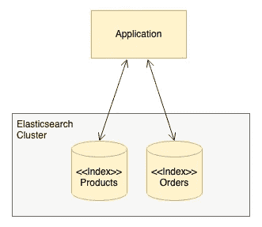
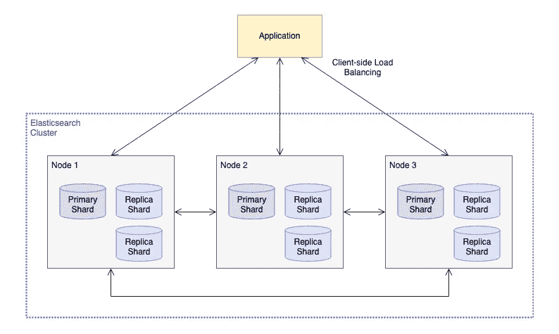
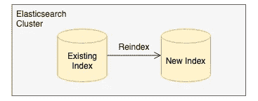
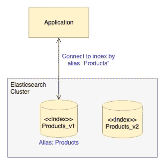
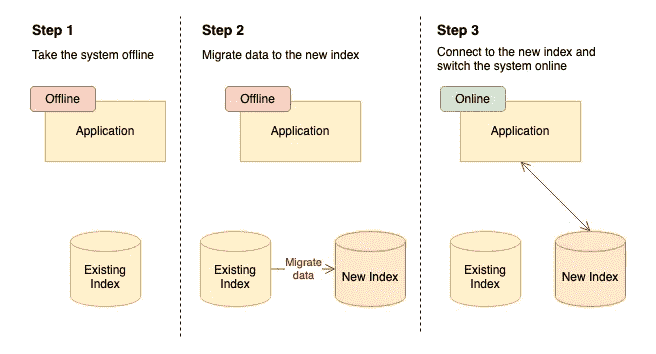
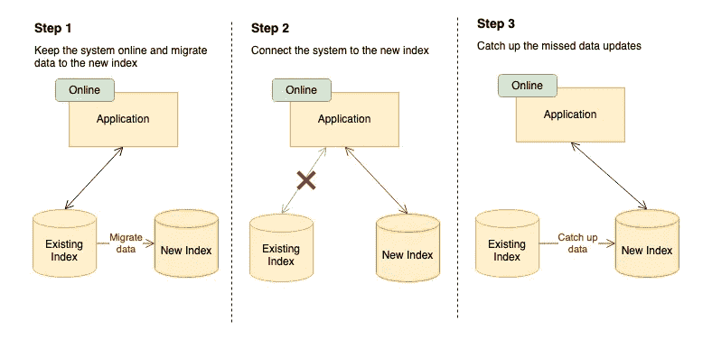
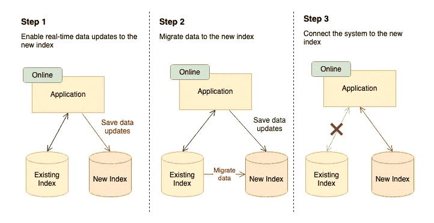
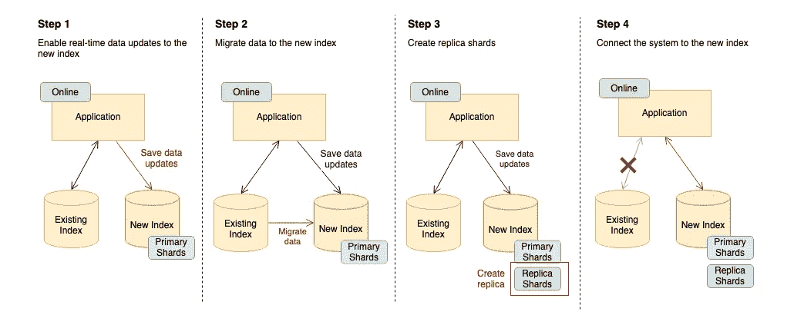
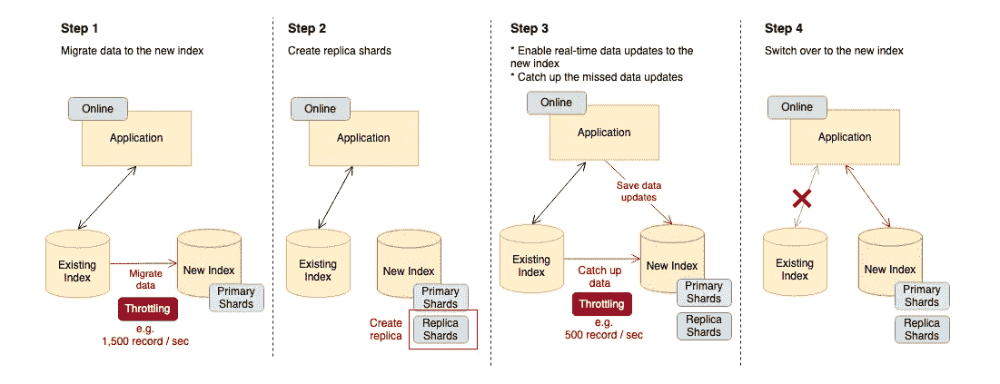

# 零停机时间的弹性搜索数据迁移

> 原文：<https://blog.devgenius.io/elasticsearch-data-migration-with-zero-downtime-c43ad69b0aff?source=collection_archive---------1----------------------->

## 弹性研究最佳配方的探索

Marc-Olivier Jodoin 在 [Unsplash](https://unsplash.com/?utm_source=unsplash&utm_medium=referral&utm_content=creditCopyText) 上拍摄的照片

Elasticsearch 是一个了不起的搜索引擎。从电子商务网站到内部系统日志搜索，许多应用程序的关键搜索功能都由 Elasticsearch 提供支持。它的全文搜索能力是高度灵活和可配置的。然而，软件在某种程度上类似于机器，它需要定期维护以保持良好状态。由于业务需要，需要对 Elasticsearch 进行微调，如调整关键字标记、更新单个数据字段的相关比率以及按比例增加主碎片的数量。

问题是，Elasticsearch 上的这些变化不是简单的任务，它们不像在传统关系数据库中执行 ALTER 语句这样的命令那么容易。事实上，Elasticsearch 中的大多数数据和设置都是不可变的，这意味着要通过删除和创建来进行更改。例如，Elasticsearch 通过删除现有记录并插入更新的记录来处理数据更新请求。因此，对于数据存储设置的更改，数据迁移是不可避免的，这意味着您需要使用更新的配置创建新的数据存储，并将所有现有数据迁移到新的数据存储。听起来很复杂，不是吗？

对于不断收到请求的 24/7 系统，在保持零停机时间的同时进行数据迁移是一项挑战。如果没有周密的迁移计划，您的系统可能会面临风险或遭受意外停机。

我最近经历了一次大规模弹性搜索数据迁移之旅，迁移对象是一个具有高实时流量的关键系统。我尝试了许多方法，最终得到了正确的公式，并成功完成了迁移。

在本文中，我将与您分享这些方法和注意事项。如果您正在寻找如何执行 Elasticsearch 数据迁移(即重新索引)的方法，您将找到最适合您的系统的正确方法。

# 弹性搜索概览

首先，为了对概念和术语有一个共同的理解，让我们对弹性搜索有一个简要的概述。

Elasticsearch 是一个 NoSQL 数据库，它在一个由原始文档数据和查询索引组成的索引中存储了一组文档。如果您认为 Elasticsearch 中的索引类似于关系数据库中的数据表，尽管它们并不完全相同，这将有助于您更好地理解这个概念。在高级视图中，应用程序连接到 Elasticsearch 集群中的索引。下图举例说明了一个电子商务应用程序连接到产品和订单索引的例子。

弹性搜索索引

仔细看看 Elasticsearch 集群内部，它是一个分布式文档存储。下图说明了如何为索引存储数据。数据分布在多个碎片上，这些碎片被分配给不同的节点，以实现弹性和可伸缩性。**主碎片**保存用于读/写操作的文档和索引的副本，而**副本碎片**是用于只读访问的主碎片的副本。每个主碎片可以有一个或多个副本碎片。

应用程序通过客户端负载平衡连接到其中一个节点进行查询或数据更新。接收请求的节点将把它路由到目标主碎片以进行数据更新，然后它将把新的更新通知它的所有副本碎片。

弹性搜索—原始碎片和复制碎片

将数据从一个索引复制到另一个索引的操作称为**重新索引**。Elasticsearch 为重新索引提供了各种选项，例如迁移整个数据或通过查询进行部分迁移。

Elasitcsearch — Reindex

Elasticsearch 中的索引可以有一个第二名(即**别名**)。这是一个非常有用的特性，尤其是对于维护不同版本的索引。例如，一个应用程序指向一个索引别名“Products ”,它被分配给一个特定的版本，即 Product_v1。要切换到索引 Products_v2，只需更新别名即可，这种更改对应用程序是透明的。因此，我们通过将别名分配给新索引，在完成重新索引时切换到新索引。

Elasitcsearch —别名

# 如果停机时间可以接受，这是最简单的方法

随着 Elasticsearch 的快速介绍，是时候深入研究重建索引的方法了。

将数据迁移到新索引的最简单方法是通过首先使系统脱机来冻结数据。然后，将所有现有数据复制到新索引中，然后恢复系统联机并连接到新索引。

缺点是显而易见的，数据迁移涉及停机时间。需要迁移的数据越多，需要的停机时间就越长。如果最终用户和企业可以接受停机时间，这就是正确的方法。通常，如果您的系统全天候负责实时请求，企业肯定不会容忍停机。

停机时重新编制索引

# 在保持系统在线的同时迁移数据

为了在不停机的情况下完成数据迁移，请在后台运行重新索引，同时保持系统在线。重新索引完成后，将别名切换到新索引。然后，应用程序请求将被路由到新的索引。由于在重新索引过程中由传入流量引入的新数据更新不会被复制到新索引中，因此需要另一轮重新索引来弥补丢失的数据更新。

虽然没有停机时间，但这并不是一个完美的方法。由于最新的数据更新尚未复制到新索引中，因此当您的系统在步骤 2 中切换到新索引时，可能会出现“Record not found”错误。如果我们改变第二步和第三步的顺序，情况会有所改善。但是，Elasticsearch reindexing 命令只能拍摄静态数据快照。如果您的系统正在处理恒定量的传入请求，同样的错误可能仍然会发生。

保持系统在线时重新索引

# 重新编制索引而不遗漏数据

如何确保重新索引而不遗漏最近的数据更新？您需要一个持续同步新索引更新的过程。虽然 Elasticsearch 中没有类似于数据库触发器的功能，但最直接的方法是在应用程序中构建一个系统逻辑，这样每当现有索引中有数据更新时，它都会将数据更新的副本保存到新索引中。

下图显示了更新后的方法。我们可以在第一步中打开新索引的实时数据更新。接下来，将所有现有数据复制到新索引中。最后，将别名切换到新索引。

重新编制索引，保持系统在线，不丢失数据

从表面上看，这是一个完美的方法。没有停机时间，也没有遗漏数据。然而，只有当您的 Elasticsearch 集群运行在超级强大的硬件资源上，或者您的系统只提供低流量时，这种方法才是可行的。否则，可能会观察到服务级别下降，例如响应时间延长，甚至由于弹性搜索超时而导致系统错误。

原因是重新索引是一项 CPU 和 I/O 密集型操作。随着新索引的实时数据更新，Elasticsearch 集群可能会被繁重的负载淹没，最终在最坏的情况下崩溃。

# 如何执行重新索引，但避免淹没 Elasticsearch 集群？

Elasticsearch 索引存储在分布于多个节点的分片中。每个主碎片可以有一个或多个副本碎片。新索引上的数据更新请求不仅消耗主碎片的处理能力，还消耗其所有副本碎片的处理能力。

为了减少资源消耗，我们可以首先创建没有副本碎片的新索引，然后在重新索引完成后创建副本碎片。根据我的经验，重新索引的资源使用可以减少 30%左右。

下图显示了先前方法的改进版本。新索引仅使用主碎片创建，并且在开始时在应用程序中启用数据同步。然后，指示 Elasticsearch 集群在重新索引结束时创建副本碎片。最后，将别名切换到新索引。

没有副本碎片的重新索引

这种方法很好，但还不够安全，无法应用于生产。我们应该对生产环境中的任何操作保持谨慎，并尽可能降低任何风险，以防出现问题。

这种方法很好，但是它引入了创建副本的额外步骤。但是，如果出现任何问题，就没有办法取消该过程。相比之下，Elasticsearch 允许我们随时停止重新索引过程。

如果一个进程消耗了太多的资源，并且可能影响集群的性能，那么停止该进程的能力就非常重要。否则，如果进程淹没了集群，我们只能眼睁睁地看着系统崩溃。

我们将通过转移数据更新活动来降低风险，以减少 Elasticsearch 集群的工作量。

# 优化群集资源的使用

这样做是为了避免在步骤 1 和步骤 2 中分别执行重新索引和副本创建时给群集带来额外的工作负载，如下图所示。这可以通过将对新索引的实时数据更新的步骤从步骤 1 转移到步骤 3 来完成，步骤 3 在副本创建完成之后。这种方法减少了对集群的压力，降低了由于繁重的工作负载而导致集群崩溃的可能性。

最后，根据您的 Elasticsearch 集群的容量微调重新索引操作的节流参数。以控制资源利用的方式，重新索引的速率被限制为每秒定义的文档数。

重建索引的最终方法

第 3 步显然涉及更重的负载，包括从实时传入流量注入的数据更新和用副本碎片重新索引新索引。因此，重新索引应该限制在较低的速率，比如 1000 doc/sec，而步骤 1 中的重新索引可以允许较高的速率，比如 1500 doc/sec。

确切的限制参数取决于根据群集容量和系统数据量得出的测试结果。最佳参数设置应该实现快速数据迁移，同时不影响服务级别。

# 感谢阅读

Elasticsearch 数据迁移方法是我在处理一个具有高请求量的 24/7 关键系统的重新索引方面的成功经验的总结。希望对您规划 Elasticsearch 重建索引或其他数据库的数据迁移有所帮助。当然，没有放之四海而皆准的解决方案。数据迁移方法应该根据您的系统架构和用例量身定制。如果您发现任何其他可以实现无缝数据迁移的方法，请随意分享。