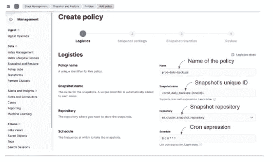
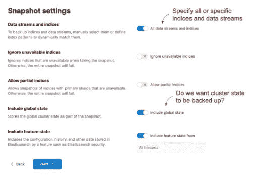
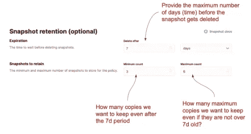

# 实践中的弹性研究:自动化快照(3/3)

> 原文：<https://blog.devgenius.io/elasticsearch-in-action-automating-snapshots-3-3-36f2570415c3?source=collection_archive---------11----------------------->


节选自我即将出版的书:弹性搜索在行动

*节选自我的书*[*elastic search in Action，第二版*](https://www.manning.com/books/elasticsearch-in-action-second-edition?utm_source=mkonda&utm_medium=affiliate&utm_campaign=book_konda_elasticsearch_7_23_21&a_aid=mkonda&a_bid=edbc50d4) *。代码在我的*[*GitHub*](https://github.com/madhusudhankonda)*库中。您可以在存储库中找到可执行的 Kibana 脚本，这样您就可以直接在 Kibana 中运行命令。所有代码都经过 Elasticsearch 8.4 版本的测试。*

迷你系列快照功能

1.  [介绍和注册快照](https://mkonda007.medium.com/elasticsearch-in-action-introducing-and-registering-snapshots-1-3-2cebf8b6776c)
2.  [创建和恢复快照](https://mkonda007.medium.com/elasticsearch-in-action-creating-and-restoring-snapshots-2-3-50ca90e32ffa)
3.  [自动化快照](https://mkonda007.medium.com/elasticsearch-in-action-automating-snapshots-3-3-36f2570415c3)

# 自动化快照

我们刚刚看到了创建快照的机制，但这些都是临时快照:您可以按需创建快照(例如，当您迁移数据、推出生产热修复版本等时)。).但是，我们可以使用快照生命周期管理(SLM)功能自动执行这一过程，以定期备份和拍摄快照。Elasticsearch 提供了`_slm` API 来管理快照的生命周期，并帮助创建按照预定义的计划执行的生命周期策略。

为此，我们需要使用`_slm` API 创建一个策略。该策略包含应该备份的索引、计划(cron 类型的作业)、保留期等信息。我们必须注册一个存储库，因为这是快照生命周期管理的先决条件。

假设我们想在每晚午夜将所有电影索引备份到给定的存储库中。我们还需要将这些快照保存一周。我们可以编写一个策略并使用`_slm` API 创建自动化，如清单所示。

## 清单:为计划的快照创建策略

```
PUT _slm/policy/prod_cluster_daily_backups #A
{
  "name":"<prod_daily_backups-{now/d}>",#B
  "schedule": "0 0 0 * * ?", #C
  "repository": "es_cluster_snapshot_repository", #D
  "config": { 
    "indices":["*movies*", "*reviews*"], #E
    "include_global_state": false #F
  },
  "retention":{
    "Expire_after":"7d" #G
  }
}
```

`_slm` API 创建一个策略，该策略存储在集群中，以便在调度开始时执行。它有三个我们必须提供的部分:一个惟一的名称、时间表和我们之前注册的用来存储快照的存储库。我们来详细了解一下这些位。

惟一名称(上面清单中的`<prod_daily_backups-{now/d}>`)考虑用数据数学构造的名称。如果`<prod_daily_backups-{now/d}>`在 2022 年 10 月 5 日运行，则解析为`prod_daily_backups-5.10.2022`，因为`{now/d}`表示当前日期。每当时间表启动时，新的唯一名称将随当前日期一起生成；比如`prod_daily_backups-6.10.2022`、`prod_daily_backups-7.10.2022`等等。因为我们在名称中使用了日期数学，所以我们必须用尖括号(`<`和 `>`)将名称括起来，以便解析器顺利通过。有关名称中日期数学的更多详细信息，请参考 Elasticsearch 文档([https://www . elastic . co/guide/en/elastic search/reference/current/API-conventions . html # API-date-math-index-names](https://www.elastic.co/guide/en/elasticsearch/reference/current/api-conventions.html#api-date-math-index-names))。

如清单所示，我们以 cron 作业的形式提供了一个调度:`“schedule”: 0 0 0 * * ?`。这个 cron 表达式声明作业将在午夜精确执行。因此，我们可以预计我们的快照过程将在每晚午夜准时开始。

清单中的`config` 块包含我们想要备份的索引和集群状态(在本例中，所有电影和评论相关的索引)。如果不包括`config` 块，默认情况下，快照备份会自动考虑所有索引和数据流。`include_global_state`属性表示我们希望在快照中包含集群状态。在清单中，我们忽略了作为快照一部分的集群状态(`include_global_state`被设置为`false`)。

最后一部分是保留信息(`“retention”:`)，它保存了关于我们希望快照在存储库中保留多长时间的信息。我们使用设置为`7d`的`expire_after` 属性将当前快照的生命周期设置为一周。

当您执行此查询时，自动快照工具将保持不变，直到我们删除此策略。它按照预期的时间表执行。这是无需任何手动干预即可备份整个集群的更简单、更受欢迎的方式。

# 使用 Kibana 的 SLM

我们也可以使用 Kibana 创建快照生命周期管理策略。让我简单地向你展示一下我们如何做到这一点。

前往 Kibana，导航至管理>快照和恢复功能链接。单击策略选项卡，并通过单击创建策略按钮调用新策略的创建。如下图所示，填写该页面的详细信息。



**图:使用 Kibana 的控制台创建 SLM 策略**

完成此初始设置页面后，通过单击“下一步”按钮导航到下一页。在这里，您将填写与我们在前面的清单中看到的查询的`config`块相关的细节。这包括任何特定的索引和数据流(或全部)、全局集群状态等。下图显示了快照设置配置。



**图:配置快照的设置**

一旦我们选择了配置设置，最后一步就是填写保留细节。我们可以提供三条(全部可选)信息，以便根据保留策略清理快照。下图显示了我们在创建此保留策略时可以选择的设置。



**图:配置快照的保留设置**

在图中，我们要求快照管理器在一周(7d)后删除此快照。我们还提到，我们的存储库中必须至少有三个可用的快照，这样我们就不会清空所有的快照。这个`minimum_count`设置确保这三个快照永远不会被删除，即使它们超过一周。类似地，`maximum_count`设置确保快照拷贝不超过给定的数量(在本例中为 6)，即使它们还不到 7 天。最后，检查选项，然后创建您的 SLM 策略。

# 手动执行 SLM

您不需要等到策略的预定时间才启动快照操作。如果您在策略上安排了每周快照，并且由于生产热修复，您可能需要进行备份，您可能希望使用手动启动。下面的清单显示了我们如何通过调用 API 上的`_execute`端点来手动执行 SLM 策略。

## 清单:手动执行计划的快照

```
POST _slm/policy/prod_cluster_daily_backups/_execute
```

运行这个命令会立即启动之前创建的`prod_cluster_daily_backups`策略。我们不需要等待它预定的时间。

# 可搜索快照(企业版)

Elasticsearch 在 7.12 版本中引入了一个名为*可搜索快照*的全新功能，这有助于针对快照运行搜索查询。这个想法是使用备份作为某些查询的索引。因为快照可以被写入低成本的档案库，使用它们不仅可以恢复数据，还可以有效地将它们作为索引来运行搜索查询，这是一个巨大的胜利。

我们知道，向群集添加副本是提高读取性能的方法之一，但这也有相关的成本:副本需要额外的空间，因此耗费时间和金钱。通过使快照可挂载(使用`_mount` API)，我们可以使快照可用于搜索，有效地替换副本，从而将我们的成本降低近一半。

可搜索快照功能仅适用于企业许可证，基本许可证不免费提供。这就是我们在本书中不涉及它们的原因。如果您感兴趣，请查看文档，了解如何实现可搜索快照的详细信息:

[https://www . elastic . co/guide/en/elastic search/reference/8.4/searchable-snapshot s . html](https://www.elastic.co/guide/en/elasticsearch/reference/8.4/searchable-snapshots.html)

Elasticsearch 几乎是按照惯例而不是配置来工作的，这使得我们在处理 Elasticsearch 的设置、运行和操作方面时需要做出的决定更少。然而，默认运行系统是自找麻烦。当需要提供额外的内存或提高性能等时，我们必须努力调整配置。

迷你系列快照功能

1.  [介绍和注册快照](https://mkonda007.medium.com/elasticsearch-in-action-introducing-and-registering-snapshots-1-3-2cebf8b6776c)
2.  [创建和恢复快照](https://mkonda007.medium.com/elasticsearch-in-action-creating-and-restoring-snapshots-2-3-50ca90e32ffa)
3.  [自动化快照](https://mkonda007.medium.com/elasticsearch-in-action-automating-snapshots-3-3-36f2570415c3)

[中型](https://mkonda007.medium.com)| |[LinkedIn](http://linkedin.com/in/madhusudhankonda)| |[Twitter](https://twitter.com/mkonda007)| |[GitHub](https://github.com/madhusudhankonda)