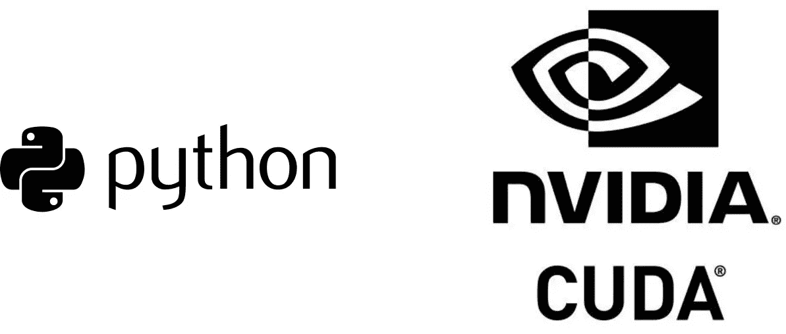

# PyCUDA 中的基本运算

> 原文：<https://blog.devgenius.io/elementary-operations-in-pycuda-5cb8d0b72161?source=collection_archive---------11----------------------->

PyCUDA 是一个 Python 编程环境，提供对 NVIDIA 的 CUDA 并行计算 API 的直接访问。它既可以在 python 计算流程中插入手工制作的 CUDA 内核，也可以通过跳过 CUDA 内核的编程细节并使用高级 python 编程风格来执行操作。

具体来说，PyCUDA 提供了一种非常简单的方法来执行数组/矩阵初始化，而无需使用 CUDA 内核、CPU/GPU 内存移动以及数学运算，并且它可以轻松地推导出感兴趣的数组/矩阵的信息，从而简化您的编程工作。

尽管如此，当你使用这些工具时，要考虑到简单是有代价的，所以不要忘记阅读文章末尾的免责声明。

让我们看看 PyCUDA 中基本操作的一些相关特性。更多信息可以从 PyCUDA 的 GPU 阵列中获得。这篇文章的目的是概述什么是一次性的，一些功能/技术细节将被跳过。

**CPU/GPU 内存移动**

使用`to_gpu()`方法可以将 numpy 数组从 CPU 转移到 GPU。与此相反，由于使用了`get()`方法，可以将一个数组从 GPU 移动到 CPU。在下面的示例中，在 CPU 上创建了一个 numpy 数组，将其复制到 GPU，然后在新的数组中移动回 CPU。

**阵列/矩阵初始化**

数组/矩阵初始化的语法类似于 numpy-work，在某些方面，它类似于 Matlab 的语法。

要在 GPU 上初始化一个数组，我们有以下几种可能:`pycuda.gpuarray.empty`和`pycuda.gpuarray.zeros`，它们分别创建一个空数组和一个填充零的数组，将它们的维度指定为`shape`，类型指定为`dtype`。

或者，我们也可以使用`pycuda.gpuarray.empty_like`、`pycuda.gpuarray.zeros_like`和`pycuda.gpuarray.ones_like`，通过从一个已经定义的对象继承属性，分别生成一个空数组、一个零填充数组和一个一填充数组。通过这三个函数，程序员仍然有可能通过`dtype`相对于数组已被建模的对象改变类型。

`pycuda.gpuarray.arange`函数也是可用的，它创建了一个数组，其中填充了以某个`step`间隔开的数字，从初始数字`start`开始，到最终数字`stop`结束。

最后，我们提到了用指定的数字填充整个数组的`fill`方法。

下面是提到的可能性的完整示例:

**基本的和复杂的数学运算**

尤其有用的是元素式操作。例如，我们可以从由`pycuda.gpuarray.zeros`设置的`0`数组中创建一个`1`数组，并对一个标量求和:

或者，我们可以从两个数组开始创建一个复数数组，一组用于幅度，一组用于相位:

在这种情况下，如果我们也想提取实部和虚部，我们可以使用`real`和`imag`方法，或者，如果我们想计算复共轭，我们可以使用`conj()`或`conjugate()`方法:

应该注意的是，`conj`的自变量代表将操作的输出分配给的数组。如果没有指定这样的参数，那么输出被分配给一个新分配的数组。相反，如果`conj`的自变量与执行运算的数组一致，则复共轭就地发生。

不过，我们可以使用`__pow__`方法计算实数或复数的幂:

或者使用`__abs__`方法计算绝对值:

PyCUDA 还公开了由`pycuda.cumath.sin`、`pycuda.cumath.cos`、`pycuda.cumath.tan`、`pycuda.cumath.sinh`、`pycuda.cumath.cosh`和`pycuda.cumath.tanh`实现的复杂数组上的三角和双曲三角元素运算，以及其他基本数学运算，如`pycuda.cumath.exp`、`pycuda.cumath.log`和`pycuda.cumath.sqrt`:

相反，其他操作是在实数组上定义的。它们包括`pycuda.cumath.asin`、`pycuda.cumath.acos`、`pycuda.cumath.atan`、`pycuda.cumath.log10`、`pycuda.cumath.fabs`、`pycuda.cumath.ceil`和`pycuda.cumath.floor`:

**条件运算**

元素条件操作表示非常有用的操作，可以一个元素一个元素地执行，`if...then...else`条件或元素最大值或最小值。具体来说，PyCUDA 公开了`pycuda.gpuarray.if_positive`，它根据特定的条件选择第一个数组或另一个数组的元素。下面是一个例子:

**阵列加扰**

由于`pycuda.gpuarray.take`，也可以根据一组或一个子集的索引对数组进行重新排序:

**铸造和形状处理**

对数组的类型和形状的操作可以通过用于类型转换的`astype`或通过改变数组形状的`reshape`、展平数组的`ravel`和删除长度尺寸的`1`来实现。

作为铅字铸造的例子报道如下:

此外，`reshape`可以如下使用:

而`ravel`为:

最后，这里有一个使用`squeeze`的例子:

**削减量**

PyCUDA 能够以非常简单的方式执行归约操作。实现的归约操作有 sum ( `pycuda.gpuarray.sum`)、max ( `pycuda.gpuarray.max`)、min ( `pycuda.gpuarray.min`)和 dot ( `pycuda.gpuarray.dot`)，后者为*非埃尔米特*。子集阵列的减少也是可以预见的。这里有一个例子:

**其他有用的浮点运算**

还有其他有用的浮点运算可用。它们包括返回两个数组除法的浮点余数的`pycuda.cumath.fmod`和返回数组的(fractional_part，integer_part)元组的`pycuda.cumath.modf`:

**阵列信息**

PyCUDA 还提供了返回 GPU 阵列即时信息的方法。这些是:

*   `shape`:相当于 Matlab 的大小；
*   `dtype`:返回存储元素的类型；
*   `size`:元素总数；
*   `mem_size`:包括可能填充的元素总数；
*   `nbytes`:数组占用的字节数；
*   `strides`:包含跨越每个维度的字节数的元组；对于二维矩阵，第一个数字是下一行要遍历的字节数，而第二个数字是下一列要遍历的字节数；
*   `ptr`:数组指针；
*   `flags.c_contiguous`:行主排序为真；
*   `flags.f_contiguous`:列专业排序为真；
*   `flags.forc`:适用于任何订单；
*   `__cuda_array_interface__`:返回包含数组信息的结构。

最后，甚至可以在 GPU 阵列上直接使用`print`来可视化子阵列的内容。

下面是一个例子:

**免责声明**

在 PyCUDA 中执行数组之间的操作非常简单，因为通常可以使用自然的数学语法。PyCUDA 将代表美国开发用于 GPU 执行的 CUDA 内核。然而，虽然这使编程变得简单，但并不总是高效的。必须记住，启动 CUDA 内核是昂贵的，良好的编程实践是尽可能将操作整合到单个内核中，以减少启动次数并利用操作的中间结果。

PyCUDA 是一个很好的工具，可以轻松获得 GPU 的速度。然而，只有手工操作才能实现最佳性能。

**GitHub**

示例代码可在 [GitHub](https://github.com/vitalitylearning2021/PyCUDA/tree/main/elementaryOperations) 上获得。