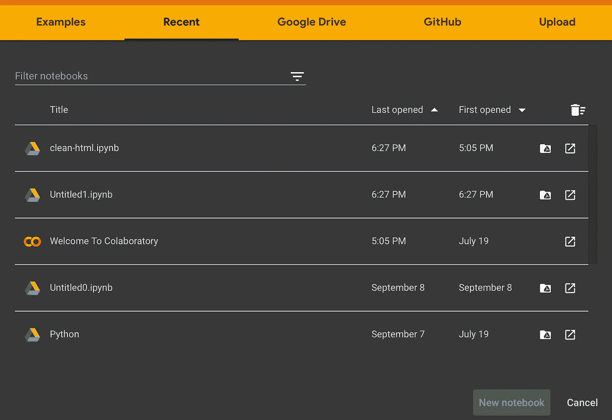
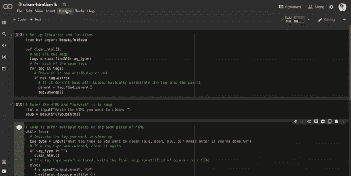

# 从 HTML 中消除无用的标签

> 原文：<https://blog.devgenius.io/eliminating-useless-tags-from-html-6bc4fae51563?source=collection_archive---------10----------------------->

> 快速、简单，无需设置。


照片由[格雷格·拉科齐](https://unsplash.com/@grakozy?utm_source=medium&utm_medium=referral)在 [Unsplash](https://unsplash.com?utm_source=medium&utm_medium=referral) 上拍摄

假设您有一些 HTML:

```
<html>
   <body>
      <p>
         This is my body 
         <span>
            text
         </span>
         .
      </p>
      <div>
         <p>
            Then here's another body
               <span style="width=300px;">
                  STYLED
               </span>
         </p>
      </div>
   </body>
</html>
```

你的第一个问题可能是:**但是为什么呢？老实说，我真的不知道，但这不会是第一次在互联网上发现疯狂的东西。**

不管这种疯狂背后的原因是什么，显然，这有一些令人沮丧的事情，最明显的是 1)超级无用的`span`包含一个本应属于`p`标签的单词，2)额外的`div`只包含一个`p`。

为了补救这一点，我提供了以下脚本。它可能不适用于所有情况，但它很容易调整，我希望我的评论提供了足够的背景，这样它就可以用于更多的情况，而不仅仅是这一种情况！

# 1.创建一个 Google Colab 笔记本

Google Colab 是一个令人惊叹的工具，它允许你使用 Google 的计算资源在浏览器中运行代码——最棒的是，它不需要在你的计算机上进行任何设置。

对于非开发人员来说，这非常有帮助，因为这意味着您不必在您的机器上设置开发环境(这可能是一件非常令人头疼的事情)。对于经验丰富的程序员来说，这是非常有用的，因为它节省了时间和麻烦！

访问[http://colab.research.google.com](http://colab.research.google.com)并创建新笔记本。



在 Google Colab 中创建新笔记本。

# 2.添加代码

大多数时候，我最终会浏览像这样的文章，寻找包含我需要的信息的代码集。所以，对于我这样的人，给你:)

我认为评论做到了这一点，但是一步一步来:

1.  导入 BeautifulSoup 包(帮助优雅地处理 HTML)
2.  建立函数`clean_html`来清理这个 HTML。稍后会有更多的介绍。
3.  允许用户将需要编辑的 HTML 粘贴到输入提示中，并将其转换为“汤”，例如从 HTML 解析的数据。
4.  建立一个循环，询问你想要反复清理哪些标签，直到你全部清理完毕。完成后，将最终的、干净的、修饰过的 HTML 写到一个文件中。
5.  返回到`clean_html`函数:这将查找 HTML 中您指定类型的所有标签。如果标签没有任何属性(例如样式)，那么它基本上被分解到父标签中。**小心这个**——它适用于我提供的例子，其中的`div`标签包含一个`p`标签，但是如果它包含多个标签，这可能会改变事情的外观。可以调整脚本来考虑这种情况和其他情况，但只是预先警告您需要仔细检查结果。

# 3.快跑！

就像我之前提到的，Google Colab 非常棒，因为它不需要任何设置。你需要做的就是运行它！



您可以看到，我成功地清理了本文顶部的 HTML 示例片段，输出保存在文本文件中。

*附注:为了便于组织，我将我的代码划分到笔记本的不同窗格中，但是您可以将它们都放在一个窗格中。*

# 让我知道这是否有帮助，或者你是否做了修改/增强！

# 如果你喜欢这篇文章，请考虑关注或查看其他文章！

[](https://madisongipson.medium.com) [## 麦迪逊·吉普森-中等

### 阅读麦迪逊·吉普森的作品。数据科学家& SWE | NASA |计算机科学学士& MBA 学生。每天…

madisongipson.medium.com](https://madisongipson.medium.com)