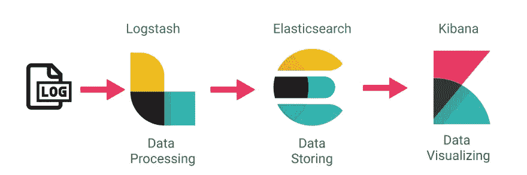
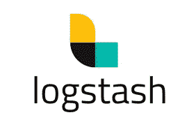

# 麋鹿栈教程:什么是 Kibana，Logstash & Elasticsearch？

> 原文：<https://blog.devgenius.io/elk-stack-tutorial-what-is-kibana-logstash-elasticsearch-6300968edf25?source=collection_archive---------17----------------------->

**ELK Stack** 是三个开源产品的集合——elastic search、Logstash 和 Kibana。ELK stack 提供集中式日志记录，以便识别服务器或应用程序的问题。它允许你在一个地方搜索所有的日志。它还通过连接特定时间段内的日志来帮助您发现多个服务器中的问题。

在本 ELK stack 教程中，您将学习

*   麋鹿栈是什么？
*   ELK 堆栈架构
*   什么是 Elasticsearch？
*   什么是 Logstash？
*   什么是节拍
*   什么是基巴纳？
*   个案研究
*   ELK 堆栈的优点和缺点

# ELK 堆栈架构

在 ELK stack 教程中，我们将了解 ELK 架构:

这是 ELK stack 的简单架构

# **弹性搜索**

弹性搜索

Elasticsearch 是一个高度可扩展的开源全文搜索和分析引擎。它允许您以接近实时的速度快速存储、搜索和分析大量数据。它通常用作支持具有复杂搜索功能和需求的应用程序的底层引擎/技术。

弹性搜索有 6 个基本概念:

*   **接近实时(NRT):** 接近实时的搜索平台意味着从你索引一个文档到它变得可搜索之间存在一点延迟(通常是一秒钟)。
*   **集群:**是一个或多个节点(服务器)的集合，它们共同保存您的全部数据，并提供跨所有节点的联合索引和搜索功能。
*   **节点:**是一台服务器，它是集群的一部分，存储您的数据，并参与集群的索引和搜索功能。
*   **索引:**是文档的集合
*   **文档:**是可以被索引的信息的基本单位。这个文档用 [JSON](http://json.org/) (JavaScript 对象符号)表示
*   **碎片&副本:**每个索引可以被分割成多个碎片。一个索引也可以被复制零次(意味着没有副本)或多次。复制后，每个索引都将有主碎片(从其复制的原始碎片)和副本碎片(主碎片的副本)。

# **日志存储**

Logstash

Logstash 是数据收集/处理管道工具。它收集数据输入并输入到 Elasticsearch 中。它从不同的来源收集所有类型的数据，并使其可供进一步使用。

Logstash 可以统一来自不同来源的数据，并将数据标准化到您想要的目的地。它允许你清理和民主化你所有的数据，用于用例的分析和可视化。

事件处理管道有三个阶段:

## 输入

您使用输入将数据放入 Logstash。一些更常用的输入是:

*   file:从文件系统上的文件中读取。
*   syslog:在众所周知的端口 514 上监听 syslog 消息，并根据 RFC3164 格式进行解析
*   jdbc:创建这个插件是为了通过一个 JDBC 接口将任何数据库中的数据接收到 Logstash 中。
*   beats:处理由 [Beats](https://www.elastic.co/downloads/beats) 发送的事件

## 过滤

过滤器是 Logstash 管道中的中间处理设备。您可以将过滤器与条件结合使用，以便在事件满足特定条件时对其执行操作。一些有用的过滤器包括:

*   grok:解析和构造任意文本。Grok 是目前 Logstash 中把非结构化日志数据解析成结构化和可查询数据的最佳方式。Logstash 内置了 120 种模式，您很可能会找到一种符合您需求的模式！
*   mutate:对事件字段执行常规转换。您可以重命名、移除、替换和修改事件中的字段。
*   丢弃:完全丢弃一个事件，例如*调试*事件。
*   克隆:制作事件的副本，可能添加或删除字段。
*   geoip:添加关于 ip 地址的地理位置的信息(也在 Kibana 中显示惊人的图表！)
*   …

## 输出

输出是 Logstash 管道的最后阶段。一个事件可以通过多个输出，但是一旦所有的输出处理完成，事件就完成了它的执行。一些常用的输出包括:

*   elasticsearch:向 Elasticsearch 发送事件数据。
*   文件:将事件数据写入磁盘上的文件。
*   graphite:将事件数据发送到 graphite，这是一个流行的开源工具，用于存储和绘制指标。【http://graphite.readthedocs.io/en/latest/ 

logstash 提供了很多优势:

*   集中数据处理
*   它分析各种各样的结构化/非结构化数据和事件
*   提供插件来连接各种类型的输入源和平台

# 搜索

搜索

Beats 非常适合收集数据。他们坐在你的服务器上收集数据，然后集中到 Elasticsearch。如果您需要更多的处理能力，Beats 还可以提供 Logstash 进行转换和解析。

有不同类型的节拍，最常用的包括:

*   Auditbeat:收集您的 Linux 审计框架数据，并监控您的文件的完整性。
*   Filebeat: tails 和 ships 日志文件。
*   心跳:ping 远程服务的可用性。
*   Metricbeat:从操作系统和服务中获取指标集。
*   Packetbeat:通过嗅探数据包来监控网络和应用程序。
*   Winlogbeat:获取和发送 Windows 事件日志。

# **基巴纳**

基巴纳

Kibana 是一个开源分析和可视化平台，旨在与 Elasticsearch 合作。您可以使用 Kibana 来搜索、查看和交互存储在 Elasticsearch 索引中的数据。您可以轻松地执行高级数据分析，并在各种图表、表格和地图中可视化您的数据。

Kibana 使理解大量数据变得容易。其简单的基于浏览器的界面使您能够快速创建和共享动态仪表板，实时显示对 Elasticsearch 查询的更改。

kibana 提供多种优势，如:

*   易于可视化
*   与 Elasticsearch 完全集成
*   可视化工具
*   提供实时分析、制图、汇总和调试功能
*   提供本能和用户友好的界面
*   允许共享搜索到的日志的快照
*   允许保存仪表板和管理多个仪表板

# 个案研究

## 出租 DVD（网站）

网飞严重依赖麋鹿栈。该公司使用 ELK stack 来监控和分析客户服务操作的安全日志。它允许他们索引、存储和搜索来自超过 15 个集群的文档，这些集群包含近 800 个节点。

## 商务化人际关系网

著名的社交媒体营销网站 LinkedIn 使用 ELK stack 来监控性能和安全性。IT 团队将 ELK 与 Kafka 集成在一起，以实时支持他们的负载。他们的 ELK 运营包括跨越六个不同数据中心的 100 多个集群。

## 绊网:

Tripwire 是一个全球安全信息事件管理系统。该公司使用 ELK 来支持信息包日志分析。

## 中等:

Medium 是一个著名的博客发布平台。他们使用 ELK stack 来调试生产问题。该公司还利用 ELK 来检测 DynamoDB 火锅。此外，使用这一堆栈，该公司每周可以支持 2500 万独立读者以及数千篇已发布的帖子。

# **麋鹿栈的优缺点**

# 优势

*   当来自企业的不同应用程序的日志汇聚到一个 ELK 实例时，ELK 工作得最好
*   它为单个实例提供了惊人的洞察力，还消除了登录数百个不同日志数据源的需要
*   快速现场安装
*   易于垂直和水平部署秤
*   Elastic 提供了包括 Ruby 在内的大量语言客户端。Python。PHP，Perl，。NET、Java 和 JavaScript 等等
*   不同编程和脚本语言的库的可用性

# 不足之处

*   当您转到复杂的设置时，堆栈中的不同组件可能会变得难以处理
*   没有什么比试错更好的了。因此，你做得越多，在这个过程中你学到的就越多

# 摘要

*   当试图识别服务器或应用程序的问题时，集中式日志记录会很有用
*   ELK 服务器堆栈有助于解决与集中式日志记录系统相关的问题
*   ELK stack 是三个开源工具 Elasticsearch、Logstash Kibana 的集合
*   Elasticsearch 是一个 NoSQL 数据库
*   Logstash 是数据收集管道工具
*   Kibana 是一个数据可视化工具，它完善了 ELK 堆栈
*   在基于云的环境基础设施中，性能和隔离非常重要
*   在 ELK 堆栈中，处理速度受到严格限制，而 [Splunk](https://www.guru99.com/splunk-tutorial.html) 提供了准确而快速的处理
*   网飞、LinkedIn、Tripware、Medium 都在使用 ELK stack 开展业务
*   当来自企业的各种应用程序的日志汇聚到一个 ELK 实例时，ELK 系统日志工作得最好
*   当您转到复杂的设置时，堆栈中的不同组件可能会变得难以处理

# 快速约会问题:

## logstash 和 beats 的区别在哪？

Beats 是轻量级的数据传送器，作为代理安装在服务器上，向 Elasticsearch 发送特定类型的运营数据。Beats 比 Logstash 占用更少的内存和系统资源。

Logstash 占用的空间更大，但是它提供了大量的输入、过滤和输出插件，用于收集、丰富和转换各种来源的数据。

## 为什么我不能只使用 logstash 来收集输入并发送到输出？

可以，但主要是因为最好的方法是将 filebeat 与您的容器一起提供，因为 logstash 对您的系统来说成本更高。

谢谢你一直读到最后。这篇文章是基于每个产品的官方文档。

*   https://www.elastic.co/
*   [https://medium . com/inside-freenow/centralized-logs-with-elastic-stack-and-Apache-Kafka-7db 576044 Fe 7](https://medium.com/inside-freenow/centralized-logs-with-elastic-stack-and-apache-kafka-7db576044fe7)
*   [https://www.guru99.com/elk-stack-tutorial.html#4](https://www.guru99.com/elk-stack-tutorial.html#4)
*   [https://logz.io/blog/deploying-kafka-with-elk/](https://logz.io/blog/deploying-kafka-with-elk/)