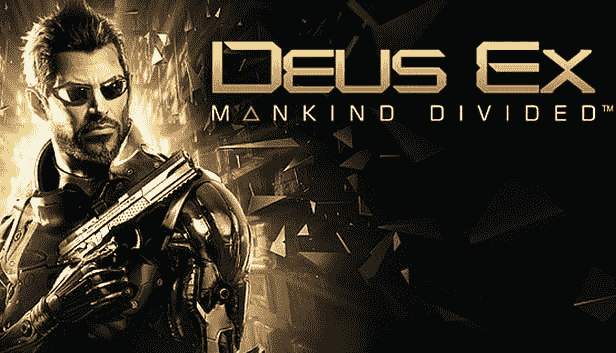

# 埃隆·马斯克的视频游戏推荐

> 原文：<https://blog.devgenius.io/elon-musks-video-game-recommendations-668f280a8c12?source=collection_archive---------0----------------------->

面试官:“电子游戏对你有什么作用？”

> 埃隆·马斯克:“它们非常吸引人，让我想学习如何给电脑编程。”

你有没有想过埃隆·马斯克玩什么电子游戏？以下是埃隆·马斯克喜爱的顶级视频游戏。

# 看守。

[http://www . bio game girl . com/2016/05/over watch-video-game-review . html](http://www.biogamergirl.com/2016/05/overwatch-video-game-review.html)

> “守望相助太神奇了。总的来说，[暴雪](https://www.blizzard.com/en-us/)是很棒的东西。”~埃隆·马斯克

# 家庭

谷歌 Play 商店

> “这是我的孩子玩得最多的是炉石好吧:还有，从暴雪”~埃隆马斯克

# 两人组

游戏封面

采访者已经不再问埃隆·马斯克他会推荐什么游戏来结束采访，这时埃隆·马斯克主动问采访者:

> “你玩电子游戏吗？你试过新的双人舞吗？”~埃隆·马斯克

他后来在采访中说:

> “在最新的《杀出重围》中，讲故事有点蹩脚。尽管之前的 Deus Ex 和原来的 Dues Ex，讲故事是惊人的。最初的双人舞是杀手。”

# 未知的

似乎埃隆·马斯克还没有玩过《神秘海域》,但当他问后排观众的意见时，他回答道:

> “是的，我听说过《神秘海域》的好消息”~埃隆·马斯克

# 我们最后一个人

这是面试中你必须看的一个漂亮点。在这里，你可以真切地看到埃隆·马斯克对游戏的由衷钦佩。

> “我认为这真的被忽视了。”~埃隆·马斯克

# 辐射 3 和辐射 4

> “那个游戏我玩过很多次，那个游戏的每个角落。”~埃隆·马斯克
> 
> “当我过生日的时候，我问我的父母，‘嘿，我可以要《辐射》中那个长相怪异的人的雕像吗？’你知道，就是 1950 年代那个有…(姿势)的人

埃隆·马斯克得到了一个 1950 年穿着跳马服的家伙的真人大小的雕像。

**跳马男孩**

# Skyrim

> “很明显，天际。我没有完成空中接力，太激烈了。这是一场大比赛。”~埃隆·马斯克

# **包装完毕**

埃隆·马斯克是一个真正的游戏玩家，他不仅仅是一个发明了多家公司、彻底改变了世界轨迹的人。这家伙玩游戏。

Elon 为我们留下了最后一个关键的洞察力，让我们了解随着时间的推移游戏失去了什么:

> 一些最古老的游戏，画面和声音都很糟糕。所以他们不得不依靠讲故事。~埃隆·马斯克

**点击此处观看完整采访:**

**伊隆·马斯克游戏(Elon Musk gaming)汇编，谈论他玩什么电子游戏。**

*和往常一样，如果你喜欢阅读这篇文章，请点击并按住那个按钮，订阅更多关于技术、设计、创业等精彩内容！~ Asim*