# 使用 Python 和 Streamlit 的电子邮件表单—使用最佳实践发送带附件的电子邮件

> 原文：<https://blog.devgenius.io/email-form-using-python-and-streamlit-sending-emails-with-attachment-using-best-practices-122a525753a?source=collection_archive---------0----------------------->

# 介绍

Streamlit 在数据科学家中非常受欢迎，它在开发人员中的势头也越来越大。如果你用 Streamlit 开发你的网站，你可以要求你的用户通过电子邮件联系你。因此，在本教程中，我将展示如何使用 Python 和 Streamlit 开发电子邮件表单。在这篇文章中，我展示了一个 *utils* 文件夹是如何对你的项目有用的，并且可以帮助分离开发关注点。我展示了 Python 编码的最佳实践，创建了一个助手函数和常量。还有，一个*的诞生。env* 文件，而不是对值进行硬编码。

> 我每周都会在这个频道发表技术文章，所以请关注我，订阅我的频道。请查看我列表中与 [Spark](https://medium.com/@clever.tech.memes/list/internalspark-62fda9e00b36?source=my_lists---------1-------62fda9e00b36---------------------) 和 [Scala](https://medium.com/@clever.tech.memes/list/internalscala-40c96bf7addd?source=my_lists---------11-------40c96bf7addd---------------------) ， [Streamlit](https://medium.com/@clever.tech.memes/list/internalstreamlit-8638d94cd666?source=my_lists---------8-------8638d94cd666---------------------) ， [React](https://medium.com/@clever.tech.memes/list/internalreact-79590e57fc46?source=my_lists---------9-------79590e57fc46---------------------) ， [Django](https://medium.com/@clever.tech.memes/list/internaldjango-8eb3f062efcd?source=my_lists---------12-------8eb3f062efcd---------------------) ， [AWS](https://medium.com/@clever.tech.memes/list/internalamazonwebservices-805665b5bf42?source=my_lists---------13-------805665b5bf42---------------------) ，[机器学习](https://medium.com/@clever.tech.memes/list/internalmachinelearning-ccbf43744e48?source=my_lists---------1-------ccbf43744e48---------------------)， [Startup](https://medium.com/@clever.tech.memes/list/internalstartup-e8a221bc47e1?source=my_lists---------14-------e8a221bc47e1---------------------) ， [Cheatsheets](https://medium.com/@clever.tech.memes/list/internalcheatsheets-7f7527bf9356?source=my_lists---------11-------7f7527bf9356---------------------) 和[其他开发主题](https://medium.com/@clever.tech.memes/list/miscellaneousdevelopmenttopics-d5ffe886b93e?source=my_lists---------1-------d5ffe886b93e---------------------)。
> 
> *请使用此链接加入 https://medium.com/@clever.tech.memes/membership*。谢谢你的大力支持。


米盖尔·Á的照片。帕德里纳:[https://www . pexels . com/photo/email-blocks-on-gray-surface-1591062/](https://www.pexels.com/photo/email-blocks-on-gray-surface-1591062/)

# 准备和设置

对于本教程，我将使用 *VSCODE* 作为 IDE 并安装 *Streamlit* ，您可以通过键入*“pip install Streamlit”*来完成。如果你想知道如何创建一个虚拟环境或安装 pip，你可以看看本教程的一部分。

现在，我创建一个名为 *main.py* 的 Python 脚本，如下所示:

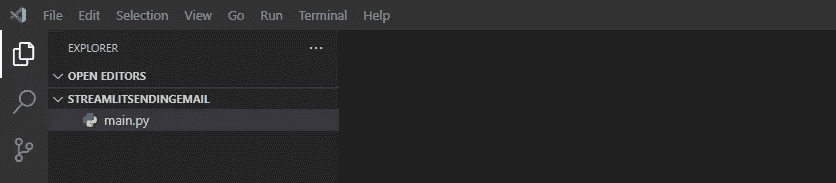

main.py 文件

并填写以下内容:

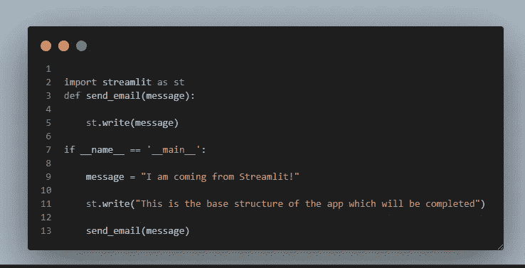

main.py 应用程序的初始结构

现在，让我们通过在控制台中键入*“streamlit run main . py”*来测试应用程序是否正常工作:

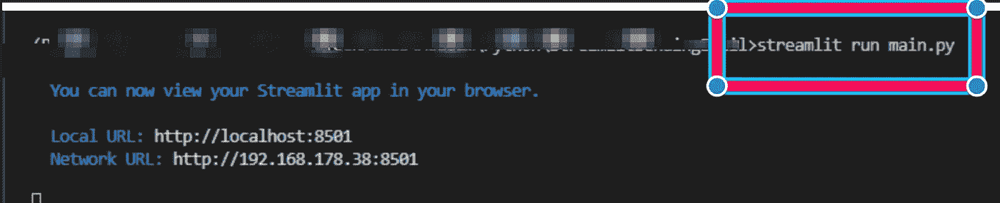

streamlit run main.py

现在，应该会弹出一个新窗口，您应该会看到以下内容:

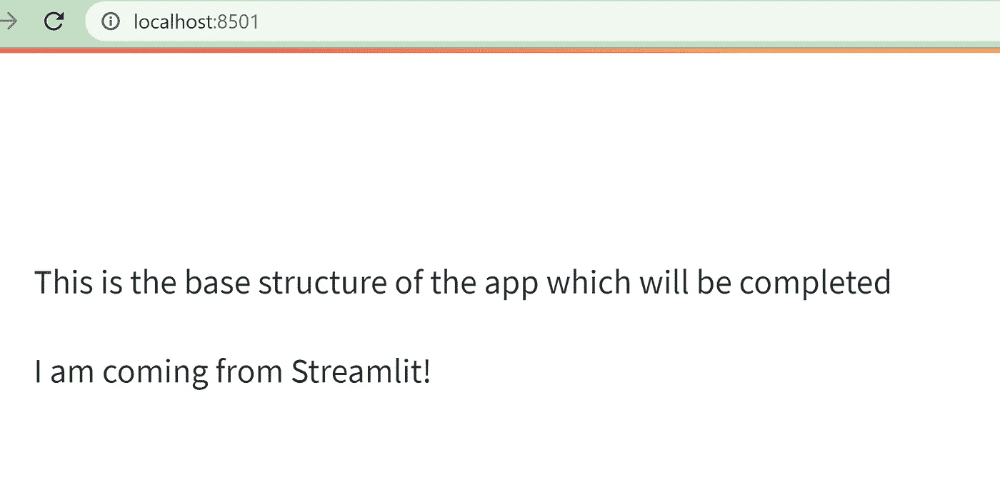

运行应用程序

## 创建电子邮件表单

现在，让我们创建一个表单，用户可以输入他/她的姓名、电子邮件地址、文本、上传附件。并且可以发送电子邮件。下面，你可以找到更新后的 *main.py* 文件:

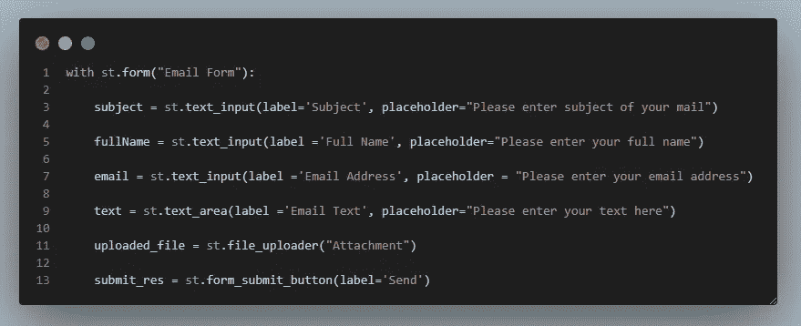

使用 st.form、st.text_input、st.text_area、st.file_uploader 和 st.form_submit_button 创建表单

上面的代码使用 *st.form* 创建表单， *st.text_input，st.text_area* 获取用户的输入，使用 *st.file_uploader* 上传文件，使用 *st.form_submit_button* 发送电子邮件。

创建的*表单*应该如下所示:

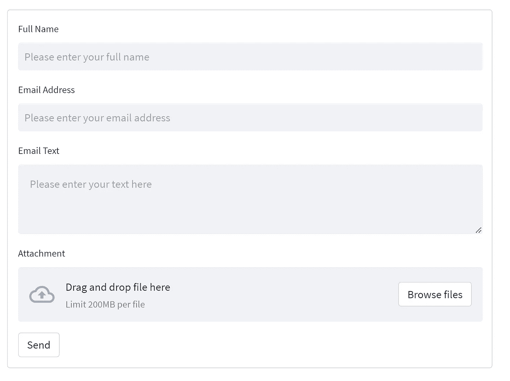

电子邮件表单

为了发送邮件，我们需要编写 *send_email* 函数，您可以在下面找到它:

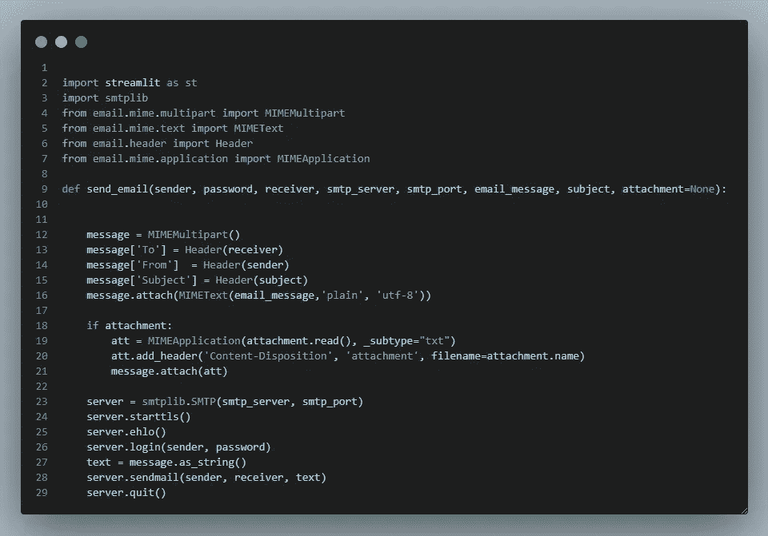

send_email 功能的更新版本

让我分解上面的代码并解释它的各个部分。首先，定义一个 *MIMEMultipart* 对象，并将电子邮件的*接收者、发送者和主题*添加到*消息*字典中。接下来，我们通过*附加函数*和 *MIMEText* 对象来附加邮件正文。

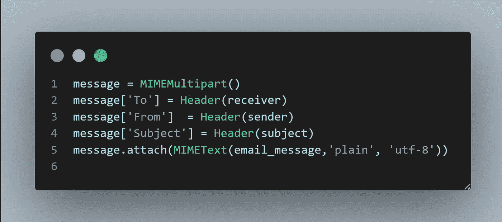

定义消息

然后，我们检查是否有附件，如果有，我们使用 *MIMEApplication* 对象和 *message.attach()* 函数将附件附加到消息中。您可以使用 *add_header* 功能为附件添加标题:

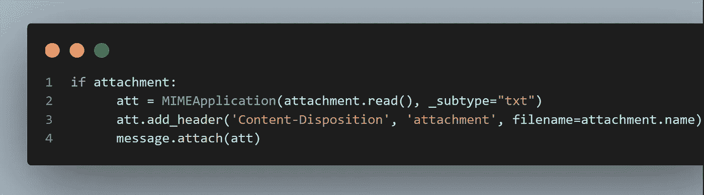

附件

现在，我们可以使用 *smtplib。SMTP* 对象，它通过使用以下代码片段来帮助发送安全的电子邮件:

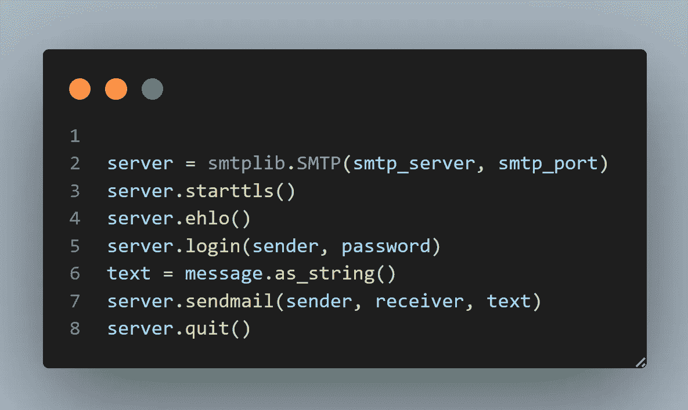

使用 smtp.gmail.com 和端口 587 发送电子邮件

现在，我们可以在我们的代码的 *__name__ == '__main__'* 部分调用 *send_email* 函数:

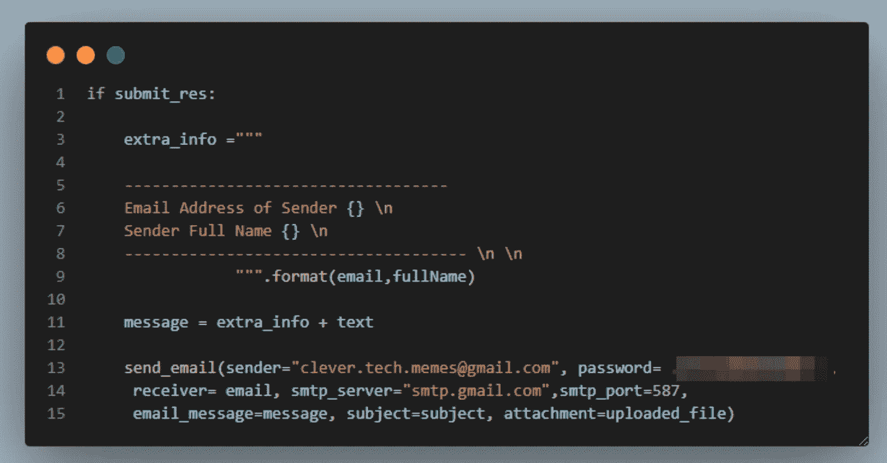

调用发送电子邮件函数

> 注意:不推荐对值进行硬编码，我们需要改进代码。

为了改进代码，让我们创建一个 *utils* 文件夹，我在里面创建了三个文件，名为 *helper.py，__init__。py 和 constants.py* 。我创建了 *__init__。为了使*实用程序*成为一个模块，我还定义了*常量。我还创建了一个保存环境变量的. env 文件和一个. *gitignore* 文件，以避免将秘密推送到 GitHub。因此，文件夹结构如下所示:**

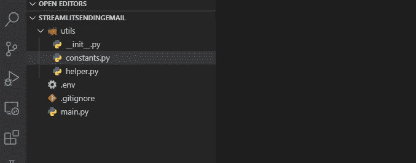

修改的文件夹结构

现在，让我们将以下内容复制到 *helper.py* 文件中，这些内容基本上是 *send_email* 函数的定义及其相应的导入:

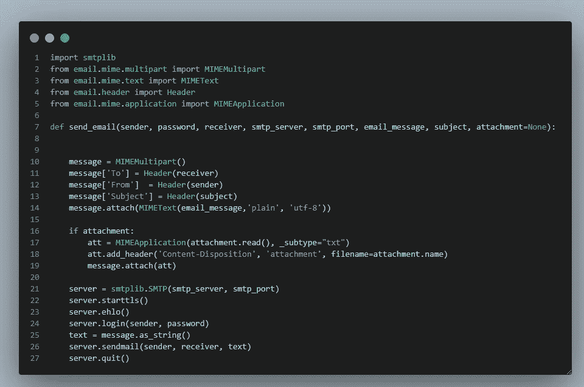

helper.py 的内容

并且让我们将 *constants.py* 的内容填充如下:

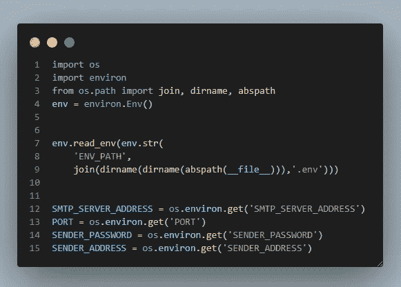

常量的内容. py

您需要确保您已经使用*“pip install python-environ”*安装了*“python-environ”*。在上面这段代码的帮助下，您应该能够使用 *env.read_env()读取环境变量。* *abs_path()* 指定了文件的绝对路径，即 *constants.py. dirname* 指定了父文件夹，这样我们就可以对*进行细化。env* 文件。看完*。env* 文件，我们应该可以使用 *os.environ.get()* 来读取环境变量。

*的内容。env* 文件如下所示:

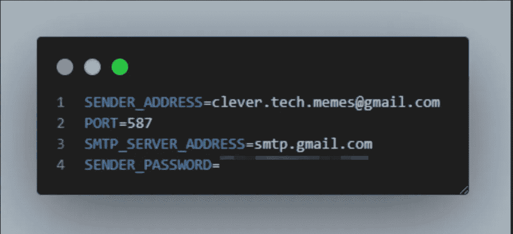

中定义秘密。环境文件

> 注意:请注意，您不应该在。env 文件，但你的编程密码可以通过这个链接创建[https://myaccount.google.com/apppasswords.](https://myaccount.google.com/apppasswords.)

现在，我们可以在 *main.py* 中导入需要的常量，并修改 *send_email* 函数的调用，如下所示:

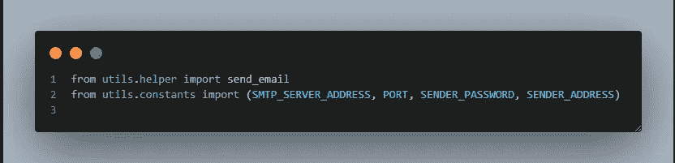

从 utils 导入 send_email 和必需的常量参数

现在，我们没有硬编码的参数，如下面的代码片段所示:

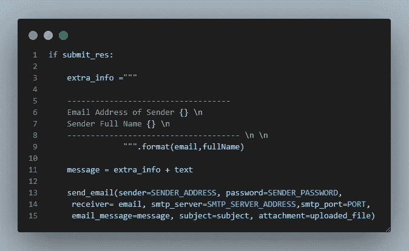

用常量变量调用 send_email

如果我们测试应用程序，我们应该能够收到如下的电子邮件:

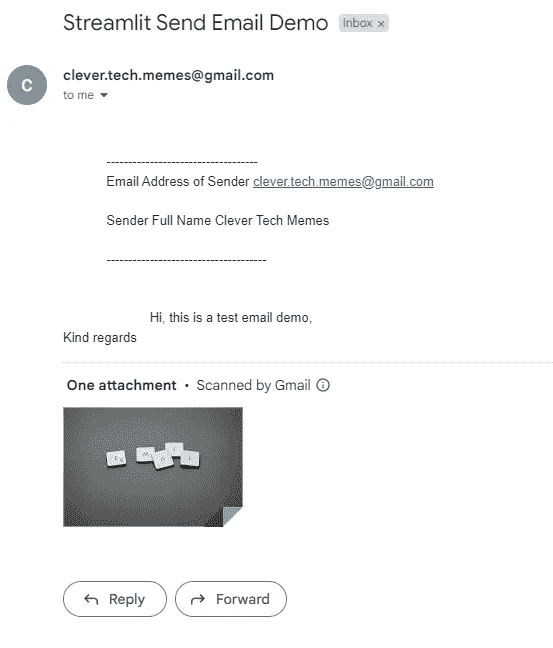

收到的电子邮件

这篇文章中最重要的代码片段是 send_email 函数，我将它粘贴在下面的代码块中，供您以后使用:

```
import smtplib
from email.mime.multipart import MIMEMultipart
from email.mime.text import MIMEText
from email.header import Header
from email.mime.application import MIMEApplication
def send_email(sender, password, receiver, smtp_server, 
smtp_port, email_message, subject, attachment=None):
  message = MIMEMultipart()
  message['To'] = Header(receiver)
  message['From']  = Header(sender)
  message['Subject'] = Header(subject)
  message.attach(MIMEText(email_message,'plain', 'utf-8'))
  if attachment:
  att = MIMEApplication(attachment.read(), _subtype="txt")
  att.add_header('Content-Disposition', 'attachment', filename=attachment.name)
  message.attach(att)
  server = smtplib.SMTP(smtp_server, smtp_port)
  server.starttls()
  server.ehlo()
  server.login(sender, password)
  text = message.as_string()
  server.sendmail(sender, receiver, text)
  server.quit()
```

> 注意:在复制上述代码块时，请注意缩进。

*main.py* 文件的最终内容如下:

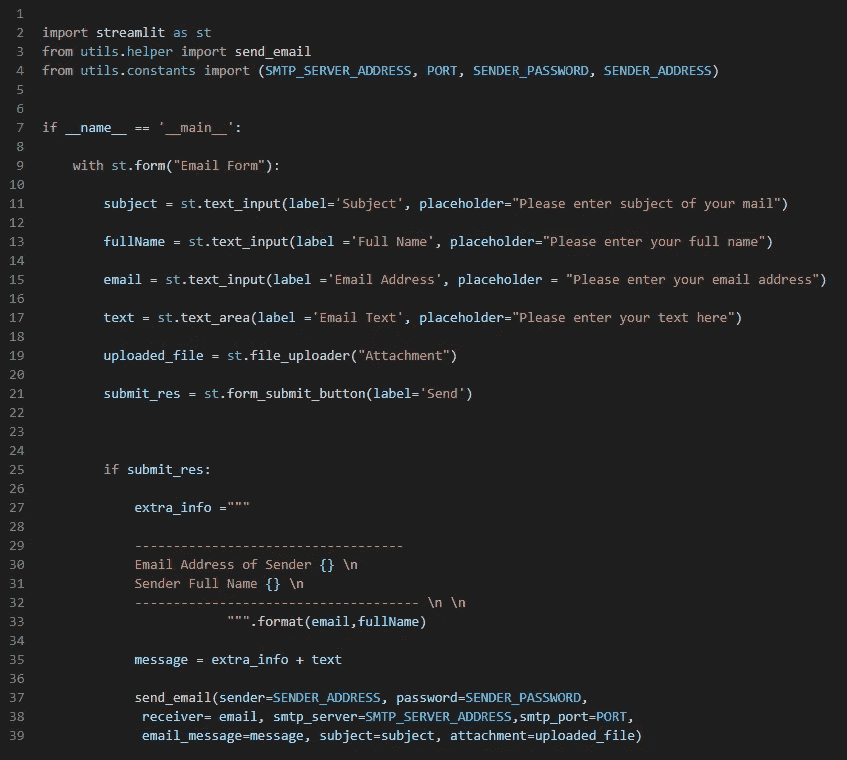

主文件的内容

# 摘要

在本教程中，我将展示如何在 Streamlit 中创建电子邮件表单，以及如何使用 Python 编程语言发送带有附件的电子邮件。创建电子邮件表单对您的网站或业务非常有用。在这篇文章中，我还展示了如何创建一个 *utils* 模块、定义常量和帮助函数以及如何使用*的最佳实践。env* 用于读取环境变量。

> 我每周都会在这个频道发表技术文章，所以请关注我，订阅我的频道。请查看我列表中与 [Spark](https://medium.com/@clever.tech.memes/list/internalspark-62fda9e00b36?source=my_lists---------1-------62fda9e00b36---------------------) 和 [Scala](https://medium.com/@clever.tech.memes/list/internalscala-40c96bf7addd?source=my_lists---------11-------40c96bf7addd---------------------) ， [Streamlit](https://medium.com/@clever.tech.memes/list/internalstreamlit-8638d94cd666?source=my_lists---------8-------8638d94cd666---------------------) ， [React](https://medium.com/@clever.tech.memes/list/internalreact-79590e57fc46?source=my_lists---------9-------79590e57fc46---------------------) ， [Django](https://medium.com/@clever.tech.memes/list/internaldjango-8eb3f062efcd?source=my_lists---------12-------8eb3f062efcd---------------------) ， [AWS](https://medium.com/@clever.tech.memes/list/internalamazonwebservices-805665b5bf42?source=my_lists---------13-------805665b5bf42---------------------) ，[机器学习](https://medium.com/@clever.tech.memes/list/internalmachinelearning-ccbf43744e48?source=my_lists---------1-------ccbf43744e48---------------------)， [Startup](https://medium.com/@clever.tech.memes/list/internalstartup-e8a221bc47e1?source=my_lists---------14-------e8a221bc47e1---------------------) ， [Cheatsheets](https://medium.com/@clever.tech.memes/list/internalcheatsheets-7f7527bf9356?source=my_lists---------11-------7f7527bf9356---------------------) 和[其他开发主题](https://medium.com/@clever.tech.memes/list/miscellaneousdevelopmenttopics-d5ffe886b93e?source=my_lists---------1-------d5ffe886b93e---------------------)。
> 
> *请使用此链接加入媒体*[https://medium.com/@clever.tech.memes/membership](https://medium.com/@clever.tech.memes/membership)。谢谢你的大力支持。
> 
> 声明:本文作者不保证渠道中所提供材料的可靠性和正确性。