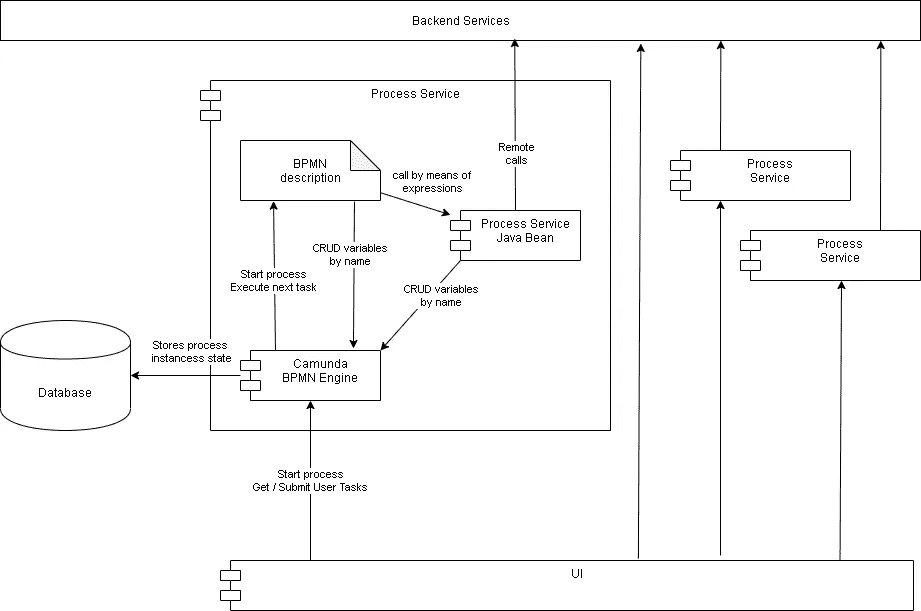
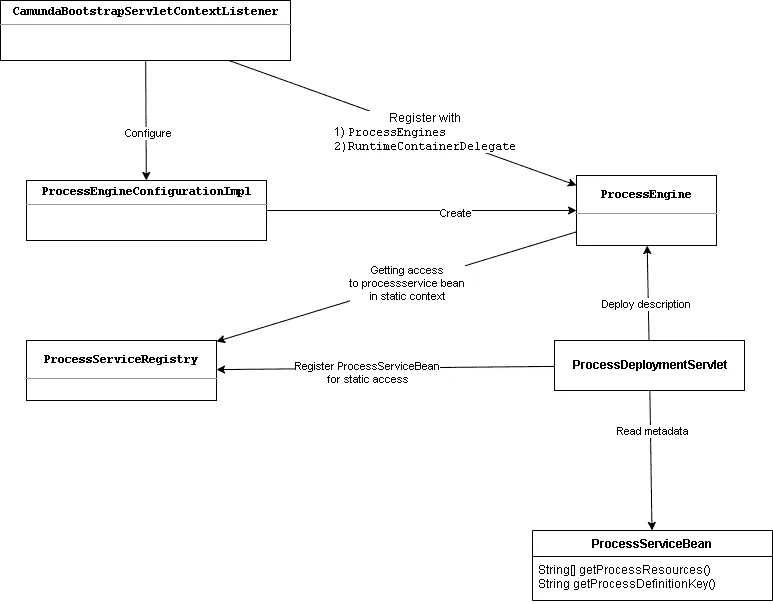
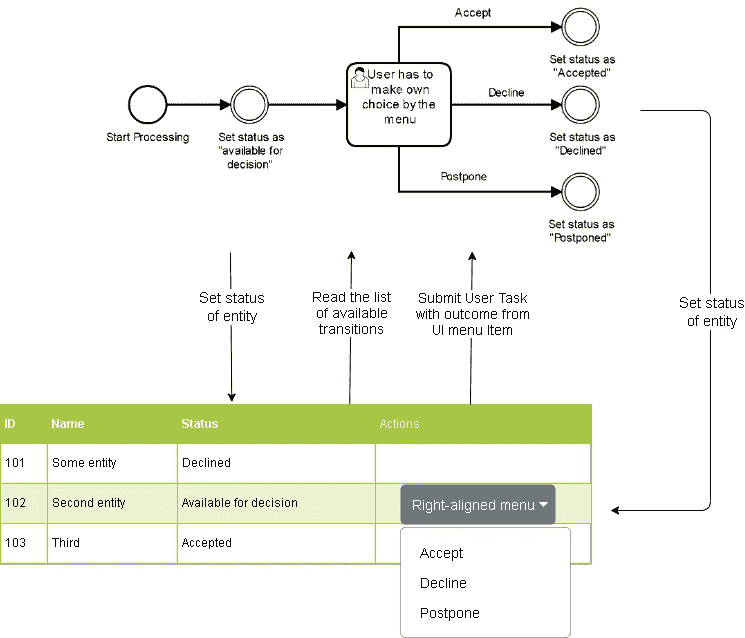
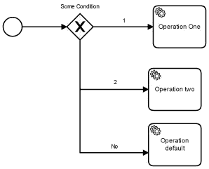

# 嵌入式 Camunda，如何正确烹饪，第一部分

> 原文：<https://blog.devgenius.io/embedded-camunda-how-to-cook-it-properly-part-i-e7e96fa99b3f?source=collection_archive---------3----------------------->

本文延续了上一篇文章“关于基于 BPM 的应用程序的一些随笔”。Oracle、Camunda 和其他……”并更详细地讨论了基于多个嵌入式 Camunda BPMN 引擎的一种可能的应用程序架构。

当然，我不会给自己设定一个任务，即使是一份简短的报告，来描述所有我认为必要的改进(否则，我的钱能用来做什么？)，而是提出一些可能的思考方向。

# 嵌入时？

对这个请求的回答主要取决于从 Camunda 到其他应用程序服务的请求的执行持续时间。Camunda 引擎工作基于作业执行器，对外部服务的查询总是在数据库中的活动事务的背景下执行，该事务更新任务状态。为了让这样的系统保持高效，这些查询必须尽可能快地执行。此外，执行程序池中的线程数量是有限的，因此慢速任务的执行可能偶尔会暂时阻塞快速任务的执行，这也是不可取的。

什么是“快速”问题是复杂的，对于每个特定的应用程序，答案只能在彻底的压力测试后给出。此外，测试应该在充分填充的数据库的基础上进行，并借助模拟所有可能类型的用户的真实同时操作的负载场景。

当然，这在很大程度上还取决于可用的硬件，但是基于一般的考虑，我认为内置的 Camunda 使用架构非常适合每天处理不到几十万个流程实例的应用程序。

接下来，我们可以开始将一些最繁重的外部服务调用转移到所谓的“外部任务”中。随着它的发展，当所有可执行代码被分离到专门的外部服务中负责外部任务的拉取和执行时，这个过程逻辑上演变成“BPMN 引擎即服务”架构。

# 战略

一个结构良好的开发环境不同于一组分散的独立实用程序，因为它背后有一个特定的想法。我认为在烹饪卡蒙达的过程中最主要的应该是什么:

*   首先:一个好的软件机箱应该简化 80%的工作，并且不阻止剩余的 20%由人工完成，并且全面使用高级的低级齿轮
*   一次定义，多次使用——实现某些功能所需的协调变化越多，出错的风险就越大
*   开发人员的错误是不可避免的，但是必须尽可能早地自动检测出来。
*   重复类似的开发人员错误是一个真实的迹象，表明上面提到的 80%的东西终究不是自动化的。你不应该鼓吹最佳实践，甚至惩罚开发人员，只是提供系统功能，使错误不太可能发生
*   如果某个技术设计很优雅，并且具有出色的性能，但是导致业务开发人员出错的风险增加，那么它很可能是一个糟糕的解决方案。在今天的环境中，开发人员的可伸缩性和“上市时间”通常是最重要的(但不比执行的可伸缩性更重要)。

这意味着:

*   应该在 IDE 中实现尽可能多的功能，而不是 BPMN，因为任何 java IDE 都提供了更多的工具来进行错误检测和代码分析，或者从 BPMN 描述中自动生成
*   不要重复不同的描述，或者在系统初始化期间尽早自动检查它们之间的一致性

# 一般建筑

基于嵌入式 Camunda 的分布式应用程序的一般架构至少包含以下主要部分:

*   用于启动流程和执行用户任务的用户界面。是的，Camunda 也提供了构建某种 UI 的功能，但是它的可用性通常与应用程序的需求相差甚远。此外，应用程序通常会对不同用户和用户组的任务可用性提出更高的要求。标准设备很难实现这种不同的访问方式。
*   使用 Camunda 作为嵌入式库的几种与流程相关的服务。它们的主要内容由 BPMN 描述组成，可由环境 beanss(通常基于 Spring 或 CDI)管理，环境 bean 的方法由 Camunda 引擎通过文本表达式调用。这些 beans 充当 BPMN 描述的某种“内部后端”。流程实例将其状态作为命名变量值存储在数据库中，也可以从 beans 端获得。
*   其他应用程序服务称为 UI 和流程相关服务

还必须考虑这种架构的下一个重要技术限制:

*   每个嵌入式 Camunda 引擎的作业执行器必须配置为“部署感知”,以允许仅执行后端 java 代码可用的 BPMN 活动
*   如果流程的启动或用户任务的提交导致后端 java 代码的同步执行，那么只能在相应的流程服务上调用这样的操作。第一种情况是可选的，但第二种情况可能会经常遇到，因为如果处理用户提交的有效载荷是不可能的，就有必要向他提供第二次机会。这就是为什么提交用户任务通常与 java 代码的同步调用一起实现。
*   部署在一个流程服务中的流程可以与部署在另一个流程服务中的流程进行交互(例如，通过传递消息或调用 BPMN 活动)，前提是不会导致后端 java 代码的同步执行。为此， **StartEvent** 上有一个属性 **asyncBefore** ，它允许以异步模式运行流程:流程启动事件将保存在数据库中，执行(包括所有侦听器)将被延迟并在服务内部执行。

与同步调用 java 代码无关的操作(获取可用用户的任务列表，获取一个具有未归档有效载荷的任务，执行 claim / unclaim 操作，提供 Camunda Cockpit UI / REST API)可以在任何 Camunda 引擎上执行。但是通常，引擎的特殊实例被部署用于执行这样的集中操作。

# 拔靴带

Camunda 可以很容易地从 Spring 容器中启动。JEE 环境中的此功能仅提供给商业版。但是要完全控制引擎，这是我们未来需要的，在任何环境下都要自己做:

*   **ContextListener** 的实现创建了**ProcessEngineConfigurationImpl**的后继，它提供了 **ProcessEngine** 的实例。该实例必须在全局集合**process engines . process engines**中注册，并使用从 web 应用程序的上下文路径中派生的唯一名称
*   **HttpServlet** 的实现注入流程服务后端 beans 的所有实例。对于每一个，它请求资源并将其部署在**流程引擎**中。此外，它在全局可用的静态集合中注册每个 bean，以提供 Camunda 的非 bean 类的访问。

在引导过程中，建议执行以下常见自定义:

*   **用于访问数据库的数据源**或**数据源名称**
*   交易经理。流程后端 beans 既可以“内部”调用(即由流程引擎调度程序调用)，也可以在启动流程、完成用户任务、从外部系统接收消息等时“外部”调用。在这两种情况下提供相同的事务行为是很重要的，这意味着通过正确设置事务管理器。还有，当我们使用 JPA，有多个数据源或者数据源+ JMS，以事务模式调用外部服务的时候，需要一个专门的事务管理器。
*   如果此引擎不用于执行流程，而仅用于提供驾驶舱 UI / REST API，则为作业执行器或空。作业执行器必须扩展**作业执行器**类，可以优化一些参数，使用环境**线程池**或 **ManagedExecutorService** 提供的
*   失败作业处理的命令工厂，我们将在后面讨论
*   IDs 的生成器，供应商强烈建议使用 **StrongUuidGenerator** 来代替标准
*   引擎事件的监听器，深度定制相当重要的地方。例如，我们可以发布事件(启动/停止流程、创建/完成用户任务、启动/结束服务任务、定义/激活计时器等等)或调用流程后端 beans 的回调方法。
*   **表达式管理器**用于评估表达式，连接 BPMN 描述和 java 代码。当然，对于 Spring 和 CDI 环境，我们需要不同的管理器。我们还可以引入自己的表达式格式或扩展现有格式，这对于深度定制非常有用。
*   **JobExecutorDeploymentAware**属性，在我们的例子中它必须为 true

当然，这比默认的启动过程稍微困难一些，但是可以在任何环境中执行(不仅仅是 Spring / CDI ),并且为我们提供了对 Camunda 引擎的完全控制，这在将来会对我们有很大帮助。

# 命名、表达式和引用

任何框架的主要目标之一都是最小化开发人员出错的可能性，并使搜索不同代码部分之间的各种依赖关系变得更容易。

BPMN 描述是指使用符号表达式的 Java 代码，如**$ { bean name . bean method name(execution)}**。不幸的是，像 Intellij IDEA 这样的常见 ide 不支持导航和使用导航。因此，引入一组简单的实践来促进这一过程是有意义的:

*   “重命名技术 id”插件必须安装在“Camunda Modeler”中。它自动重命名类似于**“some process”**的进程，以及类似于**“user task _ submit somedata”**或**“service task _ MakeSomeExternalCall”**的活动。
*   支持 BPMN 描述的后端 java bean 应该被命名为 **SomeProcess** 。它还必须包含方法**user task _ Submit somedata _ Create**和**user task _ Submit somedata _ Submit**，分别用于为用户准备数据和接受用户的回答

因此，使用这种策略，我们可以很容易地找到 BPMN 活动和 java 代码 beans 方法之间的对应关系。但是我们仍然需要手写连接两个规范的表达式。

至于已经提到的 80%,我们可以在 BPMN 描述部署期间通过半自动绑定使我们的生活变得更容易:

*   Camunda **ProcessEngine** 提供 **RepositoryService** ，后者提供 **DeploymentBuilder** 用于手动执行部署操作。
*   标准方式是 usage**deployment builder . addclasspathresource()**方法，但是在这种情况下，我们不能使用它，因为没有定义表达式的 BPMN 描述是无效的，并且会抛出异常
*   但是我们可以通过**bpmn . readmodelfromstream()**将原始描述读取到 **BpmnModelInstance** 对象中，按照我们的意愿处理它，并且只有在 **DeploymentBuilder** 加载之后
*   在这种情况下，处理逻辑非常简单:如果开发人员已经明确指定了一个表达式，我们就让它保持“原样”。否则，我们“默认”实现它

当然，如果我们检查 Java Beans 方法和属性的可用性，我们可以大大加快错误检测的速度，这些方法和属性由 BPMN 作者的表达式描述手动引用，就在资源解析阶段。

# UI 集成

例如，可以应用类似的方法来自动生成动作列表，作为某个实体上的 UI 菜单对用户可用。可以根据实体(流程实例、处理实体)用户任务的当前定义的传出转换来提供它。

对于所有后续活动，用于 UI 构建的引用表达式(指向“中间无事件”和“用户任务”活动的侦听器的指针)和菜单项名称可以从包含在 BPMN 模式中的描述自动生成:

因此，BPMN 和 UI 之间的集成可以按如下方式组织:

*   每个流程实例包含两个标准变量:“业务实体 ID”，每个流程都与某个业务实体类相关联。
*   id 为**IntermediateThrowEvent _ SetYyyAsXxx**的所有活动都指向同一个基础设施 java bean，它将实体的属性“yyy”设置为“Xxx”值
*   每当 UI 请求一个可用动作的列表并且流程处于 ID 为**user task _ MenuBasedChoice**的阶段时，传出的转换名称集将作为菜单项返回
*   对于每个转换，我们不仅可以定义名称和将在转换中执行的代码的引用，还可以定义一些额外的元数据。例如，UI 表单的标识符，其输出将用作用户任务有效负载，并在执行转换期间使用
*   因此，一旦用户选择了菜单项，他必须填写适当的表单，这最终将导致流程实例改变业务实体的内容和状态。

这种方法的主要概念是，描述的几乎所有元素都可以定义一次(菜单项名称)，或者它们与其他描述的一致性可以在系统初始化阶段自动检查(具有某种标识符的实体或 UI 表单的“setYyy”方法的可用性)。

此外，这种方法可以被认为是基于流程和基于生命周期的业务视图之间的某种“桥梁”的一个示例。

# 流程实例数据

基本原则:存储尽可能少的数据。通常，只有存储在外部服务中的数据的实体标识符，流程才能与之通信。在这种情况下，数据几乎总是最新的，不存在无意识的风险。如果您需要迁移数据，您不必处理 BPMN 引擎低级数据存储结构

但是有时我们不得不存储比我们需要的更多的数据:

*   外部服务太慢，我们使用流程实例存储作为缓存。在这种情况下，标准缓存对我们没有太大帮助，因为流程实例通常存在很长时间，并且对它的操作很少——缓存中的数据已经被丢弃了
*   外部存储器中的数据在快速变化，我们需要准确地存储该过程开始时的数据状态。但是最好通过将数据版本化引入外部系统来解决这个问题
*   来自外部系统的消息以及来自用户任务的有效负载，因为它们没有存储在其他任何地方。在迁移/重放流程实例的情况下，这些数据可能是必需的。

流程实例可以以两种形式存储数据——业务键和变量。

## 商业密钥

它充当流程实例的名称，对于以下情况是必要的:

*   管理—在 Camunda 驾驶舱中快速搜索流程实例)
*   为了确保流程实例在特定业务实体环境中的唯一性
*   用于以幂等的方式开始该过程(当然，在这种情况下，业务密钥必须是预先已知的，而不是在执行过程中形成的。)

按照 Camunda 用户手册，可以用最简单的方式在数据库中创建一个索引(表 **ACT_RU_EXECUTION** 和 **ACT_HI_PROCINST** )。

业务键是可选的，但是可以在启动流程实例时指定，或者在执行过程中通过调用**execution . setprocessbusinesskey()**方法来指定。

最重要的一点:对于相同类型的所有过程，它必须是唯一的，并且这种唯一性必须从系统维护的最开始就设置。

例如，业务关键字可以采用 **<流程缩写> — <业务实体的 UID>—<处理>** 的额外参数的形式。这允许您不在索引中使用 **PROC_DEF_ID_** 列，并且只对某些进程启用此限制。

## 变量

在 Java 代码中，变量名必须和静态 final 常量一样少。它不能包含“_”，因为它会导致与 REST API 查询格式冲突。在 BPMN 描述中，我们也可以通过用特殊的 **ExpressionManager** 实现来解引用这个常量名，而不是变量名。因此，通过全文搜索，我们可以从 IDE 中快速找到使用该变量的所有地方。

在存储变量时，最好不要使用 java 序列化，因为您总是需要通过 Cockpit UI 或 REST API 来修复数据。相应地，我们将所有复杂数据以字符串形式存储为 JSON / XML 文档，以长/双精度形式存储数字，其他数据以格式化字符串形式存储。应该记住，例如在 Oracle 中，一个字符串的长度不能分别超过 2000 个字符，要存储更长的字符串我们必须应用类型化值 API。

更高级的方法是将变量的描述存储为静态常量，不仅包含变量的字符串名称，还包含某个接口的实例**process variable<T>**，它提供:

*   存储通用属性:名称、范围，需要非空值
*   获取/设置适用于常见存储类型的方法: **VariableScope，Map < String，Object >，runtime service/task service/history service+execution id**
*   **< T >** 转换并存储表示的逻辑。例如，一些类型可以存储为几个 BPMN 级别的变量
*   一些额外的交叉功能，例如日志或试听

变量问题的主要来源是它们在正确的时间不存在。在大多数情况下，它是开始一个新的进程或获得一个已完成的进程的结果。要降低出现此类问题的概率，您可以使用以下方法:

*   流程服务后端 bean 提供了变量列表，这些变量必须在流程开始之前和执行结束时显示
*   流程引擎自举过程通过**processengineconfigurationimpl . setcustompostbpmnpraselistents()**设置**abstractbpmnparsetlistener**的继承者，该继承者通过实现 **parseProcess()** 方法为所有流程安装启动/停止监听器
*   启动/停止侦听器可以完全访问流程实例上下文中的所有变量，并且可以访问流程服务后端 bean，该 bean 由引导过程在全局静态存储集合中注册。

例如，同样的方法可以应用于验证变量的存在，这些变量必须由消费的消息来传递。如果变量的值不是简单的，而是由对象表示的，我们还可以通过 Java Beans 验证 API 来验证数据的存在性和包含性。

另一个常见的错误来源是基于变量值的条件连续的实现。

为此，我们必须在每个流出的流上定义类似于 **${someCondition==1}** 的条件表达式，这相当烦人。相反，我们只能将鉴别器值定义为一个表达式，并在定义加载期间将其重写为完整的表达式，假设变量名与相应的独占网关的名称相匹配。

变量也可以用来确保流程以幂等的方式运行。这必须做得稍微难看一点，因为 **ACT_RU_VARIABLE** 表不包含对过程定义的引用，并且主数据库通常不支持同时在几个表之上的索引。但是，例如，您可以:

*   用**变量名、变量值**和**过程定义关键字**字段和相应的唯一索引创建另一个“控制”表。
*   在 **ACT_RU_VARIABLE** 表上定义“每行更新或插入后”触发器，该触发器将在每次更新期间向控制表传输新数据
*   违反“控制表”的唯一性会导致初始操作失败

当然，如果我们已经在 Camunda 之外启动了事务，我们可以简单地在第三个表中插入一个惟一的记录，这样，如果违反了完整性约束，事务就可以回滚。但是在这种情况下，你必须非常小心，确保 Camunda 引擎内部和外部的代码在同一个事务中执行。在触发的情况下，这很容易保证。

# 故障和事故

是啊，倒霉事时有发生，但那只是麻烦的一半。糟糕的是，有时事情会突然发生，这就是诀窍。在分布式系统中，倒楣的事情经常发生，这是一种正常的情况，我们必须为此做好准备。

默认情况下，Camunda 引擎会尝试执行每个任务三次，然后记录事件。我们可以用活动的**“重试时间周期”**属性为每个具体任务重新定义这个行为。在大多数情况下，这是一种正常的方法，有时我们需要更多的灵活性:

*   远程服务可能长时间不可用，我们希望重试暂停次数呈指数增长的尝试。在这种情况下，我们通常会在堆栈的某个地方出现类似的异常: **SocketTimeoutException** ，**ClientTransportException**。
*   此外，远程服务也是可用的，但ше可能没有足够的时间来完成请求。在这种情况下，我们得到类似于 **TimedOutException** 的返回，并需要进行下一次尝试。
*   有时候我们根本不需要重试。例如，当抛出 NullPointerException 时
*   由于处理的异步性质，一些数据可能没有及时准备好，我们需要等待它们。当然，这种行为可以通过 BPMN 逻辑来实现，但是在业务图中加入只有技术价值的片段并不明智。

默认失败作业重试策略的定制可以通过**processengineconfigurationimpl . setfailedjobcommandfactory()**方法来执行，该方法安装工厂，为分析下的每个异常返回 **DefaultJobRetryCmd** 的后继。在方法**getfailedbjobretryconfiguration(job entity，ActivityImpl)** 中，我们可以调用父代码，如果之前没有配置重试策略，则返回一个**failedbjobretryconfiguration**类的实例，该类定义了尝试次数和尝试之间的暂停次数。为了确定尝试次数和尝试之间的暂停次数，我们使用了一个可抛出的实例

在实例化期间传递到 **DefaultJobRetryCmd** 中。

等待某个条件是一种特殊情况，因为我们需要不同的等待时间，这取决于条件的业务性质，并且最有可能的是，我们希望专门处理某个条件没有被满足的情况。

*   第一个特性可以通过引入特殊异常来实现，该异常将 **DefaultJobRetryCmd** 初始/最大暂停作为 owns 参数
*   第二个，可以通过查询当前作业( **by managementService()来实现。createJobQuery()。executionId()。activityId()** )并分析它的“重试次数”属性。“最后”时间将是“1”。

我还强烈建议在每次抛出异常时，将以下一般信息作为局部变量写入流程实例上下文中:

*   当前
*   异常类型和消息
*   上次尝试次数和下次尝试时间
*   节点名
*   活动名称(不是同一活动，事件将被记录在该活动中)
*   应用的重试策略

要编写这样的“异常”变量，可以使用 **runtimeService()。setVariableLocal()** 方法。他们将通过定期重复过程对管理员可见，如果事故发生后将被登记。

# 并发

在分布式系统中，一些事情总是在错误的时间发生:太快、太晚或太同时…

## 过程的有条件开始

有时，在业务实体的上下文中，流程的唯一性不能通过索引来保证。例如，只有当某个实体属性设置为“真”(已启动的流程将其更改为“假”)时，才能启动流程。很明显，由于条件竞争，“读取-比较-开始”逻辑在这种情况下不起作用。

但是我们可以通过在启动流程的同一个事务中执行“select for update”SQL 查询来同步与某个实体相关的流程的启动。这可以通过下一种方法来实现:

*   通过**Void execute(Command context)**方法定义**命令< Void >** 的后继命令用于执行查询。该方法的参数提供对 **DbSqlSession** 对象的访问，该对象可以是数据库连接的源。与执行同步相关的实体的标识符被传递给命令构造函数。
*   这个命令可以由 **RuntimeService()执行。getCommandExecutor()** 服务。

理论上，我们可以通过使用 **ACT_RE_PROCDEF** 表和进程定义键来同步启动某种类型的所有进程。它当然会扼杀性能，但在某些情况下，它可以是一个解决方案。

## 等待流程就绪

最简单的例子:我们希望将消息提交给流程，但是实例还没有准备好(我们基本上不知道它什么时候准备好)。用法 **Thread.sleep()** +条件循环是一个很好的方法，可以给自己创造很多有趣的有前途的问题。

首先，我们必须验证流程是否尚未准备好，否则我们处理第二次尝试，流程将永远无法再次接收到此消息。为了简化这种检查，我们可以将每个提交的消息记录到流程实例上下文中的一个特殊变量中，并在尝试将消息提交给流程之前检查这种存储。是的，它是“读取-比较-开始”操作，但是我们也知道如何处理它，并且流程实例上的同步不是一个大的性能问题。

其次，如果我们发现，那个项目还没有准备好接收消息，我们需要等待这一时刻的手段。如果我们能把这个责任放在流程的客户身上，那我们就是幸运的了。然而，在这种情况下，不可避免地会有两次收到消息的风险，但我们已经知道如何处理这个问题。

情况很简单，如果我们通过 JMS 接收消息——只需抛出一个异常并再次接收消息。唯一的问题是，在这种情况下，我们无法控制尝试之间的暂停，并且如果进程从未达到所需的状态，就有收到“中毒消息”的风险。

一种更灵活的方法是当流程服务被访问时，例如，通过 HTTP，由客户端实现重试策略。这种方法的缺点是这种等待可能会长时间阻塞客户端的执行线程。一般来说，最好有一种方法来等待并隐式地将消息传递给流程，而不会对传输和客户端产生明显的副作用。

为此，我们可以引入一个简单的纯技术子流程，它由一个“服务任务”组成，可以在启动时通过以下参数进行配置:

*   尝试次数和尝试之间的暂停次数。这些值将被设置为服务任务的一个**“重试时间周期”**属性
*   对代码的引用，必须使用参数多次执行。在我们的例子中，它可以是 java bean 及其方法的名称，它可以接受必要的参数:流程实例的标识、消息名称、消息有效负载或变量集。服务任务将使用该值来尝试执行所需的作业。

顺便说一下，通过这样一个过程的实现，我们得到了一种廉价的方式来使用 Camunda 调度程序来规划我们自己的任何任务。按照这种方式，我们可能不再需要集成类似石英的工具。必须考虑的一个重要限制是:这样的任务必须尽可能快地执行，以免阻塞其他进程的执行。也就是说，如果我们需要安排一些长期活动，我们可以使用这种方法，只在异步模式下启动它，而不等待完成。

如果我们处理“回复”消息(不幸的是，并非所有消息都是类似回复的)，我们还可以通过以下操作显著降低流程未准备好接受它的风险:

*   启动流程外部的活动，并立即开始等待接收关于其完成的返回消息。如果我们试图在这中间做些别的事情，就有可能“没有时间”去准备接受回应。
*   我们可以继续在子流程内部做一些事情，接收消息的边界事件附加到子流程中。
*   立即继续用 AND gateway，在一个分支执行进一步的工作，在另一个分支我们开始等待消息

然而，由于 Camunda 调度程序是不可预测的，外部活动可以很快完成，我们甚至可能没有时间继续等待消息。

根据我的观察，不同流程实例中活动的异步性和不可预测的执行时间是业务开发人员最难理解的。它们也是最难和最晚发现的错误的来源。

# 未完待续…

在接下来的文章中:事务和测试...