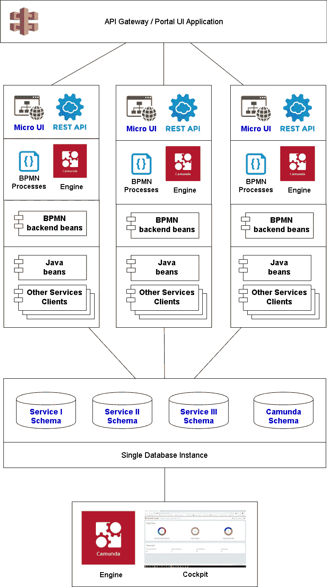
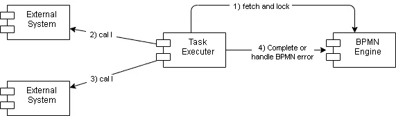
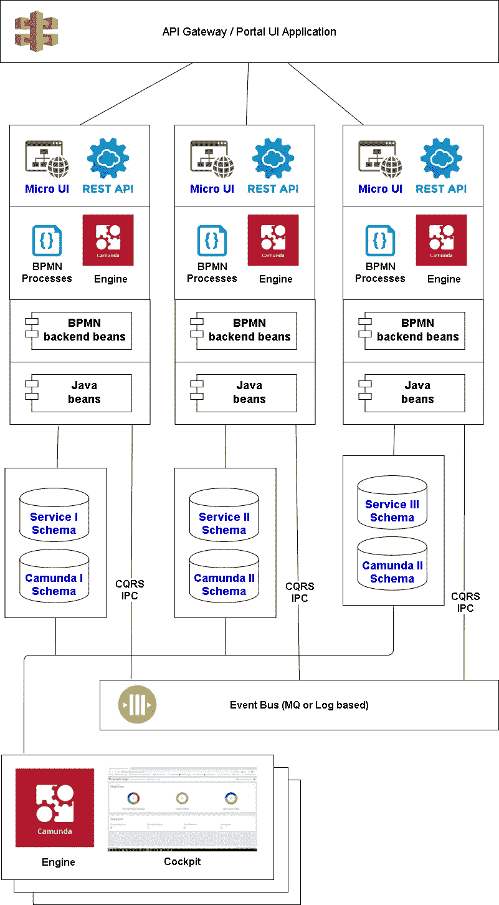
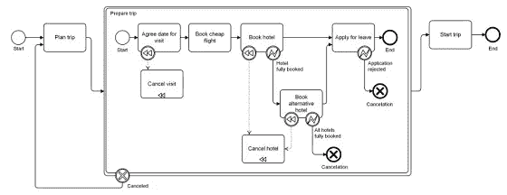

# 嵌入式 Camunda，如何正确烹饪，第二部分

> 原文：<https://blog.devgenius.io/embedded-camunda-how-to-cook-it-properly-part-ii-60ba525f5789?source=collection_archive---------6----------------------->

还有一篇文章延续了上一篇，[“嵌入式 Camunda，如何正确烹饪，第一部分”](https://medium.com/dev-genius/embedded-camunda-how-to-cook-it-properly-part-i-e7e96fa99b3f)。让我们讨论一下事务的组织，这可能是构建这种系统最复杂的方面。

在其中执行 BPMN 引擎代码和引用流程活动的相应后端 beans 的事务可以以至少两种方式启动:

*   在应用程序边界，例如，REST 控制器，作为外部系统调用的结果
*   BPMN 引擎中的调度程序，用于从作为专用数据库表实现的执行队列中选择任务。

只要这段代码专门用于同一个数据库，就不会有问题——事务仍然是本地的。主要的架构问题如下:

*   有必要加入外部系统请求的事务上下文吗(当然，如果有)有必要吗
*   反过来，您应该以事务的方式调用外部系统吗

答案取决于系统的需求，并且一如既往地是两个互不兼容的极端之间的妥协。

# 伪分布式体系结构

在一段时间内，组织交易的问题可能根本不会困扰开发人员。例如，让我们考虑一个大型文档工作流项目的典型初始架构，它不涉及与外部系统的运行时交互:

*   所有功能都被划分到单独的服务中，每个服务都提供几个紧密联系的文档。
*   每个服务都被实现为一个整体，包含以下主要部分:微前端 UI、REST API、嵌入式 BPMN 引擎、流程描述、用于流程实现的后端 beans、剩余的 java 代码。
*   所有服务都基于单个数据库，该数据库包含用于业务数据的每个服务的单独方案，并且只有一个数据库专用于所有 BPMN 引擎。
*   服务不直接将引用数据寻址到“另一个”方案。相反，它们提供了带有服务间数据集成标准 API 的专用客户端模块。这样就实现了独立服务之间的松散耦合。
*   服务之间的运行时集成是在文档流程实例的级别上执行的，它们相互启动、交换消息、等待完成并接收结果，等等。因此，服务内部的 java 代码从不相互执行远程调用，无论同步还是异步。对于 BPMN 引擎的所有正在运行的实例，所有交互仅通过单个数据库来完成。这也是一种将单个服务彼此松散耦合的方式。
*   每个微前端 UI 由三个独立的片段组成，它们共同构成了三个核心 UI 应用程序:客户端、业务管理员和系统管理员。每个片段向核心 UI 应用程序交付以下组件:菜单部件、文档表、参考书、文档编辑表单、向导、报告等。组件可以相互交互:填充一个服务提供的文档字段可以使用另一个服务提供的字典。此外，没有人阻止任何接口片段使用 API Gateway 提供的聚合 REST API。这是服务间集成的第三层。
*   由于所有 BPMN 引擎实例都引用单个数据库模式来进行监控、管理等，因此我们可以只使用一个基于专用引擎的 Cockpit 实例，而不用执行业务流程。

上面描述的体系结构可以用下图来说明。

正如我们从描述中看到的，它假设在每个服务实例中只使用本地事务。惟一的技巧是 BPMN 引擎和 JPA 提供者共同使用的单个事务管理器的正确配置。

这种方法简单、直观，并且在开发(服务可以彼此独立地开发和更新)和运行时(每个服务可以在所需数量的实例中运行)具有足够的可伸缩性。

所有进程都被分成几个组，这些组的活动不会相互竞争单个线程池的资源。这个事实也有助于运行时的可伸缩性。

系统整体的可伸缩性只受单个数据库的可伸缩性限制，基于这种架构可以让你活得够久。

# 数据库使用

是的，单一数据库存在这样的瓶颈，它是所有 BPMN 引擎实例使用的主要单一模式。在某种程度上，这可以通过数据库的正确调优来补偿。例如，以甲骨文公司为例:

*   对于 Camunda 实体 id 的生成器，供应商非常推荐使用 **StrongUuidGenerator** 而不是标准。
*   为高并发表设置 INITRANS 和 MAXTRANS
*   对存储流程执行历史的表使用时间分区和单独的表空间

当然，还要持续监控数据库中的慢速请求和其他性能问题。令人惊讶的是，有多少项目在抱怨神秘的低系统性能时，没有注意到数据库中不断的全扫描。事实上，像 JPA 这样的框架在某种程度上将开发人员与数据库的细节隔离开来，这并不意味着您最终可以忘记这种特殊性。数据仓库的调优是高负载项目运行过程中的基本要素之一。

该数据库还可以用来在系统内快速交换消息。在这种情况下，队列可以基于专用表实现，消息和接收过程实现为**“select for update skip locked”**查询。

假设每个操作的持续时间不超过 10 毫秒(长事务会降低数据库吞吐量)，那么对于每秒大约 1000 次操作的吞吐量来说，它是非常简单、灵活和可靠的。

如果队列中同时出现的消息量不大，数据库服务器会将它们都保存在内存中，几乎像一个真正的代理一样工作。因此，建议通过队列传输所需的最小数据量。

优势:

*   我们可以实现非常灵活的消息优先级策略，不仅基于时间戳，还基于一些与业务相关的属性
*   数据处理一方面是多线程的，另一方面是严格的事务性的
*   我们还获得了强大的持久性、任务交付保证和至少一次交付语义

这种方法的缺点很明显:

*   每条信息都必须快速处理。这意味着无法在事务或复杂的处理逻辑中进行远程调用，因为存在中间状态和锁超时
*   即使消息队列为空，也不断重新请求数据的消费者。

# 与外部系统集成

当然，一个罕见的系统离不开与外部系统的集成，不幸的是，这需要长时间的远程调用，从而降低了数据库的可伸缩性。在 BPMN 世界中，可以通过机制 **ExternalTask** 轻松实现:

*   技术任务的提要通过 REST 发布给外部执行者。
*   每个执行者负责与一些外部系统的集成。
*   Executor 读取作业并将其锁定在身后
*   之后，它执行外部系统调用(在数据库事务之外——易于执行非常长的操作)
*   最后，它注册任务执行的事实，将接收到的数据传递给流程。

优势:

*   BPMN 后端代码不能知道外部系统的地址/接口/数据类型。它没有集成逻辑和其他低级部分(处理请求平衡、处理故障和其他远程调用的不良细节)，易于开发和测试。
*   根据负载的不同，很容易改变执行器的数量——可伸缩性和弹性
*   执行者可以用任何语言/技术实现
*   服务暂时不可用的处理非常简单自然，维护和更新非常方便

问题:

*   超时问题。如果一个服务阻塞了一个任务的执行并终止了，这个任务将在很长一段时间内对其他服务不可用。当执行时间过长时，作业可能会被另一个执行者窃取。根据具体情况，这种影响可能是一个问题，也可能是一种解决方案。幸运的是，Camunda 外部任务 API 提供了延长锁时间的方法。但是，如果集成过程仅仅基于一个可能很长的远程调用，那么使用它就不那么容易了。
*   来自执行器的“完整”调用可能在去往引擎的路上和返回的路上丢失。回滚外部作业(即使我们可以做到)是一个坏主意，因为可能会发生我们永远不会第二次获得这个任务。因此，在任何情况下，我们重复“完整”调用。
*   根据业务流程调用的事务性。在这种情况下，它无法实现，因为 Camunda 提供了 REST API，不能在事务上下文中调用。我们将在接近文章结尾时考虑这个问题。

还有就是要让执行器调用的服务幂等，或者在执行器本身实现相应的逻辑，这可能是基于它的本地存储。幸运的是，每个外部任务实例都有一个惟一的 ID，我们可以使用它。

理解这一点很重要:执行者不是外部服务。它们只是 BPMN 流程的服务适配器。否则，服务将失去其普遍性。因此，与来自 BPMN 后端 beans 的服务调用相比，我们必须实现更多的代码和可部署的模块。

# 弱分布式体系结构

然而，系统带宽的增长迟早会在数据库上停止。合理的解决方法是为每个服务分配一个单独的数据库实例。因此，对架构进行了以下更改:

*   引入了一种新的元件，即数据通信总线。它可以是像 Active MQ 这样的消息传递系统，也可以是像 Kafka 这样的分布式日志记录系统(你可以在我的文章《Kafka 和 ActiveMQ 的一些详细区别》中读到它们之间的区别)。
*   由于 CQRS 模板，引入了数据复制，而不是服务直接访问彼此的数据(由客户端模块抽象)。管理一些数据的每个服务(数据的主人)在总线中发布它们的变化事件。其他服务通过订阅和处理相应的事件，只更新本地副本所需数据的必要部分。
*   使用总线通信，而不是使用 BPMN 工具的进程间通信。一个服务发布启动进程的请求；另一个服务通过总线接收它并启动进程。进程间的消息交换也是如此。

上面描述的体系结构可以用下图来说明。

由于在第一阶段引入的预先分离的数据模式和服务客户端组件，从第一个架构到第二个架构的转换在数据共享方面足够透明。

*   首先，我们通过类似“Oracle dblink”的机制将每个客户机连接到适当的服务器。
*   然后，我们可以开始逐步将它们迁移到 CQRS 方法。

如果某些业务操作需要严格的事务性单步数据更新，并且完全不适合 CQRS +进程间通信对，我们也可以使用这个技巧作为一种变通方法。

这种变化的一个缺点是非常明显的——我们现在有几个与 Camunda 相关的数据库，因此需要部署几个 Camunda Cockpit 实例来管理它们(或实现一些数据联合技术)。另一个解决方案是安装单个 BPMN 服务器，它只包含流程描述，不包含可执行的业务代码。在这种情况下，以前作为 BPMN 后端 beans 实现的所有可执行代码都被转移到位于服务中的外部任务执行器中。

另一个缺点不太明显，与事务性直接相关:当在不同服务的上下文中执行的进程之间交换消息时，我们现在处理两个数据存储，并且必须小心它的一致性。

# 使用 XA 事务

事务性消息交换最简单的方法是将发送或接收消息的过程与 Camunda 中的任务合并到一个两阶段提交 XA 事务中。对于 ActiveMQ 来说，这是一个典型的非资源密集型动作(因为它通常由“尽力而为 1PC”模式实现，这并不真正涉及 XA)。我遇到了类似 ActiveMQ 系统的对象，因为它们可以打破传递队列中的原始消息顺序。在我们的情况下，这并不特别重要，原因如下:

*   在大多数情况下，对于流程的每个实例，只有在发送自己的消息时才能收到消息。这样，它们原则上是不能交换的。
*   两个不应该交换的消息之间的时间“距离”相对较长，以至于冲突的可能性可以忽略不计

不幸的是，这种方法对于像 Kafka 这样的系统是不可能的，因为 Kafka 不提供 XA 兼容的访问模式。

另一种方法是根本不使用 XA 事务。以这种方式实现这种交换的主要问题是，由于 Camunda 引擎实现的特殊性，任何操作都可能被 **OptimisticLockingException 中断。**这种情况在以下情况下尤其常见(唉，但不仅仅是这样):

*   禁用独占执行+后续连接的多个并行服务任务
*   多用户/外部任务+后续加入
*   几个用户/外部/服务任务试图并行更新进程的存储
*   多实例处理

如果调度程序请求该操作，它会尝试重复调用，而不减少重试值。

当客户端请求操作时，本地事务被回滚。客户端收到异常，并考虑重复动作，如果是，用什么参数。在我们的例子中，它没有任何其他方法，作为重复调用。

在这两种情况下，如果其中一个 BPMN 任务在非事务模式下调用一个非幂等的外部服务，或者执行本地数据的非幂等更新，我们就会遇到问题。此外，正如我们已经知道的，接收方进程可能还没有准备好接收这个消息。

# 没有交易

向 BPMN 引擎传递非事务性消息的过程可以实现如下:

1)发送者进程发送具有唯一 ID 的消息。

*   对于执行每个 BPMN 任务的所有尝试，该 ID 必须相同。
*   不幸的是，它不能在流程的上下文中立即生成和保存——在抛出异常**、**的情况下，它将由于事务回滚而丢失。这就是为什么我们要么在一个单独的事务中提前创建它(这是一个复杂的、带有技术细节的流程描述)，要么使用由 Camunda 调度程序提供给我们的数据，即类似于**context . getjobexecutorcontext()的东西。getCurrentJob()。getId()** 。
*   有两个要点。首先，这个信息在测试执行期间是不可用的，因为 Camunda 调度程序没有启用。其次，也是更重要的一点，这个 ID 在一个数据库事务中执行的所有服务任务中都是相同的，由调度程序启动(从一个异步任务到另一个，用户和外部任务总是异步的)。因此，如果我们一个接一个地向一个流程实例发送几条消息，我们必须为这个“基本”ID 使用一些不同的后缀。
*   我们可以用不透明的方式发送这样的消息，因为我们面临的最大风险是发送两次。如果要降低风险，我们可以应用“更改-数据-捕获”模式:读取数据库实例的事务日志，检测数据插入/更新到专用消息表的事件，读取数据，并发送消息。查看 Debezium、Linkedin Databus、PgQ 等框架了解更多信息。

2)接收者进程存储已经接收的所有消息的 id 列表。它允许我们区分已经收到的消息(除了确认收到之外什么也不做)和还没有准备好的消息(抛出一个异常，稍后再尝试接收)。

*   遗憾的是，我们无法在处理过程中立即确认收到非事务模式的消息。由于我们无法控制的原因，操作可能会在引擎处理的最后回滚。因此，我们将消息的 ID 存储在流程的上下文中，并在完全没有收到确认的情况下完成处理。然后，我们第二次接收消息，在流程的上下文中找到它的 ID，什么也不做，最后只确认消息。另一种方法是注册为事务监听器，并在成功的数据库提交后确认消息(这是关于“最大努力 1PC”模式—我们在最后一轮提交最可靠的资源)。
*   由于要避免并发竞争，我们必须在相对于流程实例的同步模式下执行这样的处理，这在上一篇文章中已经描述过了。
*   我们可以引入一个具有惟一索引的特殊表，而不是在流程上下文中同步和存储 id。这样的表将是高并发的，所以相应地调优它，并且不要忘记在进程完成后从其中清除数据。一种特殊的重试策略可以在向该表中插入新条目的尝试失败后确认收到当前消息。

不幸的是，基于 Kafka 这样的系统，确认一个单独的消息是很复杂的，这是反对在这种情况下使用它的另一个理由。

顺便说一下，请注意，在这两种情况下，使用卡夫卡是相当复杂的。同时，对于 CQRS 模板的实现，它非常适合。此外，Kafka 是一种备份数据的绝佳方式。将 Kafka 作为消息传输工具的最简单方法是将传入的消息移动到基于内部表的队列中，然后灵活地对其进行操作(例如，重新排序)。由于在这个阶段进程间通信的强度通常不会太高，这种方法看起来相当可行。

因此，即使在使用多个数据库的情况下，我们也可以只处理本地事务。然而，在这种情况下，我们不得不稍微复杂化服务和 BPMN 引擎管理过程之间的运行时集成。当我们出于这样或那样的原因想要转移到分布式架构时，情况变得更加复杂。

# 分布式体系结构

顾名思义，分布式系统总是不可靠的。除了我们仍然可能多次发送请求的事实之外，它可能在到达或返回的途中丢失，并且我们根本不知道结果发生了什么。

在这一节中，我们将看到在我们控制下的组件之间的应用程序内的“相当快的”通信，它不需要“慢的”远程调用。与外部系统的集成应该总是通过外部任务机制来完成。在使用这种机制之前，被诅咒的问题仍然与在事务上下文中包含外部系统调用相同。

# 分布式交易

通常，实现分布式事务的尝试是分析师和开发人员对调用外部服务并保持数据完整性的必要性的第一本能反应。不这样做有很多好的理由。

首先，在分布式事务期间，所有参与者的资源至少在所有参与者之间的事务的最大执行时间内被阻塞。在所有参与者上同时执行操作是最好的情况。在大多数情况下，这是不可能的，由于业务性质或复杂的大多数开发人员。锁定的持续时间通常与参与者的数量成比例，并构成每个服务执行操作的累计时间。随着平均事务执行时间的增加，大多数数据库的性能急剧下降。它还会导致资源超支，例如 Oracle，因为回滚段显著增加。对于通常以单线程模式运行的 NoSQL 数据库，要求甚至更严格。因此，顺便说一下，他们很少参与交易。

分布式事务的协调器是一个单点故障，通常非常反复无常和容易出故障。在我使用 WebLogic 的工作中，我多次遇到这样的情况，WSAT 发疯了，开始发出大量的请求，使系统瘫痪。此外，将不同交易平台支持的交易资源链接到一个交易资源中也是一项挑战。

今天，远程调用的事务上下文的传输仅仅是基于带有 WS-Transaction 扩展的 Web 服务协议的标准化支持。Corba(没错，我记性很好)和 RMI 都死了。RedHat 提出了 REST-AT，但是规范还没有出来。由于其重量级，WS 完全不适合现代技术堆栈，甚至非常受尊重的供应商也逐渐放弃它。此外，Atomikos 事务管理器也提供了类似的功能，但不是 2PC 而是 1PC。如果每个服务操作将返回一个 TID，而不是提交/回滚本地事务，那么这种方法可以自己实现。然后，首先，我们调用所有操作，然后对于每个登记的服务，我们调用一个特定的 URL，它通过其 TID 执行挂起事务的提交/回滚。

分布式事务中涉及的服务开始变得非常相互依赖。一个服务上某些操作的变慢会增加其他服务上被阻塞的资源量。通过这种方式，经济放缓开始在整个体系中蔓延。更糟糕的是，无论哪些服务依赖于哪些服务，速度的降低都会不确定地分布在整个应用程序中。引入每个调用的最大超时的天真尝试迫使开发人员执行复杂的计算，尤其是当我们有一系列相互调用的服务时。

WS-Transaction 只是一起完成或没有一起完成的本地事务的总和。这种误解使得一些微不足道的后果变得十分神秘:

*   如果我们调用服务 A 和 B，而 B 又调用 A，那么在服务 A 的数据仓库的上下文中，有两个本地事务，它们之间的变化彼此不可见。
*   如果我们提交对 A 和 B 的更改，我们不知道本地事务的实际提交顺序。如果 B 随后立即调用 A，他可能不会发现那里的更改，这些更改看起来应该已经提交了。如果 A 发现自己处于相当大的压力之下或者已经不完全健康，这种影响尤其可能发生。

在这两种情况下，开发人员过去常常在本地事务的框架内工作，困惑于无法解释的获得**数据而没有发现**异常。

还应考虑以下问题:

*   在交互过程中，所有参与者必须同时可用—仅支持同步呼叫
*   许多现代广泛使用的数据库(主要是 NoSql — REDIS、MongoDB、Cassandra)根本不支持这样的功能。
*   长期锁强制对单个资源的更新操作进行额外的同步，只能顺序执行的代码片段显著扩展，降低了整个系统的可伸缩性(阿姆达尔*定律*)。
*   使用外部任务机制的外部系统调用不能包含在事务上下文中。

但是，很多团队都选择这种方式，尤其是在项目初期。这主要是因为系统的真正客户通常是测试人员。他们的预算也有限，所以大多数测试都是在单个组件级别进行的，或者是在理想条件下执行非常罕见的集成场景。

但是，当一些服务开始明显变慢，甚至经常停止响应一些请求时，与分布式事务相关的大多数问题就会在负载下显现出来。不幸的是，很少遇到基于真实客户端场景的系统的常规负载测试，在容量和结构方面充满代表性数据的存储，以及模拟网络问题和混乱的服务故障。

因此，只有当改变架构为时已晚且代价高昂时，分布式事务的障碍才会被发现，但应用程序才刚刚进入密集使用阶段。后果通常是令人痛苦和悲伤的。

应用分布式事务的一个常见原因是存在大量不提供业务功能的纯技术远程服务(例如 CRUD)。如果认为实现的微服务数量决定了微服务架构的成熟度，那就错了，但事实上，这种观点经常被观察到。

这样的服务类似于 DAO 组件，它们被轻率地发布以供公众访问。在 monolith 应用程序中，DAO 的方法总是在一个事务中被调用。以这种方式提供大量远程 CRUD 服务将使分布式事务的使用变得近乎强制性。

当然，如果你的系统每天要处理 100 个文档，出现这种问题的概率是相当低的。否则，我唯一能建议的就是从一开始就放弃使用分布式事务，仔细设计服务集。理想情况下，数据完整性限制和它们定义的本地事务边界应该作为将系统分割成独立服务的源数据，而不是相反。当然，这一开始会让开发者和分析师的日子难过得多，但在真正的系统维护阶段会省下很多血泪。

# 幂等调用

放弃分布式事务后的第一步是让所有远程调用幂等。

BPMN 端的实现非常简单:

*   基于当前调度程序作业的 ID 生成唯一 ID 请求
*   定义一个重试策略，在出现远程调用问题、**OptimisticLockingException**或特定业务相关的服务异常(通常与条件竞争相关)时重复该操作

远程服务端的实现更加复杂:

*   对于每个服务，我们存储一个唯一请求标识符的列表，以及为它们返回的结果。
*   企业经营的实施可以是乐观的，也可以是悲观的；二者的选择取决于冲突的概率和工作范围。
*   在悲观方法的情况下，我们用“select for update”锁定某个主实体，然后只查看这个请求是否已经被应用。如果主实体尚不存在，我们必须锁定另一个对象，该对象对于服务或调用方是唯一的。此外，还可以插入实体的“草稿”,然后在下一个事务中尝试再次锁定它。
*   在乐观方法的情况下，我们启动事务，执行业务逻辑，并尝试保存结果，同时将请求的标识符插入到已经处理的应用程序列表中。
*   在这两种情况下，当客户端基于已经过时的数据请求执行请求时，我们必须考虑条件竞争的可能性。只有通过对数据进行版本化才能解决这个问题:客户端从服务中读取一些版本化的数据，并向参数列表中的版本请求业务操作，业务操作的实现更新数据的版本。

对于许多情况，主要是当流程实例处理相互独立的数据时，这就足够了。不幸的是，幂等服务的引入并没有帮助我们处理这样的情况:由于业务原因，业务流程的某些部分无法执行，我们需要回滚或补偿已经提交的更改。对于分布式事务，这是自动完成的。现在我们需要手动操作。

# 商业交易

BPMN 中的业务事务是 SAGA 模式的进一步发展，SAGA 模式是 1987 年为不适合任何超时的长业务流程的事务执行而引入的

主要思想是:将一个长的逻辑操作分成一组对单个资源/服务的多个请求:

*   每个调用都必须在流程实例的上下文中检索和存储回滚请求所需的最少信息。例如，如果一个服务是无状态的，它将必须返回从它依次调用的函数接收的所有信息，这是它执行编译操作所必需的。
*   对于每个服务操作，必须定义一个补偿操作，将相应的资源返回到适当的状态。不一定是初始状态。例如，在仓库中预留商品: **reserveItem()** 和 **rejectItem()。**
*   如果一个逻辑事务中的一些操作失败了(立即或多次重复后——调用的幂等性),那么这些操作将按照定义的顺序执行。！！)，然后我们停止执行，对于所有已经更新的资源，调用补偿操作，这将回滚更改。

虽然分布式交易天生悲观，但 BPMN 商业交易是乐观方法的一个例子。

业务交易中通常涉及的操作类型:

*   **可补偿**——最多只能调用一次。它们可以通过调用相应的操作来补偿。例如:**create order()/reject order()**
*   **里程碑**可选且唯一；如果它被执行，整个交易必须继续到结束。它不可用于补偿或重复。比如 **makePayment()** 。
*   **可重复** —可以多次调用；他们可以遵循一个里程碑，总是成功地完成(立即或几次尝试之后)，逻辑上“修复”或“提交”所做的更改。

如果我们有几个里程碑操作，这意味着业务流程必须重构。

例如，让我们以取消订单的流程为例，除了其他操作之外，该流程还包括向用户发送一封信、退回货款以及实际退回准备运回仓库的商品。在这种情况下，发送信件的第一个操作是不可取消的。相应地，退货应该在它之前执行，因为订单可能已经被转移到递送服务，并且基本上不会被退回。

通常，最有可能失败的活动被放在更靠近开始的地方，以减少回滚的可能性和整个系统执行的工作量。

优势

*   支持长流程、异步事务、重复数据请求、个人问题的智能恢复(涉及用户和管理人员)等等
*   全局逻辑事务中涉及的各个资源被锁定的时间最短，从而保持了系统的性能和可伸缩性

缺点:

*   由于需要实现回滚操作，这些服务的数据方案和服务本身非常复杂
*   数据处于永久的延迟一致性状态，这对于开发人员和分析人员来说很复杂。实际上，这是我们生活中真实系统的一种常态。当我们订购产品，在线支付，等待发货时，两个系统(我们的钱包和我们的冰箱)也处于不一致的状态，这种矛盾是根本无法恢复的。

顺便说一下，没有人禁止我们使用混合方法:通过分布式事务处理具有高业务风险的罕见请求。相比之下，其他的大部分是基于业务交易处理的。因此，我们结合了高带宽和关键数据的有保证的一致性。

# 缺乏孤立

在 BPMN 业务交易的情况下，整个系统的可用性是通过牺牲单个交易彼此之间的隔离来实现的——AC(-I)D:

*   每个请求/补偿的副作用对整个系统是可见的，直到整个逻辑事务的提交/回滚
*   所以，我们处理部分时间的数据不一致:脏读、不重复读、覆盖单个业务事务之间的更改，等等…

当然，我们并不总是面临这些问题，但只有当:

*   单个流程实例可以竞争更改单个业务对象
*   他们或一些外部观察者需要读取聚合数据(例如，用户账户中的金额)

常见问题示例:

*   **丢失更新** — **CreateBooking** 创建实体并继续；同时， **CancelBooking** 将对象标记为已取消； **CreateBooking** 完成并将订单标记为已完成。
*   **脏读** — **取消预订**开始并增加账户中的金额； **CreateBooking** 检查现金可用性(脏读的时刻)并允许流程继续；**取消记账**碰撞出错，减少回账金额。因此，客户端可以进入负号。

防止这种问题的标准方法是语义锁定。可以通过实体的以下属性的组合来实现:中间状态(例如 **UPDATE_PENDING** )、更新业务流程的标识、更新前的值。

*   只有指定的流程实例有权将实体恢复到正常状态。
*   其他更新程序应该等待，直到达到正常状态，或者由于试图进行并发访问而简单地以错误结束。因此，在相同实体上交叉的各种运行的流程实例被序列化。
*   读者可以使用该值或旧值，这取决于实体的状态。这样，就可以观察到应用程序数据的一致视图。

另一种方法(乐观的 like):在将实体切换到中间状态后，事务会记住值的版本。如果在提交时该版本已经更改，则启动业务事务回滚(执行补偿操作)。

此外，按照这种方法，服务所有者可以独立地管理和分析正在更新的数据。这种方法的一个常见例子是 TCC(尝试-确认/取消)系统，例如，实现分布式预订。

下面是一个基于 REST API 购买机票并同时预订酒店的示例:

*   我们通过邮局订票:结果，我们收到了执行确认/取消操作的 URL，并且为我们预订了指定时间段的机票。酒店房间也一样。
*   在成功处理的情况下，我们对两个资源执行 PUT 并确认。如果出错—执行删除以取消操作。根据定义，这两种运算都是幂等的。
*   如果我们丢失了一些东西或关闭，门票将在锁定期结束时自动再次出售。

面向服务所有者的附加功能:

*   可以追踪你的状态历史。例如，对经常“忘记”取消预订的顾客处以罚款。或者预测服务责任和风险管理可接受的超额预订量。
*   GET from received URL 允许我们获取有关预订的信息。通过这个 URL，也有可能提供一个延长预约期的操作，也许是收费的。

这种方法的进一步发展是为每个运营实体引入一组状态，并保存实体从一种状态转换到另一种状态的所有记录。这是一个完整的模拟，其中有一个财务帐户和一组日志条目。在这种情况下，我们有物料账户表，例如，一个单位的货物:购买、交付、库存、保留、添加到交付集、发送到交付服务、交付期间、已交付等等。这种复杂性使企业主能够分析物流和仓库的拥挤程度。这是一个很好的例子，说明薪酬流程中的严重技术限制(缺乏隔离)可以转化为新的有价值的商业机会。