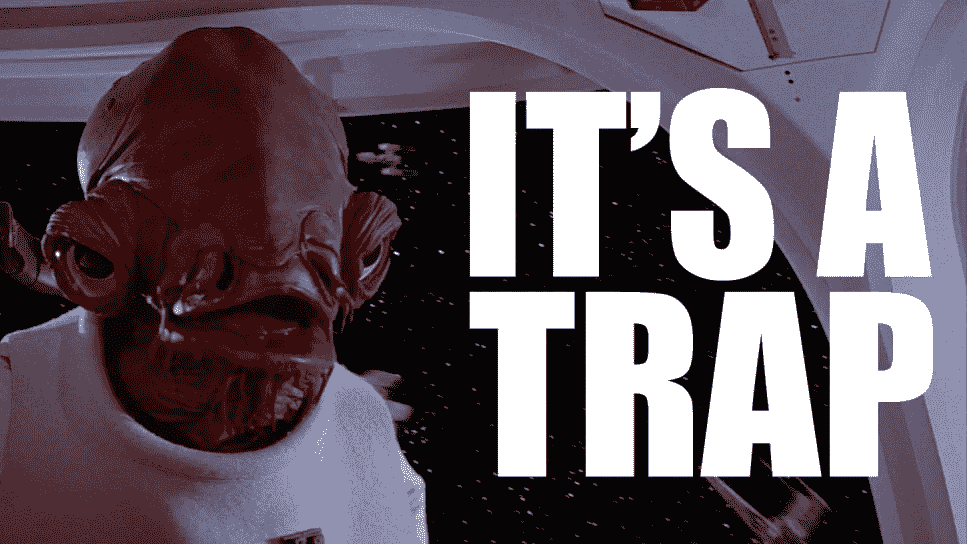

# 拥抱阿克巴上将来识别软件开发中的陷阱

> 原文：<https://blog.devgenius.io/embrace-admiral-ackbar-to-identify-traps-in-software-development-192267856dbe?source=collection_archive---------8----------------------->

## 是抓住你的无形陷阱

[itsatrap.jpg](https://i.kym-cdn.com/entries/icons/original/000/000/157/itsatrap.jpg#)

> 开发者给自己设下陷阱，警告自己，然后在踏入陷阱时大吃一惊

当我听到“这是个陷阱”这样的话时，我觉得这还不够，我听到这些话是用《星球大战——绝地归来》中阿克巴上将那种带着鱼腥味的鼻音说的

创建软件时，你需要一个迷你阿克巴上将坐在你的肩膀上，阻止你走进陷阱。

最容易陷入的陷阱我们为自己设置的陷阱(低估、过度承诺、在应该闭嘴的时候张嘴、在不需要代码的时候写代码或者写错代码)。

如果所有的开发人员都像阿克巴上将那样，软件开发将会充满有着巨大鱼头的开发人员，他们将帮助团队避开无形的盾牌。

# **阿克巴上将和星球大战**

阿克巴上将因第一个大喊这是个陷阱而闻名。这正是你的开发团队想要的开发人员类型。除非他一直说一切都是陷阱，那会很烦人。

互联网喜欢阿克巴，他有很多迷因，尽管在《绝地归来》中只有 14 句台词。

对义军同盟的阿克巴来说，这是很平常的一天，他们的飞船数量少得可怜，而且要去攻击一个巨大的行星大小的空间站(死星)，因为他们相信护盾会被拆除，死星会很脆弱。

我做过一些棘手的项目，但当你被告知你将攻击死星时，你会打开 LinkedIn，阅读收件箱中一些诱人的工作邀请，以防万一。

当他们准备攻击死星时(想想项目前的会议),一个叫兰多的人叽叽喳喳地问了一个听起来很合理的问题，关于隐形护盾是升起还是落下

> 我们得从防护罩上获取某种读数，向上或向下。如果他们不知道我们要来，怎么可能干扰我们。兰多

在您的项目会议中，一些 Lando 开发人员会提出一些关于需求(或完全没有需求)的问题，他们说需要 20 名开发人员用 6 个月的时间来构建只有一段描述的软件。

兰多的脑子现在真的在嗡嗡作响，他向飞船上那些即将撞上一面看不见的盾牌/墙的健忘的白痴们发出关切的目光。

> 停止攻击！防护罩还在。兰多

最后，领导层会听取开发者的意见——我的意思是反叛舰队会听取兰多的意见，然后掉头(但以一种很酷的飞船方式，而不是像骑自行车的老奶奶那样)

> "猎鹰和红色班的战斗机不顾一切地转向以避开看不见的墙."

接下来是一些关于绿色组织和 MV-7 的废话空间！这是阿克巴在争取时间，因为他知道自己搞砸了一点。然后他们注意到一些敌舰，这让撒旦先生·阿克巴推断出“这是个陷阱！”

下面是[全文讨论](https://www.imdb.com/title/tt0086190/characters/nm0741714)

> 蓝多·卡瑞辛:我们必须能够在防护罩上得到某种读数，向上或向下。
> 
> 尼恩·农布(用南非语说话)
> 
> 蓝多·卡瑞辛:但是如果他们不知道…如果我们来了，他们怎么能干扰我们呢？
> 
> [通过通讯器]
> 
> 蓝多·卡瑞辛:停止攻击！护盾还在！
> 
> 魏吉·安提列斯:我没有阅读。你确定吗？
> 
> 蓝多·卡瑞辛:拉起来！所有飞船，拉起！
> 
> 阿克巴上将:采取回避行动！绿色小组，靠近 MV-7 区！
> 
> 蒙卡拉马里:上将！47 区有敌舰！
> 
> 阿克巴上将:这是个陷阱！

回过头来看，似乎 Lando 做了大部分艰苦的工作，但正如所有优秀的开发人员所知道的，谁做了工作并得到了荣誉(例如，不是开发人员)并不重要，但最终还是得到了一些荣誉。

# **软件开发陷阱**

> 值得注意的是，像我们这样的人通过努力保持不愚蠢，而不是努力变得非常聪明，获得了多少长期优势。查理·芒格

开发人员和开发团队有很多陷阱，他们需要保持警惕以避免陷入其中。

[软件开发人员需要既聪明又善于写代码](https://itnext.io/the-difference-between-the-clever-developer-the-wise-developer-a0edd9d8a692)，**有些问题你需要避免而不是用代码**解决。你写的代码越少，引起开发团队问题的代码就越少。

避免愚蠢，将开发团队置于危险的境地，让你在未来有更多的时间，更少的问题。

你在寻找隐形的护盾陷阱。从远处看似乎还不错的听起来合理的策略。事情可能通过了嗅探测试，但你需要靠得更近才能看到细节。

演示文稿、文字、电子邮件、议程让事情得到认可/同意。大多数沟通不是为了沟通，而是为了迷惑、误导和阻止人们问太多问题。

当你看到战略、进度、战术、基础、专业术语之类的废话的时候。这些被用来阻止人们问尖锐的问题和指出潜在的问题。**不要掉入陷阱。**

软件开发中常见的陷阱有:

*   低估发展
*   当业务流程可以改变时创建代码
*   对不需要参加的会议说“是”
*   不要对乐观的计划提出异议
*   没有为出错做好准备
*   忽略风险
*   需求、信息、访问几乎完成或被忽略

软件开发是失败者的游戏，犯最少错误的开发团队将取得最大的进步。

# **在你的项目上发现阿克巴**

你的项目中不会有阿克巴上将，所以你需要自己扮演阿克巴上将。当人们谈论需求、计划或其他事情时，你需要问自己这些问题。

*   陷阱在哪里？
*   这会给我带来什么问题？
*   如果要出问题，会出什么问题？

警惕看起来不像陷阱的陷阱。你需要想象阿克巴上将跳起来用可疑的声音喊道——**这是个陷阱**

让自己做好准备的一个很好的例子是，在部署时，想象一下如果某些服务或流程出错会发生什么。你会怎么做？

如果你要写的问题在未来会给软件开发团队带来大问题——它们是什么？这些问题造成了什么损害？

我会怎么做——寻找陷阱

*   开发环境已删除→从源代码管理还原
*   首席开发人员离开了→所有东西都应该在源代码控制中并记录在案
*   服务 x 已关闭→应该会出现特定错误

你不能阻止问题、错误和争论，但你可以为它们做准备，并确保它们以灾难告终。技术灾难不应让开发者措手不及

软件开发偷偷摸摸的。它把你抱在怀里，你没有意识到它已经抓住了你，它随时都可能把你扔下去。

过去的经历并不能保护你免受阿克巴隐形护盾的伤害。这就是我所说的[火鸡开发者和圣诞节问题](https://itnext.io/turkeys-developers-and-the-christmas-problem-9b9acc040fae)。您可能因为运气不好而错过了一个大问题——比如没有将您的代码置于源代码控制中或者在产品发布之前进行备份。百分之九十九的情况下，它可能是好的，但是当它出错时，它就是灾难。

# **结论**

肩上扛着一个迷你阿克巴上将来寻找陷阱，可以帮助你避免或在问题发生前解决问题。软件开发制造的陷阱看起来如此真实，以至于你都没有意识到自己已经踏入其中。

避免问题是创建软件的一种更好、压力更小的方式。

问问你自己阿克巴上将会怎么做——大喊这是个陷阱