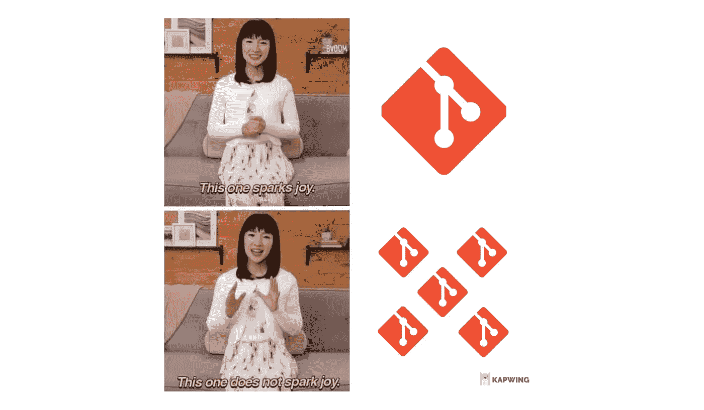
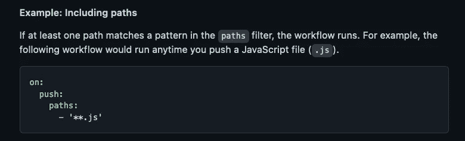

# 拥抱单一回购！

> 原文：<https://blog.devgenius.io/embrace-the-mono-repo-3efcd09a38f8?source=collection_archive---------1----------------------->

将你的 poly-repo 转变为 mono-repo 是玛丽·近藤赞同的一种组织行为！

在源代码控制中，软件团队管理他们的源代码通常有两个极端:

1.  **聚回购**。每个独立的项目或应用程序范围都有自己的存储库。例如，在最简单的情况下，一个团队可能有一个用于应用程序前端和后端的独立存储库。
2.  **单一回购**。一个相关应用程序甚至一个组织的所有项目都存储在一个存储库中。

介于这两个极端之间的是**混合回购**，即*多元单一回购*。

但对于大多数团队来说，尤其是初创公司，我开始相信单一回购是一条出路。事实上， **poly-repo 通常是小团队和初创公司在组织代码时犯的最早且代价最大的错误**,因为这种非常早期的行为会产生一种无形的阻力，这种阻力直到大力整合回购时才会消失。

让我们来看看为什么以及何时应该为您的团队使用单一回购而不是多回购设置。

# 背景

由于微服务架构取代整体架构的兴起，Mono-repo 的品牌在最近的历史中受到了一定程度的诽谤。

但将单一回购等同于整体回购是一个常见的错误。微软的新美乐股份公司·科廷就此写了一篇很棒的文章:

> 不难看出，我们在哪里开发代码以及何时部署什么实际上是相互关联的。例如，谷歌的 monorepo 中有成千上万的应用程序，但显然，它们并不是一起发布的。
> 
> **所以 monorepo！==独石**。恰恰相反，因为 monorepos 简化了代码共享和跨项目重构，它们显著降低了创建库、微服务和微前端的成本。因此，采用 monorepo 通常能够实现更大的部署灵活性，以及应用程序结构的更大模块化。

采用面向服务的架构的团队通常会默认使用 poly-repo 作为隔离应用程序通信边界和团队边界的机制。

虽然这肯定会有一些好处，但它伴随着 ***巨大的开销和缺点，*** 尤其是在一个小说系统开发周期的早期。

再次，Cotin 的写作是基于对 ***公开*** 和 ***公开*** 的区分:

> 改变一个公共 API 需要我们更新 API 的客户端，但是一次就可以完成。对于一个已发布的 API 来说，一蹴而就是不可能的，有时甚至根本不可能。所以改变一个已发布的 API 要困难得多。
> 
> **观察:当一件事很努力的时候，开发者会避免去做。因此开发人员避免更改已发布的 API。**
> 
> 在开发生命周期的早期，开发人员仍然在弄清楚系统的架构和协议，决定什么可以共享，等等。
> 
> 因此，引入已发布 API 的成本要高得多，因为我们需要改变它的次数要多得多。

使用 poly-repo，不管系统的各个部分是如何连接的——不管是通过 REST、GQL 还是一个包管理器——它总是导致需要将共享代码作为一个已发布的 API 来使用(以免您走复制和粘贴代码的可靠路线……)。

# 单一回购:如此古老，又是新的

在过去几年里，单一回购实际上已经有了某种复兴。

这里有一个关于谷歌单向回购如何运作的很好的讨论:

微软的许多仓库已经转向单一回购:

 [## Azure-sdk-for-net/主 Azure/azure-sdk-for-net 上的 SDK

### 这个库用于. NET 的 Azure SDK 的积极开发。对于 SDK 的消费者，我们建议访问我们的…

github.com](https://github.com/Azure/azure-sdk-for-net/tree/main/sdk) 

其他使用单一回购的著名公司包括脸书、Dropbox 等。

尽管它的形象问题和整体架构的关联，单一回购似乎正在卷土重来。让我们来看看原因。

# 多元回购的“根本”问题

最核心的是，poly-repo 的摩擦和痛苦实际上与文件系统有关。

首先，在 poly-repo 设置中，每个开发人员环境中的文件系统是不一致的，这意味着逻辑布局和物理布局之间存在*错位，因此脚本和自动化变得不可能*。我们*可以*使用一些脚本来设置环境，这样每个人都有相同的物理布局。

其次，虽然微服务和 poly-repo 不是一回事，但这两种模式之间往往有很强的相关性。构建微服务的团队更有可能采用多回购而不是单回购。这个决定的结果是，它打破了代码库中系统各部分之间的符号链接。

最后，维护每个回购的版本需要更多的工作。因为它们都位于不同的目录中，所以经常需要额外的*步骤*来保持所有内容的最新和一致。当然，也可以写一个脚本来做这件事，但是要问的问题是为什么要接受这种摩擦？

摩擦是你做错事的一个信号。

# 单一回购的诸多好处

[使用 GitHub Action 的**路径**语法仅在回购的子树上激活工作流](https://docs.github.com/en/actions/using-workflows/workflow-syntax-for-github-actions#example-including-paths)

## 发展速度

正如 Cotin 所写的，当您有一个已发布的 API 时，这意味着要更新对该 API 的引用，通常会有一个流程，其中发布步骤之后是刷新步骤，以更新对已发布 API 的引用。

例如，OpenAPI 或 gRPC 引用通常就是这种情况。

虽然当 API 相对稳定或者实际上由组织内的独立团队管理时，这非常有意义，但在其他情况下很少有意义。它*特别是*对于创业公司来说没有意义，因为在那里每个人都在做一些事情。这种额外的开销只会拖团队的后腿。

在 mono-repo 中，在每次构建时为模式和下游客户端的自动生成编写脚本变得非常简单。

## 代码导航

poly-repo 的一个问题是 ***代码导航有更多的摩擦，当每个 repo 的组件之间存在强制服务边界时，这个问题会加剧。***

现代的代码编辑器和 ide 能够跟踪项目中跨文件的符号引用，但是当这些文件没有链接在一起并一起加载时，这就失效了。

例如，假设一个. NET 项目有两个项目的两个回购。如果不链接这两个项目，编辑器将无法遍历链接的符号。如果我们通过包发布进行链接，我们将失去快速浏览代码库的能力，并最终依赖于非常原始的“查找全部”。

Mono-repos 允许代码编辑器和 ide 充分利用语言服务器和项目间代码符号的智能导航。

## 高效重构

因为 poly-repo 中断了符号链接，所以很难使用现代 ide 强大的重构工具，相反，这些超级能力被限制在单个库的范围内。在这种情况下，查找和替换引用就变成了“查找全部”的问题。

现代工具可以很容易地对方法签名进行一致的全局更改…当那些符号被链接时。

## 一致的版本

使用聚回购时，每个回购都有不同的版本，必须进行维护和同步。这造成了开销，甚至可能成为缺陷的来源。

随着存储库数量的增加，管理版本的开销只会产生越来越多的摩擦。我见过一些团队仅仅通过编写脚本来管理他们的 poly-repo 中最新版本回购的同步。

在 mono-repo 中，单个`git pull`同步存储库的所有版本。单个`git checkout feat/awesome-feature`确保您的整个系统准备好运行`awesome-feature`，而不必跨多个本地回购同步版本。

## 更好的工作流程

在 poly-repos 中，当开发人员的工作跨越多个存储库时，围绕拉请求和代码审查的工作流变得相当繁重。例如，服务器 API 被更新，并且需要对前端进行相应的更新。

对于 poly-repo，这需要通过 GitHub 或 GitLab 中的多个存储库或者您选择的源代码协作工具来审查代码。也许您还想将 PRs 链接在一起以提高可见性。

如果您在本地拉动分支，您将需要在多个分支之间持续拉动。

***这一切都只是开销。***

在 mono-repo 中，所有的代码审查都可以在 GitHub 中的一个 repo 中进行，如果您想在本地测试或审查代码，一个简单的`git`操作就可以让您进入正确的环境。

## 更高的可见度

经常被忽视的是，mono-repos 为团队提供了对彼此工作的更多可见性和责任。在 poly-repos 中，GitHub 中的 PRs 将被隔离在每个回购中，每个开发人员的工作对其他人来说可能不太可见。

在单一回购设置中，所有的 PRs 都流经一个回购，每次拉取都会带来所有的代码。这是提高可见性和增强最佳实践、设计模式的采用以及防止代码重复现有功能的一个很好的方法。

# 当多边回购有意义时

这并不是说 poly-repo *永远没有意义，而是说它不应该成为大多数团队的默认选项。*

支持聚回购的一些标准包括:

*   **代码由分散的团队完成**。当具有独立过程和实践的独立团队在代码的不同部分工作时，有更强的理由进行独立的回购。如果每个团队都有不同的过程要遵循，那么回购边界与过程边界一致是有意义的。
*   **库、API 或 SDK 的表面积是稳定的**。如果在如何向消费者公开代码的功能方面存在很小的不确定性，那么 poly-repo 的开销就会减少。特别擅长管理代码和数据版本的团队通常能够以最小化破坏性变更的方式编写 API 和 SDK。
*   **稳定性比速度更重要**。聚回购的摩擦？它偏向于稳定性，因为更新代码的成本更高，在某些情况下，这可能是一个“特性”。poly-repo 可以被用作“棍子”,通过提高更改代码的成本来支持稳定性。当速度仅次于稳定时，这可以被视为聚回购的额外好处。
*   **在法规约束下管理代码**。在涉及 GxP 过程的生命科学中，代码必须在法规约束下开发，在这种情况下版本控制是至关重要的。使用 poly-repo 范式可以通过允许代码的一部分发生变化而不必承担监管过程的全部成本(例如回归测试)来帮助降低这种监管约束的成本(以开发开销为代价)。换句话说，回购边界可以用作与监管开销相关的流程的边界。

一般来说，采用多边回购的决定是由*创建边界*(正是边界是摩擦的来源)的需求驱动的，因为该边界具有与流程相关的好处，通常会取代由多边回购引起的与开发相关的摩擦。

如果你想阅读更多的行业观点，Infoq 有一个关于单一回购、微服务和整体产品的精彩讨论。Alex Noonan 特别深入地讲述了从 mono → poly → mono 的旅程以及他们在这一过程中所学到的东西:

> 你要改变一件事，然后测试在其他地方中断，现在你必须花时间修复这些测试。将它们分解成单独的回购协议只会让情况变得更糟，因为现在你要去接触一些六个月都没有接触过的东西。这些测试完全被破坏了，因为你不必花时间去修复它。

对你来说是单一回购吗？用客观的眼光审视你的流程和工作流程，看看摩擦的一些根本原因是否仅仅是因为聚回购的设置，这一点很重要。在早期阶段，单一回购的好处数不胜数，有助于提高交易速度。

Mono-repo 确实需要在 CI/CD 端增加一点复杂性(只是一点点),因为脚本和工作流需要上下文感知，但这些努力可以提高生产率，减少每行代码的摩擦。