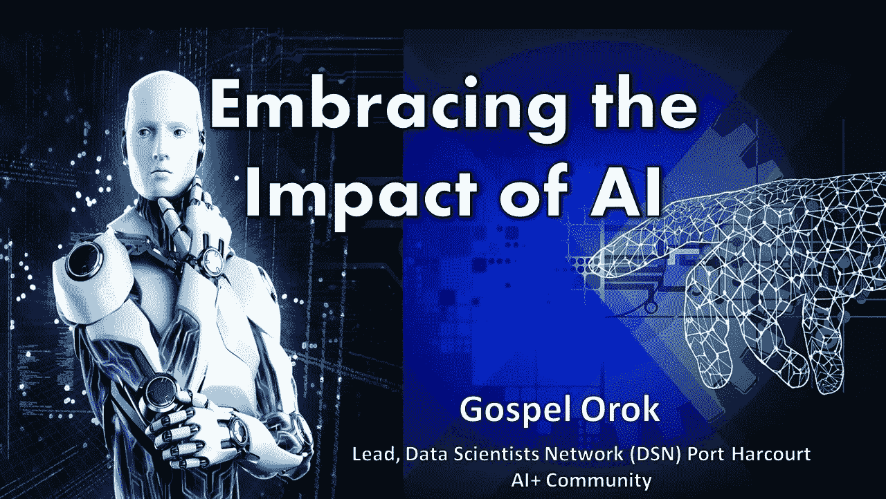
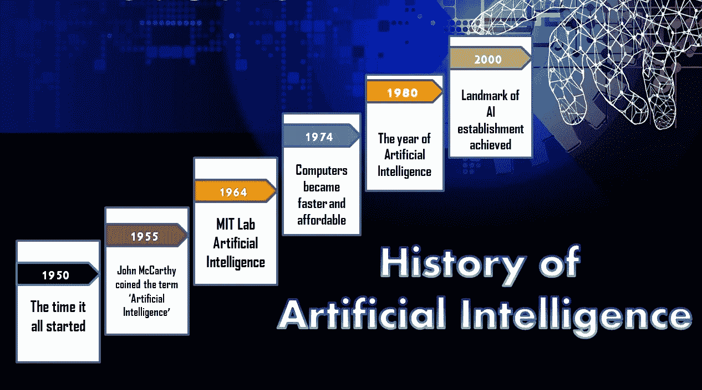
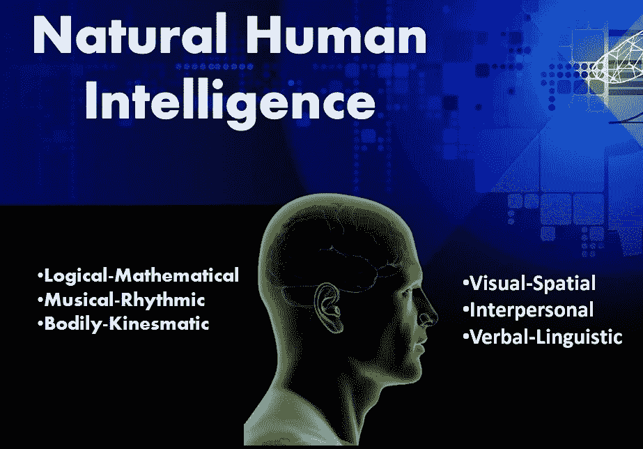
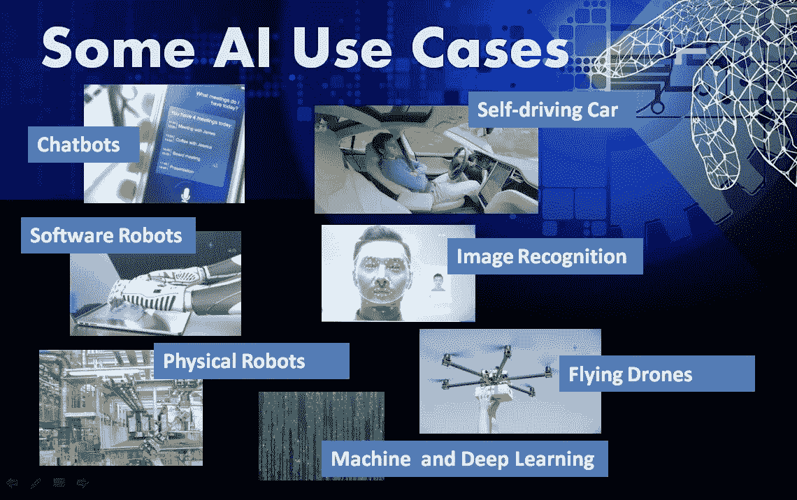

# 拥抱人工智能的影响

> 原文：<https://blog.devgenius.io/embracing-the-impact-of-ai-1c3dd9512d7e?source=collection_archive---------13----------------------->

这篇文章旨在积极支持你为人工智能(AI)时代和已经到来的未来工作做好准备。我相信，通过鼓舞人心的例子和用例，您将受到鼓励，在您的业务、公司和社会环境中积极利用人工智能，以负责任的方式创造积极的价值。这篇文章并不打算用太多的理论或技术细节来轰炸你，而是重新聚焦并重新装备你的思想，如何实际利用人工智能赋予的迷人机会。

我们来看看 AI 的简史。

**人工智能的历史**

从 20 世纪 50 年代到 21 世纪初的人工智能历史

现代人工智能方法的历史始于 20 世纪 50 年代，在过去的 70 年里取得了一些实质性的进展。2000 年代，由于大数据的出现，人工智能见证了一个可实现的里程碑。据说“*数据是新的石油，人工智能是新的电力*”。就像电力在前几个世纪带来了巨大的变革一样，很难假设人工智能不会做同样的事情。人工智能已经是我们日常生活的一部分。在当今时代，人工智能正在改变我们工作、生活甚至娱乐的方式。

**AI 的定义**

那么 AI 这个术语的基本定义是什么呢？然而，事实是，人工智能一词实际上并没有一个全球专家都同意的共同定义，而是对人工智能主题真正涵盖的内容略有不同。

如果你问我什么是人工智能，我自己简单而有力的定义是:

“ ***人工智能是以人类*** ”的形象创造智能机器和计算机程序

**天生的人类智能**

如果人工智能是关于模仿人类智能或创造机器和计算机程序来像人类一样思考和行动，那么我们更好地理解人类自然智能，而不是更好地理解人工智能。

让我们仔细看看人类的自然智能。

**人类的自然智能是什么样的？**这里也有一些不同的意见，但大多数专家都同意，人类的自然智能不能用一种非常狭隘和一维的方式来描述，而是一种非常多维和广泛的现象。

**例如，人类的智力有不同的形式:**

**AI 的范围和目的**

人工智能的范围是什么？显然，反映人类思维和人类行为不同形式的不同类型的人类智能可以被认为是人工智能的范围。

但是 AI 的目的到底是什么呢？有什么好处？当一件东西的目的不明时，滥用它是不可避免的。我想从两个不同的角度来看这个问题，人工智能取代人类和人工智能支持人类。人工智能的出现引发了一些人的恐惧，认为人工智能实际上将完全取代人类。更好的方式是说，人工智能的目的是至少部分地用机器和计算机程序取代人类的思维和行为，而不是完全取代人类。

另一种观点是，人工智能主要不是取代人类，而是通过结合人类和机器的力量来支持和加强人类的思维和行动。

如果你问我，我更喜欢结合两种观点和术语，为人工智能提出一个统一的定义，即人工智能正在模仿、增强，有时甚至部分取代人类思维和人类行为。这一定义反映了它的目的，即增加或取代人类，它还反映了它的范围、人类的思维以及人类以各种不同形式的行动。

*   **人工智能用例的例子有:**
*   物理机器人
*   软件机器人
*   聊天机器人和社交机器人
*   无人驾驶汽车
*   面部和图像识别
*   飞行无人机等等。

除了这些例子，还有其他数字互联技术，如区块链、物联网、云服务、移动应用等等。

**AI 的种类**

正如有非常不同类型的人类自然智能一样，也必须有不同类型的人工智能。这些不同类型的人工智能必须反映人类思维和人类行为的不同形式。我们将从两个方面来看人工智能的类型:

1.  **力量和**
2.  **解决方案**

**AI-Strength 的类型**

**人工狭义智能:**这类 AI 也叫弱 AI。它只能做一件事，不能做这么多事。弱人工智能或 ANI 拥有专注于狭窄领域的专业解决方案。弱 AI 的例子有，语言翻译器，图像识别等。

**人工通用智能:**我们还有人工通用智能，AGI，也叫强 AI。这种类型的人工智能能够完成多项任务。AGI 的例子有自动驾驶汽车、人形机器人等。

我们也有人工超级智能，一种假设的类型，这个术语描述了一种更强大和可能的未来人工智能力量，它可能取代人类思维和人类行为。这种类型的 AI 实力还不存在。ASI 只是一个概念，一个愿景而不是现实。

**人工智能解决方案的类型**

**认知解决方案:**这对应于像人脑一样的人类思维，它们在分析问题、做出评估、做出判断、做出决定和对决定提出建议。认知人工智能解决方案的例子有机器学习模型、深度学习模型、推荐系统、搜索引擎等。

**机器人解决方案:**另一方面，我们有机器人解决方案，它们对应于人类的行动，比如人类身体的行动部分，包括手臂、手、腿和脚。机器人解决方案在物理世界中执行，但像人脑这样的认知解决方案会告诉它们该做什么。人工智能解决方案的两个类别，认知解决方案和机器人解决方案都非常重要，非常互补，因此都需要。只有两者的结合才能让我们不仅做出决定，还能在现实世界中执行这些决定，让事情发生。

认知和机器人解决方案都需要实现综合全面的人工智能解决方案，并有效地模仿或取代人类的思维和行为，以完成任务并创造积极的价值。

一些人工智能专家声称，人工智能这个术语应该只用于非常智能的认知人工智能解决方案，而不是智能较低的人工智能解决方案。我很不同意，我认为这些专家的观点相当理论化，不符合现实和实践。为什么，因为不是所有的人都一样聪明，也不是所有的动物都一样聪明，所以为什么所有的人工智能解决方案都应该一样聪明，除此之外，正如我们所看到的，有多种类型的自然人类智能以及人工智能。每一种这种类型的智力都反映了我们现实的一部分，因此有权利存在。

不同的人工智能技术经常相互结合，尽管我们出于一些探测原因区分了认知解决方案和机器人解决方案，但在实践中，这两者之间没有严格的界限。

例如，今天大多数物理机器人都嵌入了许多认知人工智能功能。今天，大多数智能人工智能解决方案都相当专业，有些大多擅长做一件、两件、三件或更多的事情，但与人类相比，不能做很多事情。事实上，人工智能是一个涵盖不同类型技术的综合术语。

**人工智能对我们未来工作的影响**

人工智能技术为我们打开了全新的迷人机会，为我们自己、为我们未来的职业抱负、为我们的企业、公司和整个社会创造积极价值的机会。

**AI 对我们工作的影响**

通过充分利用人工智能赋予的技术，我们可以在工作场所实现以下目标:

自动化:在大多数工作都是重复性的公司和情况下，可以部署人工智能机器来自动化操作，这减少了人为错误的机会。这种情况的例子有汽车工业中的汽车装配厂，以及数据输入操作。

**生产力:**在完成涉及大型复杂任务的工作方面。当事情超出我们人类的控制范围时，人工智能机器在处理大量复杂数据或操作时可以派上用场。人类在处理超过特定数量的任务时容易疲劳或效率低下。我们会感到困惑，可能会把事情本来的样子搞得一团糟。

**效率:**人工智能机器也有助于加快日常操作，改善数据处理。人工智能系统可以在一个特定的时间点评估和解释多种事物。从处理员工数据库和客户数据库到分析这些团队遵循的模式，有很多事情只需要一台机器就可以完成。而人类也可以完成多种类型的任务，但不能同时完成。

**人工智能对我们业务的影响**

另一方面，通过很好地利用这些技术，我们可以帮助以个性化的方式满足我们的客户

*   新的客户体验和满意度
*   营销和销售的有效性，根据特定客户的需求量身定制。
*   更新更好的产品和服务
*   像初创企业这样的新商业模式

**AI 对我们全球经济的影响**

根据世界经济论坛，技术进步可能或正在消除特定的工作。但从长远来看，随着公司重组员工队伍，这也创造了更多的就业机会。

人工智能的出现引发了第四次工业革命，对每个人都产生了巨大的影响。此外，专家估计，人工智能将对我们的经济产生全球性影响，这种巨大的影响价值超过数十亿甚至数万亿美元的人工智能年收入。

**投资人工智能的领先公司**

亚马逊、微软、特斯拉、脸书、谷歌、阿里巴巴、苹果、腾讯和其他领先的科技巨头公司正在大力投资人工智能的更多原因。这些公司正在将人工智能嵌入其核心流程，并致力于改善其产品和对客户的服务。他们还投入巨资收购人工智能初创公司，以加强其内部的人工智能能力。

**人工智能的成功因素**

*   数据
*   人工智能中的职业
*   国家人工智能战略

**数据:**善用人工智能与善用数据的能力相结合，似乎是我们这个时代领先科技公司的头号因素。

人工智能领域的职业生涯:尽管人工智能领域广阔无垠，但从事这一领域的职业有其自身的规范。任何人都可以从事人工智能职业，这取决于他们的资质。接受人工智能的好处将需要企业和政府合作开展大规模的再培训和技能提升计划，以帮助员工进行再培训，并为新的和未来的工作做好准备。你可以追求以下目标，以建立人工智能职业生涯:

1.  机器学习工程师
2.  数据科学家
3.  商业智能开发人员
4.  研究科学家
5.  大数据工程师

**国家人工智能战略:**一些国家已经开始认识到人工智能将对他们整个地区的未来成功、繁荣和财富产生越来越大的影响。因此，在过去的几年里，越来越多的国家开始制定自己的国家人工智能战略。国家人工智能战略不仅描述了这些国家计划进行的数十亿美元的投资，而且还显示了他们如何鼓励他们的公民和公司将人工智能应用到他们现有的业务中，并鼓励他们发明全新的产品和人工智能业务

**结论**

在人工智能支持的不远的未来社会的背景下，是时候学习如何充分利用令人着迷的新机会来创造积极的价值和现代数字技术了，最重要的是将人工智能视为新数字时代的主要驱动力。发展新的技能来创造和解码这些数字技术是很重要的。也是时候学习如何避免与数字化和人工智能不可避免地相关的风险和威胁了。企业通常很快适应变化，这里是基于人工智能的解决方案。这意味着对与人工智能在行业中的使用相关的新型技能的需求越来越多。

**参考:**

[https://data-flair . training/blogs/人工智能-ai-tutorial/](https://data-flair.training/blogs/artificial-intelligence-ai-tutorial/)

[https://www . we forum . org/agenda/2020/10/dont-fear-ai-it-will-lead-to-long-term-job-growth](https://www.weforum.org/agenda/2020/10/dont-fear-ai-it-will-lead-to-long-term-job-growth/)

**关于作者**

福音 Orok 是一名数据专家，也是一名 AI 爱好者。他还是数据分析、数据科学和数据工程专业技能的倡导者，致力于提供高影响力的解决方案。他目前是哈科特港城市数据科学家网络(DSN) AI+社区的负责人。他愿意与组织和个人合作，建立一个人工智能生态系统，开发高人类能力的影响。

感谢阅读这篇文章。请随时在 LinkedIn 和 Twitter[Orok 福音](https://twitter.com/iamorokgospel)上联系作者