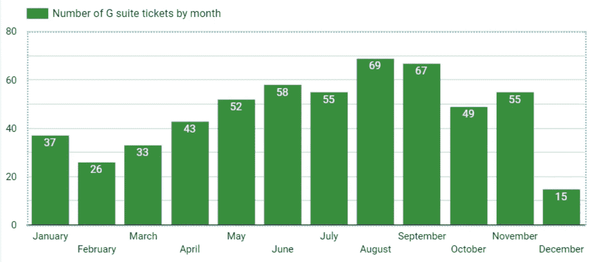
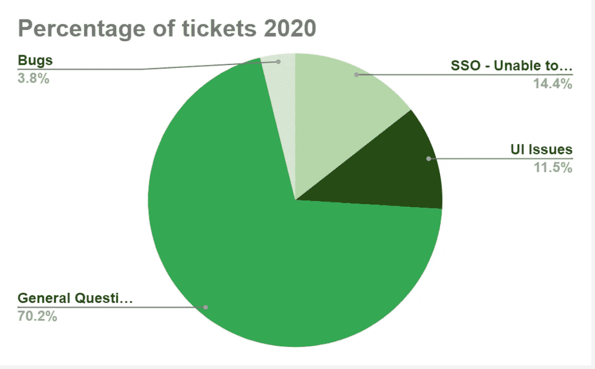
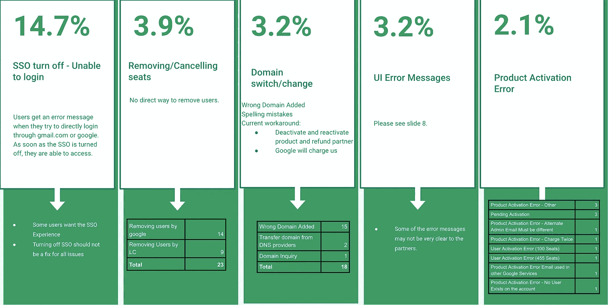
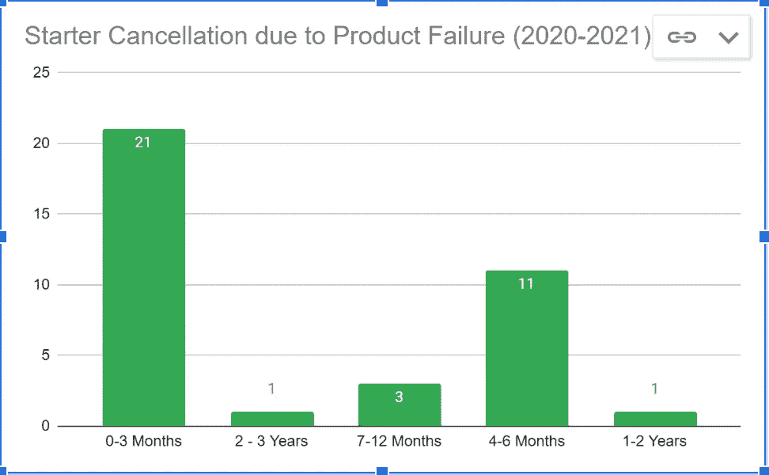

# 拥抱消极

> 原文：<https://blog.devgenius.io/embracing-the-negative-34f7d6eaacea?source=collection_archive---------25----------------------->

今天是美好的一天，我认为这是最好的心情助推器来写下我最大的项目之一，它将我的职业生涯带到了一个新的高度。那时候，我从一名初级商业智能分析师做起，被交给一份有趣的分析工作。该项目旨在确定负面客户反馈数据如何帮助改变软件的用户体验，并有可能增加公司的收入。

按月统计的 G Suite(现为 Google Workspace)门票数量

这是这一切如何开始的一点背景，在 2020 年第四季度，我公司的支持团队开始看到谷歌工作区门票数量的趋势。一般来说，这是一个很大的迹象，表明更多的客户正在使用该产品。因此，建议该团队完成 Google Workspace 管理课程，以解决这些问题。在此期间，问题重复出现的趋势开始与提交的票证数量成正比。

按百分比划分的票据类型

票证流入的特定模式促使我深入分析这种情况，结果发现——这些票证中约有 15%只是由于软件和 Google Workspace 之间的 SSO 集成而无法登录，12%是 UX/UI 问题，4%是软件相关的错误。但是，大多数都是关于产品的培训性问题。该概述清楚地引出了一个想法，即客户无法自行配置产品，需要在一致的基础上寻求支持。

这让我想更深入地研究票证分析，并找到客户不断为类似问题而挣扎的根本原因。我创建了一个包含更多细分数据的图表，并决定向产品负责人展示我的研究成果。我希望能够做出改进，减少这些客户日益增长的痛点。

客户烦恼的详细原因

我与主要利益相关者开了一次会，会上我展示了我的发现并展示了一些例子。基于这一讨论，UX/UI 开发人员一致认为其中一些问题需要改进，并很快开始对长期存在的技术债务进行更新。

在与团队交谈后，我清楚地意识到故事并没有就此结束。它只是证实了一个事实，即客户数据不仅仅局限于 UX/UI 团队，还应该被更广泛的受众所关注。

这激起了其他利益相关者和我之间的对话，讨论这些常见问题和缺失功能是如何成为一个更普遍的问题——并可能通过研究有助于改进软件和增加收入的“负面”反馈数据来解决。

我真的觉得这个分析会给客户一个声音，这个声音会一直投射到后端开发过程。

取消统计

进一步的分析还证实，大多数合作伙伴仅在订阅后的 3 个月内与该公司合作，主要原因是—“*产品故障*”。Deep dive 还显示，有 4 家主要签约客户因同样原因取消了订单。

由于这个项目的主要重点是帮助降低流失率，所以对我来说，提出一些损害控制模式和潜在的解决方案非常重要:

支持部门采取了哪些预防措施？

*   寻找效率低下的临时解决方案。
*   提供变通办法——这不是长期解决方案，因此会导致平台不稳定。
*   倾听沮丧的伴侣，他们感到无助，想要离开。

为了减轻支持团队成员的负担，我建议制定以下成长和改进计划:

*   从支持团队收集更多合作伙伴沟通数据。
*   提出一个流程，让合作伙伴感受到更多的倾听。
*   利用客户的负面反馈来激发持续改进。
*   通过利用所有这些流程，尽可能避免客户流失，同时帮助增加收入。

最终，这个项目成为我在公司最大的成就之一。我被邀请在管理团队面前展示我的发现。我的工作得到了公司许多利益相关者的赞赏，最让我高兴的是，首席技术官很快跟进并认可了我的工作，从而对支持和开发团队之间的沟通过程产生了影响。在我的演讲后不久，一个大的结构性变化被宣布，现在 80%的重点将转移到技术债务，而 20%将是功能发布。