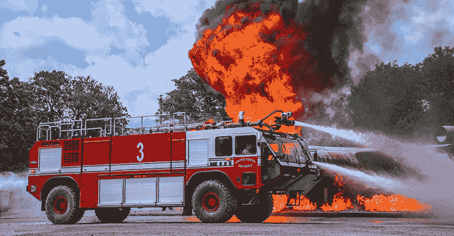

# 灾难移交应急计划

> 原文：<https://blog.devgenius.io/emergency-plan-for-disaster-handover-36c52227d5ba?source=collection_archive---------28----------------------->

扑灭这火:(

这个计划是为一家公司写的，我最近在那里和他们一起工作，**以避免灾难移交的后果**。该计划是根据老员工的情况编写的，并且建立在来自老团队的可交付成果的不同场景之上。我修改了它，与公众分享，我希望它可以为你们照亮一条路。

可交付成果假设:

1.  数据备份。
2.  数据的备份，带有表和数据流的完整描述。
3.  运行完全访问云的生产环境。
4.  为我们公司构建的源代码没有旧团队构建的库和模板-不可构建的代码。
5.  该软件的完整源代码。
6.  没有交付成果，只是运行生产环境。

# 数据备份

这个可交付成果很重要，但是如果和其他可交付成果分开，大部分时间是没有意义的。如果我们只收到一份备份，我们的选择将非常有限，我们将需要很长时间来对其进行分类，并且我们可能会也可能不会迁移到新系统中

这对我们来说是最坏的情况。

我们的计划是:

1.  通过在零数据领域有丰富知识的公司尝试一种货架解决方案。
2.  我们正在尝试对备份中的数据进行分类，以将其迁移到新系统中。这一步可能需要时间，而且可能不准确。
3.  我们将开始编写新系统所需的任何定制 BRD。
4.  我们将获得新系统的培训，以开发和建立新的功能。

# 数据备份，包含表和数据流的完整描述

这一交付成果使我们能够将一些数据转移到新系统，但这将需要更多的时间来实施定制模块，并且可能会丢失整个用例或实施基于缺乏可操作性的错误用例，并且生产将停止一段时间，用户可能需要接受新系统的培训。

我们的计划是:

1.  通过在零数据领域有丰富知识的公司尝试一种货架解决方案。
2.  我们将把它移植到新系统上。在这种情况下，这一步会更准确，但是根据描述细节和新旧系统之间的兼容性，数据迁移可能需要一些时间。
3.  我们将开始编写新系统所需的任何定制 BRD。
4.  我们将获得新系统的培训，以开发和建立新的功能。

# 运行完全访问云的生产环境

该交付品将帮助我们创建当前生产的副本，并帮助我们模拟当前情况，提取用例的逻辑并测试不同的场景。

好处:

1.  这将有助于创建业务需求文档。
2.  这将有助于保持公司的运转。
3.  这将有助于平稳过渡到新软件。
4.  这将有助于逆向工程来描述底部数据。

缺点:

1.  逆向工程可能需要很长时间。
2.  有些用例很难知道它的数据流。

我们的计划是:

1.  从当前环境创建一个测试环境。
2.  我们将使用测试环境对当前数据流进行逆向工程。
3.  我们将为当前系统编写 BRD。
4.  我们将获得关于我们可以转移到的最佳货架解决方案的咨询。
5.  我们将接受新系统的培训。
6.  我们将开发新系统的定制需求。

# 不可构建的源代码+运行完全访问云的生产环境

如果给出的源代码没有构建系统的能力，那么源代码有助于跟踪软件行为，并且将更加确定数据流

好处:

1.  这将有助于创建业务需求文档。
2.  这将有助于保持公司的运转。
3.  这将有助于平稳过渡到新软件。
4.  这将有助于很好地了解软件逻辑和数据层。

缺点:

1.  在迁移到新系统的过程中，我们将无法构建系统或添加新功能。

我们的计划:

1.  从当前环境创建一个测试环境。
2.  我们将使用测试环境来检查当前代码是否正确。
3.  我们将为当前系统编写 BRD。
4.  我们将获得关于我们可以转移到的最佳货架解决方案的咨询。
5.  我们将接受新系统的培训。
6.  我们将开发新系统的定制需求。

# 完整的源代码可用于构建+运行生产环境，完全访问云

如果源代码具有构建系统的能力，则源代码有助于实现新的功能，并有助于理解软件行为

好处:

1.  在迁移到新系统的过程中，我们将能够构建系统或添加新功能。
2.  这将有助于创建业务需求文档。
3.  这将有助于保持公司的运转。
4.  这将有助于平稳过渡到新软件。
5.  这将有助于很好地了解软件逻辑和数据层。

我们的计划:

1.  从当前环境创建一个测试环境。
2.  我们将使用测试环境来检查当前代码是否正确。
3.  我们将尝试在测试环境中部署新版本
4.  我们将为当前系统编写 BRD。
5.  我们将获得关于我们可以转移到的最佳货架解决方案的咨询。
6.  我们将接受新系统的培训。
7.  我们将开发新系统的定制需求。

# 没有交付成果，只是运行生产环境

这是最坏的情况，我们不会从老团队那里得到任何东西，他们会让系统运行一段时间。

我们的计划是:

1.  通过在零数据领域有丰富知识的公司尝试一种货架解决方案。
2.  我们将通过旧系统提供的报告提取数据，将数据处理为 CSV，并将其迁移到新系统。
3.  我们将开始编写新系统所需的任何定制 BRD。
4.  我们将获得新系统的培训，以开发和建立新的功能。

# 最后

如果你很想知道发生了什么，以及我们是如何处理这种困境的，请留言鼓励我继续写下这段经历:)

# 关于我

我是 Alaa Alsalehi，专业后端和移动开发人员。我是宠物绿洲公司的首席技术官，该公司是沙特阿拉伯宠物行业的领先公司之一。我有一家食品食谱内容初创公司，每月活跃用户超过 25 万。