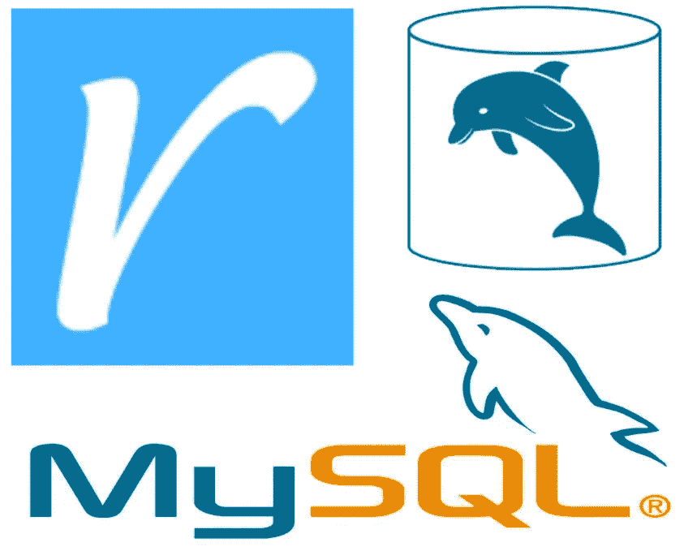
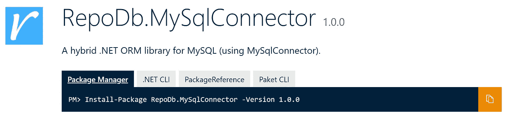

# 用 MySqlConnector + RepoDb 支持 C# MySQL 数据库访问

> 原文：<https://blog.devgenius.io/empowering-the-c-mysql-db-access-with-mysqlconnector-repodb-85ad12066244?source=collection_archive---------6----------------------->

# **简介**

[MySqlConnector](https://mysqlconnector.net) 是 MySQL Server、MariaDB、Percona Server、Amazon Aurora、Azure Database for MySQL、Google Cloud SQL for MySQL 等的 ADO.NET 数据提供商。它提供了 DbConnection、DbCommand、DbDataReader、DbTransaction 的实现—从托管代码查询和更新数据库所需的类。MySqlConnector 自称是 MySQL 在。净空间。众所周知，它比 [MySql 更快更优。数据](https://www.nuget.org/packages/MySql.Data/)甲骨文写的数据提供者。

[RepoDb](http://repodb.net/) 是开源的。NET ORM 弥补了微表单和完整表单之间的差距。它帮助开发人员在开发过程中简化何时使用基本和高级操作的切换。它是 Dapper 和 Entity 框架的最佳替代 ORM。RepoDb 声称是中速度最快、效率最高的 ORM 库。NET 其中甚至以巨大的差距超过了[衣冠楚楚](https://www.nuget.org/packages/Dapper/)的表现。它最适合希望用更简单和动态的实现来控制数据访问层的开发人员。

我们正在敲窗户。NET/MySQL 社区关于 MySQL DB 可访问性空间的新构建和发布的功能。通过这两个库的结合，MySQL 的 DB accessibility 现在非常强大，因为这两个包为用户提供了不同的优势。

# **关于图书馆**

该库被部署为名为 [RepoDb 的 Nuget 包。MySqlConnector](https://www.nuget.org/packages/RepoDb.MySqlConnector) ，其中两者都是由 RepoDb 和 MySqlConnector 的作者创作的。该项目托管在 [Github](https://github.com/mikependon/RepoDb/tree/master/RepoDb.MySqlConnector) 作为 RepoDb 的扩展。

在写这篇文章的时候，这个库正在发布它的第一个版本。测试套件(包括[单元](https://github.com/mikependon/RepoDb/tree/master/RepoDb.MySqlConnector/RepoDb.MySqlConnector.UnitTests)和[集成](https://github.com/mikependon/RepoDb/tree/master/RepoDb.MySqlConnector/RepoDb.MySqlConnector.IntegrationTests)测试)被编写为涵盖其所有操作的数百个真实业务场景。

> 通过使用这个库，您已经在一次安装中继承了这两个强大软件包的所有功能。

# **开始使用**

首先，通过软件包管理器控制台安装软件包。

然后，调用引导程序一次。

自举完成后，就可以立即使用这个库了。

或者，请访问我们的官方 MySQL [入门](http://repodb.net/tutorial/get-started-mysql)页面了解更多信息。

# **插入一条记录**

要插入记录，使用[插入](http://repodb.net/operation/insert)方法。

要插入多行，请使用 [InsertAll](http://repodb.net/operation/insertall) 方法。

# **查询记录**

要查询记录，使用[查询](http://repodb.net/operation/query)方法。

要查询所有行，请改用 [QueryAll](http://repodb.net/operation/queryall) 方法。

# **合并一条记录**

要合并记录，使用[合并](http://repodb.net/operation/merge)方法。

要合并所有行，请使用 [MergeAll](http://repodb.net/operation/mergeall) 方法。

# **删除记录**

要删除记录，使用[删除](http://repodb.net/operation/delete)方法。

默认情况下，它使用主键作为限定符。其他字段也可以通过 Linq 表达式使用。

要删除所有行，请使用 [DeleteAll](http://repodb.net/operation/deleteall) 方法。

也可以为此方法传递主键列表。

# **更新记录**

要更新记录，使用[更新](http://repodb.net/operation/update)方法。

要更新所有行，请改用 [UpdateAll](http://repodb.net/operation/updateall) 方法。

默认情况下，主(或标识)字段用作限定符。其他字段也可以用作限定符。

# **执行 SQL 文本**

要执行查询，请使用 [ExecuteNonQuery](http://repodb.net/operation/executenonquery) 方法。

要在期望类对象结果的同时执行查询，则使用 [ExecuteQuery](http://repodb.net/operation/executequery) 方法。

要执行一个查询，同时期望得到一个结果，那么使用 [ExecuteScalar](http://repodb.net/operation/executescalar) 方法。

要在期待 DbDataReader 结果的同时执行查询，那么使用 [ExecuteReader](http://repodb.net/operation/executereader) 方法。

# **社区地址**

我们在这里从社区收集一些关于使用图书馆的经验的反馈。

对于任何问题，您可以直接访问 RepoDb 的官方渠道。

[GitHub](https://github.com/mikependon/RepoDb/issues) —针对任何问题、请求和难题。

[StackOverflow](https://stackoverflow.com/questions/tagged/repodb) —任何技术问题。

[推特](https://twitter.com/search?q=%23repodb)——获取最新消息。

[Gitter Chat](https://gitter.im/RepoDb/community) —用于直接和现场 Q & A。

原文可以在这里找到[。感谢您阅读这篇文章。](http://repodb.net/blogs/repodb/2020/05/30/empowering-mysql-db-access.html)