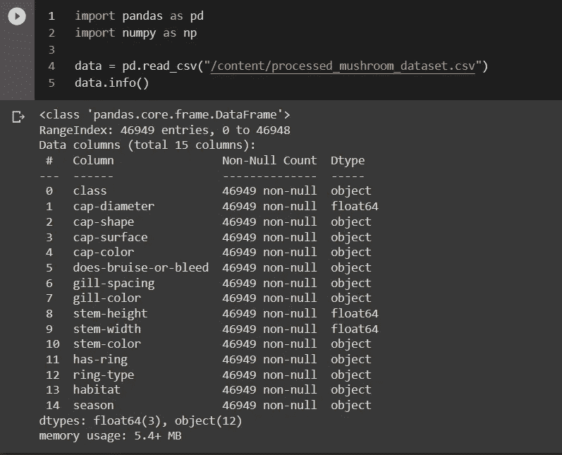

# 机器学习中分类数据的编码方法

> 原文：<https://blog.devgenius.io/encoding-methods-to-encode-categorical-data-in-machine-learning-717b5509933c?source=collection_archive---------7----------------------->

在机器学习领域，在进行建模之前，数据准备是一项强制性任务。在准备数据时，我们需要执行各种步骤，对分类数据进行编码是其中一项被认为至关重要的任务。大多数机器学习算法只接受数字数据作为输入。例如，K-最近邻算法计算特征的两个观察值之间的欧几里德距离。来计算两个观察值之间的欧几里得距离，因此传递的输入应该是数字类型的。因此，在将数据提供给算法之前，必须将分类数据转换或编码为数字类型，这反过来会产生更好的结果。

*分类数据*可以认为是被分组的有限可能值。例如，不同的血型、性别、不同的城市和州。分类数据有两种类型:

*   **有序数据**:由一组有限的离散值组成的数据，这些离散值具有一个优先顺序或优先级别。示例—[低，中，高]，[正，负]，[真，假]
*   **名义数据**:由一组有限的离散值组成的数据，这些值之间没有关系。例如— ["印度"、"美国"、"英国"]、["狮子"、"猴子"、"斑马"]

对于序号数据，在对数据进行编码并训练模型之后，我们需要再次将其转换为原始形式，因为需要它来正确预测值。但是对于名义数据，这不是必需的，因为这里偏好并不重要，我们只需要信息。

**对分类数据进行编码**是将分类数据转换为整数格式的过程，以便将转换后的分类值数据提供给模型，从而给出并改进预测。

理论讲得够多了，让我们从编码部分和我们可以用来编码分类数据的不同技术开始。在本教程中，我们将使用来自 UCI 的经过处理的蘑菇数据集。这里 可以找到 [**。**](https://github.com/muttinenisairohith/Encoding-Categorical-Data/tree/main/data)

## **加载数据集**



加载数据

正如我们所看到的，我们有 15 列，其中 12 列的数据类型是 object，该数据中没有缺失值。因此，在建模之前，我们需要对这 12 个特征进行编码。

## **标签编码**

在标签编码中，每个标签将被转换成整数值。这里的输出将是一维的。


```
#using scikit-learn
#Import LabelEncoder using sklearnfrom sklearn.preprocessing import LabelEncoderle = LabelEncoder()data["season"] = le.fit_transform(data["season"])
```

## 顺序编码

类似于标签编码，但是当我们打算将输入变量组织成行和列时，通常使用顺序编码。(例如:Matix)


```
#using scikit-learn
#Import OrdinalEncoder using sklearnfrom sklearn.preprocessing import OrdinalEncoderoe = OrdinalEncoder()encoded_data["season"] = oe.fit_transform(data[["season"]])
```

## **一个热编码**

在一次性编码中，任何分类变量的每个类别都有一个新变量。它用二进制数(0 或 1)映射每个类别。当数据是名义数据时，使用这种类型的编码。新创建的二进制特征可被视为**虚拟变量**。在一次热编码之后，虚拟变量的数量取决于数据中出现的类别的数量。


对于一个热编码，我们将使用 category_encoders 包而不是 sklearn，因为它更有用。

```
!pip install category_encoders
```

代码:

```
#Import OneHotEncoder from category_encoders
from category_encoders import OneHotEncoderohe = OneHotEncoder( handle_unknown='return_nan', return_df=True, use_cat_names=True)ohe_results = ohe.fit_transform(data[["season"]])
```

## [多列编码器](https://pypi.org/project/MultiColumnLabelEncoder/)(首选方法)

使用 MultiColumnLabelEncoder 的主要优点是，每当模型包含顺序数据时，在编码之后，我们需要对数据进行逆变换，并获得原始数据，因此使用 MultiColumnLabelEncoder，顾名思义，在一个步骤中对多个列进行编码。

它的工作方式几乎类似于标签编码，但它适用于单个实例中的多个列，逆转换和获取原始数据太容易了。

安装:

```
!pip install MultiColumnLabelEncoder
```

编码代码:

```
from MultiColumnLabelEncoder import MultiColumnLabelEncoderMcle = MultiColumnLabelEncoder()
encoded_data = Mcle.fit_transform(encoded_data)encoded_data.head()
```

在这里，它将对数据框中的所有对象列进行编码。我们也可以传递 columns 参数，如果传递了 columns 参数，它将只对传递的列名进行编码。

逆拟合变换:

```
inverse_encoded_data = Mcle.inverse_fit_transform(encoded_data)inverse_encoded_data.head()
```

先前使用的相同字符串列将用于反转，但是如果我们只想传递某些列，我们可以通过传递一个可选的参数列来实现

## 结论

还有其他编码库可用于编码，pandas 中的内部函数(如 map、replace、apply)也可用于编码，但上面提供的方法是对数据进行编码和及时逆变换的简单方法。所以我跳过了这些方法。

快乐编码…

保持快乐…