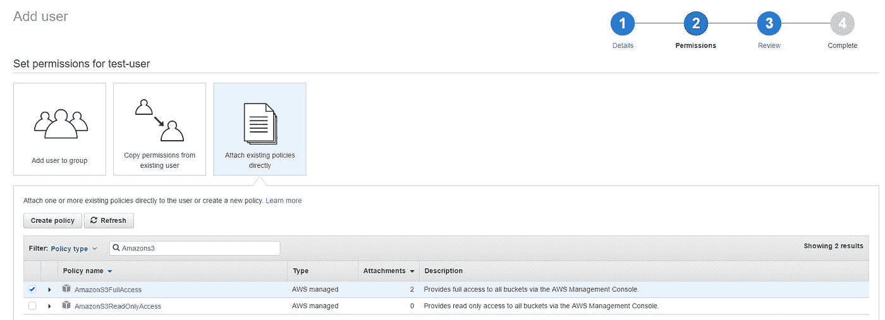

# 使用 AWS S3 加密和存储上传的文件

> 原文：<https://blog.devgenius.io/encrypt-and-store-uploaded-files-using-aws-s3-7f9def79d8df?source=collection_archive---------0----------------------->


弗洛里安·克拉姆在 [Unsplash](https://unsplash.com?utm_source=medium&utm_medium=referral) 上拍摄的照片

您是否曾经希望编写一个简单的 web 表单，允许用户上传各种敏感数据，而不必开发复杂的加密机制？

这里有一个使用 Amazon Web Services 提供的简单存储服务的令人惊讶的简单解决方案。以下代码片段使用 JavaScriptNode 在后端，Angular 在前端，但是 AWS 文档包含了一系列现代技术的例子，包括 C#和 Java。

请注意，本文包含了一些独立的代码片段来提供指导，但它并不是一个完整的指南，并假设您能够进行任何必要的更改和添加，以便将逻辑与您自己的 API 和前端集成。有几个关于如何在 Node 中创建 REST API 的优秀指南，比如 scotch.io 的[这个](https://scotch.io/tutorials/build-a-restful-api-using-node-and-express-4)

步骤 1:创建并配置 s3 存储桶

出于这篇简短文章的目的，我假设您已经安装了 AWS 控制台。下面是[入门指南](http://docs.aws.amazon.com/gettingstarted/latest/awsgsg-intro/gsg-aws-intro.html)。

登录到您的控制台并访问 s3。点击“创建存储桶”:


将出现存储桶创建向导；选择一个名称，然后单击“创建”。


选择您的新 bucket 并打开“Permissions”选项卡。点击“存储桶策略”:


粘贴以下示例策略以实施加密:

```
{
    "Version": "2012-10-17",
    "Id": "PutObjPolicy",
    "Statement": [
        {
            "Sid": "DenyUnEncryptedObjectUploads",
            "Effect": "Deny",
            "Principal": "*",
            "Action": "s3:PutObject",
            "Resource": "arn:aws:s3:::my-bucket/*",
            "Condition": {
                "StringNotEquals": {
                    "s3:x-amz-server-side-encryption": "aws:kms"
                }
            }
        }
    ]
}
```

现在，要创建用户并授予他们访问存储桶的权限，请转到“我的安全凭据”>“用户”和“添加用户”:


给用户一个名称，勾选“编程访问”，然后单击“下一步”:


选择“直接附加现有策略”并选择 AmazonS3FullAccess:



还要给他们“ProgrammaticUploadPermission”:


现在，您应该可以看到将在代码中使用的访问密钥 ID 和秘密访问密钥—保存它们:


第二步:编写后端逻辑

在节点 API 中，安装 AWS-SDK:

```
npm install aws-sdk *--save*
```

在你的 API 中编写上传方法:这里有一个通过 Babel 使用 ES6 的例子。同样，这只是一个指南，您的实现可能会有所不同！

```
import AWS from 'aws-sdk'

 const uploadFile = (file) => {
     AWS.config.update({
        'accessKeyId': mys3AccessKeyId,
        'secretAccessKey': mys3SecretAccessKey
     })
     let s3 = new AWS.S3({"signatureVersion":"v4"})
     let key = file.fileName + "." + file.fileExtension
     s3.putObject({
           'Bucket': 'my-bucket',
           'Key': key,
           'Body': new Buffer(file.base64Contents, 'base64'),
           'ACL': 'public-read',
           'ContentType': 'application/pdf',
           'ServerSideEncryption': 'aws:kms'
     }, (err, res) => {
           return {
                success: true,
                fileUrl: 'https://s3-eu-west-1.amazonaws.com/my-bucket/' + key
           }
     }
}
```

创建一个端点并进行测试。

第三步:编写前端逻辑

下面是一个 AngularJS 控制器将文件发布到 API 的示例——根据您的需要，您可以创建一个单独的文件上传服务或工厂来帮助实现可重用性:

```
angular.module('my-app')
.controller('fileUploadController', ['$scope', '$q',
    function($scope, $q) {

    var self = this;

    self.getFileReader = function(deferred) {
        var fileReader = new FileReader();
        fileReader.onload = self.onLoad(fileReader, deferred);
        fileReader.onerror = self.onError(fileReader, deferred);
        return fileReader;
    }

    self.getBase64Contents = function(file) {
        var deferred = $q.defer();
        var fileReader = self.getFileReader(deferred);        
        fileReader.readAsDataURL(file);
        return deferred.promise;
    }

    $scope.upload = function ($event) {
        var deferred = $q.defer();
        var file = $event.target.files[0];
        *// Implement your validation and error handling*
        if (!file.Valid) {
            *// Do something*
        }      
        else {
            return self.getBase64Contents(file).then(function (base64) {
                file.base64Contents = base64;
                $http.post('https://my-endpoint.com/uploadFile', file).then(function(response) {                            
                    deferred.resolve(response)        
                    return deferred.promise;    
                })                                        
            })
        }            
    }
}
```

在 HTML 中:

```
<input type="file" file-upload="processFile($event)" />
```

轻松点。

那么，什么时候应该加密上传的文件呢？

任何时候，他们包括个人身份信息，包括用户的姓名，电子邮件地址，其他联系方式，出生日期等。或任何其他敏感信息，如事务日志或业务敏感数据。

有关以编程方式访问 s3 bucket 对象的更多信息，请参见[文档](http://docs.aws.amazon.com/AmazonS3/latest/API/RESTObjectPUT.html)。

有关桶安全策略的更多信息，请参见[此处](http://docs.aws.amazon.com/AmazonS3/latest/dev/UsingServerSideEncryption.html)。