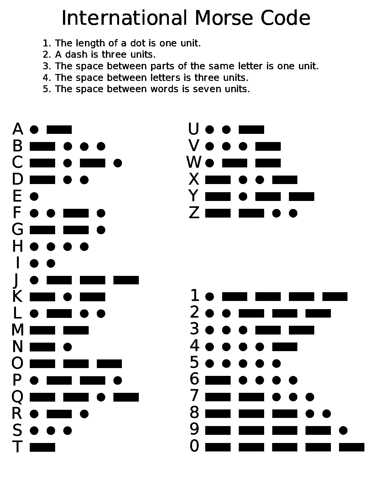
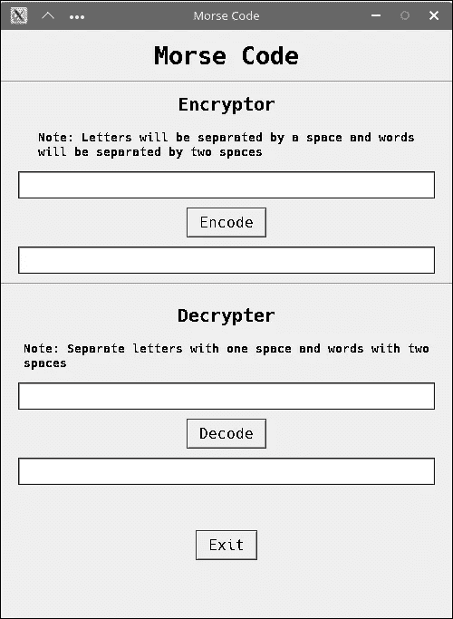
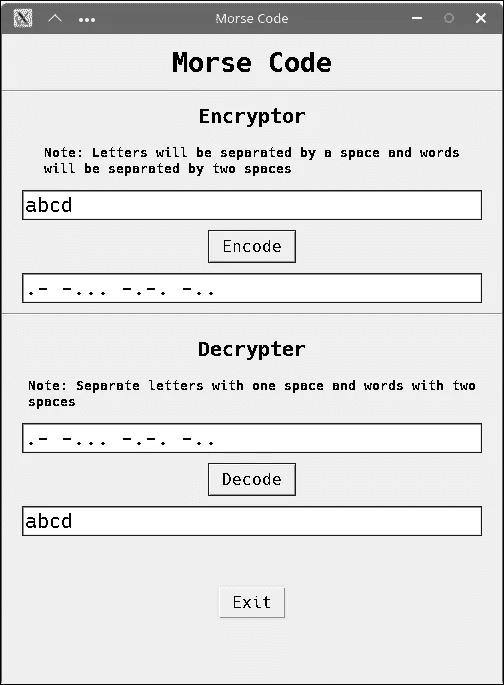
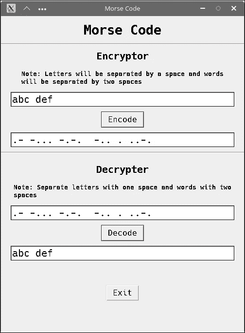

# 使用 Python (GUI)加密和解密莫尔斯电码

> 原文：<https://blog.devgenius.io/encrypting-and-decrypting-morse-code-using-python-d004531bd6c5?source=collection_archive---------3----------------------->

莫尔斯电码

在这篇文章中，我们将学习如何用 Python 加密和解密莫尔斯电码。并使用 Tkinter 构建图形界面。
GitHub 回购:[https://github.com/arabind-meher/MorseCode.git](https://github.com/arabind-meher/MorseCode.git)

# 什么是莫尔斯电码？

莫尔斯电码是电信中使用的一种方法，用于将文本字符编码为两种不同信号持续时间的标准化序列，称为点和破折号。它是以电报的发明者之一塞缪尔·莫尔斯的名字命名的。

# 初始项目工作

这个项目唯一的需求就是 python 和莫尔斯码 JSON 文件中的 Tkinter 和 JSON 包( [morse2text.json](https://github.com/arabind-meher/MorseCode/blob/master/morse2text.json) ， [text2morse.json](https://github.com/arabind-meher/MorseCode/blob/master/text2morse.json) )。要了解如何在 python 中设置虚拟环境，可以访问[Python 虚拟环境简介](https://medium.com/@arabind-meher/brief-introduction-to-python-virtual-environments-5eb0ad5e8921)。

# 加密和解密莫尔斯电码

> 注意:莫尔斯电码中的单词将由双空格分隔，字母将由单空格分隔。

## 加密摩斯密码

该方法将使用两个函数:

1.  **encryptor()** :它以一个字符串(文本中的一个单词或句子)作为参数。如果传递了一个单词，那么它将调用 *encrypt_word()* 函数，否则它将把句子拆分成一个单词列表，并逐个传递给 *encrypt_word()* 函数。得到结果后，它会把所有的单词连接成一个句子，并返回值。
2.  **encrypt_word()** :它以一个字符串(文本中的一个单词)作为参数。字符串将通过一个循环，每个字母将使用 *text2morse.json* 文件转换成莫尔斯电码。最后，这些字母将被连接起来组成单词。

## 解密莫尔斯电码

该方法将使用两个函数:

1.  **decrypter()** :它以一个字符串(莫尔斯电码中的一个单词或句子)为参数。如果一个单词被传递，那么它将调用 *decrypt_word()* 函数，否则它将把句子拆分成一个单词列表，并逐个传递给 *decrypt_word()* 函数。得到结果后，它会把所有的单词连接成一个句子，并返回值。
2.  **decrypt_word()** :它以一个字符串(莫尔斯电码中的一个单词)为参数。字符串将通过一个循环，其中每个字母将使用 *morse2text.json* 文件转换成纯文本。最后，这些字母将被连接起来组成单词。

## 最终代码

[https://gist . github . com/arabind-meher/4c F4 CD 17 f 08 f 9 b 151473 f 06 e 5 FB 817 f 9](https://github.com/arabind-meher/MorseCode/blob/master/morse.py)

# 用 Python 构建 GUI

我们将使用 Tkinter 作为图形用户界面，因为它简单易用，而且是跨平台的。

[https://github . com/arabind-meher/morse code/blob/master/main . py](https://github.com/arabind-meher/MorseCode/blob/master/main.py)

# 截屏

