# Google 云平台中的端到端 DBT 项目(第一部分)

> 原文：<https://blog.devgenius.io/end-to-end-dbt-project-in-google-cloud-platform-part-1-ea14dd11cf9e?source=collection_archive---------2----------------------->

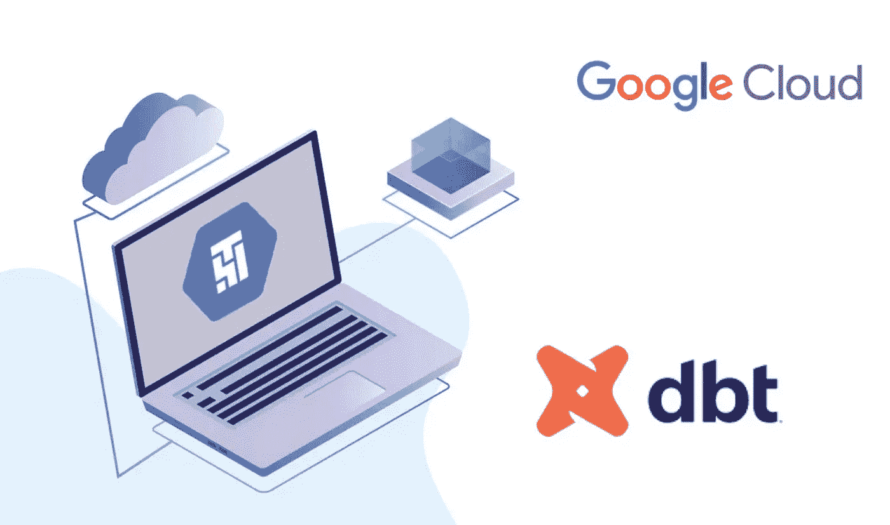

在许多公司，建立数据仓库和进行分析仍然是一个未解决的问题。幸运的是，在当前这个年龄，生活变得越来越容易。

DBT 是一个分析工程工具，是这个难题的一部分。它有助于转换阶段，旨在“使数据分析师和工程师能够更有效地转换他们仓库中的数据”。在过去的几年里，数据工程师和数据分析师之间的差距越来越大。工程师们正在使用更复杂的工具，例如，用面向对象的编程语言编写数据管道，并使用类似 airflow argo 或 dagster 的编排器。另一方面，分析师仍然更喜欢 SQL，并使用不支持工程最佳实践(如代码版本控制)的无代码工具。dbt 通过扩展 SQL 和提供围绕数据转换模型的工具来缩小差距。

在本文中，我们将涵盖许多关于 DBT 的基本概念，创建和配置我们的第一个 DBT 项目，并查看一些用于验证和询问项目的有用命令。最后，我们将在谷歌云平台上运行该项目。我们将在下一篇文章中讨论该项目的 Devops 和 CICD 过程。

开始吧！

# **1。什么是 DBT？**

我建议你先看看 [dbt 介绍文章](https://docs.getdbt.com/docs/introduction)，但是对于初学者来说；

*dbt(数据构建工具)使分析工程师能够通过简单地编写 select 语句来转换他们仓库中的数据。dbt 负责将这些 select 语句转换成表和视图。dbt 执行 ELT(提取、加载、转换)过程——它不提取或加载数据，但是它非常擅长转换已经加载到仓库中的数据。*

这些是最重要的特征；

*   **编排** : *dbt* 自动检测模型之间的依赖关系(沿袭)，生成依赖图(DAG)并能以正确的顺序执行 SQL(模型)。
*   **部署**:支持开发和生产环境，使用 *dbt* 库跟踪历史，基本上强迫你使用代码库。
*   **测试&集成** : *dbt* 使您能够轻松设置测试(缺失数据、数据格式等)并执行集成测试。
*   灵活性:轻松重建或回填表格。
*   **文档** : *dbt* 自动生成文档/数据目录
*   **DRY** :可重用的宏代码块

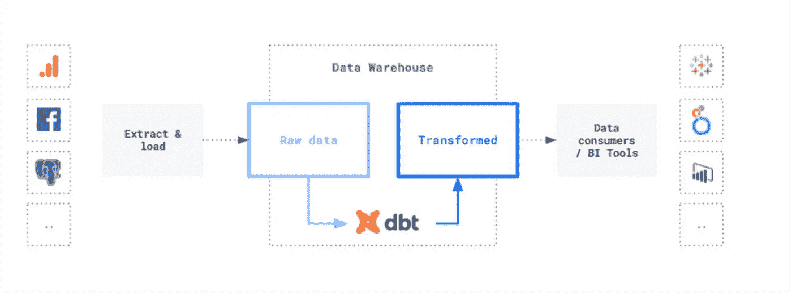

# **2。环境设置**

我们将使用[诗歌](https://python-poetry.org/docs/)进行 python 依赖管理，所以我建议按照官方文档在您的本地环境中安装该工具。

1.  初始化项目:

`poetry new dbt-gcp --name analytics`

它将创建一个文件夹，如下所示:

```
dbt-gcp
├── pyproject.toml
├── README.md
├── analytics
│   └── __init__.py
└── tests
    ├── __init__.py
    └── test_my_package.py
```

我们的 python 依赖项将在 pyproject.toml 文件中列出。如果你不喜欢诗歌，你可以使用一个“requirements.txt”文件来保存你的依赖项。

分析文件夹将包含我们的 DBT 项目和我们所有的 SQL 文件。

2.安装 DBT

`poetry add dbt-bigquery`

3.初始化 DBT 项目

您开发的转换将被逻辑地分组到 DBT 项目中。例如，你可以为你的订单分析、网站分析和财务分析选择不同的项目。这里没有硬性的规则，只要对你和你的团队有用。

这尤其正确，因为我们可以使用[包](https://docs.getdbt.com/docs/building-a-dbt-project/package-management)在项目之间共享代码，我们将在另一篇文章中解释。例如，我们将使用“分析”作为我们的 DBT 包。

```
poetry run dbt init analytics
```

让我们看看创建了什么样的文件夹和文件。将创建以下文件夹:

*   模型——模型是您的核心转换，它接受源数据并输出目标表或视图；
*   分析——分析是临时的模型，我们需要它作为中间步骤，但是它不会持久化到数据库中；
*   数据——有时您需要静态数据和种子数据来进行转换；
*   宏——宏是可重复使用的代码块，被多个转换使用，给了我们重用的机会；
*   快照—数据库状态的快照；
*   测试——测试定义了您的转换的正确性。

dbt_project.yml 是项目根目录中的一个配置文件，允许指定项目级别的详细信息，例如找到各种组件的路径。请参考官方[文档](https://docs.getdbt.com/reference/dbt_project.yml)了解更多信息。

yml 保存了 DBT 和数据仓库之间的所有连接细节。它可以为不同的数据仓库定义几种不同的连接细节。它可以定义多个目标，比如生产环境和开发环境，分析师可以在其中测试和部署新的 SQL。

4.访问谷歌云平台项目

我们将使用 Bigquery 作为数据仓库，并将在 GCP 环境中测试我们的 DBT 项目。

# 3.DBT 构型

1.  **项目结构**

关于如何构建你的 DBT 项目，有很多好的观点，我们推荐阅读下面两篇文章，它们给出了如何构建你的项目的最佳实践，以及使用一个存储库和多个存储库的优缺点。

[https://discourse . get dbt . com/t/how-we-structure-our-dbt-projects/355](https://discourse.getdbt.com/t/how-we-structure-our-dbt-projects/355)

[https://discourse . get dbt . com/t/how-to-configure-your-dbt-repository-one-or-many/2121](https://discourse.getdbt.com/t/how-to-configure-your-dbt-repository-one-or-many/2121)

在本教程中，我们假设我们将在现有的 python 项目/应用程序中集成 DBT，我们将遵循如下所述的结构:

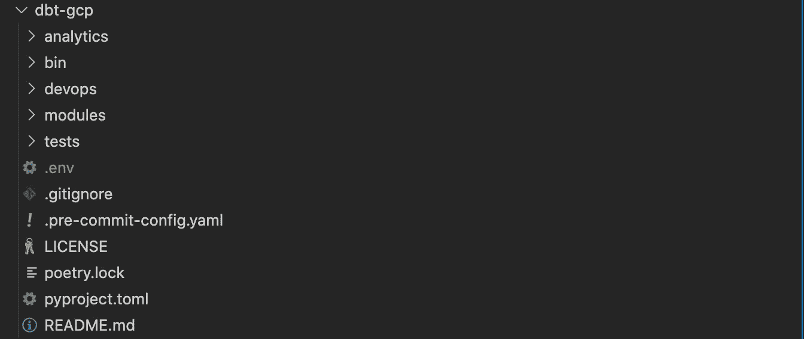

*   /bin:对于应用程序入口点或“主”文件
*   /devops:对于 cicd 和部署文件
*   /modules:主库和包
*   /analytics:一个或多个 dbt 项目/概要文件。为了简单起见，我们将实现一个单独的概要文件。
*   pyproject.tml 和 poetry.lock:我们将使用 poem 来处理 python 依赖关系。

分析文件夹是一个 dbt 项目，具有以下结构:

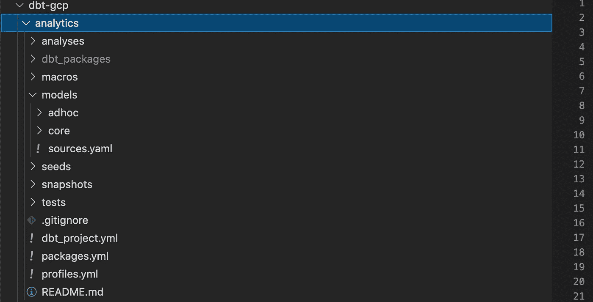

我们在分析/模型文件夹中创建了两个子文件夹:

*   分析/核心:一个重新组合“基本”或“暂存”sql 模型的文件夹。我们可以将它们定义为标准的或横向的数据对象，它们将被许多用例使用。
*   analytics/adhoc:一个对特定于 ad hoc/特定用例的 sql 模型进行重新分组的文件夹

这是分析/模型文件夹的结构:我们有 4 个核心/阶段模型(每个核心模型一个文件夹)和一个针对每个用例(财务、营销)的特别文件夹。在每个临时文件夹中，我们将找到数据模型(每个数据模型一个文件夹)。每个数据模型有一个文件夹的好处是将查询、文档和数据对象的质量测试放在一起，我相信这比将文档或数据质量的所有信息放在一个文件中更有组织性和灵活性。

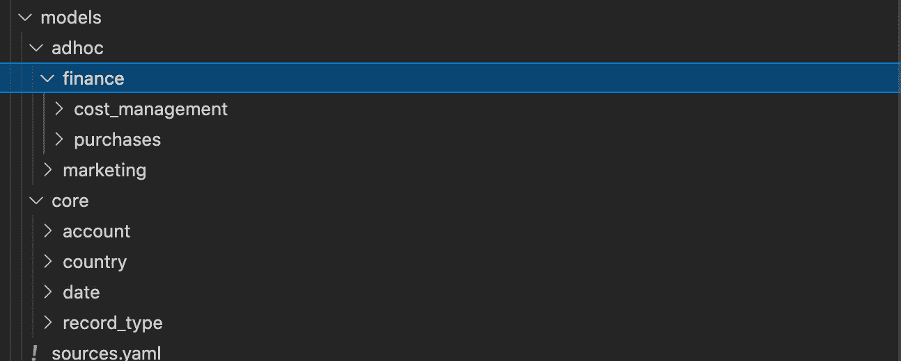

在核心或临时文件夹中，我们将按照以下约定放置所有数据模型:

每个数据模型都有一个包含查询、文档(doc.md)和质量测试(schema.yml)的文件夹。示例:模型帐户将位于文件夹 core/account/中，我们将在其中找到三个文件:

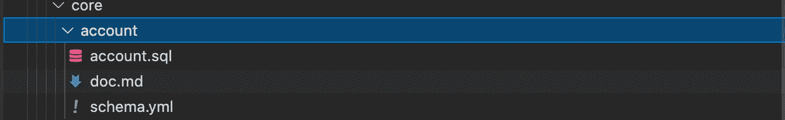

*   account.sql:模型的 sql 查询
*   doc.md:包含模型文档的 markdown 文件，您需要以块开始 markdown，并以结束。
*   schema.yml:一个 yaml 文件，包含要在模型上运行的质量测试。下面是一个测试的例子。你看我们引用了降价

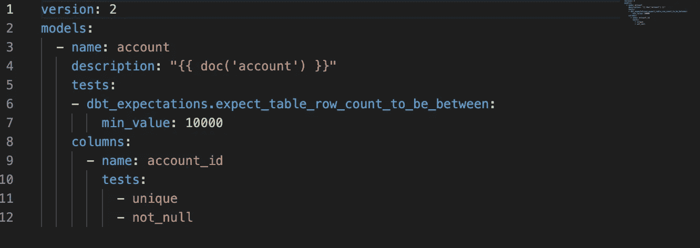

**2。轮廓**

为了设置您的 DBT 项目的配置，您需要更新“profiles.yml”来告诉 DBT 如何连接到您的数据库以及一些静态配置。我们建议对每个 GCP 环境/项目使用 dbt 概要文件，而不要在“profiles.yaml”文件中使用静态概要文件。下面是我们可以实现的基本配置文件:

*   sdx:您的沙盒环境的配置文件，以便所有开发人员和数据分析师在他们的本地机器上自主运行 DBT，并指向 GCP 沙盒环境。以便通过服务帐户集中访问您的沙盒项目。我们建议为沙盒环境设置参数“impersonate_service_account ”,并且您的分析工程师必须具有模拟此服务帐户的角色。
*   开发、uat 和生产:根据您的环境约束，我们建议为开发或 UAT 设置一个配置文件，为生产设置一个配置文件。这些与沙盒配置文件类似，只是“impersonate_service_account”被删除了，因为 dbt 将使用来自运行 dbt 操作的计算机的服务帐户的身份验证。

该配置文件如下所示:

```
config: fail_fast: trueanalytics: target: "{{  env_var('ENV')  }}"outputs: sdx:
   type: bigquery dataset: "" # Any value because it will be overwritten fixed_retries: 1 location: EU method: oauth priority: interactive threads: 4 timeout_seconds: 300 impersonate_service_account: SDX_SERVICE_ACCOUNT_ID project: "{{  env_var('GCP_PROJECT_APP')  }}" scopes: - https://www.googleapis.com/auth/bigquery maximum_bytes_billed: 1000000000dev:
   type: bigquery dataset: "" # Any value because it will be overwritten fixed_retries: 1 location: EU method: oauth priority: interactive threads: 4 timeout_seconds: 300project: "{{  env_var('GCP_PROJECT_APP')  }}" scopes: - https://www.googleapis.com/auth/bigquery maximum_bytes_billed: 10000000000
```

环境变量“ENV”应该是 dbt 概要文件中定义的目标之一(示例中为“dev”)。您需要通过设置环境变量 GCP 项目应用程序来设置运行 sql 查询的 GCP 项目。我们还没有定义概要文件的数据集(模式),因为我们将在下面介绍如何从您的 DBT 项目结构中动态生成这些参数。

**3。数据集和表格约定**

我们建议使用多个 BQ 数据集，并避免在“profiles.yaml”文件中使用静态数据集。这有许多好处，例如分离数据层(核心层、暂存层、临时层)以允许粒度 IAM 权限，还可以将您的模型具体化到它们自己的数据集中，以便对您的数据产品进行清晰的分离。我们可以使用 dbt 宏，以便使用文件夹结构动态生成数据集，在我们的例子中，我们需要覆盖内置宏“generate_schema_name ”,它为您的模型具体化定义了 BigQuery 数据集 ID。

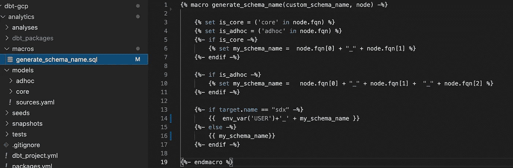

宏的逻辑如下:

*   从数据对象的父文件夹中推导出层(核心或临时)。
*   如果图层为“核心”，数据集名称将为“分析 _ 核心”
*   如果图层为“临时”，数据集名称将由“分析 _ 临时”和用例名称“分析 _ 临时 _ 营销”串联而成
*   如果 dbt 概要文件的目标是“SDX”，我们用 env_var('USER ')作为数据集的前缀，当我们有许多开发人员使用 dbt 在沙盒环境中同时工作时，这非常有用。

**4。模型具体化**

正如本文开头所解释的，当我们在项目文件夹中运行“dbt init”时，会自动创建一个配置文件“dbt_project.yml”。这个配置文件允许指定项目级别的细节，例如找到各种组件的路径，我们也可以使用它来指定我们的数据模型如何具体化(视图或表)。

默认情况下，dbt 模型被具体化为“视图”。通过提供如下所示的`materialized`配置参数，可以用不同的具体化来配置模型。

可以在查询开始时使用{ { config(materialized = ' table '…)} }在模型 sql 文件中直接配置物化，也可以在 dbt_project.yml 中指定物化。我们建议使用第二种方法，因为它可以在文件夹中指定物化。

在我们的例子中，我们决定默认将所有的模型具体化为 BQ 表，并且只在需要的时候指定“视图”具体化。我们的`dbt_project.yaml`看起来像:

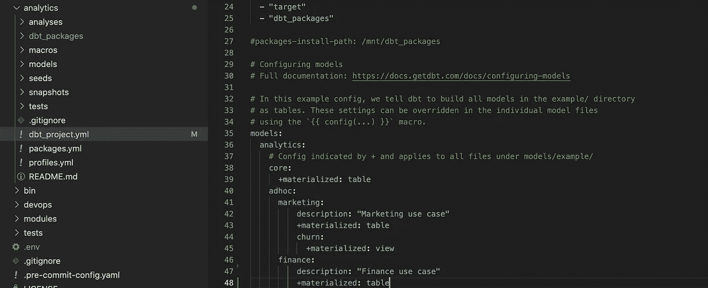

# **4。本地运行 DBT**

设置配置文件后，您可以在本地运行 DBT，检查数据仓库连接是否设置正确，并且可以在沙盒环境中创建数据模型。

首先，您需要设置所需的环境变量:

*   DBT 概要文件目录:在哪里可以找到 dbt 概要文件配置
*   GCP 项目应用:运行数据模型的谷歌云平台项目
*   环境:目标数据库环境(sdx，dev …)

我推荐使用。env 文件，以简化环境变量的设置。我本地的。env 文件看起来像:

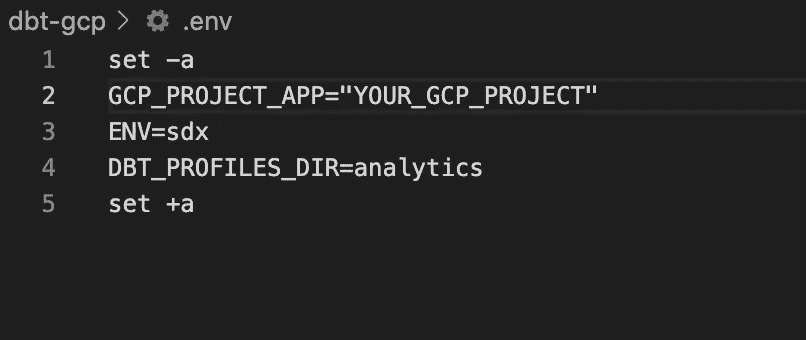

我只是在我的终端中运行`source .env`来设置这些变量。随意使用`export`命令或任何机制来设置这些变量。

下一步是运行`debug`命令来检查配置语法和到 BQ 的连接:

```
poetry run dbt debug --project-dir=analytics
```

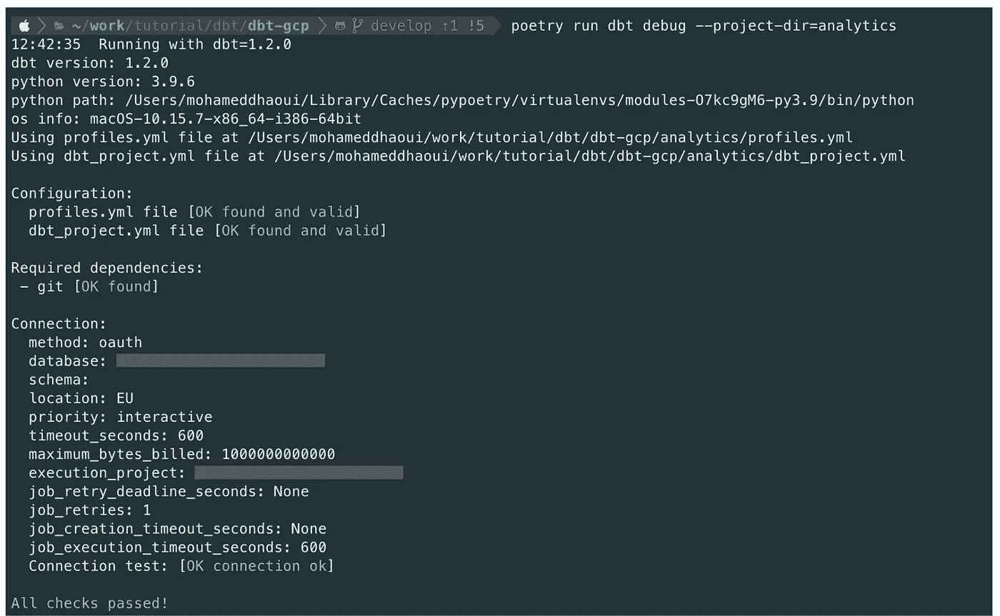

然后，我们需要安装 dbt 包，在我们的例子中，我们使用“dbt_utils”和“dbt_expectations”来运行数据质量测试，我们的 packages.yml 如下所示:

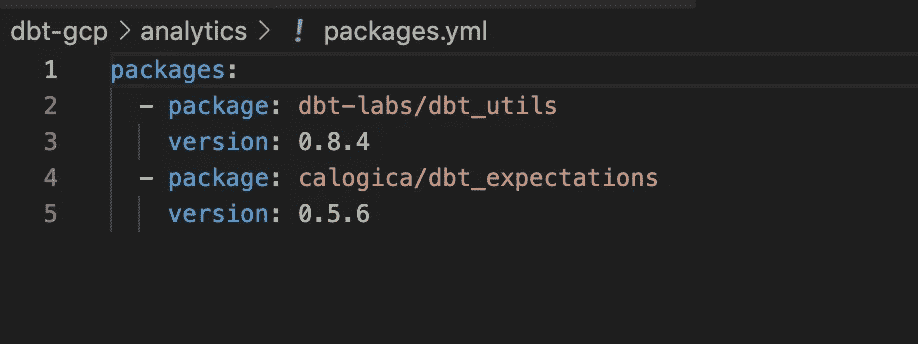

运行以下命令安装软件包:

```
poetry run dbt deps --project-dir=analytics
```

现在，我们可以使用以下命令同时运行所有数据模型:

```
poetry run dbt run --project-dir=analytics
```

它将在沙盒环境中创建核心和临时对象:

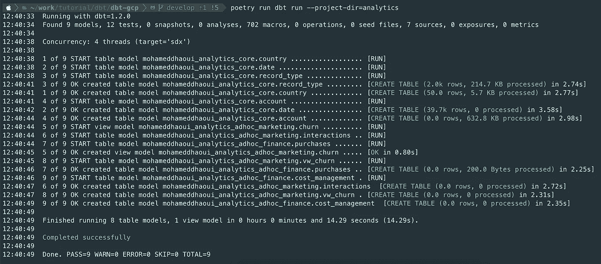

我们的 BQ 项目将如下所示，我们看到所有数据集都以沙盒环境中的用户名为前缀:

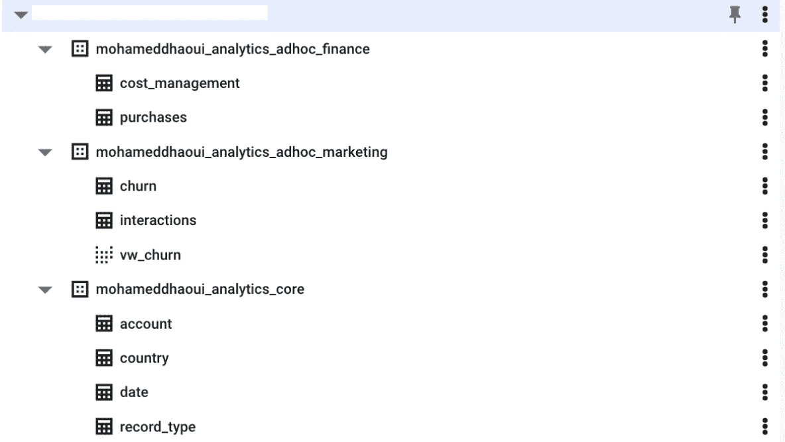

您还可以使用以下命令运行数据质量测试和模型:

```
poetry run dbt build --project-dir=analytics
```

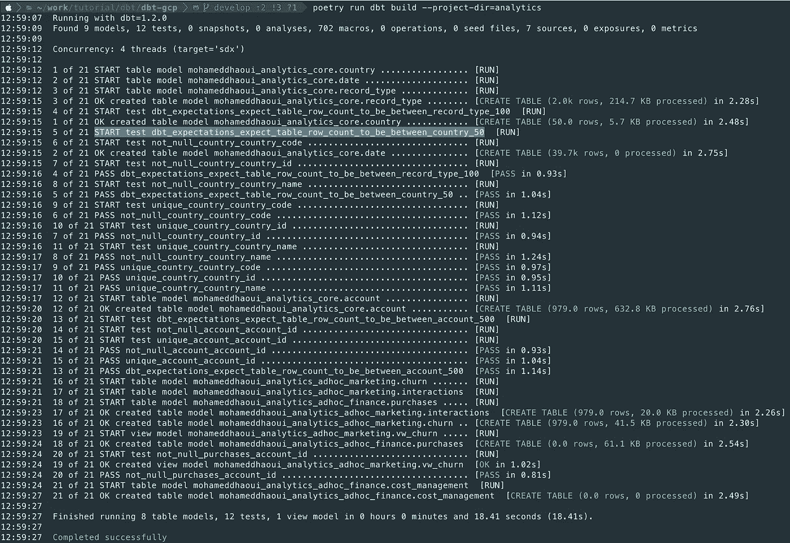

最后，DBT 允许您在每次运行数据转换的同时生成一个新的文档站点，以检查数据沿袭、查看模型文档和依赖关系、探索源代码的新鲜度以及在线查看 SQL 代码。您可以使用以下命令在本地生成并运行 UI:

```
poetry run dbt docs generate --project-dir=analytics # generate docspoetry run dbt docs serve --project-dir=analytics --port=8083 #serve the UI in your localhost
```

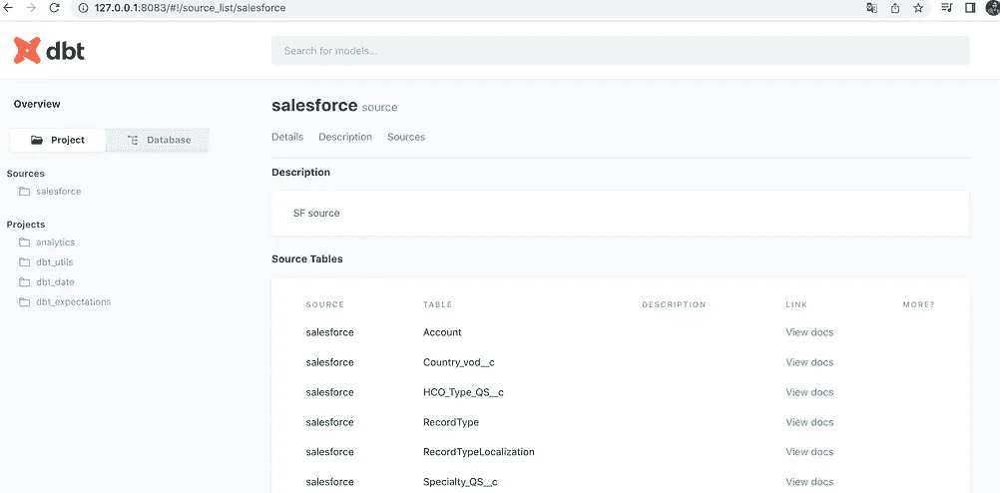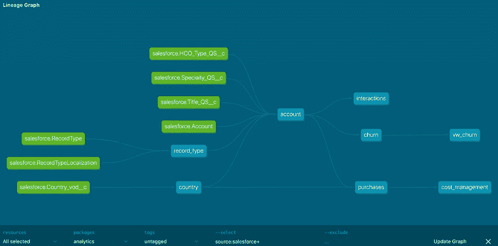

# 5.摘要

在本文中，我们研究了 dbt，创建了一个基本项目，然后使用各种 dbt 命令行工具在本地验证和运行该项目。

我们还查看了控制项目级配置的 dbt_project.yml，以及描述数据仓库连接细节的 profiles.yml。

在接下来的文章中，我们将在 Google 云平台中部署 dbt 项目，并实现 CICD 过程来自动化部署和交付过程。