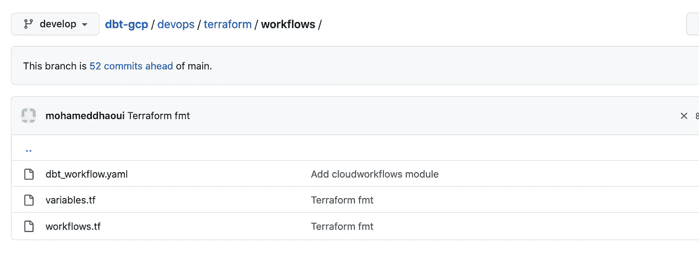

# 谷歌云平台中的端到端 DBT 项目(第三部分)

> 原文：<https://blog.devgenius.io/end-to-end-dbt-project-in-google-cloud-platform-part-3-ca1c575f45aa?source=collection_archive---------4----------------------->


在我之前的系列文章( [*第一部分*](/end-to-end-dbt-project-in-google-cloud-platform-part-1-ea14dd11cf9e) *和* [*第二部分*](https://blog.devops.dev/end-to-end-dbt-project-in-google-cloud-platform-part-2-d779ce8cc3d7) *)* ，*中，我介绍了 DBT 以及我们如何使用它来构建和执行分析工作流。我还建议使用* ***云构建*** *、****terra form****和* ***云运行*** *来打包和部署 DBT 项目。在本文中，我将展示如何集成已经部署了 Cloud RUN 的 DBT 服务，作为与云工作流协调的数据管道的一个步骤。*

为此，我们将开发一条管道，该管道:

*   运行数据摄取步骤。
*   调用运行 DBT 作业的云运行服务。
*   如果管道失败，则运行警报，否则打印 DBT 作业日志。

我们将继续使用前几篇文章中使用的代码结构。

# 1.谷歌云工作流程概述:

*我推荐从* [*这个视频*](https://www.youtube.com/watch?v=aOTFhWpjrFI&feature=youtu.be) *开始，给你一个产品的高层次概述。*

谷歌工作流于 2020 年 8 月 25 日在[首次推出。它是一个平台，作为一个无服务器的工作流，供开发人员编排和自动化谷歌云任务，并连接一系列基于 HTTP 的 API 服务。例如，您可以使用 Google Workflow 连接云运行微服务、云功能、外部 API 等。](https://cloud.google.com/workflows/docs/release-notes#January_25_2021)

工作流由一系列步骤组成，这些步骤指定了每个步骤要执行的功能，并以 YAML 或 JSON 格式编写。有关工作流程 YAML 语法的详细说明，请参见[语法参考](https://cloud.google.com/workflows/docs/reference/syntax)页。


完成创建工作流后，您需要**部署**它，然后**才能执行**。执行是包含在工作流定义中的逻辑的一次运行。尚未执行的工作流不会产生费用。所有工作流的执行都是独立的，产品的快速扩展允许大量的并发执行。

## 云工作流使用案例:

*   事件驱动的工作流在定义的触发器上执行。例如，当提交新订单时，您希望计算客户忠诚度积分。或者当订单被取消时，可以发布该事件，所有感兴趣的服务都将处理该事件。
*   批处理作业工作流使用云调度程序定期运行作业。例如，检查处于失败状态的菜单项并删除它们的夜间作业。

## 云工作流的优势:

*   配置胜于代码:通过将逻辑转移到配置而不是编写代码来减少技术债务。
*   简化您的架构。有状态工作流允许您可视化和监控复杂的服务集成，而无需额外的依赖。
*   整合可靠性和容错能力。使用默认或自定义重试逻辑和错误处理来控制故障，即使在其他系统出现故障时也是如此——对 Cloud Spanner 的每一步进行检查，以帮助您跟踪进度。
*   零维护。按需扩展:工作流不需要基础架构管理，可根据需求无缝扩展，包括缩减至零。使用按使用付费的定价模型，您只需为执行时间付费..

除了连接不同的服务，工作流还处理服务之间的解析和传递值。它有内置的错误处理和重试策略。它是无服务器的，可以根据需求无缝扩展，甚至可以缩减到零。

## 云工作流概念:

在编写工作流之前，让我们解释一些关于云工作流语法的概念:

*   步骤:要创建工作流，您需要使用工作流语法定义所需的`steps`和执行顺序。每个工作流必须至少有一个步骤。
*   条件:您可以使用一个`switch`块作为选择机制，允许表达式的值控制工作流的执行流程。
*   迭代:您可以使用一个`for`循环来迭代一个数字序列或一组数据，比如一个列表或地图。
*   子工作流:子工作流的工作方式类似于编程语言中的例程或函数，允许您封装工作流将重复多次的一个或一组步骤。

在官方的谷歌云博客中有几篇关于工作流的博文，这里有几篇你一定要看看:

1.  [在工作流程中实施 saga 模式](https://cloud.google.com/blog/topics/developers-practitioners/implementing-saga-pattern-workflows)
2.  [具有工作流和计算引擎的长期运行容器](https://cloud.google.com/blog/topics/developers-practitioners/long-running-containers-workflows-and-compute-engine)
3.  [使用工作流分析 Twitter 情绪](https://cloud.google.com/blog/topics/developers-practitioners/analyzing-twitter-sentiment-new-workflows-processing-capabilities)

这听起来很棒，让我们看看我们能做些什么！

# **2。基本工作流实现:**

现在，我们将创建一个执行以下步骤的基本工作流:

*   运行数据接收作业。出于演示目的，我们将创建一个返回 200 作为执行代码的虚拟步骤。请随意用您定制的摄取步骤来替换它。
*   通过调用带有所需参数的云运行 URL 来运行 DBT 作业。
*   如果 DBT 作业失败，调用一个警报步骤向开发团队发送失败通知，否则，打印 DBT 日志。在这一步，您可以随意添加您的自定义警报逻辑。

为了生成工作流，我们从创建包含以下内容的`dbt_workflow.yaml`开始:

最重要的步骤是“dbt_run”:我们构建一个调用 HTTP 端点的步骤。常见的 HTTP 请求方法有“GET”和“POST”。但是在这个例子中，我们使用了“HTTP。POST”请求到已经部署的云运行微服务。我们还提交了在请求体中运行的 DBT 命令。我们还通过将属性`auth`设置为“OIDC”(OpenID Connect)，向云运行服务发出了一个认证请求。您可以在[此链接](https://cloud.google.com/workflows/docs/authenticate-from-workflow)中找到更多关于工作流和云 API 服务之间认证的详细信息。

## *在沙盒环境中运行工作流:*

如果要在沙盒环境中运行工作流，您需要将变量 CLOUD_RUN_DBT_URL 替换为已部署服务详细信息中的云运行 URL，然后使用 gcloud 命令部署工作流:

```
*gcloud config set workflows/location europe-west1*                                                                         
*gcloud workflows deploy dbt_workflow --source=dbt_workflow.yaml*
```

然后，您可以使用命令`gcloud workflows run dbt_workflow`或手动使用云工作流 UI 中的“执行”按钮来执行工作流。


太好了！现在将讨论**自动化**以及如何将我们的工作流部署集成到我们的 CICD 流程中。

# 3.工作流部署自动化:

部署我们的云工作流面临一些挑战，主要是:

1.  云工作流依赖于云运行服务。我们工作流的“dbt_run”步骤调用运行 dbt 的云运行服务的 URL。URL 可能会根据环境或云运行服务的名称而变化，因此需要在 YAML 中动态更新。
2.  我们使用 terraform 来部署和供应我们的基础设施，因此最好将其用作 IAC 工具，并避免在持续部署过程中结合使用 gcloud 和 Terraform 命令。
3.  工作流是在 YAML 或 JSON 文件中编写的，我们的部署策略必须考虑到我们需要对工作流配置进行版本控制和跟踪。

为了应对这些挑战，我们建议以下解决方案:

我们将创建一个 [terraform 模块](https://www.terraform.io/language/modules/develop)来部署工作流。使用模块的优势在于它的可重用性和可配置性，因为我们可以在项目中开发许多工作流。为此，我们在文件夹“/devops/terraform”中创建了一个子文件夹“workflows”，其结构如下:



*   dbt_workflow.yaml:我们的工作流配置文件，我们在其中声明工作流的不同步骤:

ℹ️ *正如你所看到的，我们有一个名为* `*cloud_run_dbt_url*` *的模块的 jinja 变量，当我们应用我们的 terraform 时，它将被动态替换为云运行服务 URL。*

*   workflows.tf:创建工作流的 Terraform 脚本。我们为工作流创建一个 Google 服务帐户，授予它调用部署了 DBT 的云运行的权限，最后我们通过在`*source_contents*`属性中引用 yaml 文件的路径来创建我们的工作流。

*   variables.tf:本模块输入变量，主要是`*cloud_run_dbt_url*`和`*cloud_run_dbt_service_name*` *(用于 IAM 权限)。*

下一步是在我们的主地形脚本`*main.tf*`中调用这个模块:

就是这样！

现在，我们只需要将我们的代码合并到 git `*develop*`分支，并运行 CICD 流程来更新我们的 GCP 基础设施:


您可以转到云工作流用户界面，检查工作流是否已成功创建:


您可以导航至`*source*`窗口，检查工作流配置并可视化步骤依赖关系:


最后，如果您在 GCP 项目中有权限`*run/invoker*`，您可以执行工作流，然后检查 DBT 命令是否成功运行，您的 BQ 表是否已更新:


现在，我们使用 Terraform 和 CICD 流程完成了工作流的部署。现在我们需要考虑工作流的触发，正如本文开头所讨论的，我们有两个选项来运行工作流:

*   事件驱动的作业:工作流将由事件触发。可以使用 [*Eventarc*](https://cloud.google.com/eventarc/docs) 来完成。我们将在下一篇文章中讨论 Eventarc 以及它如何帮助触发工作流。与此同时，我推荐阅读谷歌官方教程关于使用 Eventarc [的基于事件的触发 https://code labs . developers . Google . com/event arc-workflows-cloud-run # 3](https://codelabs.developers.google.com/eventarc-workflows-cloud-run#3)。
*   调度批处理作业:我们使用 [*云调度器*](https://cloud.google.com/scheduler) 来调度工作流。


使用调度还是基于事件的方法取决于您的体系结构以及数据的更新方式。如果您正在运行计划作业以从 ERP 中提取数据，然后运行 DBT 作业，您应该使用云调度程序来触发您的数据管道。否则，如果您的管道由外部事件(GCS 通知、PubSub 消息..)，应该用 Eventarc。

# 4.摘要

希望这篇文章能帮助你更好地理解什么是工作流，以及如何使用 Terraform 自动部署工作流。这个产品的潜力给我留下了深刻的印象，我肯定会在未来的博客文章中尝试一些更复杂的用例。

如果您有任何反馈或问题，请告诉我。