# 平均堆栈应用程序的端到端开发

> 原文：<https://blog.devgenius.io/end-to-end-development-of-a-mean-stack-application-f1bd5aefd565?source=collection_archive---------9----------------------->


MEAN 是 MongoDB、Express、Angular 和 Node.js 的缩写，MEAN 是用来开发 web 应用的流行技术栈之一。它在前端和后端使用 Javascript。所有的 MEAN stack 组件都是开源的，开发者可以自由定制它们。Angular 使用 MVC 架构来组织应用程序，从而为您的应用程序提供快速开发。

均值堆栈有多种变化，如 MERN(用 React.js 替换 Angular.js)和 MEVN(使用 Vue.js)。

在本文中，我们将创建一个基本的 MEAN 应用程序，用于从数据库中存储和检索员工信息(基本的 CRUD 操作)。

# 入门指南

## 目录

*   [设置环境](#2abb)
*   [**Part1 —设置一个 Node.js 后端**](#b4ce)
*   [安装所需的软件包](#3039)
*   [创建模型](#a69b)
*   [设置控制器](#efb3)
*   [设置路线](#90f7)
*   [设置服务器](#0c60)
*   [**第二部分——设置一个角度前端**](#e691)
*   [打造棱角分明的工程](#6ef3)
*   [生成组件](#3c7a)
*   [激活路由服务](#ceaa)
*   [创建角度服务](#631a)
*   [登记员工](#44ca)
*   [显示员工名单](#bfc2)
*   [编辑一个员工](#27e6)
*   [有用的链接](#e6b6)

## 设置环境

## 要求

*   节点。Js [ [下载](https://nodejs.org/en/download/)
*   MongoDB [ [下载](https://fastdl.mongodb.org/windows/mongodb-windows-x86_64-5.0.1-signed.msi) ]
*   邮递员[ [下载](https://www.postman.com/downloads/)
*   Visual Studio 代码或任何文本编辑器[ [下载](https://code.visualstudio.com/download)

如果您尚未安装列出的软件，请从官方网站下载并安装到您的机器上。确保您已经在环境变量中添加了`mongodb`和`node.js`路径。

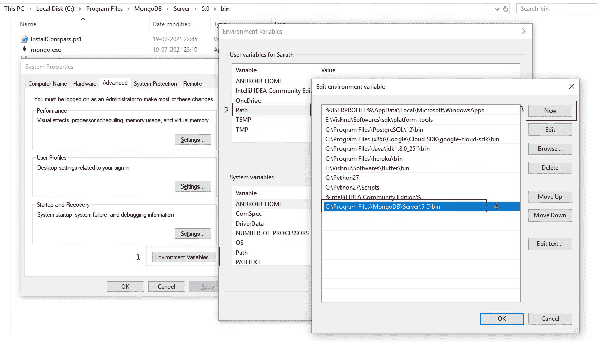

使用以下命令验证 node.js 和 mongodb 版本。

```
npm --version
mongo --version
```

## 第 1 部分—设置节点。JS 后端

我们可以在不同的文件夹中组织后端和前端文件。为此，使用以下命令创建并导航到后端文件夹。

```
mkdir backend
cd backend
```

使用以下命令初始化后端 nodejs 项目。

```
npm init
```

`npm init`会提示你输入一些基本信息，如应用名称、描述、版本、作者、关键词等。输入此信息，然后按 Enter 键完成该过程。在项目创建之后，您将在目录中获得一个`package.json`文件，它包含基本的项目信息以及项目依赖关系。

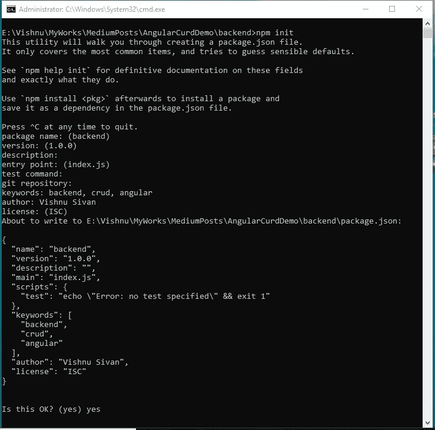

*   在`package.json`文件中添加一个`start`命令。为此，打开 VSCode 并向其中添加以下脚本。

```
"start": "node index.js"
```


*   创建一个名为`index.js`的文件来编写服务器代码。
*   创建三个文件夹— `models`、`controllers`和`routes`。
*   在所有三个文件夹中创建一个名为`employee.js`的文件。

最终的项目结构如下所示:

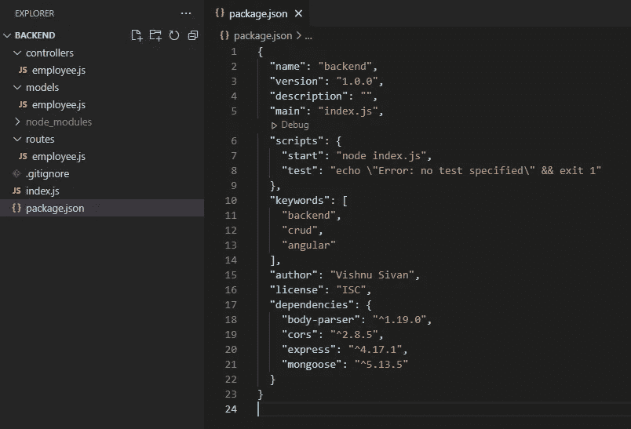

## 安装所需的软件包

在终端的根文件夹中执行以下命令，将 body-parser、cors、express 和 mongoose 包添加到项目中。

```
npm install body-parser cors express mongoose
```

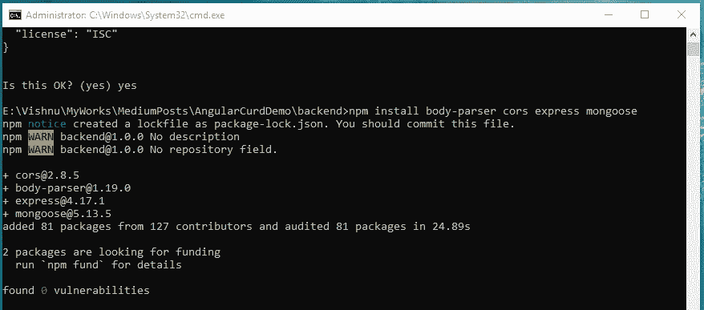

*   **body-parser**:JSON 解析中间件，帮助解析 JSON 数据、纯文本或整个对象。
*   **Express.js** :创建 web 应用和 RESTful APIs 的节点框架。
*   **Cors** :在项目中启用 Cors 的快速中间件。
*   **mongose**:MongoDB ODM 与 MongoDB 数据库交互。

## 创建模型

我们将从定义雇员集合的模式开始。员工集合包含**姓名、电子邮件、职务和电话号码**。

要定义雇员模型，请在`backend > models > employee.js`文件中添加以下代码。

## 设置控制器

控制器包含使用不同路由从数据库访问数据的业务逻辑。这里，我们将使用 mongoose 在 MongoDB 数据库上执行 CRUD 操作。

要创建控制器，在`backend > controllers > employee.js`文件中添加以下代码。

## 设置路线

路线是在控制器的帮助下从数据库访问数据的方法。

要创建路线，请在`backend > routes > employee.js`文件中添加以下代码。

## 设置服务器

我们在代码中指定了存储和检索雇员数据的模型、控制器和路径。编写一个服务器文件来组合所有这些信息。为此，打开`backend > index.js`并向其中添加以下代码。

理解代码，

*   express app、cors、body-parser、mongodb 和模型的初始化变量。
*   通过指定 mongodb url 作为参数，使用`mongoose.connect()`方法创建了服务器和 mongodb 数据库之间的连接。
*   为服务器设置 cors 配置。
*   通过使用 express app 导入和注册路线来设置 API 的路线。
*   在端口 3000 上运行服务器。

执行以下命令启动 node.js 服务器。

```
npm start
```

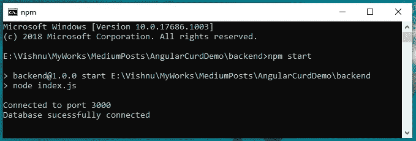

使用 postman 访问 API。或者，在您的浏览器上加载 url `[http://localhost:3000/employee](http://localhost:3000/employee)`。如果服务器启动并运行，你将得到一个空数组`[].`

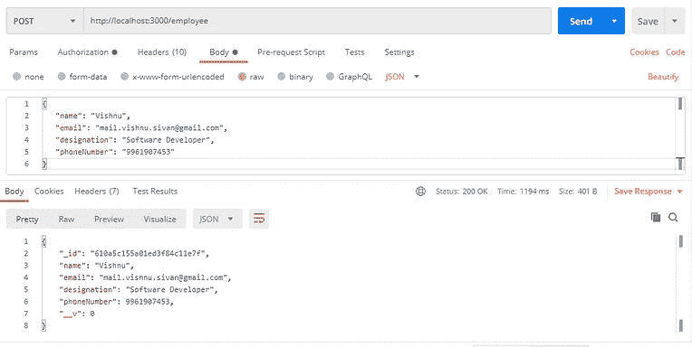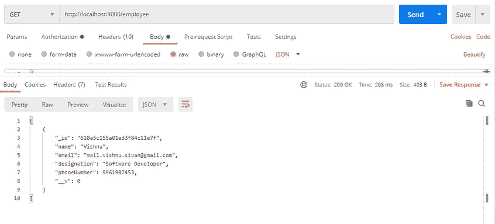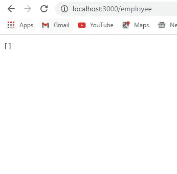

# 第 2 部分-设置角度前端

Angular 是一个基于 typescript 的开源开发平台，用于构建 web 应用程序。它使用名为 **Angular CLI** 的命令行界面直接从终端开发和维护 Angular 应用程序。

使用以下命令在您的机器上安装`angular-cli`，如果已经安装，则忽略。

```
npm install -g [@angular/cli](http://twitter.com/angular/cli)
```

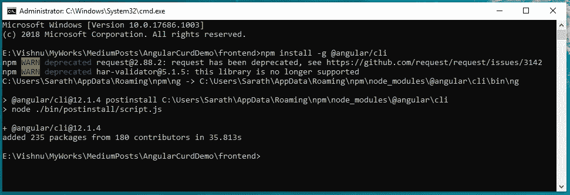

## 创建角度项目

*   创建一个名为 frontend 的文件夹来保存 angular 项目。
*   使用`ng new`命令创建一个角度应用。

```
mkdir frontend
cd frontend
ng new mean-stack-crud-app
```

*   Angular CLI 在设置项目时会询问以下内容。

**您想要添加角度路由吗？**
选择 y 并按回车键。

**您想使用哪种样式表格式？**
用箭头键选择 CSS，并按回车键。

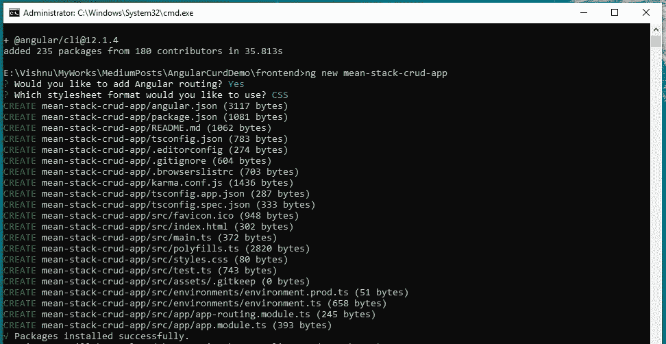

*   导航到项目文件夹(mean-stack-crud-app)并在那里打开 visual studio 代码。

```
cd mean-stack-crud-app
code .
```

## 自举集成

Bootstrap 是一个用于创建响应性 web 应用的开源工具。我们将为这个项目使用引导模板。

*   使用以下命令将引导程序安装到项目中，

```
npm install bootstrap
```

*   将以下代码添加到`angular.json`文件中的`“styles”: [ ]`数组。

```
"styles": [
          "node_modules/bootstrap/dist/css/bootstrap.min.css",
          "src/styles.css"
         ]
```

## 生成组件

组件是角度应用程序的构建块。每个组件都由一个呈现页面的 HTML 模板和一个实现行为的 typescript 类组成。

*   使用以下命令生成组件来添加、更新和查看员工详细信息。

```
ng g c components/employee-create
ng g c components/employee-edit
ng g c components/employee-list
```

## 激活路由服务

路由是在各种组件之间导航的重要工具。如果您在创建项目时启用路由，Angular-cli 将为您的应用程序创建默认路由。为此，它创建`app-routing.module.ts`并将其注册到`src > app > app.module.ts`文件中。

我们已经创建了 3 个组件来管理员工数据。要创建不同的路径来访问相同的路径，请用以下代码替换`app.module.ts`代码。

`app.component.html`包含一些虚拟代码。要访问组件中的路由器链接，需要在 HTML 文件中添加一个`router-outlet`标签。
用以下代码替换`app.component.html`文件内容。

## 创建角度服务

在 angular 中，服务是带有`@Injectable` decorator 的类型脚本类。它用于组织数据并与角度应用程序的不同组件共享数据。

*   **配置 HttpClientModule**
    我们需要在`app.module.ts`文件中导入`HttpClientModule`服务，使用服务文件中的`httpClient`对象来管理数据。

*   **创建员工模型文件**
    创建`src > model > employee.ts`文件使用以下命令，

```
ng g cl model/employee
```

*   向其中添加以下代码。

*   **创建服务**
    使用以下命令创建一个角度服务。

```
ng g s service/api
```

*   向其中添加以下代码。

*   将服务添加到`app.module.ts`文件的`providers`数组中。

## 登记员工

我们已经配置了 angular 应用程序，并为其创建了服务。现在，我们可以将重点放在注册雇员组件和雇员视图组件的业务逻辑上。在本教程中，我们将使用反应式表单来注册员工。

 [## 有角的

### Angular 是一个构建移动和桌面 web 应用程序的平台。加入数百万开发者的社区…

angular.io](https://angular.io/guide/reactive-forms) 

*   在 VSCode 中打开`components > employee-create > employee-create.component.ts`文件，并向其中添加以下代码。

*   打开`employee-create.component.html`文件，向其中添加以下代码。

## 显示员工列表

*   打开`src/app/components/employee-list/employee-list.component.ts`文件，添加以下代码。

*   打开`employee-list.component.html`文件，添加以下代码。

## 编辑员工

*   打开`src/app/components/employee-edit/employee-edit.component.ts`文件，添加以下代码。

*   打开`employee-edit.component.html`并添加以下代码。

你有它！你的第一款 MEAN stack 应用:)

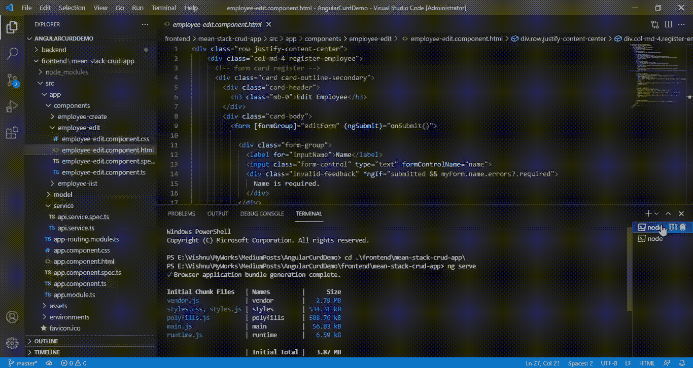

感谢阅读这篇文章。

感谢 [Gowri M Bhatt](https://www.linkedin.com/in/gowri-m-bhatt-85b31814b/) 审阅内容。

如果你喜欢这篇文章，请点击拍手按钮👏并且分享出来帮别人找！

这篇文章也可以在 [Dev](https://dev.to/codemaker2015/end-to-end-development-of-a-mean-stack-application-1o3f) 上找到。

本教程的完整源代码可以在这里找到，

[](https://github.com/codemaker2015/mean-stack-crud-demo) [## GitHub-codemaker 2015/mean-stack-crud-demo:具有 nodejs 和 mongodb 的基于 Angular 的 web 应用程序…

### 此时您不能执行该操作。您已使用另一个标签页或窗口登录。您已在另一个选项卡中注销，或者…

github.com](https://github.com/codemaker2015/mean-stack-crud-demo) [](https://angular.io/) [## 有角的

### Angular 是一个构建移动和桌面 web 应用程序的平台。加入数百万开发者的社区…

angular.io](https://angular.io/) [](https://www.mongodb.com/mean-stack) [## 什么是均值叠加？简介和示例

### MEAN 架构旨在使用 JavaScript 构建 web 应用程序和处理 JSON 变得非常简单…

www.mongodb.com](https://www.mongodb.com/mean-stack)